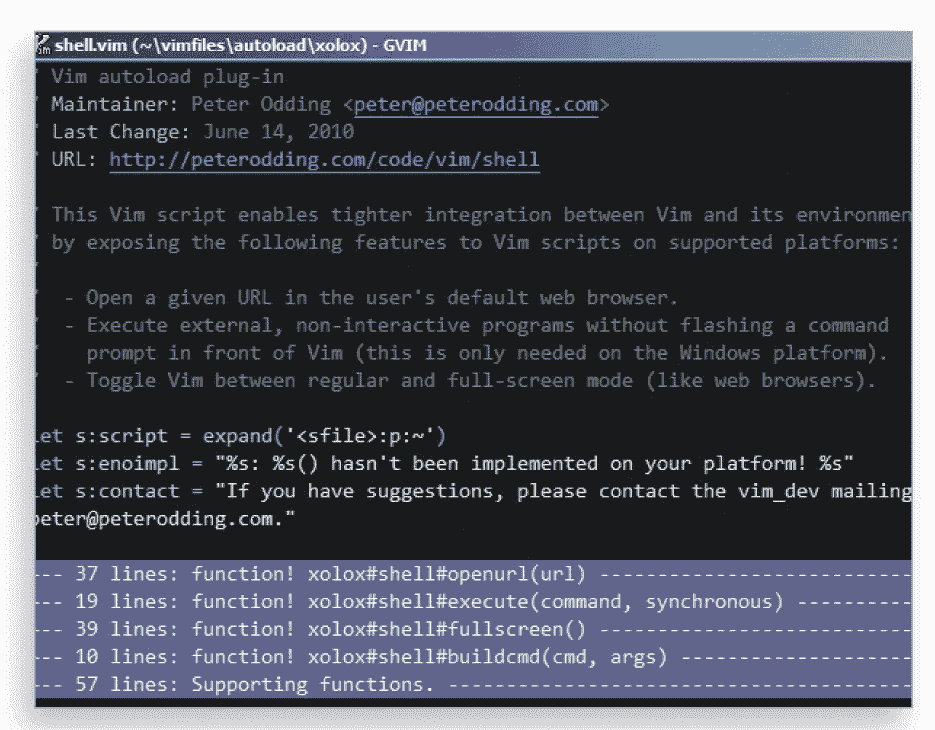
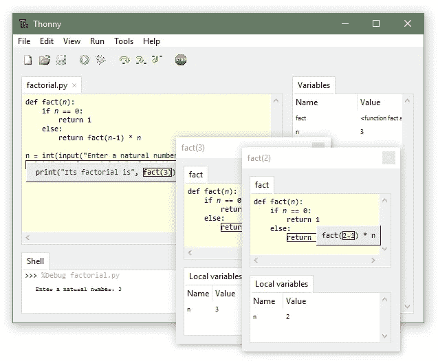

# 您应该知道的最好的 Python IDEs 和代码编辑器——第 2 部分

> 原文：<https://towardsdatascience.com/best-python-ides-and-code-editors-you-should-know-part-2-47072250c0d2?source=collection_archive---------16----------------------->

## 更多具有显著特性的 Python IDEs 和代码编辑器

照片由来自[佩克斯](https://www.pexels.com/photo/blur-close-up-code-computer-546819/?utm_content=attributionCopyText&utm_medium=referral&utm_source=pexels)的[路易斯·戈麦斯](https://www.pexels.com/@luis-gomes-166706?utm_content=attributionCopyText&utm_medium=referral&utm_source=pexels)拍摄

> 编写 Python 代码的乐趣应该在于看到短小、简洁、易读的类，这些类用少量清晰的代码表达了大量的动作——而不是让读者厌烦得要死的大量琐碎代码。
> 
> 吉多·范·罗苏姆

[**Python 的**](https://www.python.org/) 拔得头筹，成为今天**最流行的编程语言**的确很壮观。而且，由于它的多功能性，大多数开发人员现在都在各种项目中使用这种编程语言。但是任何开发人员，无论是 Python 还是其他 [**编程语言**](/top-programming-languages-for-ai-engineers-in-2020-33a9f16a80b0) **都离不开的一个工具就是代码编辑器和 ide。**

看着 Python 越来越受欢迎，**几个月前，我写了一篇文章**，介绍了可用的**最好的 Python 代码编辑器和 IDE。**

从那以后，这篇文章获得了大量的赞扬，同时我们的读者 **提出了一些有价值的建议，增加了一些我们可能忽略了的更受欢迎的代码编辑器和 IDE** 。这篇后续文章旨在通过在开发人员社区中添加一些更强大且广泛使用的 Python 代码编辑器和 ide 来实现这一目的。

## **点击这里查看第一部分—**

 [## 2020 年你必须使用的最好的 Python IDEs 和代码编辑器

### 具有显著特性的顶级 Python IDEs 和代码编辑器

towardsdatascience.com](/best-python-ides-and-code-editors-you-must-use-in-2020-2303a53db24) 

# 你应该知道的最好的 Python IDEs 和代码编辑器

尽管 Python 有大量的代码编辑器和 ide，但是选择正确的代码编辑器和 ide 还是很有挑战性的。在最初的文章中，我们强调了一些最好的，在这篇文章中，我们将分享一些同样著名的。

# 1. **Emacs**

*   **类别:**代码编辑器
*   首次发行日期: 1975 年
*   **平台兼容性:** Windows、macOS、Linux
*   **支持语言:** Lisp，C，Emacs Lisp
*   **价格:**免费
*   **下载:** [Emacs 下载链接](https://www.gnu.org/software/emacs/)
*   **热门公司使用 Emacs Python 代码编辑器—** Stack、Accenture、Bukalapak、Chime。

从现代计算机的早期开始，Emacs 就是一个**长期运行的文本编辑器**。这个编辑器因为与另一个著名的文本编辑器**Vi(现在叫做 Vim)** 的恶名昭著的编辑器战争而变得流行。多年来，Emacs 已经发展成为一个**高度可定制和可扩展的代码编辑器**，可以免费获得。

就其核心而言，该编辑器是 Emacs Lisp 的解释器，但也可以很容易地用作大多数编程语言的代码编辑器。**Emacs 的显著特点是:**

●提供大量按键绑定

**●** 附带调试器、项目规划器等

●用于安装扩展件的内置包装系统

## **优势—**

●快速

●最小化系统资源的使用

●提供大量的扩展或软件包

## **劣势—**

●高学习曲线

●广泛的定制选项可能会分散注意力

## 2021 年学习 Emacs 的理由—

# 2. **Vim**

*   **类别:**代码编辑器
*   首次发行日期: 1991 年
*   **平台兼容性:** Windows、Linux、Mac OS、IOS、Android、UNIX、AmigaOS 和 MorphOS
*   **适合谁:**专业
*   **支持语言:** C，Vim 脚本
*   **价格:**免费
*   **下载:** [Vim 下载链接](https://www.vim.org/)
*   **热门公司使用 Vim 代码编辑器****-
    -**Lyft、阿里巴巴游记、CircleCI、Ruangguru。

**还记得那场牵扯到 Emacs 的编辑大战吗？**在擂台的另一边是 Vi，另一个流行的文本编辑器，**内置于基于 Unix 的操作系统，**提供同样令人印象深刻的功能。**Vim(Vi 改进版的缩写)**是 Vi 的现代化版本，提供了大量方便的特性，使其符合当今开发人员的文本编辑器。

Vim 编辑器不仅允许您**高效地创建完整的 Python 程序**，还允许您轻松地处理文本文件。编辑器也在积极更新，增加了许多现代代码编辑器的标准特性。我们在下面列出了其中的一些功能:

●提供超过 10 种界面模式

●自带一种名为 Vimscript 的内置脚本语言

●为插件提供广泛的支持

●支持多种编程语言

## **优势—**

●重量轻

● Vimtutor，内置教程可以对抗其高学习曲线

●高度可配置和可移植

## **劣势—**

●一开始可能看起来很复杂

●定制 Vim 可能会成为一个永无止境的过程

**截图供参考-**

# 3.托尼

*   **类别:** IDE
*   **平台兼容性:**微软视窗、Linux、macOS
*   **适合谁:**初学者
*   **支持语言:** Python
*   **价格:**免费
*   **下载:**Thonny 下载链接

对于很少或没有编程经验的人来说，Thonny 是一个非常适合初学者的 Python IDE 。Thonny 让新手更容易进入 Python 编程，因为它**带有 Python 3.7** ，节省了安装时间。

Thonny 的教育性编程风格不仅教你编程语言的某些部分，比如变量，而且还给你一个执行的可视化表示。**托恩尼的主要亮点是:**

●简单干净的 IDE

●附带一个简单的调试器

●提供代码完成功能

## 优势—

●提供大量初学者友好的功能

●提供一个简单的 Python 外壳来安装附加的包

●可以用几个方便的插件进行扩展

## 缺点—

●它不如列表中的其他一些 ide 先进

●缺乏对模板的支持

## **截图供参考-**

# 4.**孙耀威**

*   **类别:** IDE
*   首次发行日期: 2002 年
*   **平台兼容性:** Linux、macOS、微软 Windows
*   **支持语言:** Python
*   **价格:**免费
*   **下载:** [孙耀威下载链接](https://eric-ide.python-projects.org/)
*   **使用 Eric Python IDE 的热门公司-** BristoSoft、GymGlish、Climpact

尽管不像这个列表中的其他代码编辑器和 ide 那样受欢迎，Eric**仍然提供了大量的特性来处理你的日常文本编辑需求。Eric 的特别之处在于**它不仅是 Python 的代码编辑器，也是同样令人印象深刻的 IDE。****

基于流行的 **Qt 工具包**和**灵活的闪烁编辑器控件**，Eric 为创建 Python 应用和专业管理软件项目提供了几个方便的特性**。它的一些**最好的特性是:****

●源代码编辑能力

●支持使用 Qt Designer 进行 GUI 设计

●代码调试、检查、测试和记录

## **优势—**

●可以同时运行多个编辑器

●自带高效调试器

●围绕 Python 编程语言

## **缺点—**

●即使对专业人士来说，界面也可能看起来很复杂

●使用多个插件时，性能会受到影响

 [## 现实世界中的 16 大 Python 应用

### 看看 Python 在现实世界中的各种应用

towardsdatascience.com](/top-16-python-applications-in-real-world-a0404111ac23)  [## 给 Python 开发者的 10 个很酷的 Python 项目想法

### 您可以使用 Python 构建的有趣想法和项目列表

towardsdatascience.com](/10-cool-python-project-ideas-for-python-developers-7953047e203) 

# 5.**竞技表演**

*   **类别:** IDE
*   **首次上映日期:** 2016 年
*   **平台兼容性:** Windows、Linux、Mac OS 等。
*   **价格:**免费

**Rodeo** 是一个面向 Python 的跨平台 IDE，它是轻量级的，是现代数据科学家开发用于 [**机器学习**](/a-tour-of-machine-learning-algorithms-466b8bf75c0a) 和数据科学问题的完美工具。

Rodeo 可以有效地用作您的个人数据探索和解释工具。如果你发现自己在某个时候陷入了困境，Rodeo 的综合教程可以帮助你找到出路。使 Rodeo 成为数据科学绝佳选择的特性包括:

●其数据绘图能力

●提供代码完成、语法高亮等功能

●支持 IPython

## **优势—**

●提供直观的工具，如可视化文件导航器、包搜索和点击式目录

●备忘单使引用 Python 主题更加容易

## **缺点—**

IDE 有几个内存和性能问题

●发展停滞了相当一段时间

# 结论

Python 对开发人员来说非常友好，但是在选择合适的代码编辑器和 IDE 时，事情就变得困难了。Python 为具有不同编程语言经验的人提供了代码编辑器和 ide。在这篇文章中，我们介绍了我们在最初的文章中遗漏的其他顶级 Python 代码编辑器和 ide。

如果您正在寻找一个强大的 Python 代码编辑器和 IDE，我们希望这篇后续文章能为您指出适合您的工具。

你对这份迷你清单有什么想法？我很想听听他们的故事。

# 更多有趣的 Python 读物

我希望这篇文章对你有用！以下是一些有趣的读物，希望你也喜欢

 [## 2020 年大一新生热门 Python 面试问答

### 这里列出了大一新生最常被问到的 python 面试问题和答案，涵盖了核心…

blog.digitalogy.co](https://blog.digitalogy.co/python-interview-questions-and-answers-for-freshers/)  [## 学习 Python 的 11 大 Github 库

### 学习 Python 的流行 GitHub 库

towardsdatascience.com](/top-11-github-repositories-to-learn-python-e75e8676757a)  [## 每个 Python 开发者的最佳 Python 库

### 开发人员应该在他们的项目中使用的 Python 库。

towardsdatascience.com](/best-python-libraries-for-every-python-developer-77daab4fa40e)  [## 你必须知道的 12 项 Python 开发者技能

### Python 开发人员必备的顶级技能

towardsdatascience.com](/top-12-python-developer-skills-you-must-need-to-know-9e2b6c7fc6c)  [## GitHub 上十大热门 Python 项目

### 像这样的 GitHub 项目是人们创造力和才华的完美展示

towardsdatascience.com](/top-10-trending-python-projects-on-github-fb852cd58262)  [## 2020 年必读的 Python 书籍

### 看看吧，你为什么要读它们？

towardsdatascience.com](/python-books-you-must-read-in-2020-a0fc33798bb)  [## 面向开发者的 10 大 Python GUI 框架

### 构建交互式 GUI 的最佳 Python GUI 框架

towardsdatascience.com](/top-10-python-gui-frameworks-for-developers-adca32fbe6fc)  [## 机器学习和深度学习的最佳 Python 库

### 现代机器学习模型和项目的 Python 库

towardsdatascience.com](/best-python-libraries-for-machine-learning-and-deep-learning-b0bd40c7e8c)  [## 用于自然语言处理的 Python 库

### 用于自然语言处理的流行 python 库概述

towardsdatascience.com](/python-libraries-for-natural-language-processing-be0e5a35dd64)  [## 10 家使用 Python 的世界级公司

### Python 正被 IT 界的一些巨头积极使用

towardsdatascience.com](/10-world-class-companies-using-python-26cde24919a8)  [## 2020 年 Web 开发的 10 个最佳 Python 框架

### 最近一次更新是在 Claire D .上。这些年来，Python 已经成为…

blog.digitalogy.co](https://blog.digitalogy.co/best-python-frameworks-for-web-development-2020/) 

> ***关于作者***
> 
> ***克莱尔 D*** *。在*[***digital ogy***](https://digitalogy.co/)***—****是一个内容制作者和营销人员，这是一个技术采购和定制匹配市场，根据全球各地的特定需求，将人们与预先筛选的&顶尖开发人员和设计师联系起来。与我连线上* [***中***](https://medium.com/@harish_6956)**[***Linkedin***](https://www.linkedin.com/in/claire-d-costa-a0379419b/)***&***[***推特***](https://twitter.com/ClaireDCosta2) ***。*****