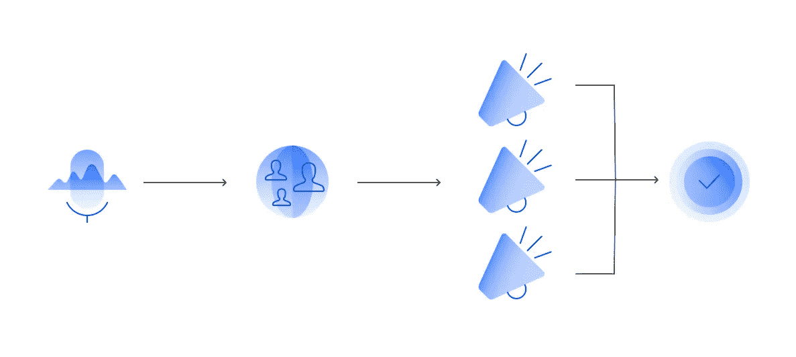
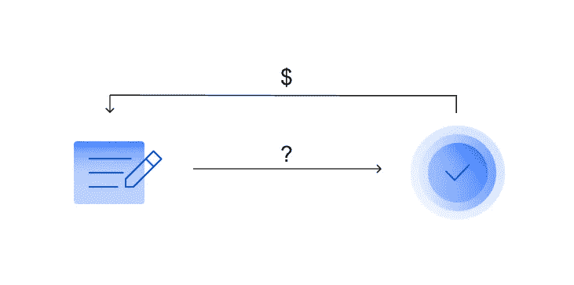
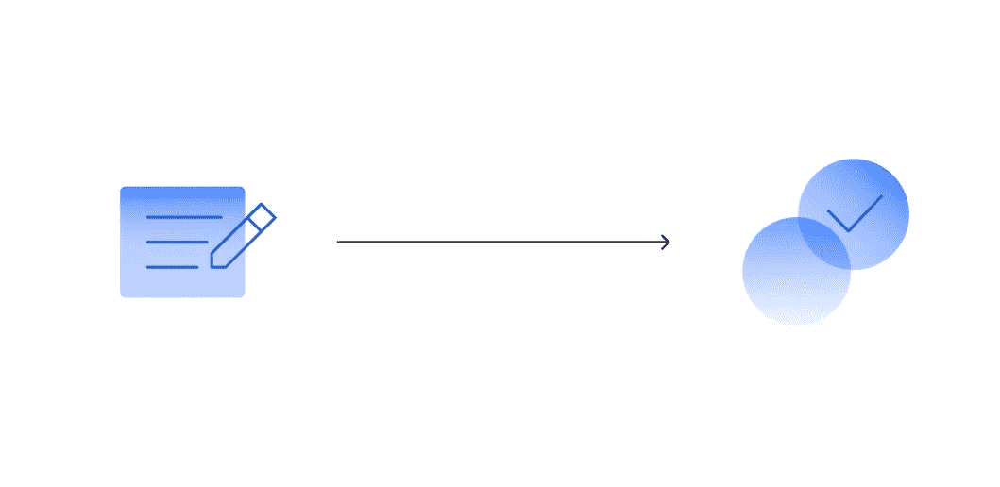
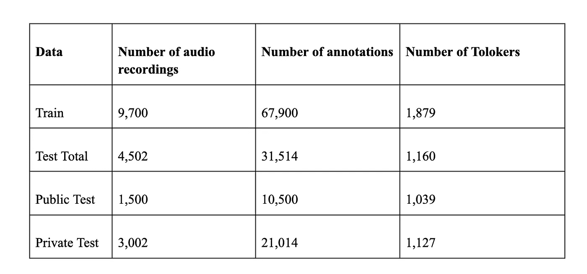

# 最佳文本聚合方法:重访 VLDB 2021 人群科学挑战赛

> 原文：<https://towardsdatascience.com/best-text-aggregation-methods-vldb-2021-crowd-science-challenge-revisited-1be2062bdab5?source=collection_archive---------26----------------------->

## [思想和理论](https://towardsdatascience.com/tagged/thoughts-and-theory)

由[乔舒亚·戈德](https://unsplash.com/@joshgmit?utm_source=medium&utm_medium=referral)在 [Unsplash](https://unsplash.com?utm_source=medium&utm_medium=referral) 上拍摄的照片

今年， [Toloka](https://toloka.ai/) 在丹麦哥本哈根举行的世界上最大的数据科学会议之一——[超大规模数据库](https://vldb.org/2021/) (VLDB 2021)上领导了一个[群体科学研讨会](https://crowdscience.ai/conference_events/vldb21)。作为研讨会的一部分，Toloka 研究团队组织了一场竞赛，以确定众包文本文件的最佳聚合方法。所谓的[群众科学挑战](https://crowdscience.ai/challenges/vldb21)提供 6000 美元的现金奖励，其中 3000 美元给获胜者，2000 美元给亚军，剩下的 1000 美元给第三名。至关重要的是，作为这场激动人心的比赛的结果，我们能够找到聚合众包文本的最佳方法。

*文本聚合*

为什么大惊小怪？

大多数众包任务都是关于分类的:众包执行者必须从一组预定义的选项中选择正确的答案。然而，一些任务需要内容生成、音频注释或对象选择。由于这些任务需要的答案超出了多项选择的范围，因此通常需要手工检查作业。出于这个原因，两个标签项目并行运行——一个收集来自群众演员(我们也称之为 Tolokers)的提交，另一个在项目中涉及的其他演员验证后接受或拒绝这些提交。验收后，绿灯 Tolokers 得到相应的报酬。

让我们感兴趣的问题是，这两个阶段的过程是否可以被绕过，整个机制是否可以自动化。

*转录音频→验证转录*

开拓者和超越者

我们绝不是第一个想到或试图这样做的人。90 年代，[识别器输出表决误差减少](https://ieeexplore.ieee.org/document/659110) (ROVER)被开发出来。它使用动态编程从几种可能的预测中提供一种新的高质量的语音识别预测。由于这种方法在众包中被广泛认可( [Marge et。，2010](https://ieeexplore.ieee.org/document/5494979) ，我们选择它作为我们的基线。因此，一种新的聚合方法不仅有望展示最好的结果，而且有望在相同的数据集上超过 ROVER。

当然，在过去的 30 年里，同样的问题还有其他的解决方案。其中有一类 RASA 和 HRRASA 方法([李，2020](https://dl.acm.org/doi/10.1145/3397271.3401239) )，它们使用类似 BERT 的语言转换器来聚合文本。这些方法使用检索方法解决聚集问题；然而，从我们的经验来看，它们通常不如 ROVER 工作得好。尽管如此，它们也包括在基准中以供参考。

因此，最好的聚合方法应该能够处理大量嘈杂的转录，并提供与相应音频文件精确匹配的最佳文本版本。作为评估标准，我们使用平均单词准确度(AWAcc)。

*转录音频→谢谢！*

**数据准备**

对于我们的竞争，我们决定使用一个全新的、[类似 LibriSpeech](https://www.openslr.org/12) 的数据集，它不会类似于任何其他东西。以下是我们为此所做的准备:

1.选自维基百科和图书语料库的随机句子。

2.丢弃很短或很长的句子，以及包含数字的句子。

3.使用 [Yandex SpeechKit](https://cloud.yandex.ru/services/speechkit) 生成所选句子的音频版本。

4.在 Toloka 上发起了一个标签项目，要求表演者转录音频文件。

5.为每段录音收集了一些注释。

(正确答案提前知道)。

正如大多数 ML 竞赛一样，我们将过程分为一个训练(“训练”)和两个测试阶段(“公开测试”和“私人测试”)。“训练”用于训练和调整竞争的 ML 模型，“公开测试”用于评估比赛过程中的质量，“私人测试”用于确定获胜者并结束比赛。我们从 3，039 名群众工作者那里收集了总共 99，414 条音频注释，转录了 9，700 条音频记录。

**数据**

挑战中使用的所有数据都可以在 [GitHub](https://github.com/Toloka/VLDB2021_Crowd_Science_Challenge) 上获得。

描述本次比赛整个数据准备过程的研究论文已在 **NeurIPS 2021 数据集和基准赛道**上发表，并在[此处](https://openreview.net/forum?id=3_hgF1NAXU7)提供。

**VLDB 大赛**

ML 比赛通常在[赛道](https://www.kaggle.com/)、[赛道](https://www.aicrowd.com/)或[赛道](https://competitions.codalab.org/)举行。权衡各种选择后，我们最终选择了 Yandex。谁能够为我们提供优先支持。

除了想出最好的转录文本聚合方法，参赛者还被邀请提交他们方法的书面描述，我们后来在我们的研讨会记录中发表了这些描述。托洛卡还向有意愿和能力的参与者提供竞赛资助。

VLDB 2021 人群科学挑战赛时间表如下:

*   2021 年 4 月 15 日——比赛启动，训练阶段开始(“训练”)
*   2021 年 5 月 5 日——主要比赛阶段开始(“公开测试”+“私人测试”)
*   2021 年 6 月 18 日—比赛结束
*   2021 年 7 月 5 日—概述汇总方法的论文提交截止日期
*   2021 年 8 月 20 日— [VLDB 2021 人群科学研讨会](https://crowdscience.ai/conference_events/vldb21)

**获奖者和荣誉奖**

由于 ROVER 和 HR/RASA 显示的 AWAcc 值分别等于 92.25%和 91.04%，我们一直在寻找具有更好结果的模型。共有 18 名参赛者参加，其中只有 8 人在活动的“私人测试”阶段展示了超过 ROVER 基线的平均单词准确度值。需要注意的是，包含大规模语言模型的 HR/RASA 方法最终未能给人留下深刻印象。以下是挑战赛的三名获胜者以及那些想出了巧妙解决方案但没有获胜的参赛者:

*   **第一名** (AWAcc = 95.73%)。最好的方法是用于文本摘要的微调 BART 模型。为了在训练中调整模型，参赛者打乱了所有提交的转录，随后用美国英语单词替换英国英语。**令人惊讶的是，一个成功的文本聚合方法依赖于一个执行良好的文本摘要策略**。
*   **第二名** (AWAcc = 95.66%)。在使用微调的 T5 模型进行自动文本摘要之前，这位参赛者还尝试了许多 seq2seq 方法。他们的方法证实了获胜方法的有效性；然而，亚军可能由于缺乏模型正规化而缺乏一致性。
*   **第三名** (AWAcc = 95.48%)。该值是不同信号的线性组合的结果，包括 BERT、假设分类器和执行者特征，如答案的数量及其一致性。值得注意的是，这是我们在比赛的三个获胜者中看到的唯一一个真正考虑表演者技能的方法。此外，这位参赛者使用了我们提供的一笔资助来完善他们的方法。
*   **第四名** (AWAcc = 95.00%)。这个参与者使用了一个经过微调的 T5 模型，并使用 [LightGBM](https://github.com/microsoft/LightGBM) 对注释进行了排序。这种方法虽然值得称赞，但产生的输出不如前三种精确。
*   **第六名** (AWAcc = 93.37%)。事实证明，人们可以使用 Levenshtein 距离的中值来提出可行的解决方案。但是这种方法意味着一个非常仔细的执行者选择试探法，它极大地影响了结果。

**结果和结论**

感谢 VLDB 2021 人群科学挑战赛，我们能够获得一种可靠的文本聚合方法，成功地将 ROVER 在我们的新数据集上的错误率减半，从 7.75%降至 4.27%。

我们收到了来自不同背景和观点的人的解决方案，有趣的是，事实证明，总的来说，整合音频转录和文本的任务是一个自动文本摘要问题。此外，我们了解到一些基于语言的模型显示了不错的结果，在这种情况下，大多数检索方法都不是特别好，并且 ROVER 不再是无可争议的音频转录聚合之王。第一名获胜者提供的方法将被添加到我们的[众包](https://github.com/Toloka/crowd-kit)中，这是一个用于众包的开源 Python 库。**这并不意味着问题已经完全解决，但它确实意味着已经取得了相当大的进展。**

我们的研讨会记录包括题为 VLDB 2021 [关于聚合众包音频转录的众包科学挑战](http://ceur-ws.org/Vol-2932/invited1.pdf)的论文，其中包含对竞赛及其结果的更详细描述。还有两篇论文概述了竞赛冠军[和亚军](http://ceur-ws.org/Vol-2932/short1.pdf)和亚军[使用的汇总方法。](http://ceur-ws.org/Vol-2932/short2.pdf)