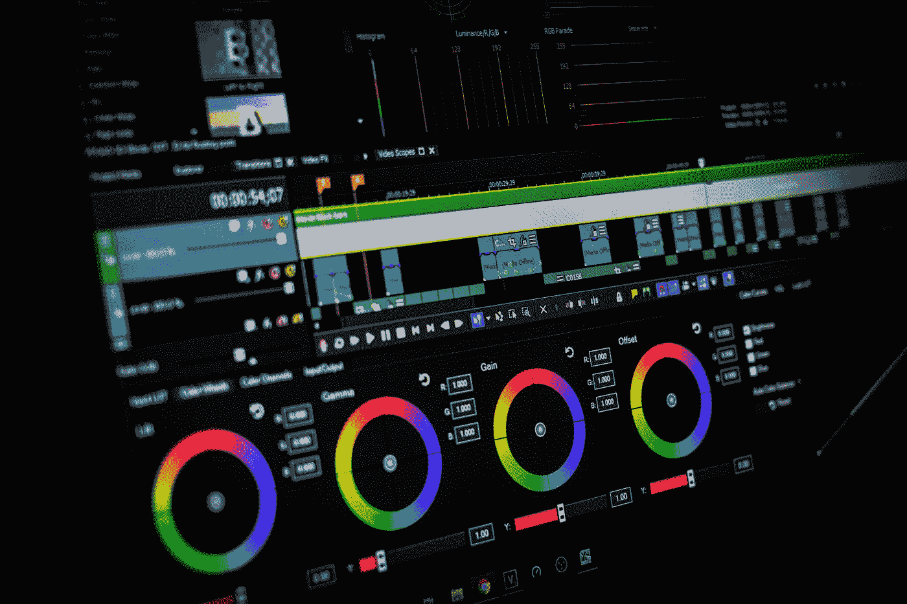
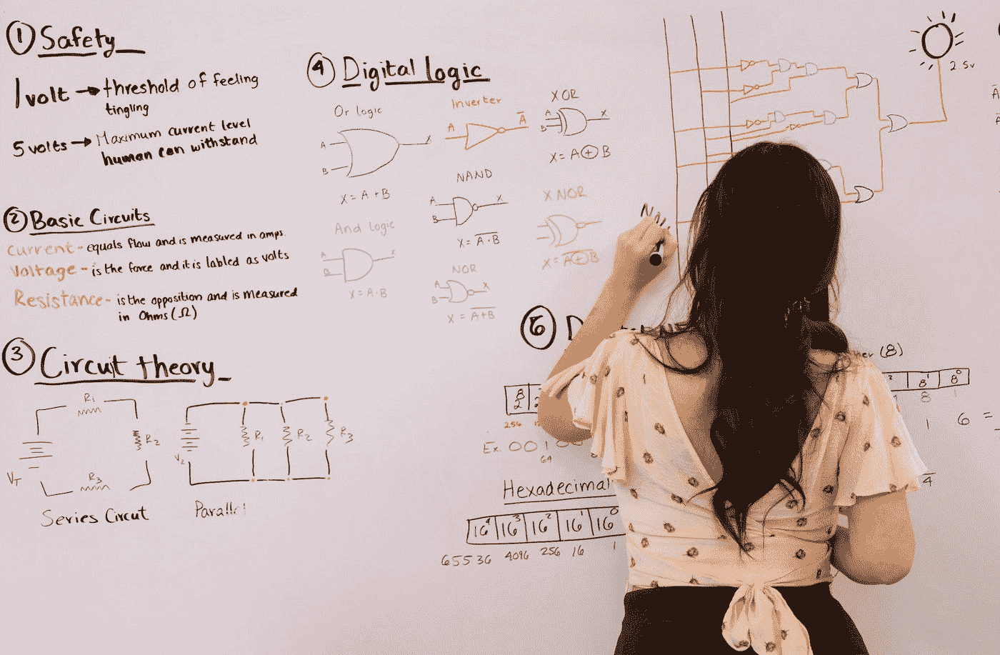

# 尽快掌握数据科学需要关注的最佳话题

> 原文：<https://towardsdatascience.com/best-topics-to-focus-on-to-master-data-science-as-fast-as-possible-609ce5cb05e3?source=collection_archive---------17----------------------->

## 开始学习数据科学时，您应该主要关注哪些主题和领域？

汤姆·里森在 [Unsplash](https://unsplash.com?utm_source=medium&utm_medium=referral) 上的照片

> "没有任何伟大的营销决策是基于定性数据做出的."— [约翰·斯卡利](https://www.ringlead.com/blog/20-inspirational-quotes-about-data/)

数据科学是一个庞大的领域，很容易迷失在该领域呈现的大量主题中。然而，如果你只是一个想要深入研究数据科学主题的初学者，它会让你想知道什么是你应该关注的基本概念，以便你可以更好地掌握这个领域。

如果你想从头开始学习一切，并制定一个完美的计划来学习你想要的一切，那么请务必查看下面的文章，在 12 个月内掌握数据科学，同时使用上述 12 个步骤学习和获得更多知识。

</12-steps-for-beginner-to-pro-in-data-science-in-12-months-c6f6ba01f96e>  

然而，如果你没有很多时间，只想完成一个快速速成课程，那么这篇文章将是你尽快专注于数据科学最本质方面的完美选择。本文的主要目标是关注在数据科学领域被认为非常有价值的清晰的主题。

让我们开始了解数据科学中最重要的主题，您必须关注这些主题，以便尽快了解更多信息并获得更多知识。这些概念的概要可以被认为是在本文的各个部分中列出的。

# 数据

照片由 [Unsplash](https://unsplash.com?utm_source=medium&utm_medium=referral) 上的 [Pietro Jeng](https://unsplash.com/@pietrozj?utm_source=medium&utm_medium=referral) 拍摄

没有数据，就不可能有数据科学。数据科学包括数据挖掘、数据准备、数据操作、数据可视化和其他与数据相关的重要方面。数据科学的正式定义如下—

***数据科学是一个跨学科的领域，它使用科学的方法、流程、算法和系统从许多结构化和非结构化的数据中提取知识和见解。数据科学与数据挖掘、机器学习和大数据相关。***

数据被认为是当今时代最重要的资源之一。科技巨头和大公司正在大力投资，以尽可能获得最佳资源。这样做的原因是为了达到期望的客户满意率，并借助收集的数据分析他们的行为模式。

如果你是一个初学者，刚开始学习数据科学，你处理数据的方法必须是从获得的资源中收集和处理尽可能多的信息。学会识别最适合你的特定项目的相关数据。

一旦您能够获得必要的数据，您的任务就是考虑从中获得有用的信息，并预处理额外的不必要的需求。收集和准备你的数据。帮助你完成这个过程的最好的工具通常是 pandas 库模块，以及一个去除无关数据的模块，比如正则表达式(re)模块。

我强烈推荐阅读下面这篇关于 NLP 的文章，这篇文章用四个正则表达式命令简化了 NLP。下面提供了链接。

</natural-language-processing-made-simpler-with-4-basic-regular-expression-operators-5002342cbac1>  

# 编程；编排

在 [Unsplash](https://unsplash.com?utm_source=medium&utm_medium=referral) 上由[Nejc sokli](https://unsplash.com/@nejc_soklic?utm_source=medium&utm_medium=referral)拍摄的照片

编程恰好是构建数据科学项目时需要关注的最重要的主题之一。这一点是显而易见的，但是如果你对编程一无所知，或者你只是一个想要学习更多编程知识的初学者，你怎么能更快地有效理解编程呢？

这个想法很简单。Python 是初学编码爱好者最容易学习和探索的编程语言之一。关于 Python 的最佳结果可以通过有效地研究这个主题来获得，并且可以在一个月的时间内掌握到中级水平。

我强烈推荐初学者从下面的链接中找到掌握 Python 数据科学的十步快速程序指南。按照上述步骤的顺序进行操作，以获得最佳效果。

</10-steps-to-master-python-for-data-science-f54199bb328d>  

数据科学的另一个要求是足够数量的 SQL。[结构化查询语言](https://en.wikipedia.org/wiki/SQL) (SQL)是一种用于编程的领域特定语言，设计用于管理关系数据库管理系统中保存的数据，或用于关系数据流管理系统中的流处理。

对 SQL 简单的基本理解通常足以开始从事体面的数据科学项目。借助互联网丰富的资源，您可以对 Python 编程语言有一个中级的了解，然后就可以开始从事数据科学项目了。

您必须关注的编程的更重要的方面是使用 Python 开发环境中存在的大量数据科学库模块的能力。您可以探索这些工具，因为它们将帮助您完成许多独特的任务。

# 可视化技术

由[粘土银行](https://unsplash.com/@claybanks?utm_source=medium&utm_medium=referral)在 [Unsplash](https://unsplash.com?utm_source=medium&utm_medium=referral) 上拍摄

为了简化您的数据科学项目，您的主要精力必须放在使用各种可视化技术来掌握您可用的数据中的有用信息。这种有用信息的程序性检索可归因于称为探索性数据分析(EDA)的重要步骤。正式定义可以表述如下—

> 在统计学中， [**探索性数据分析**](https://en.wikipedia.org/wiki/Exploratory_data_analysis) 是一种分析数据集以总结其主要特征的方法，经常使用统计图形和其他数据可视化方法。可以使用或不使用统计模型，但 EDA 主要是为了查看数据可以告诉我们什么，而不仅仅是正式的建模或假设测试任务。

可视化在数据科学中占有非常重要的地位，因为它能够为特定的任务找出正确或错误的数据。在分析数据时，您可以找出模式和许多其他元素，这将有助于您更有效地应对复杂的数据科学项目。

Python 编程对这一目的非常有益，因为它允许用户利用 matplotlib 和 seaborn 中一些最好的可视化工具对大量数据集进行分析。当你能够对这些库模块有更好的理解时，你就可以在分析过程背后发展出更强的直觉。

尝试各种图表，如条形图、饼图、直方图、散点图和其他可视化技术，将有助于您更好地理解问题陈述和解决问题的方法。你不仅能理解数据，还能解释破解项目必须遵循的步骤。

# 数学

杰斯温·托马斯在 [Unsplash](https://unsplash.com?utm_source=medium&utm_medium=referral) 上的照片

数学是数据科学的一个重要方面，你需要掌握一些知识才能直观地理解众多概念。对数学有很强的基本理解将有助于你弄清楚机器学习算法和其他与数据科学相关的概念背后的概念熟练程度。

在数学方面，如果你刚刚开始接触数据科学，你需要掌握的主要目标必须是线性代数、概率统计和微积分这三个领域。在线性代数中，尝试开发向量、欧几里德距离、点积和其他类似主题背后的直觉，以轻松理解众多机器学习方面。

概率和统计是直观理解图形信息的重要主题，也是机器学习算法背后的过程理解，如基于贝叶斯定理的朴素贝叶斯算法。虽然积分学可能不需要立即关注，但你应该专注于微分学，以更快地掌握反向传播和其他类似概念的过程。

要了解更多关于学习数学的最佳免费资源，你可以查看下面的链接，或者阅读包含学习数学的最佳资源的下一部分。

</do-you-need-to-pay-to-learn-data-science-e71f75493e5a>  

## 学习数学的最佳资源:

1.  **可汗学院(*):** 开始学习线性代数、微积分、概率统计等基本数学概念的最佳去处。
2.  **3Blue1Brown (*):** 最好的 YouTube 频道之一，可以查看一些精彩的深入解释，并更好地直观理解概念。
3.  书籍:如果你更喜欢读书，那就在谷歌上快速搜索一下，找到一些优秀的学习数学的免费电子书资源。为了更好地练习，你应该为每个特定的主题选择单独的书。

# 机器学习

阿瑟尼·托古列夫在 [Unsplash](https://unsplash.com?utm_source=medium&utm_medium=referral) 上的照片

机器学习是数据科学中的一个特殊主题，也是您可以构建和建立模型以完成您计划完成的目标和任务的主要方式之一。机器学习可以被定义为一种计算机程序，它将随着时间的推移而学习，即通过执行特定的任务并在许多时代之后学习它来获得经验。

机器学习模型是解决你的数据科学项目的主要方式。一旦您完成了对数据集的分析，并且使用多种可视化技术找出了最佳方法和途径，并且完成了数据准备，您的机器学习模型现在就可以构建了。

在构建机器学习模型的过程中，您的主要目标是解决特定的任务，同时实现体面的准确性和损失结果。向所有没有任何机器学习算法经验的数据科学初学者强烈推荐 Python 中的 scikit-learn 库模块。

对于数据科学家来说，理解这些模型的工作和方向非常重要。如果你有时间，我会建议你从头实现所有这些机器学习算法。然而，如果你没有足够的时间来做这些项目，而你又想尽快对这个主题进行实验，那么就试试这些预先构建的算法。

一旦您成功地完成了模型的训练，并且成功地运行了相当数量的纪元，您就应该考虑部署这些模型了。这一步将确保您在几天或几周内完成第一个数据科学项目。您可以专注于数据科学的基本部分，并构建许多更有用的项目。

# 结论:

照片由[拉丽莎·伯塔](https://unsplash.com/@larisabirta?utm_source=medium&utm_medium=referral)在 [Unsplash](https://unsplash.com?utm_source=medium&utm_medium=referral) 上拍摄

> "智慧不是学校教育的产物，而是终生努力获取的产物."— [阿尔伯特·爱因斯坦](https://de.sumtotalsystems.com/en/blog/2014/08/20-inspirational-learning-quotes/)

虽然数据科学有几个方面是至关重要的，需要全神贯注才能掌握这门学科，但有几个特定的主题尤为重要。在这些概念的帮助下，您可以完成各种各样的任务，从而使您能够更快地在项目中获得想要的结果。

你的目标必须是获取广泛的数据，并彻底研究这些数据。应用一系列可视化技术，并相应地确定您可以在项目中实现的最佳机器学习算法。这样做将帮助你达到你想要的结果，而且比你花时间解决所有事情花费的时间要少得多。

不要忘记关注编程的基本方面，即像 Python 这样的编程语言，使您能够学习编码的基础知识并开发独特的项目。为您的数据科学项目学习一些管理数据库的 SQL。不要忘记数学，因为它是数据科学和机器学习的核心。它将帮助你获得坚实的基础和对主题的理解。

如果你对这篇文章中提到的各点有任何疑问，请在下面的评论中告诉我。我会尽快给你回复。

看看我的其他一些文章，你可能会喜欢读！

</5-reasons-why-you-should-develop-a-game-with-python-and-ai-9f5f276e7637>  </can-your-ai-have-emotions-7efc35721e12>  </working-with-object-storage-and-jupyter-notebooks-96915cba815a>  </how-to-read-and-understand-python-code-faster-180ba1ba9445>  </5-reasons-why-you-should-code-daily-as-a-data-scientist-fa7fc6dc92c4>  

谢谢你们坚持到最后。我希望你们喜欢阅读这篇文章。我希望你们都有美好的一天！