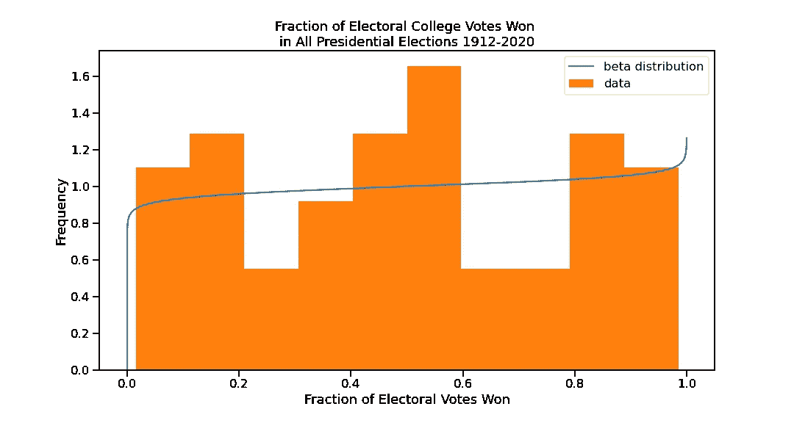
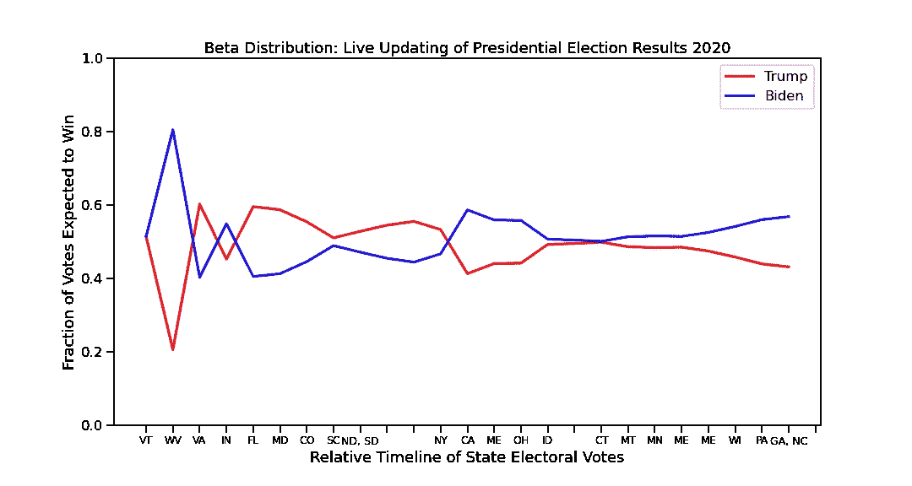

# 贝塔分布预测 2020 年选举结果

> 原文：<https://towardsdatascience.com/beta-distributions-9faa227fd0fd?source=collection_archive---------44----------------------->

## 快速实时预测的简单更新


不同参数值的 beta 分布动画。[维基百科上 Pabloparsil 的 Gif](https://commons.wikimedia.org/wiki/File:PDF_of_the_Beta_distribution.gif)。 [CC BY-SA 4.0](https://creativecommons.org/licenses/by-sa/4.0) 。

不知何故，在我上学的几年里，我从未听说过 beta 发行版，直到我在[大卫·罗宾逊的博客](http://varianceexplained.org/r/beta_binomial_baseball/)上偶然发现它们，但它们很快成为我最喜欢的发行版之一。我的意思是，看看那个向左摆动的东西。它们是非常灵活的发行版，但这并不是它们真正酷的原因。正是你可以轻松地更新你的预测，使得贝塔分布脱颖而出。

贝塔分布由两个参数描述，阿尔法和贝塔(你可以看到改变这些值如何影响上面的分布形状)，虽然这种分布有丰富的数学描述，但对它们的高级解释是**阿尔法-1 =成功数**，**贝塔-1 =失败数**，是的，贝塔分布与二进制数据有关，成功或失败，就像二项式和伯努利分布一样。事实上，在技术语言中，我们会说贝塔分布是二项式分布和伯努利分布之前的共轭，为了简化，这意味着当我们想要更新由这些分布建模的数据时，我们使用贝塔分布来完成它，但是为了更深入的解释，请查看 Aerin Kim 的 [MIT 18.05](https://medium.com/swlh/mit-18-05-873f15aec11d) 和这两篇文章( [1](/bayesian-inference-intuition-and-example-148fd8fb95d6) 、 [2](/conjugate-prior-explained-75957dc80bfb) )(按照她的推荐顺序)。

更新 beta 发行版就像了解您正在使用的 alpha 和 beta 一样简单。更新，新的成功？给 alpha 加一(字面意思是 alpha + 1)。更新，5 个新故障？在 beta 上加 5(字面意思是 beta + 5)。就这么简单，数据集的预期均值总是 **alpha / (alpha+beta)。**

让我们举一个选举数据的例子，但首先，一个警告:这更接近于一个我称之为*天真*贝塔分布和贝叶斯更新的例子，就像*天真*贝叶斯分类器一样，也就是说我忽略了我的观察的独立性(因为它们不是)，我承认我不知道这种天真到底有多可恶。也许只有一点。也许完全是。但正如他们所说的，LAAETTR(发音为“后来”，带有南加州口音，如“后来，笨蛋”):

> 留给读者作为练习。
> 
> ––[也许是所有数学中最讨厌的 7 个单词](http://www.mathmatique.com/articles/left-exercise-reader)

我们的例子:贝塔分布和 2020 年选举数据。

在美国，我们通过直接代表而不是直接代表来选择我们的国王:这就是选举团，它无疑是人民民主的古老和可以说是良好的遗迹，但对人民来说却没有太多的民主。这是一个让候选人有可能赢得普选的制度，但不是总统职位。)

比方说，在最近的 2020 年总统选举中，随着一周内民调开始出现，你希望更新你的预期。也许你有前几年候选人的选举人票的历史数据([和](https://www.270towin.com/historical-presidential-elections/))，并且知道一个候选人期望得到的平均票数。

为什么，这是一个采用贝塔分布的绝佳机会——除了这些观察结果不是独立的这一事实。一个候选人在选举团中表现很好，意味着至少有一个候选人表现很差，根据定义，这不是独立观察。我们知道这是一种糟糕的做法，但为了举例，我们还是继续进行。

所以我们使用了一个库，如果你使用 Python 的话，可能是 SciPy，来拟合 beta 分布，并给出 alpha 和 beta 值。

```
from scipy import statselectoral_votes = [0.29, 0.7, 0.11, 0.13, ...]
beta_params = stats.beta.fit(electoral_votes, loc=0, scale=1)
beta_params# alpha, beta, loc, scale
>>>(1.032, 0.975, 0.001, 0.984)
```



α= 1.032，β= 0.975。图片作者。

这就是我们开始工作所需要的一切。拿起你的爆米花，舒适地躺在安乐椅上，准备好享受 2020 年选举数据吧。综合起来，你对这一周的期望应该是这样的:



从第一个(左)到最后一个(右)选举人票报告，每个候选人获得的全部选举人票的预测分数，必须大于 0.5 才能获胜。图片作者。

这就是测试版的美妙之处:易于使用，易于解释，易于更新。

最后一个提醒和免责声明:记住，你依赖于测试版的独立性来工作。要获得一个可行应用程序的更好的例子，请查看下面大卫·罗宾逊的棒球统计数据的例子。

# 资料来源和进一步阅读

*   [**贝叶斯推理——直觉和例子**](/bayesian-inference-intuition-and-example-148fd8fb95d6) 由艾林·金在中
*   [**共轭在先**](/conjugate-prior-explained-75957dc80bfb) 由艾林金在介质上解释
*   [**麻省理工学院 18.05**](https://medium.com/swlh/mit-18-05-873f15aec11d) 关于贝叶斯推断和贝塔分布的更多信息
*   [**【理解贝塔分布(使用棒球统计数据)】**](http://varianceexplained.org/statistics/beta_distribution_and_baseball/) 作者大卫·罗宾逊，这是对贝塔分布的另一个很好的介绍，但是这次，你猜对了，是棒球统计数据。
*   [**【了解贝塔二项式回归(使用棒球统计)】**](http://varianceexplained.org/r/beta_binomial_baseball/) 作者大卫·罗宾逊(与第一篇不同的文章)，另一篇看贝塔分布及其背后的假设。
*   帖子使用的代码和投票数据可以在我的 [GitHub](https://github.com/stlanier/presidential-beta-distributions) 上找到