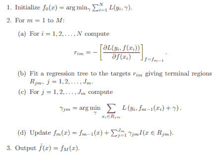
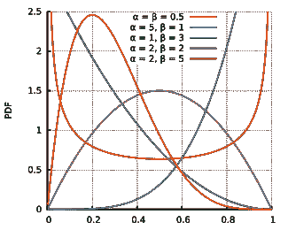
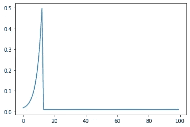
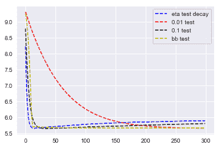

# BetaBoosting

> 原文：<https://towardsdatascience.com/betaboosting-2cd6c697eb93?source=collection_archive---------8----------------------->

## [思想和理论](https://towardsdatascience.com/tagged/thoughts-and-theory)

## XGBoost 的学习速度非常快


[觉吞](https://unsplash.com/@kyawthutun)在 [Unsplash](https://unsplash.com/) 上拍摄的照片

**TLDR:** 传统上，像 XGBoost 这样的梯度推进实现使用静态学习率。我们建议使用一个函数，其参数可以传递到一个标准的超参数调整过程，以学习“最佳”的学习率形状。

所有代码都在这里: [BetaBoost Github](https://github.com/tblume1992/BetaBoost)

# 关于升压的简要复习

在这一点上，我们都知道 [XGBoost](https://xgboost.ai/) ，因为它在 Kaggle 等平台上举办的众多数据科学竞赛中取得了巨大成功。随着它的成功，我们已经看到了一些变化，如 [CatBoost](https://catboost.ai/) 和 [LightGBM](https://github.com/microsoft/LightGBM) 。所有这些实现都基于 Friedman 开发的梯度推进算法，该算法涉及迭代地构建弱学习器的集合(通常是决策树)，其中每个后续学习器都根据前一个学习器的错误进行训练。让我们从统计学习的元素来看一些算法的通用伪代码:



来自 ESL 的伪代码(图片由作者提供)

然而，这还不完整！一个核心机制是一个收缩参数，它在每一轮提升中惩罚每个学习者，通常称为“学习率”。它的主要功能是防止过度拟合，它是对梯度下降算法的一个很好的回调，该算法启发了梯度增强的许多方面。为了利用学习率，弗里德曼将 2.d 改为:


作者图片

现在，我们将每一轮的学习者乘以一个常数。但是我们应该用什么常数呢？这是一个常见问题，通常用超参数调整来处理，通常会产生一个常数，如. 1 或. 01。一些数字远低于 1，或者换句话说，一个严重惩罚每一轮的数字。由于人数少，我们无法最大限度地利用每个学员。

# 使用动态学习率

当具体查看学习率参数时，下一个自然的问题(尽管通常是不重要的)是为什么使用常数？梯度下降具有允许学习速率改变的动量策略。为什么渐变提升不能用类似的思路？

嗯，我们可以…

…它就是**不起作用****。**

快速的谷歌搜索显示，有一些工作是利用一个衰减的学习率完成的，这个学习率开始时很大，每一轮都在缩小。但是我们通常在交叉验证中没有看到准确性的提高，并且当查看测试误差图时，它的性能和使用常规的旧常数之间的差异很小。为什么像这样的方法不起作用背后的推理似乎是一个谜。这让我们想到了启发 BetaBoost 的一个核心主题:

***这方面应该多做研究。***

# 贝塔密度函数

为了与我们的主题保持一致，我们进行了研究，并发现了一个似乎很有前途的功能:beta 功能(当然还有一些护栏！).或者更具体地说，贝塔概率分布函数。这个函数最初是通过蛮力方法发现的，一旦它提供了令人鼓舞的结果，一些[半连贯的基本原理](https://github.com/tblume1992/portfolio/blob/master/GradientBoostedTrees/3_Dynamic_GBT.ipynb)就被挖掘出来了。

那么，什么是 beta PDF 呢？顾名思义，这是一个主要由两个参数描述的概率分布: *α* 和 *β。*除了这些参数之外，还增加了几个参数以及一些更进一步的“护栏”,这些参数似乎会有所帮助。出于我们的目的，我们很大程度上不关心函数作为概率密度函数的任何属性，只关心它与 boosting 的结果。

与许多其他功能相比，Beta PDF 的一个明显优势是您可以使用它实现大量的形状:



图片来自[维基百科](https://en.wikipedia.org/wiki/Beta_distribution)

如果我们想做类似指数衰减的事情，或者在中间产生一个大尖峰，只需要改变一个参数。这意味着如果我们将整个过程交给一个超参数调整包，比如 [Hyperopt](https://github.com/hyperopt/hyperopt) ，我们可以发现最适合(或过度适合)的学习率形状！)我们的数据。虽然，我们主要看到一个形状出现在顶部。

最终，我不知道为什么这些会有任何好处，所以:

***在这方面应该做更多的研究。***

# BetaBoosting

这一切把我们带到了 BetaBoosting。这不是一个新的方法来建立一棵树或提出分裂。它只是在 XGBoost 的[学习 API](https://xgboost.readthedocs.io/en/latest/python/python_api.html#module-xgboost.training) 中使用回调在每一轮提升中分配不同的学习速率。我们的具体实现基于 Beta PDf 分配学习率，因此我们得到了“BetaBoosting”这个名字。

该代码可通过 pip 安装，以便于使用，并要求 xgboost==1.5:

```
pip install BetaBoost==0.0.5
```

如前所述，特定的形状似乎比其他形状做得更好。这个形状在早期有一个很大的尖峰，由于我们的护栏，它很快就变成了一个“地板”参数。让我们看看使用类默认参数的 BetaBoost。这个函数将默认参数传递给 [scipy Beta PDF](https://docs.scipy.org/doc/scipy/reference/generated/scipy.stats.beta.html) 函数，还有一些附加的护栏。下面是一个简单的独立函数和实际的 BetaBoost 实现:

```
def beta_pdf(scalar=1.5,
             a=26,
             b=1,
             scale=80,
             loc=-68,
             floor=0.01,
             n_boosting_rounds=100):
    """
    Get the learning rate from the beta PDF
    Returns
    -------
    lrs : list
        the resulting learning rates to use.
    """
    lrs = [scalar*beta.pdf(i,
                           a=a, 
                           b=b, 
                           scale=scale, 
                           loc=loc) 
           + floor for i in range(n_boosting_rounds)]
    return lrs
```

为了便于使用，这里列出了使用 BetaBoost 类的相同学习率:

```
from BetaBoost import BetaBoost as bb
import matplotlib.pyplot as plt
booster = bb.BetaBoost(n_boosting_rounds=100)
plt.plot(booster.beta_kernel())
plt.show()
```



作者图片

鉴于这种形状做得很好，这表明采取更大的步骤，不是在开始或结束时，而是在被促进的树发育的“青少年时期”提供最大的帮助。

为了进一步研究，我们可以用模拟数据运行它，并与其他学习率进行比较。

(下面的例子来自几年前的一个帖子，关于使用一个衰减的学习率，我找不到，如果有人找到了请告诉我，这样我就可以引用这篇文章了！)

首先，我们将进行导入并模拟一些数据:

```
import numpy as np
import xgboost as xgb
import matplotlib.pyplot as plt

def generate_data():
    y = np.random.gamma(2, 4, OBS)
    X = np.random.normal(5, 2, [OBS, FEATURES])
    return X, y

max_iter = 300
eta_base = 0.2
eta_min = 0.1
eta_decay = np.linspace(eta_base, eta_min, max_iter).tolist()
OBS = 10 ** 4
FEATURES = 20
PARAMS = {
    'eta': eta_base,
    "booster": "gbtree",
}

X_train, y_train = generate_data()
X_test, y_test = generate_data()
dtrain = xgb.DMatrix(X_train, label=y_train)
dtest = xgb.DMatrix(X_test, label=y_test)
evals_result = {'train': dtrain}
```

接下来，让我们使用衰减学习率，并将我们的结果保存在一个字典中，我们最终将绘制该字典:

```
progress1 = dict()
model1 = xgb.train(
    maximize=True,
    params=PARAMS,
    dtrain=dtrain,
    num_boost_round=max_iter,
    early_stopping_rounds=max_iter,
    evals=[(dtrain, 'train'),(dtest, 'test')],
    evals_result=progress1,
    verbose_eval=False,
    callbacks=[xgb.callback.LearningRateScheduler(eta_decay)]
)
```

现在，0.01 的标准常数:

```
progress2 = dict()
model2 = xgb.train(
    maximize=True,
    params=PARAMS,
    dtrain=dtrain,
    num_boost_round=max_iter,
    early_stopping_rounds=max_iter,
    evals=[(dtrain, 'train'),(dtest, 'test')],
    evals_result=progress2,
    verbose_eval=False,
    callbacks=[xgb.callback.LearningRateScheduler(list(np.ones(max_iter)*0.01))]
)
```

常数 0.1

```
progress3 = dict()
model3 = xgb.train(
    maximize=True,
    params=PARAMS,
    dtrain=dtrain,
    num_boost_round=max_iter,
    early_stopping_rounds=max_iter,
    evals=[(dtrain, 'train'),(dtest, 'test')],
    evals_result=progress3,
    verbose_eval=False,
    callbacks=[xgb.callback.LearningRateScheduler(list(np.ones(max_iter)*0.1))]
)
```

最后，我们的 BetaBoost，其中 fit 方法只是返回与 XGBoost 学习 API 中的 train 方法相同的输出

```
#Here we call the BetaBoost, the wrapper parameters are passed in the class init
bb_evals = dict()
from BetaBoost import BetaBoost as bb
betabooster = bb.BetaBoost(n_boosting_rounds=max_iter)
betabooster.fit(dtrain=dtrain,
                maximize=True,
                params=PARAMS,
                early_stopping_rounds=max_iter,
                evals=[(dtrain, 'train'),(dtest, 'test')],
                evals_result=bb_evals,
                verbose_eval=False)
```

让我们回顾一下每一轮测试准确性的结果:

```
plt.plot(progress1['test']['rmse'], linestyle = 'dashed', color = 'b', label = 'eta test decay')
plt.plot(progress2['test']['rmse'], linestyle = 'dashed', color = 'r', label = '0.01 test')
plt.plot(progress3['test']['rmse'], linestyle = 'dashed', color = 'black', label = '0.1 test')
plt.plot(bb_evals['test']['rmse'], linestyle = 'dashed', color = 'y', label = 'bb test')
plt.legend()
plt.show()
```



作者图片

查看最小测试集误差，我们看到衰减的学习率实际上最快地达到最小值，但这也是一个*不稳定*的结果，因为它很快开始过度适应测试集。下一个达到“拐点”的是 betaboosted 测试集。然而，与衰减测试集不同的是，我们可以看到，随着它的收敛，它的误差继续缓慢减小。最终，在迭代 300 左右，它遇到了对应于恒定的 0.01 学习率的错误率。因此，看起来我们在这两个方面都得到了最好的结果:我们非常快地收敛到接近最优的测试精度，然后我们可以抵抗过度拟合。但是，它真的表现最好吗？

**号**

在接下来的 100 次迭代中，静态的 0.01 略胜一筹。然而，情况并非总是如此，在下一篇文章中，我们将看到一些 5 倍 CV 结果，其中优化的 BetaBooster 实际上在真实世界数据上优于优化的 vanilla XGBoost！

# 摘要

使用β密度函数作为其学习速率的梯度增强似乎给了我们更快的收敛和对过拟合的鲁棒性。这样做的代价是要调整更多的参数。此外，随着学习速度调整某些函数的想法可以很快地添加到主要的增强包中，如 XGBoost 和 LightGBM，使用它们的回调功能。这看起来像是我们目前正在从岩石中榨出水的田地里的一个低垂的果实。

最终，BetaBoosting 回避了这个问题:

有更好的功能吗？

我们的回答是…

***这方面应该多做研究。***

参考

1.  随机梯度推进。(1999 年 3 月)
2.  Hastie，Tibshirani，r .，，j . h . Friedman(2009 年)。统计学习的要素:数据挖掘、推理和预测。第二版。纽约:斯普林格。
3.  [https://en.wikipedia.org/wiki/Beta_distribution](https://en.wikipedia.org/wiki/Beta_distribution)