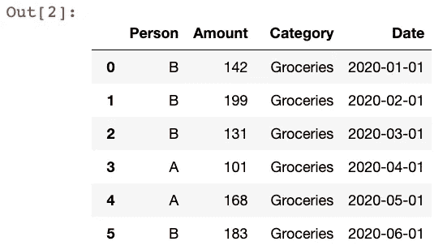
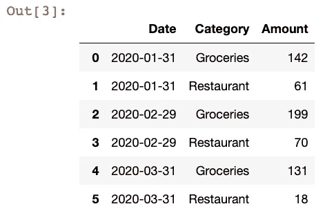
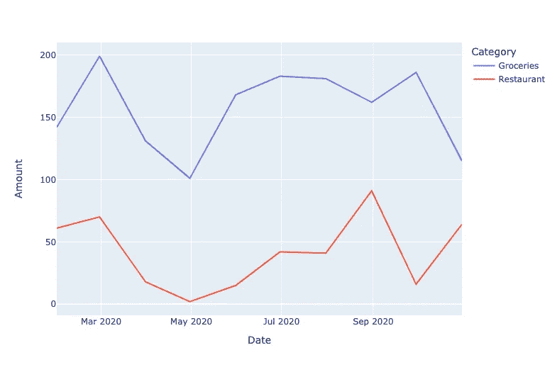
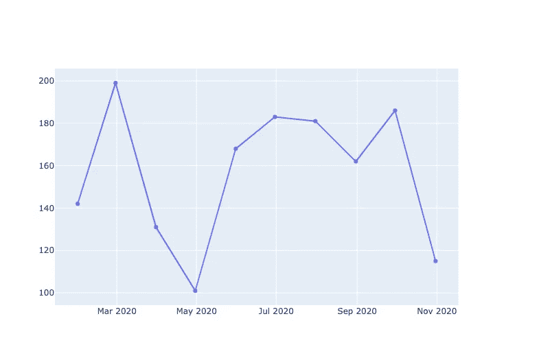
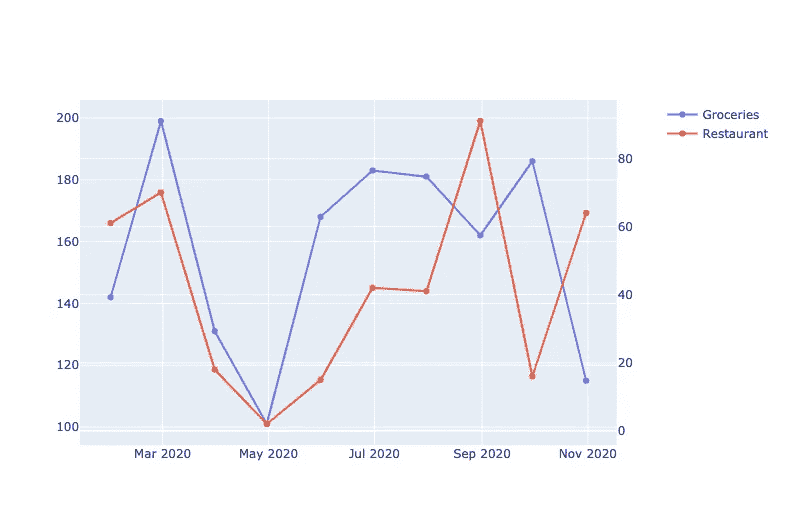
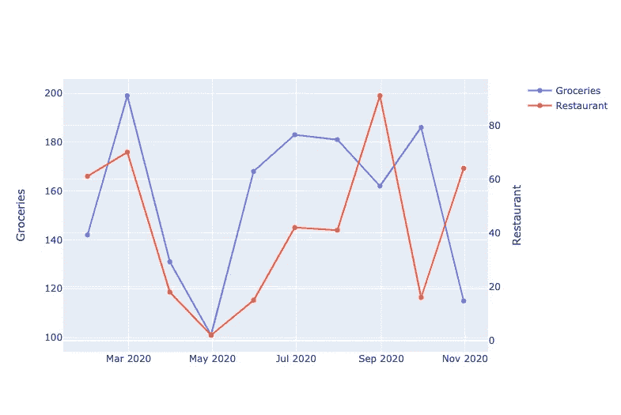
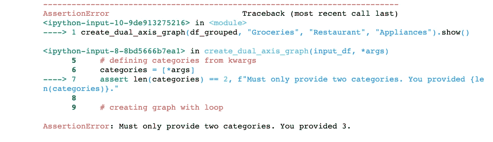

# 使用 Python 中的双轴图形实现更好的数据可视化

> 原文：<https://towardsdatascience.com/better-data-visualization-with-dual-axis-graphs-in-python-a7f35a493558?source=collection_archive---------9----------------------->

## 大蟒

## 使用 Plotly 库以易于阅读的方式分析和展示您的数据


我才华横溢的姐姐的作品

可视化数据使人们更容易理解趋势并做出明智的决策。数据可视化的一个重要部分是选择合适的图表来展示数据。此外，甚至像条形图和折线图这样的特定图表也可以进一步定制，以最好地解释您想要展示的数据。

除了颜色和字体之类的修饰性变化，您还可以考虑添加额外的功能，如平均趋势线、预测或实现双轴。在这篇文章中，我们将介绍如何在折线图中使用双轴，让数据点之间的相关性和趋势对您的受众更加明显。我们还将快速看一下没有双轴的常规图表是什么样子，这样您就可以决定这两个图表中哪一个最适合您的可视化需求。

我们将使用 Python 中的 Plotly 库进行数据可视化，并使用 Pandas 进行一些初始数据预处理，所以请确保您已经安装了这两个包。然后，导入以下内容，并准备好跟随！

```
import pandas as pd
import plotly.express as px
import plotly.graph_objects as go
from plotly.subplots import make_subplots
import random
```

# 用 Plotly 简单实现一个规则折线图

首先，要生成一些示例数据，请运行以下代码。

```
expense_data = {
    "Person": random.choices(["A", "B"], k=20),
    "Amount": random.sample(range(100, 200), 10) + random.sample(range(0, 99), 10),
    "Category": ["Groceries"] * 10 + ["Restaurant"] * 10,
    "Date": pd.to_datetime(pd.date_range('2020-01-01','2020-10-01', freq='MS').tolist() * 2)
}
df = pd.DataFrame(data=expense_data)
```



我们将要可视化的数据将基于一些随机生成的个人支出数据。从上面可以看到，我们只是随机创建了 10 个月的费用数据，并将其加载到 Pandas 数据框架中。上面的代码应该输出 20 行数据。

**我们这次分析的目标是随着时间的推移比较“食品杂货”和“餐馆”的消费类别。**因此，接下来让我们使用几行熊猫按日期和类别字段对数据进行分组。

```
df_grouped = df.groupby(by=[pd.Grouper(key="Date", freq="1M"), "Category"])["Amount"]
df_grouped = df_grouped.sum().reset_index()
```



最后，仅使用 Plotly Express 的一行代码，我们就可以创建一个折线图，将分组的数据帧作为输入。

```
px.line(df_grouped, x="Date", y="Amount", color="Category")
```



Plotly Express 允许我们用一行代码生成上面的图表，在这里我们输入我们的数据帧、x 轴值、y 轴值和可选的`color`参数，因此在图表中有多条彩色的线(每个类别一条)。

这个图表看起来很不错，但是正如你所看到的，比较这两个类别有点困难。这从直觉上讲是有道理的，因为你会认为，一般来说，人们每个月在食品杂货上的花费要比在餐馆旅行上的花费多。(此外，我们将这个逻辑硬编码到生成这个样本数据的代码中——您可以在上面仔细检查它。)

接下来，让我们看看如何实现双轴，以便更容易地比较两种不同类别的支出。

# 用 Plotly 创建双轴折线图

首先，我们需要使用`make_subplots`(我们之前导入的)创建一个空的支线剧情。我们还将定义两个变量来命名我们的目标类别。

```
# making dual axis and defining categories
fig = make_subplots(specs=[[{"secondary_y": True}]])
category_1 = "Groceries"
category_2 = "Restaurant"
```

我们还没有输出任何东西，但是值得注意的是，在`make_subplots`方法中，我们在`specs`中传递了`"secondary_y": True`，以确保我们稍后可以正确地实现双轴。

接下来，我们将手动创建折线图中的第一条线。

```
# creating first plot
fig.add_trace(
    go.Scatter(
        y=df_grouped.loc[df_grouped["Category"]==category_1, "Amount"], 
        x=df_grouped.loc[df_grouped["Category"]==category_1, "Date"], 
        name=category_1
    ),
    secondary_y=False,
)
```

以前，使用 Plotly Express 让我们只需通过一行代码就能生成所有内容，这真的很容易。使用常规的 Plotly 库意味着我们需要编写更多的代码。上图中，我们在前面定义的`fig`对象上使用了`add_trace`方法来添加来自之前分组的数据帧的数据。我们之前还将`plotly.graph_objects`作为`go`导入，所以我们可以传入 x 和 y 列的值。最后，我们将`secondary_y`设置为`False`，因为这只是图表中的第一行。

如果您运行`fig.show()`，您应该会看到类似这样的内容:



有点平淡，但目前为止还不错！现在，我们只有杂货数据。为了向第二行添加餐馆数据，我们将运行以下代码。

```
# creating next plot
fig.add_trace(
    go.Scatter(
        y=df_grouped.loc[df_grouped["Category"]==category_2, "Amount"], 
        x=df_grouped.loc[df_grouped["Category"]==category_2, "Date"], 
        name=category_2
    ),        
    secondary_y=True,
)
```

这几乎是完全相同的代码，除了我们使用`category_2`并传入`secondary_y=True`来代替。然后，如果您再次运行`fig.show()`，您应该会看到类似这样的内容:



看起来更好！与以前不同的是，我们可以更容易地看到这两类支出数据在一段时间内的相对表现。这只是随机生成的数据，但你可以看到在某些月份，当食品支出高时，餐馆支出相对较低(反之亦然)。

我们可以通过编写更多的代码来添加轴标签，使这一点更加清楚，如下所示:

```
fig.update_yaxes(title_text=category_1, secondary_y=False)
fig.update_yaxes(title_text=category_2, secondary_y=True)
```



我们在这里使用相同的`update_yaxes`方法，但是先传入 False，然后传入 True 到`secondary_y`参数，以适当地标记两个轴。

到目前为止，这非常好，但是我认为我们可以稍微清理一下，将所有的逻辑移到一个适合重用的函数中。下面是我的实现:

```
def create_dual_axis_graph(input_df, *args):
    # making dual axis initial fig
    dual_axis_fig = make_subplots(specs=[[{"secondary_y": True}]])

    # defining categories from kwargs
    categories = [*args]
    assert len(categories) == 2, f"Must only provide two categories. You provided {len(categories)}." # creating graph with loop
    for count, category in enumerate(categories):
        dual_axis_fig.add_trace(
            go.Scatter(
                y=input_df.loc[input_df["Category"]==category, "Amount"], 
                x=input_df.loc[input_df["Category"]==category, "Date"], 
                name=category
            ),
            secondary_y=count,
        ) dual_axis_fig.update_yaxes(title_text=category, secondary_y=count) return dual_axis_fig
```

我们做的事情和以前完全一样，除了我们删除了一些有助于演示的重复内容。`create_dual_axis_graph`函数将一个`input_df`作为主参数(您可以像我们之前一样提供已经分组的数据帧)，然后将`*args`作为您想要检查的两个类别的名称。

我们将`*args`放在一个列表中(同时检查该列表只有两个元素)，然后遍历该列表并再次使用`add_trace`方法添加 x 和 y 轴的数据。我们还将在这个循环过程中使用`enumerate`，这样 0 或 1(它们是布尔型的)可以被传递到`add_trace`和`update_yaxes`的`secondary_y`参数中，就像我们之前所做的一样。

运行该函数只需一行代码，如下所示:

```
create_dual_axis_graph(df_grouped, "Groceries", "Restaurant").show()
```

这将为您提供与之前完全相同的双轴图。为了展示不正确的实现会是什么样子，您可以尝试这样做:

```
create_dual_axis_graph(df_grouped, "Groceries", "Restaurant", "Appliances").show()
```



我们之前定义了一个`AssertionError`来确保只有两个参数被传递到类别列表中。您还可以定义一种更全面的数据验证步骤，比如检查数据帧是否有正确的列，列值是否有正确的数据类型，所提供的类别是否确实在数据帧中，等等。然而，对于这个演示，上面的函数就足够了。

就这些了，伙计们！

我希望这个快速(半端到端)的数据分析和可视化演示对您有所帮助！我喜欢双轴图，因为它使得在相同的尺度上比较两个不必要的类别变得非常容易，并且因为 Plotly Express 没有一种本地方式来做到这一点，我认为与每个人分享这个实现会很棒。

祝您好运尝试这种方法并将其用于您自己的数据！

再次感谢你的阅读！如果你正在考虑成为 Medium 的付费会员，如果你使用我下面的推荐链接注册，我会非常感激！这会让我直接收到你的一部分会费，所以这将是一个很大的帮助。

[](https://byrondolon.medium.com/membership) [## 用我的推荐链接加入媒体-拜伦多伦

### 作为一个媒体会员，你的会员费的一部分会给你阅读的作家，你可以完全接触到每一个故事…

byrondolon.medium.com](https://byrondolon.medium.com/membership) 

```
**More by me:** - [Check for a Substring in a Pandas DataFrame](/check-for-a-substring-in-a-pandas-dataframe-column-4b949f64852?sk=bfb5bbab11ae45c47bfb316d931c3b56)
- C[onditional Selection and Assignment With .loc in Pandas](/conditional-selection-and-assignment-with-loc-in-pandas-2a5d17c7765b?sk=e5672d859a3964c1453a1c09edca22cf)
- [2 Easy Ways to Get Tables From a Website With Pandas](/2-easy-ways-to-get-tables-from-a-website-with-pandas-b92fc835e741?sk=9981ddaf0785a79be893b5a1dd3e03dd)
- [5 (and a half) Lines of Code for Understanding Your Data with Pandas](/5-and-a-half-lines-of-code-for-understanding-your-data-with-pandas-aedd3bec4c89?sk=7007a1ae248cf7ea4ef5fcd4af7ae72b)
- [Top 4 Repositories on GitHub to Learn Pandas](/top-4-repositories-on-github-to-learn-pandas-1008cb769f77?source=friends_link&sk=d3acc38062490a86ecb46875342224e6)
```