# 做得更好贝叶斯？

> 原文：<https://towardsdatascience.com/better-done-bayesian-a7759e295355?source=collection_archive---------13----------------------->

## [实践教程](https://towardsdatascience.com/tagged/hands-on-tutorials)

## 用贝叶斯和频率统计规划我们的婚礼。


[拍摄的照片](https://unsplash.com/@photos_by_lanty?utm_source=unsplash&utm_medium=referral&utm_content=creditCopyText)在 [Unsplash](/s/photos/wedding-spring?utm_source=unsplash&utm_medium=referral&utm_content=creditCopyText) 上拍摄的照片

那是 2019 年夏天，我看着克罗地亚多云的天空，那时我深深改变了对统计的看法。在读完 Regina Nuzzo 的《p 值的诅咒》之后，我突然明白了——统计证据并不是我曾经认为的那样:即使是合理规划的随机实验的合理有力的“高度显著”的结果也可能变成假警报。因为即使是最聪明的科学家也无法关闭统计估计带来的自然不确定性。但还有一件事更让我感兴趣:即使是置信区间——我的大学教授曾经非常自豪地教给我们的一个概念——实际上也很少提到我们的估计带来的不确定性。在此之前，我认为置信区间反映了 95%最可信的参数值——或者至少包含了 95%情况下的“真实”值。但这要复杂得多。而且，我不知道我最初的解释甚至已经是贝叶斯理论了。在接下来的部分，我想告诉你传统假设检验的真正错误是什么——并更深入地探究理论基础。我的目标并不是以最不吸引人的形式呈现频繁主义者的统计概念，但我认为现在可能是时候对 p 值、置信区间和无假设显著性检验(NHST)进行更谦卑的解释了。那么，我们大多数人习惯的统计方法有什么问题呢？贝叶斯对等体真的能更好地找到我们问题的数据驱动答案吗？

# 有什么大惊小怪的？

假设我们正在进行一项实验，以发现与温水淋浴相比，定期冰浴是否真的能增强我们的免疫系统。如果你知道维姆·霍夫方法，这一假设应该会引起注意(艾伦，2018)。现在我们想知道相信冰浴真的对我们的免疫系统有很大影响有多合理——至少我们想避免在冰浴没有任何效果的情况下感到极度不适。因此，我们想用输入统计软件的真实数据来回答我们的问题。我们使用的数据分析(无论是 t 检验、方差分析、广义线性模型……)通常基于正式的数学模型。John Kruschke 和 Torrin Liddell (2018)提供了一个非常有说明性的定义:

> 你可以把数学模型想象成一台机器，它根据控制旋钮的设置，以某种模式产生随机的数据样本。例如，淋浴喷头喷出水滴(即数据)的模式取决于淋浴喷头的角度和喷嘴的设置(即参数)。”(*克鲁施克&里德尔在* [*《贝叶斯新统计学:从贝叶斯的角度进行假设检验、估计、元分析和功效分析*](https://link.springer.com/article/10.3758/s13423-016-1221-4) (2018)，第 2 页)

这意味着，不管我们使用的数据分析类型如何，我们总是试图通过统计模型尽可能好地模拟观察到的数据。为了达到这一目标，我们为机器(统计模型)配备了“模拟”自然的参数值，例如白细胞浓度随冰浴频率的变化。因此，我们可以将数据分析解释为对模拟观察数据的正确设置的搜索，以找到潜在的模式。换句话说:我们想知道“现实”是什么味道。

一旦我们有了想法，我们不想把它藏在心里——这就是为什么科学家喜欢用数学符号来表示数据。例如，众所周知，智力(以智商衡量)正态分布，参数 mu = 100，sigma = 15。有了这些数字，我们就可以对许多数据点进行简洁的总结，让我们能够对后续的观察做出推断:例如，我们可以说一个智商为 128 的人可能比你在街上遇到的绝大多数人都聪明。

许多研究人员的数学模型所基于的范式被称为频率主义统计学。它基于这样一种想法，即自然界的效应是固定的(但未知)，而我们试图捕捉它们的数据是随机的。每一种经典的数据分析都包括基于虚数据采样分布的方法，这些方法会产生 p 值和置信区间。坚持我们的冰浴例子，统计计算将是这样的:为了证明在你的观察中是否有值得注意的模式，程序制造随机的假数据来表示如果冰浴是浪费时间会是什么样子。即便如此，参与者的免疫系统当然会有所不同——但这种差异完全是随机的，与任何温度控制无关。这就是零假设所代表的。现在，您的观察结果被汇总(例如，在 t 统计中)，并与基于假样本的统计分布进行比较。根据冰浴和温水淋浴之间的“极端”差异，汇总统计留下了一定比例的实验可能结果。在这种分布的边缘，这些情况可以被认为是非常不寻常的，因为它们很少偶然发生。如果是这样的话，这应该让我们有点怀疑:我们应该考虑仔细看看。这就是 p 值所代表的——在一个零假设为真的世界中，观察到数据*至少是这个极端值*的可能性有多大？只有当您的数据收集完全遵循您的初始测试协议时，得到的估计才是正确的。按照惯例，我们不接受 p 值小于 0.05(或 0.01)就没有显著影响的观点。

拟议影响的大小及其不确定性通常基于最大似然估计(MLE)，这是一种估计参数值的数学技术，使数据在模型环境中最有可能。是的——再读一遍这个句子。… *这使得数据最有可能出现在模型的上下文中* …这看起来是不是有点奇怪？

因此，置信区间是不会被正式假设检验拒绝的参数范围(例如，相对于某一免疫反应的平均差异)(坚持 p < .05)。因此，置信区间不一定给我们提供一系列我们可以“确信”的参数。除非你天生有一种非常技术化和数学化的思维方式，否则它无法被解释。

这就是对零假设显著性检验最深刻的批评的来源:没有办法直接和直观地解释统计结果。围绕这一概念有一个完整的误解指南，因为 p 值远非直观、简单明了(Greenland 等人，2016 年)-对于业余爱好者和研究人员来说都是如此。此外，有时似乎整个世界的分析师和研究人员都只盯着那个 p 值，战战兢兢地希望结果是“有统计学意义的”。我们对“中间”的任何结果都不感兴趣，是吗？学者们经常提到“过于简单化的非黑即白思维”(Kruschke & Liddell，2018)。当谈到有无效果时。然而，许多东西自然是灰色的。例如，暖浴和冰浴都不会强烈影响我们的免疫系统，而现实情况介于两者之间。出于对这一现象的好奇，我们想知道它的确切位置:这就是为什么我们需要对影响的大小进行一些估计(例如，冰浴能在多大程度上减少每年的感染数量？我们应该有多冷？)以及围绕该估计的不确定性(例如，我们对从我们的分析中得到的效应大小有多大把握？).

现在是时候对我们的分析程序采取更加细致和差异化的观点了——这是心理学研究多年来一直呼吁的事情:学者们主张从无意识的假设检验转向量化不确定性的估计，这种估计理想地建立在以前的研究基础上(Kruschke & Liddell，2018；Vandekerckhove，Rouder & Kruschke，20018)，这一概念也被称为“新统计”(Cumming，2014)。

# 贝叶斯统计从何而来，它与频率主义者的观点有何不同？

虽然著名的贝叶斯定理在 1763 年左右就已经发表(Fienberg，2006)并且一直存在，但贝叶斯统计直到今天才流行起来。在世界上的每一门“初学者统计学”课程中，学生们在学习频率主义统计学之前——如果有的话——他们后来会发现贝叶斯统计。然而，与频率统计相比，贝叶斯估计可以更好地处理噪声数据和小样本，并且具有更直观和直接的解释。方便的是，有一些方法可以使用相同的统计程序(t 检验、相关性、ANOVAs 等)。)在“贝叶斯”术语中，它允许分析师结合关于所讨论现象的先验知识(例如，基于以前的数据，当涉及到免疫系统时，我们可以预期冰浴和温水淋浴的人之间有多大的差异？).这使得它成为促进元分析和持续研究的理想候选，这是一个很大的优势，我将在后面更深入地讨论。贝叶斯统计受到许多作者的喜爱，因为它有可能对抗心理学中的可信度危机(Kruschke & Liddell，2018 年)，有能力减轻发表偏倚，有能力将更多可测试的理论纳入统计模型。尽管如此，贝叶斯并没有让你在分析数据时摆脱思维的束缚——我们无法从“动态”数据中得出有意义的结论，这是有充分理由的。即使我们可以认为显著性测试是科学中的一个坏习惯，贝叶斯显著性测试(即贝叶斯因子)本身并不能满足我们的问题。无论哪种方式，我们都必须全面处理利益问题。

那么，贝叶斯统计有什么不同呢？与频率统计相反，贝叶斯假设数据是固定的，而自然界的影响是未知的。因此，相应的估计可以被定义为不同可能选项的概率的重新分配。Kruscke & Liddell (2018)为这种思维风格提供了一个极好的类比(在*Bayesian data analysis for the 新人，* p. 2):夏洛克·福尔摩斯的任务是找到一个杀人犯。他从对每个嫌疑人不同程度的怀疑开始，不断寻找证据，让他重新考虑自己的观点。即使嫌疑人 A 从一开始看起来相对无辜，但一旦排除了其他嫌疑人(例如，因为他们有强有力的不在场证明，他们的动机与犯罪不符，等等)，他/她似乎更有可能犯了罪。…).按照贝叶斯的说法，夏洛克·福尔摩斯从对每种可能性(犯罪嫌疑人)的先验信任度开始，逐渐重新分配每种可能性的可信度，并以后验信任度结束——这是他在跟踪最有可能犯罪的人时应该非常确定自己的猜测的地方。这一过程非常接近我们的自然推理方式，并转化为以下模型:我们从各种可能的参数组合开始，根据我们到目前为止的知识，某些值或多或少是可能的，这称为先验分布。现在，我们收集数据，并可以计算每个数据点被赋予我们所知道的总体效果的可能性——这被称为可能性分布。看到这些数据后，我们的知识需要更新，因为我们现在对哪些参数是可信的有了更狭隘的理解。我们认为与数据不一致的参数值可信度较低，因此与数据一致的参数值可信度较高。我们对理论上可能的每个参数值重复这一过程——这种数据驱动的洞察然后产生后验概率分布。这种分布总结了我们新的知识状态，并可以为未来的分析师提供服务，以建立他们对类似问题的“先验信念”。

多亏了这个程序，我们可以更彻底地测试各种假设:虽然 NHST 只能拒绝零假设(由低 p 值表示)，但贝叶斯假设测试的结果不仅拒绝或接受假设，还包含一个“灰色区域”——对于在给定数据的情况下仍未决定哪个假设更有可能的情况。有时我们只是还不知道——这种证据状态在研究中应该很常见，因为自然很复杂，很难理解。因此，“介于两者之间”的结果应该相当令人放心。但是这个选项经常被我们提供“重要”结果的需要所否决。贝叶斯假设检验有三种状态:

*   数据提供了有利于 H0 的充分证据
*   数据提供了有利于 H1 的充分证据
*   数据无法支持任何一种假设

这种三方面的区别导致了这样一个事实，即贝叶斯和频率主义分析并不总是得出相同的结论，即使它们基于相同的数据(Dienes & Mclatchie，2018 年)——提供支持任一假设的证据的能力与早期完全不同。贝叶斯假设检验可以表明零假设比替代假设(或者相反)更可信，而 NHST 永远做不到这一点，因为它不产生相对概率。

请记住，当使用频率统计时，我们只能测试针对 H0 的证据*——如果我们假设没有任何影响，这些数据看起来够奇怪吗？这是一个有点麻烦的技术，因为我们通常对支持替代假设的证据更感兴趣。我妈妈会说我们好像是“从后面穿过胸腔进入眼睛”(而不是直视)。即使我们非常确定我们的数据在“无效效应”的情况下似乎不太可能，我们也无法知道我们脑海中的选择是否正确。我们甚至不知道零假设首先是否是假的。我们掌握的证据相当薄弱，实际上我们的问题仍未解决。似乎这还不够糟糕，p 值还伴随着其他(方法论)问题，使它们变得非常不方便(例如，著名的“测试和停止意图”)。*

总之，贝叶斯统计和频率统计之间的差异可以总结如下:

*   对于常客来说，效果是固定的，而数据是未知的，而对于 Bayesians 来说，数据是固定的，效果是未知的。
*   Frequentist 方法基于从零假设采样的虚构数据提供 p 值，而 Bayesian 方法比较数据的相对能力，以支持零假设、替代假设或两者都不支持。
*   频率主义者的推理基于观察给定假设的数据的概率，而贝叶斯主义者估计给定数据的某个假设的概率。

# 案例分析——我如何才能知道哪个月会足够温暖，适合我的婚礼派对？

几个星期前，我已经开始和我一生的挚爱计划婚礼。我们想和我们最亲密的家人和朋友在他父母的花园里开一个小派对。但是在组织一切的时候，我们在想我们最好是在四月还是五月结婚，因为我们想在外面庆祝。总的来说，四月是个不错的选择，因为我的肚子还没有五月大，而且柏林的天气已经很热了。另一方面，五月可能是一个更好的候选人，因为有更多的时间让 COVID 感染下降，天气应该足够温暖——但我们能有多确定？


Honey Yanibel Minaya Cruz 在 [Unsplash](/s/photos/wedding?utm_source=unsplash&utm_medium=referral&utm_content=creditCopyText) 上拍摄的照片

作为一名数据科学爱好者，我将使用数据来回答我的问题。为此，我将使用传统的频率主义方法以及一些贝叶斯对应方法。首先，我查看了一些历史温度数据。我发现了一些有趣的表格——[柏林自由大学的 rg Wichmann 和 Manfred Wegener](https://www.berliner-extremwerte.com/Tagesrekorde-von-Berlin_Dahlem.htm) 发表的气象数据集合。这些表格显示了自 1908 年以来柏林-达勒姆每月每天观测到的最极端最高日温度以及平均最高日温度。为了对四月和五月的极端和正常最高温度有一个印象，我提供了相应的数据:

为了绘制结果，我将温度值的每个向量保存在一个数据帧中，并将它们整理成一种更整洁的格式。

数据几乎已经准备好用于绘图——我们只需要设置调色板并保存每个参数的平均值(最大值、最小值、平均值),用密度图明确表示它们。

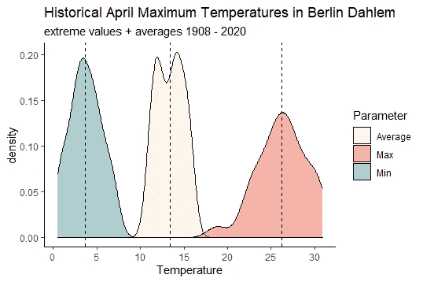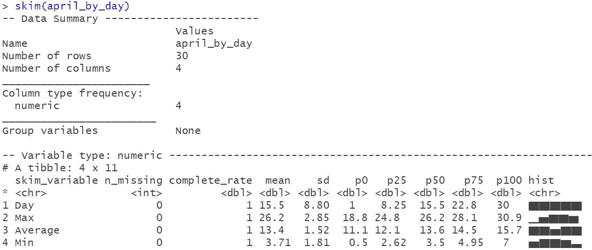

看起来柏林四月份的平均最高温度为 13.4°C(SD = 1.52)，而最热日的温度通常在 0.5°C 到 30.9°C 之间变化——在柏林天气数据的历史上，四月份有非常寒冷的日子(例如 1911 年 3 月 4 日)，但也有非常温暖的夏天(1968 年 3 月 22 日)。通过观察 4 月份每天的正常最高气温，我们可以发现，4 月上半月的最高气温约为 11°C，而 4 月下半月的最高气温可达 15°C 左右。这也解释了 4 月份平均最大值数据的密度曲线的下降。嗯——五月会有不同的趋势吗？

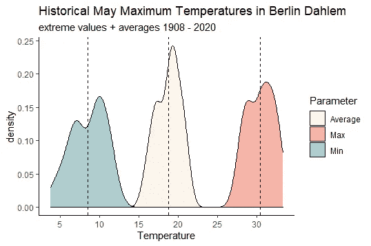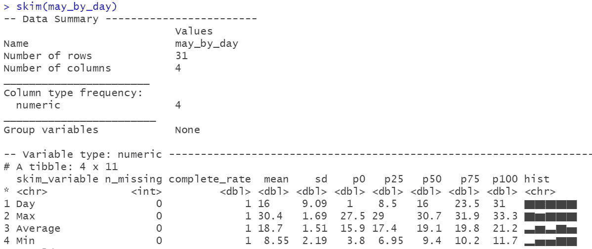

我们可以预计一个典型的五月天的温度将达到 18.7 摄氏度(SD = 1.51)，正如所料，这比一个典型的四月天要暖和得多，即使正常的最高温度变化程度不同。历史上，我们经历过 5 月份的最高日温度在 3.8 摄氏度(1941 年 5 月 3 日)和 33.3 摄氏度(2005 年 5 月 28 日)之间。与 4 月相比，有史以来观测到的最低最高温度(用蓝色表示)比有史以来观测到的最高温度(用红色表示)覆盖的数值范围更广。这可能是因为与四月相比，五月不太可能出现寒冷的气温(尽管我们有几个稍微凉爽的五月天)，但当一个典型的五月天无论如何都是温和的，很难超过真正炎热的夏季温度。与 4 月相似，接近月末时天气变得越来越暖和，5 月上半月的温度约为 17°C，下半月的温度约为 19°C。但是我们能有多确定五月对于我们的游园会绝对是一个更好的选择呢？

通过从五月的正常最高温度中减去四月的正常最高温度，我们得到一个差值向量。因为 May 包括多一天，所以我们需要排除最后一个值，以便进行公平的比较和便于计算。我们最后得到以下描述性统计数据:

嗯，看起来五月的一个典型日的最热时刻通常比四月的一个典型日的最热温度高 5.27°C，而它通常相差 1°C。一般来说，自 1908 年以来的几十年中，正常的最大温差在 3.7°C 到 6.4°C 之间。但是，五月和四月的最高气温实际上没有差别，这种可能性仍然存在吗？

假设我们只有去年(2020 年)的数据。

为了检验我们的假设，我们首先计算独立样本的经典 t 检验。

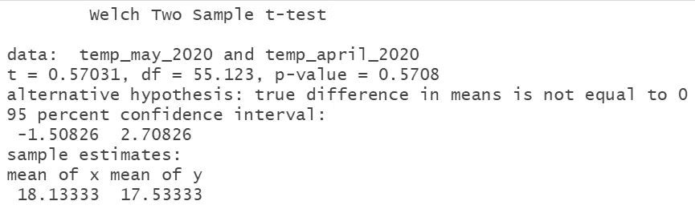

如您所见，p 值超过 0.05，这意味着很有可能只是偶然观察到这些温度差异。通过查看置信区间，我们可以看到给定数据下包含 95%最可能温差的范围，对吗？不。我们不知道 CI 包括的温度差异中哪一个更可能，因为没有包括分布信息:区间中间(大约 0)的参数值不一定比 CI 边缘的值更可能。我们可以说，如果用相似的数据反复进行相同的实验，95%的温度平均差异将在-1.51 和 2.71 之间，包括零(无差异)。如果我们真的只有 2020 年的数据，我们会决定暂时不拒绝零假设。好吧，但是贝叶斯如何解决这个问题呢？

首先，我们当然会使用所有可用的温度数据，但我想让算法更难模拟最糟糕的情况:实际缺乏数据。如果我们有一个杂乱的小样本，数据分析表明了什么？

让我们来探索理查德·d·莫雷和他的同事们(2015)的 [BayesfactorR-package](Morey,%20R.%20D.,%20Rouder,%20J.%20N.,%20Jamil,%20T.,%20&%20Morey,%20M.%20R.%20D.%20(2015).%20Package%20‘bayesfactor’.%20URLh%20http:/cran/r-projectorg/web/packages/BayesFactor/BayesFactor%20pdf%20i%20(accessed%201006%2015).) 中的贝叶斯 t 检验。我们正在分析 Bayes 因子，以检验替代假设(五月和四月之间的温差)和零假设(无温差)。

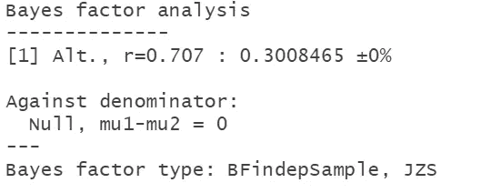

`[1] Alt., r=0.707`–这是指差异可能有多大的假设，而默认值是基于心理学中常见的通常效应大小。我们可以使用 ttestBF-语法来改变这个假设，但是我们暂时不做讨论。

贝叶斯因子是数据中支持两个假设之一的相对证据。换句话说，它是一个假设比另一个假设更好地预测观察到的数据的程度。在这里，我们计算替代的 hyothesis(五月和四月之间的温差)比无效的零假设能更好地预测观察到的数据的程度。由于贝叶斯因子在我们的案例中已经下降到 1 以下，证据表明 H0 比 H1 更有利(杰弗里斯，1998)。如果原假设的先验概率相对于替代假设减少了 0.30 倍，这表明我们现在应该接受原假设，因为支持我们替代假设的证据还不够有力。即使贝叶斯因子和 p 值并不总是一致，经验法则表明，0.05 的常规 p 值大致等于贝叶斯因子 3 (Dienes，2014；Jeffreys，1998)即使一些研究人员总体上要求更高的决策阈值(Etz & Vandekerckhove，2017；Schö nbrodt 等人，2016 年)—在我们的案例中，贝叶斯因子和 p 值都表示保留零假设。

然而，我们应该记住，拒绝零假设的事实并不能告诉我们任何关于效果大小的信息。当——就像在我们的例子中——零假设没有被 p 值拒绝或者甚至没有被贝叶斯因子接受时，人们倾向于相信实际上存在零效应。鉴于 2020 年的温度数据只是 100 多年来可用温度观测的一部分，仍然有理由相信 5 月实际上仍然比 4 月更温暖。如果我们对以前的一组历史温度数据进行相同的分析，我们会得到不同的结果，这一事实支持了这一想法(为了清楚起见，我在这里不给你看)。

好的——我们现在想知道根据我们的后验分布，可信的温度差是什么样的:


从图中可以看出，MCMC 迭代运行稳定，我们现在知道日温差可能在-2°C 和 2.5°C 之间，中间值约为 0.48°C。

使用 Makowski 及其同事(2020 年)的[bayestr-package](http://cran.rapporter.net/web/packages/bayestestR/bayestestR.pdf)，我们还可以从后验分布中计算出参数值的数量，这些参数值代表实际上相当于“无影响”的温度差异。例如，如果五月的平均气温比四月高 1 摄氏度或低 1 摄氏度，我不会选择五月而不是四月来举办我们的游园会。从统计学上讲，我们可以计算实际等效区域(ROPE ),该区域被定义为“零”值周围实际等效于“无效”的区间。在临床研究中，它可以用来测试实验组是否实际上不同于对照组，因此已经纳入了一种“最小”效应大小(有关函数的详细概述，也请参见:[马科夫斯基，本-沙查尔&吕代克，2019](https://joss.theoj.org/papers/10.21105/joss.01541.pdf) )。

结果表明，72.3 %的温度差异位于我们预先定义的实际等效区域内，这意味着不到三分之一的数据指向五月和四月之间有意义的差异。为了找出哪个月实际上更暖，我们可以计算方向概率(PD)——它可以被解释为观察到的温差(由其后验分布描述)严格为正或负的概率(以最有可能的为准)。在数学上，它被定义为后验分布中中位数符号的比例(在我们的例子中是正的，表明五月比四月暖和)。

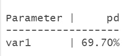

在我们的例子中，根据我们的后验分布，有 69.70 %的可能性五月比四月暖和。


由[拍摄的黄致远婚礼](https://unsplash.com/@jeremywongweddings?utm_source=unsplash&utm_medium=referral&utm_content=creditCopyText)在 [Unsplash](/s/photos/wedding?utm_source=unsplash&utm_medium=referral&utm_content=creditCopyText)

鉴于我很确定无论如何五月可能是一个更好的选择，我想测试一个具体的日期:五月 28 日天气够暖和可以在外面庆祝吗？

我的决定规则是:如果结果表明我们婚礼当天的某个时候气温可能会达到 21 摄氏度或更高，我可以在室外庆祝。那么，5 月 28 日气温超过 21 摄氏度的可能性有多大？

当我在寻找一种频率主义方法来回答这个问题时，我偶然发现了基于历史天气数据预测气温的 ARIMA 模型。但是因为这似乎超出了本文的范围，我们将直接跳到贝叶斯方法。此外，我将向您展示如何从零开始应用贝叶斯方法，不涉及任何特殊的 R-package，灵感来自 Rasmus B eth 的 R 中的课程[贝叶斯数据分析基础。为什么？这样，通常发生在幕后的必要步骤对您来说变得更加明显。](https://learn.datacamp.com/courses/fundamentals-of-bayesian-data-analysis-in-r)

首先，我们需要一些新的温度数据。我发现一个[网站](https://www.accuweather.com/de/de/berlin/10178/may-weather/178087)提供了过去 10 年中柏林 5 月 28 日的最高气温。我们将使用这些数据和我们“更多”的历史数据来估算 2021 年最有可能的最高温度。

现在，我们需要为温度数据定义一个生成模型——您可以将它视为未知的潜在分布模式，它可能会在几年内生成 5 月 28 日的最高气温。为此，我们需要一个可能值的参数空间来表征 5 月 28 日最高气温数据的“真实”分布，因此我们指定 mu(总体均值)和 sigma(总体标准差)。当然，我们无法真正知道真实的潜在分布，但基于我们在上一节中建立的关于所有 5 月最高日温度的知识，我们可以假设 mu 可能位于 10°C 和 30°C 之间，sigma 可能在 0.5°C 和 6°C 之间。即使我们想对 5 月 28 日进行预测，我们使用从上个世纪的极值中获得的信息也会有点保守。通过使用网格近似，我们将测试 mu 和 sigma 的任何可能的参数组合，以计算其与我们已有数据的兼容性。

网格将足够宽和细粒度，以表示理论上可能的任何参数组合。结果参数空间如下所示:

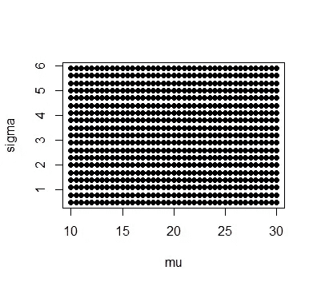

接下来，让我们定义 mu 和 sigma 的先验概率——基于我们对每个可能参数与我们所知的可能性的信念。通过查看 [FU 温度数据](https://www.berliner-extremwerte.com/Tagesrekorde-von-Berlin_Dahlem.htm)，我们可以看到 5 月 28 日的平均最高温度为 20°C，我猜每年可能相差 3°C 左右。此外，我假设平均温度呈正态分布，因此我们将此信息放入 dnorm 函数中，以创建适当的密度函数。然而，对于 sigma，我认为 0.5°C 和 8°C 之间的任何值都是同等可能的，因此我将使用均匀分布。最高温度数据的先验现在基于μ和σ，并相乘以获得组合的先验概率分布。

现在需要为每个可能的参数组合计算数据的可能性，假设可能性函数接近正态分布。然后，我们结合这一计算，分别为每个可能的参数组合获得所有 10 个温度观测值的似然值。

根据贝叶斯法则，我们计算后验分布如下:

> 后验∝先验*似然/先验加权的似然之和

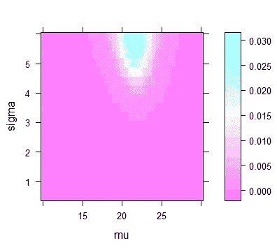

在考虑新数据后，mu 最可信的参数值似乎在 22°C 左右，sigma 最可信的参数值在 6°C 左右。

哇，终于到了预报我们婚礼天气的时候了！现在，让我们根据我们创建的模型，尝试预测 5 月 28 日最可信的最高气温。在通常的贝叶斯软件解决方案中，我们将通过使用马尔可夫链蒙特卡罗方法，从后验概率分布(在我们的情况下为后验 28)中随机抽样最可信的一组参数值来实现这种预测。对于本例，我们将通过从模拟概率分布中随机抽样 mu 和 sigma 来简化这种方法，模拟概率分布直接由我们的后验分布提供信息。出于预测目的，我们使用 mu 和 sigma 的后验分布来模拟 10000 个新鲜温度样本。

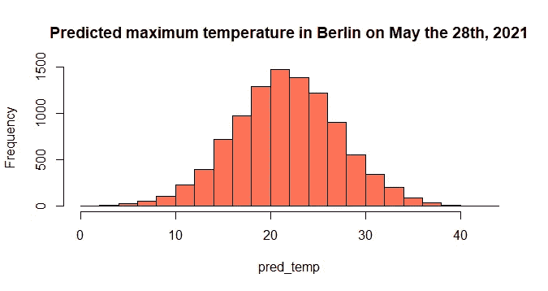

好的——不错！在我看来，我们将会有一个 21 摄氏度左右的最高气温，但是超过 21 摄氏度的可能性有多大呢？

```
sum(pred_temp >= 21 ) / length(pred_temp)
```

大约 55%的预测样本超过 21 摄氏度。老实说，这比我希望的要少，但我们将能够举办一次花园聚会的机会并不坏。现在，5 月 28 日最高气温的最可能值是多少？

为此，我们将计算最大后验概率(MAP ),定义为后验分布的最可能值。

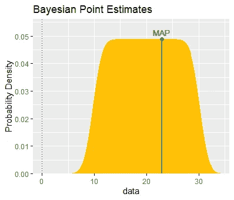

根据我们的计算，我们现在知道 5 月 28 日平均最高日温度的最可信值是 22.93 摄氏度。鉴于我们仍然有些不确定，哪个温度范围也是可信的呢？

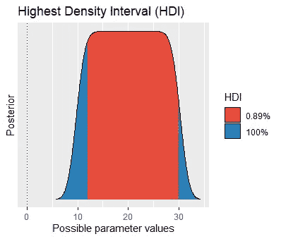

与 frequentist 置信区间相反，我们可以直接从后验分布中“读出”估计的不确定程度。更具体地说，在给定数据的情况下，最高密度区间(HDI)跨越了 95%最可能的参数值。换句话说，它是一个区间，从该区间开始，所有包含的值比该区间之外的值具有更高的概率。在我们的例子中，我们预计 mu 的最可信值在 12°C 和 30°C 之间(HDI 89% [12，30])。

总的来说，当谈到在户外庆祝时，我现在更有信心了——我关于选择五月而不是四月的问题，以及 28 日气温的预测，都没有用 Frequentist 统计数据充分回答。我知道我们应该多带些外套以防万一。但是为什么贝叶斯估计在我的案例中胜出呢？在总结之前，让我们转向理论层面。

# 贝叶斯统计的优点是什么？他们能做得更好的是什么？

## 贝叶斯统计可以直接解释，并且符合我们的自然推理。

从我的角度来看，贝叶斯统计最根本的优势在于能够对我们最初提出的问题给出令人满意的答案。相比之下，传统统计学在大多数情况下实际上是基于*错题*。例如，我们不想要今天下雨的概率(这有点荒谬),而是今天下雨的概率。翻译成概率术语，它转换成这样的事实，即频率主义者要求给定(空)假设为真的数据的概率，而贝叶斯主义者要求给定数据(例如，今天的天气参数)的假设的概率(例如，将下雨)。第二个问题肯定更有趣—这可能是为什么 p 值和置信区间被解释为好像它们是贝叶斯的(例如，p 值 0.05 意味着零假设为真的概率是 5%，对吗？…).如果我们得到了与我们想知道的完全相反的结果，为什么我们会有兴趣首先测试它呢？

## **贝叶斯统计促进信息丰富的&合作研究。**

在心理学研究和许多其他学科中，实际的研究不仅仅是由寻找真相的动机驱动的:包括“无关紧要”结果的草稿仍然留在大型科学期刊的文件抽屉中——各自的研究可能不够醒目，不足以吸引读者的注意，即使其他研究人员可能有兴趣找到发现。一些作者认为，贝叶斯估计可以通过定义一个不同的成功标准来克服这种出版偏差:编辑应该根据一项研究的实际限制条件是否达到了合理的精确度来检查草稿，而不是专注于统计意义(Kruschke & Liddell，2018)。因此，高度精确的结果在研究中应该比高度“重要”的结果更有价值——因为独立研究应该是开放式的。参考开放科学的理念，预先登记研究的过程也有助于减少偏见。

此外，贝叶斯估计允许对任何样本大小进行稳健估计——这对于习惯于追求足够大的 Ns 的人来说是非常方便的先决条件。这不是没有原因的:p 值和置信区间需要足够大的样本大小来进行可靠的计算和足够的能力，而另一方面，它也不应该太大，因为算法往往会过于乐观，甚至会拾取最微小的影响。对频率主义者统计数据的依赖带来了另一个问题:估计不仅会因样本大小而产生偏差，还会直接依赖于分析师的确切测试和停止意图。这意味着，如果我们计划测试 50 名参与者，结果却只有 60 名，那么 p 值应该会受到影响。为什么？因为频率主义者的统计是基于模拟的，可能结果的云随着我们最终得到的每一个额外的(或缺失的)观察而变化。一个类似的原则适用于进行比原计划更多的测试:我们可以观察到 p 值的膨胀，因为小的 ps 变得越来越没有价值。这是因为我们每进行一次额外的测试，发现任何重要结果的机会就会增加。因此，我们必须明确地对多个测试进行校正(例如，使用 Bonferroni 校正)。对于贝叶斯估计，我们不担心固定的 N 个观察值或测试值，因为它不是基于假想分布的抽样。

贝叶斯估计的另一大好处是，它促进了持续研究和累积知识的增长，这种想法通常是通过汇总特定现象的证据状态的元分析来实现的。理想情况下，随着越来越多的研究进行，我们希望积累我们的知识，并使证据不断发展。因此，单个研究应该基于以前的研究，并作为未来研究的基础，以最终得出更可靠的结论。然而，我们迄今为止的荟萃分析可能会得出错误的结论，因为 a)有些研究从未发表，b)一些包含“无关紧要”结果的研究经常被解释为证明自然界中绝对没有影响。如果有更多发表的基于贝叶斯估计的数据分析，我们将对反对、支持或不支持某个假设的试验性证据有一个更全面、更精细的看法。更好的是，贝叶斯估计带有一个特殊的随机效应模型，以从合作研究中获得洞察力:元分析可以分层建模，为我们提供每个个体(低水平，例如单个研究)和一般(高水平，例如跨研究的整体变化)参数的描述(Kruschke & Liddell，2018)。这使得在数据中找到潜在的模式变得更容易，同时允许研究之间的一些可变性。

## **贝叶斯统计反映了证据的连续程度。**

当涉及假设检验时，p 值和贝叶斯因子都包括“有用的”约定，这些约定反映了足以值得注意的证据程度。然而，贝叶斯因子仍然遵循另一个基本原理:它代表证据的连续程度。在我们的例子中，它展示了一个微小的暗示，即 2020 年 5 月和 4 月的最高日温度之间应该有差异，即使它通常让我们认为有更多的证据支持零假设。我非常欣赏这种想法，因为对于 p 值来说，没有明显的界限或必要的阈值，为数据驱动的见解留下了更多空间，这些见解由分析师的经验所伴随和告知。因为我们将证据理解为证据的阴影，并且每个估计的不确定性都被明确地建模，贝叶斯统计使我们对自己的解释更加谦逊(也更加自信)。

## **贝叶斯统计让我们记住了舞蹈。**

另一个支持贝叶斯统计的论点是，它承认自然界多样性的美。我的意思是，它可以将我们的注意力转移到随机和动态的变化上，这些变化自然地发生在样本之间，甚至发生在个体之间。换句话说，贝叶斯估计可以帮助我们记住数据的“舞蹈”(Cumming，2014)。相反，Frequentist 模型并不明确地以数据为条件，而是以虚拟样本的模拟为条件，以找出我们的数据在面对特定场景时有多奇怪(例如，如果五月和四月之间的最高日温度相同)。使用贝叶斯估计，我们可以模拟非常复杂的系统，同时仍然允许不同的人，措施和研究的可变性。

# 贝叶斯统计的缺点是什么？为什么它不能让我们摆脱所有的问题？

贝叶斯统计比频率统计更直观、更灵活、信息量更大——这是肯定的。然而，在比较这两种范式时，我们应该记住，现实世界的决策不应该基于单个研究的 p 值或贝叶斯因子是否超过某个阈值这一事实。对统计显著性概念的滥用告诉我们，我们应该尽一切可能避免这种对甚至无法复制的结果的机械的非黑即白的思考。在解释数据时，任何统计指标都不能作为唯一的推断来源——相反，分析师可以从各种不同的统计工具中受益。用著名科学家 Gerd Gigerenzer 和 Julian Marewski 的话说，贝叶斯因素不应成为又一个“盲目的无效仪式”(Gigerenzer 和 Marewski，2015 年，第 423、437 页)。

此外，贝叶斯估计受到主观性的指责，因为先验分布的规范给分析者留下了更多的自由度。即使我们也能欣赏结合相关背景知识的机会，但这让我们承担责任:我们需要有意识地选择先验知识，并事先形成理论上合理的假设。如下，先验分布应该尽可能具体。让我给你举个例子:如果我们假设零假设的可信度很小，那么贝叶斯因子必须很大才能产生实际上有利于零假设的后验概率。因此，贝叶斯估计直接受到分析师背景知识的影响。这可能会阻止年轻而天真的分析师去尝试——但事实并非如此。

# 哪个范式能更好地回答我的问题？

我们可以说，如果准确性是你的目标，贝叶斯统计应该是选择的估计，而如果减少假阳性率是你的目标，频率统计是你的伙伴。在我看来，这肯定也取决于你的个人喜好。就我个人的案例研究而言，我更喜欢贝叶斯统计，因为它对我来说信息量更大，即使我花了一些时间才弄明白。不幸的是，贝叶斯估计很少在大学教授，因此一些专业人士可能会在没有深入知识的情况下犹豫使用它。可以理解！这两种方法都应该在适当的时候使用——考虑到自然通常是复杂的，我们只有有限的可能性通过数据来接近真相。但是如果我们尝试，让我们保持一点谦卑。我们永远无法确切知道。

# **参考文献**

[1] J. Allen，[“维姆·霍夫方法的用户特征和报告效果:一项混合方法研究”](http://essay.utwente.nl/76839/1/WHM%20THESIS%20FINALEST.pdf) (2018)，*特温特大学硕士论文。*

[2] J. K. Kruschke & T. M. Liddell，[贝叶斯新统计:从贝叶斯角度进行假设检验、估计、元分析和功效分析](https://link.springer.com/article/10.3758/s13423-016-1221-4?wt_mc=Other.Other.8.CON1172.PSBR%20VSI%20Art02%20&%20utm_medium=other%20&%20utm_source=other%20&%20utm_content=2062018%20&%20utm_campaign=8_ago1936_psbr%20vsi%20art02) (2018 *)，心理计量学通报&综述*，25(1)，178–206。

[3] S. Greenland，S. J. Senn，K. J. Rothman，J. B. Carlin，C. Poole，S. N. Goodman & D. G. Altman，[统计检验，P 值，置信区间和功效:误解指南](https://link.springer.com/article/10.1007/s10654-016-0149-3) (2016)，*《欧洲流行病学杂志》*， *31* (4)，337–350。

[4] J. K. Kruschke & T. M. Liddell，[新人贝叶斯数据分析](https://link.springer.com/article/10.3758/s13423-017-1272-1) (2018)，*心理计量学通报&综述*，25(1)，155–177。

[5] J. Vandekerckhove，J. N. Rouder，J. K. Kruschke，[推进心理科学的贝叶斯方法](https://link.springer.com/article/10.3758/s13423-018-1443-8) (2018)，*心理计量学通报&综述* (25)，1–4。

[6] S. E. Fienberg，[贝叶斯推理什么时候变成了“贝叶斯”？](https://projecteuclid.org/journals/bayesian-analysis/volume-1/issue-1/When-did-Bayesian-inference-become-Bayesian/10.1214/06-BA101.full)(2006)*贝叶斯分析*，1(1)，1–40。

[7] Z. Dienes & N. Mclatchie，[比显著性检验更喜欢贝叶斯分析的四个理由](https://link.springer.com/article/10.3758/s13423-017-1266-z?%20utm_medium=other%20&error=cookies_not_supported&code=b6def637-c0dd-4c5c-87d8-a70e1f835116) (2018)，*心理计量学通报&评论*，25(1)，207–218。

[8] H .杰弗里斯，[《概率论](https://books.google.de/books?hl=de&lr=&id=vh9Act9rtzQC&oi=fnd&pg=PA1&dq=Jeffreys,+H.+(1939).+Theory+of+probability.+Oxford:+Clarendon.&ots=ffQzMUY4p-&sig=wM9_-hMQhecJYDeCaTXkNyv_H8s#v=onepage&q&f=false)》(1998)，OUP 牛津大学出版社。

[9] Z. Dienes，[使用 Bayes 从非显著性结果中获取最多信息](https://www.frontiersin.org/articles/10.3389/fpsyg.2014.00781/full) (2014)，《心理学前沿》，5781 页。doi:10.3389/fpsyg

[10] A. Etz & J. Vandekerckhove，[关于再现性项目的贝叶斯观点:心理学](https://journals.plos.org/plosone/article?id=10.1371/journal.pone.0149794) (2016)，PloS one，11(2)，e0149794。

[11]f . d . schnbrodt，E. J. Wagenmakers，M. Zehetleitner & M. Perugini，[带 Bayes 因子的序贯假设检验:有效检验均值差异](https://psycnet.apa.org/doiLanding?doi=10.1037%2Fmet0000061) (2017)，*心理学方法*，22(2)，322。

[12] D. Makowski，D. Lüdecke，M. S. Ben-Shachar，M. D. Wilson，P. C. Bürkner & T. Mahr，[Package‘bayeststr’](http://cran.rapporter.net/web/packages/bayestestR/bayestestR.pdf)(2020)，最后一次查看于 2020 年 8 月 20 日。

[13] D. Makowski，M. S. Ben-Shachar，D. Lüdecke，[bayestr:描述贝叶斯框架内的效应及其不确定性、存在性和意义](https://joss.theoj.org/papers/10.21105/joss.01541.pdf) (2019)，*开源软件杂志*，4(40)，1541。

[14] G. Cumming，[《新统计:为什么和如何》](https://journals.sagepub.com/doi/full/10.1177/0956797613504966) (2014)，*心理科学*， *25* (1)，7–29。