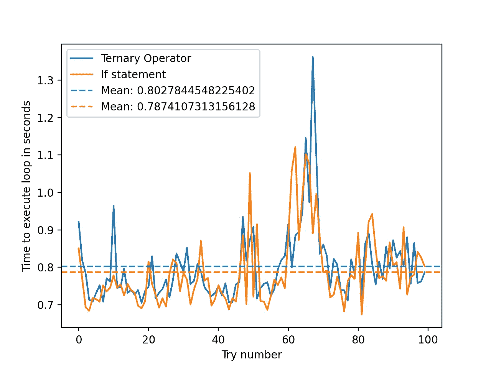

# 更好的 Pythoning 化 1:三元运算符

> 原文：<https://towardsdatascience.com/better-pythoning-1-ternary-operators-72b23a5d52a4?source=collection_archive---------44----------------------->

## 如何通过几个简单的步骤来缩短代码行并使其更具可读性

图片取自 [hiteshchoudhary](https://unsplash.com/photos/D9Zow2REm8U#:~:text=Choudhary-,%40hiteshchoudhary,-Download)

如果您是数据科学的初学者，很可能您已经遇到过三元运算符(很酷的单行 If 语句)。你是否想知道它们是什么，为什么它们无处不在，什么时候应该使用它们？

在这篇文章中，我将用例子简要地解释三元运算符，使它们易于理解。这是关于使用单行语句来缩短代码(例如，列表理解、Lambda 函数等)的四部分系列的第一部分。).本系列的最后一篇文章将教你如何结合这些不同的方法来大大缩短你的代码。我希望读者喜欢阅读这篇文章，学习一些新的东西，同时提高代码的可读性。

## 三元运算符——或者我称之为“花哨的 if 语句”

在 Python 中，IF 语句允许你在某些情况下运行代码的某些部分。一个简单的例子:

自然，这可以扩展到包括更复杂的命令。三元运算符可以实现 if 语句在一行中完成的大部分功能，例如:

这可以从字面上理解为:`print('I have a name')`如果`my_name`为*真*否则`print('I don\t have a name')`。

> truthy 指的是 Python 读为 boolean `True`的东西。这几乎可以是任何东西，除了一些显著的例外(这些被称为 falsy)，比如一个空列表`[]`，一个零`0`，一个空字符串`''`等等。

当 if 语句的唯一功能是设置变量时，这非常有用。例如:

> 注意，这是一个非常简单的例子，通过设置`is_retired = age > retirement_age`可以使它变得更加简单。

关键是三元运算符本身实际上不是语句，它们实际上是一个值。这意味着语句`True if age > retirement_age else False`就像一个运行后会返回值的函数。

另一方面，if 语句本身并不返回任何值。返回或不返回值的是 if 语句中的实际内容。这非常重要，因为像`raise`这样的函数不能用在三元运算符中，因为它们实际上不返回任何东西。

那么，如果是这样的话，第一个带`print`的三元运算符是如何工作的呢？事实上，这并不违反规则:`print`在运行时返回`None`。

> 如果你怀疑这一点，尝试设置`a = print('Hello World')`，然后`print(a)`

这意味着当我们执行`print('I have a name') if my_name else print('I don\t have a name')`时，我们实际上返回了`None`，但是我们没有指定一个变量来存储这个值！

最后一个复杂的问题是:三元运算符也可以接受函数的值。这解释如下:

值得注意的是，三元运算符中的函数`difference`和`print`没有任何括号。整个事情外面的括号意味着那些实际上是以`(retirement_age, age)`为变量的函数。虽然这很酷，但通常不经常使用，而且代码过于复杂，所以最好避免。

**关键要点:**

*   三元运算符是一个单行 if 语句，看起来像运算符，根据条件，**必须**返回值
*   这意味着它们对于**设置变量**非常有用，但是对于**运行代码**却没有用
*   三元运算符可以链接，例如:`my_surname = 'Unchained' if my_name.lower() == 'django' else 'Fett' if my_name.lower() == 'jango' else 'Surnameless'`
*   三元运算符可以用另一种形式编写，如下所示
*   值得注意的是，三元运算符只有在设置变量时才真正提高可读性，更复杂的用例是 if 语句的更好储备

## 结论

三元运算符有:

*   对于使**代码可读**来说相当强大(当明智地用于`return`变量时)
*   当用于简单表达式时，使你的代码**更短**

总的来说，我发现它们比 if 语句更好，并经常使用它们，尤其是因为它们对效率没有显著影响(见附录)。

值得注意的是，当在其他函数和表达式中使用这些操作符时，它们会变得更加强大，比如 List Comprehensions(同样，这是很酷的单行循环)，这是下一篇文章的主题。在这篇文章中，我将举例说明它们在实际数据科学问题中的用处。对列表理解的一个简短的窥探:

## 附录

这是我运行的一个小实验，看看三元运算符是否对效率有任何影响(根据[堆栈溢出](https://stackoverflow.com/questions/34599754/what-is-the-performance-cost-of-ternary-operator)，它们不应该)

我比较了两个使用三元运算符或 if 语句设置变量的 for 循环。然后，我重复实验 100 次，计算每次运行的时间差。代码和结果如下所示:

从上面我们可以看到，三元算子稍微慢了一点，大概~2.5%是相当小的。