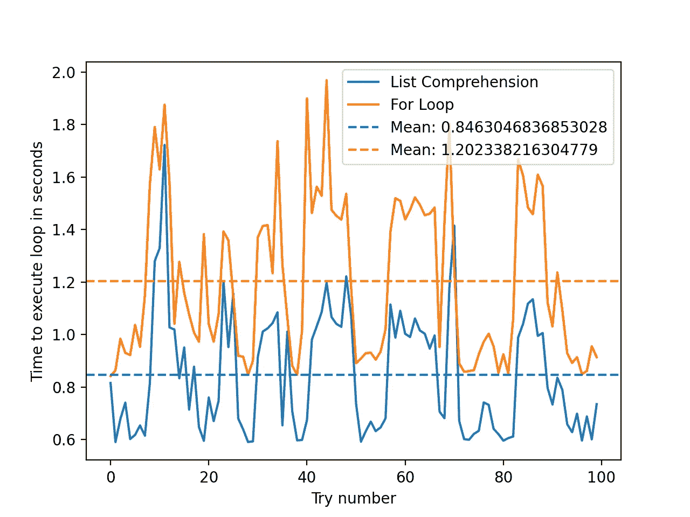

# 更好的 Pythoning 化 2:列表理解(包括带有 spaCy 的 NLP 示例)

> 原文：<https://towardsdatascience.com/better-pythoning-2-list-comprehensions-including-nlp-examples-with-spacy-88cd76fc6412?source=collection_archive---------39----------------------->

## 如何通过几个简单的步骤缩短代码行并使其更具可读性


图片取自 [hiteshchoudhary](https://unsplash.com/photos/D9Zow2REm8U#:~:text=Choudhary-,%40hiteshchoudhary,-Download)

如果您是数据科学的初学者，那么您可能会遇到 List Comprehensions(很酷的循环单行代码)。你想知道这些是什么吗？为什么它们如此普遍，什么时候应该使用它们？

在这篇文章中，我将用例子简要地解释列表理解，使它们易于理解。我将特别强调它们与 for 循环的区别，以及它们是否更有效。

这是关于使用单行语句缩短代码的四篇系列文章的第二篇。本系列的[上一篇](/better-pythoning-1-ternary-operators-72b23a5d52a4)文章研究了三元运算符(很酷的单行 if 语句)。本文将建立在前一篇文章的基础上，向您展示列表理解和三元运算符如何一起使您的代码更短、更易读。

我希望你喜欢阅读这篇文章，学习一些新的东西，提高你的编码技能。

## 列出理解——“花式循环”之类的？

在 Python 中，for 循环允许你遍历一个 **iterable** 来执行重复的任务。

典型的例子是打印数字 1 到 10:

这里，函数`range`是一个 iterable 对象，它创建从 0 到`num — 1`的数字(因此，本例中总共有 10 个数字)。我们可以使用列表理解来重新创建这些:

上面的语句是，`range(num)`中的每个`i`对应`print(i+1)`。我们基本上用少一行代码重复了相同的任务，这似乎并没有节省多少空间。那么这些有用吗？

当然了。

如果我们目光敏锐，我们会注意到我们实际上已经**创造了**一个`list`。我们同样可以将其设置为一个变量，例如:

```
numbers = [i + 1 for i in range(num)]
```

这很容易理解:在列表中为`range(num)`中的每个`i`创建一个值为`i+1`的元素。如果我们打印`numbers`，我们会得到:

```
[1, 2, 3, 4, 5, 6, 7, 8, 9, 10]
```

您可能想知道打印示例创建了什么？因为我们运行了`print` 10 次，所以我们创建了一个`None`值的列表(因为`print`返回`None`):

```
[None, None, None, None, None, None, None, None, None, None]
```

> 这使得我们的列表理解对于设置变量非常强大，因为我们有效地**创建了**变量，并在 **iterable** 运行时将它们存储在一个列表中。相比之下，for 循环不会在它自己的**上创建任何东西，而是由我们传递给 for 循环的东西来做这件事。**

将其与使用 for 循环创建列表所需的行数进行比较:

除了列表理解更短这一事实之外，值得注意的是它们更具可读性。

简单地说，值得注意的是，列表理解也可以用于创建集合和字典。例如:

## 列表理解和三元运算符

当你把列表理解和三元操作符一起使用时，你可以打开一个新的可读性层次。

**示例 1:** 假设您是一名教师，有一本学生姓名及其考试成绩的字典，您想从中提取成绩不太好的学生的姓名，以便为他们提供更多支持。

您可以使用 for 循环来实现这一点，但是使用列表理解要容易得多(并且可读性更好..):

列表理解为:在`score`小于或等于`failing_threshold`的情况下，为`student_scores.items()`中的每个`student`和`score`保存`student`。

> 值得注意的是，这个上下文中的列表理解只对减少数据有用。例如，不可能将不及格的学生和及格的学生都存储在两个不同的列表中。为此，您可以使用 For 循环。

三元运算符有用的另一个例子是，如果您希望根据某个条件来区别对待列表的组件。

**示例 2:** 假设您有一个包含学生及其分数的相同数据集，但是您想要创建一个目标变量“fail ”,如果学生不及格，该变量将给出 1，如果学生及格，该变量将给出 0

你可以这样做:

注意，这实际上是一个简单的例子，因为 if 语句和三元运算符都可以用`int(score <= fail_threshold)`代替。

然而，我们注意到当我们将列表理解与三元运算符一起使用时，它们会变得相当复杂(并且很长)。当你试图让你的代码更易读的时候，这是需要记住的。

## 二维列表理解？

列表理解可以被链接，这允许它们超越一维。让我先解释一个例子，你可能需要这个。

我最近遇到了一个问题，我需要展平一个列表列表，例如:

```
list_of_lists = [[1,2], [3,4], [5,6]]
```

我想把它转换成`list_of_lists = [1,2,3,4,5,6]`

我的第一反应是使用解包操作符`*`，但是这在列表理解中不受支持。我的逻辑是:

相反，我发现我需要本质上**链接**两个列表理解来使它变平:

令人困惑的是，逻辑并不符合你的预期:我的直觉是`num for num in list_ for list_ in list_of_lists`，但是 Python 要求列表顺序颠倒。

也可以在这里添加三元运算符，分别作用于列表理解，但是正如您可以想象的那样，这使得代码的可读性非常差，因此我个人避免这样做。我只是为了完整起见才添加的。

## spaCy 的应用实例

我将给你一个真实的数据科学的例子，说明列表理解是多么有用，特别是在 NLP 中。

我使用 [spacy](https://spacy.io/) 来创建我拥有的`Doc`文本对象。这意味着每个`token`实际上是一个对象，包含解释那个`token`是什么的参数(例如，它是一个名词，一个动词，一个数字等等……)。

spacy 做了所有这些注释，这很好，因为清理过程在我这边变得非常容易(也非常可读…):

## 结论

列表理解本质上是一种从可重复项创建列表的方法。它们提供了一种简单的方法，用一行代码概括大量的代码，使得代码非常易读。

**关键要点:**

*   列表理解是一个单行 for 循环，用于**从 iterables 实例化**新列表。与 for 循环不同，它们返回值
*   当与三元运算符一起使用时，它们对于从受约束的现有列表创建新列表非常有用
*   他们更有效率(参见附录)
*   它们可以被**链接**以沿着更高的维度工作，但是这失去了可读性
*   它们可以用于字典、集合和列表
*   像往常一样，更复杂的情况最好留给**循环和 if 语句**

总的来说，我发现这些理解非常优雅，并尝试将它们用于上述用例。正如你所看到的，列表理解在与三元运算符一起使用时确实很出色，然而，它们也可以与 **Lambda** 函数(很酷的单行函数)结合使用，这可以使你的代码更加紧凑。这将是本系列下一篇文章的主题，这是一个短暂的高峰:

## **附录:**

和我之前的文章一样，我想试验一下列表理解是否比使用 for 循环更快。三元运算符的实验表明，它们的效率比循环略低。

为此，我用学生的名字进行了实验，并对包含 1000 个学生名字的字典进行了评分。我重复了 10000 次。值得注意的是，在这种情况下，必须在 for 循环中使用 if 语句，在 list comprehension 中使用三元运算符。



我们可以看到列表理解实际上要快 30%,这给了我们更多的理由去使用它们。