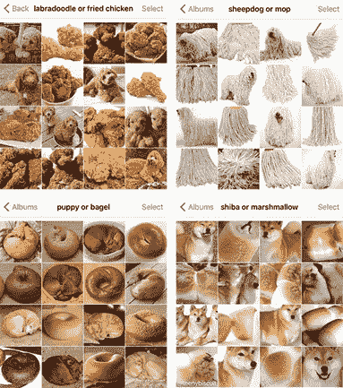

# 通过利用标签的层次结构提高深度学习分类模型的可靠性

> 原文：<https://towardsdatascience.com/better-reliability-of-deep-learning-classification-models-by-exploiting-hierarchy-of-labels-986603170fe0?source=collection_archive---------24----------------------->

## 如何使用来自标签的附加信息来训练合理性模型

在实践中使用预测性深度学习模型往往会带来一个问题，即我们可以在多大程度上信任该模型的预测。虽然有几个框架来验证它确实学习了正确的特征(例如，[石灰](https://github.com/marcotcr/lime)， [LRP](https://github.com/sebastian-lapuschkin/lrp_toolbox) )，但对于看不见的数据，仍然不能保证预测的类别是正确的。增加这种模型的可信度的一种选择是引入似真性检查。建立这种检查的一种方法是使用来自标签的分层结构的信息，这在公共数据集(CIFAR-10，Image-Net)中经常见到。目标是建立第二个模型，在层次结构中的父标签上训练，这篇文章将展示为什么这增加了模型的可靠性以及代价是什么。

# 扁平标签结构

大多数对新模型架构和更好的模型的研究都是基于平面标签，从数据集中丢弃了层次结构。对于 [ImageNet](http://image-net.org/challenges/LSVRC/) 通常使用 1000 个标签， [Birdsnap](http://thomasberg.org/) 使用 500 种鸟类作为标签。有一些模型利用了这些类别的层次结构，如 [HD-CNNs](https://arxiv.org/abs/1410.0736) 和 [Tree-CNNs](https://arxiv.org/abs/1802.05800) ，但这是一个相当小的领域。

在实践中，我们经常有这样的应用，其中我们的训练数据是有限的，并且随着时间的推移而增长。我们每个类别用于训练的图像数量是变化的，一些标签的准确性比其他标签差。新的标签不时出现，我们至少应该知道，我们可以在多大程度上依赖我们的预测。换句话说，我们能在多大程度上信任我们的模型？

# 概率分数在看不见的数据上是不可靠的

好的一面是，我们有概率得分，我们可以用它来估计预测的确定性。然而，当一个模型面对新数据时，它有时会给我们很高的概率分数，即使预测完全错误。特别是在具有许多标签的图像 CNN 中，当处理新数据时，我们可以观察到不稳定的预测。当我们谈论[细粒度图像分类](https://paperswithcode.com/task/fine-grained-image-classification)时，这个问题变得更加难以解决，在这种情况下，图像中的小细节会产生影响。

图 1—Twitter 上一些非常流行的错误分类

这些例子通常很难解决，但它们很好地说明了问题。一个以动物品种为标签的 CNN 无法检测食物或拖把。CNN 通常会采取一切可能的捷径来解决这个问题，很明显，从物体的整体颜色、形状和姿态来看，这些图像看起来非常相似。由于在动物身上训练的神经网络不理解狗的概念，它会感到困惑，并以很高的可信度对这些例子进行预测。

但是，如果我们另外有一个不同的 CNN 训练检测鼻子，眼睛和其他特征，这是动物的代表呢？

# 从标签中挖掘领域知识

这就是合理性检查的想法。如果第二个模型被训练来检测与我们的标签相关的不同特征，我们可以检查可信度。我们想从我们的数据结构中发掘信息。

另一个例子是在第二个模型中使用来自 ImageNet 的活动信息，并检查该活动与检测到的对象相结合是否有意义(当然，该信息必须在层次结构中编码)。

有了这些信息，就有可能利用标签结构中隐含领域知识。一个假设是，似真性模型受益于每类的大量训练数据，并且概括得更多，因此防止了过度拟合。

## 训练模型以检查可信度

原始模型在我们的目标标签上训练，因为它们在最高粒度上(标签层次结构中的叶子)。似真性模型在更高级别的标签(图中的父节点或相关节点)上被训练。为了使用动物分类器示例，原始模型根据动物的品种进行训练，并且具有 1000 个不同的标签，而似真性模型被训练来对数据中的 50 种不同的动物进行分类。

*一个旁注:*

*你可能会认为用多个模型直接对层级进行建模会容易得多，例如一个模型用于动物，在检测到动物后用另一个模型来检测每只动物的品种。是的，这是可能的，但是除了玩具数据，我们通常在一个树中有更多的类和节点，最终有数百个模型集合在一起。这通常是不实际的。*

具有似真性模型的另一个好处是，我们也可以使用带有不完整标签信息的图像。我们知道这种动物，但不知道确切的品种。当对现有的图像分类系统使用用户反馈时，这种情况经常发生。用户可能无法确定动物的品种，但清楚地知道它是一只狗。对于一个检测品种的模型来说，这些例子是不可用的。但是对于第二个模型，我们可以包括它们。

# 测试可信度

当我们训练这两个模型时，我们可以预测两个概率分数，一个用于细粒度目标标签，一个用于粗粒度似真性标签。由于类别数量的减少和每个类别图像数量的增加，我们的似真性模型通常比原始模型具有更好的准确性。

最后，我们得到图像的两个预测，并需要对结果应用一些逻辑:

*   当两个分数都很高，并且原始模型(例如品种)预测了一个标签，该标签与似真性预测(例如动物)相匹配时，我们可以假设该预测是正确的。*举例:0.98 狗/ 0.89 秋田*
*   当两个分数都很低时，我们知道结果不可靠或者图像上有简单的其他东西。*例如:0.05 的狗/ 0.07 的小猎犬*
*   当原始模型预测值较低，而第二个模型预测值较高时，我们可能会在原始模型的训练数据中发现一个缺失的标签(例如，缺失的品种)。*举例:0.98 猫/ 0.28 波斯*
*   当原始模型预测值较高而可信度模型预测值较低时，可能会出现上图所示的情况。不是猫，但形象很像。*举例:0.21 猫/ 0.98 波斯*
*   最后，最有趣的情况:假设我们的似真模型有很高的概率，原始模型有中等的概率，但标签不是似真的:*例如:0.98 狗/ 0.47 波斯*。显然，波斯人不是狗。但是，如果我们在原始模型中查看第二好的预测，发现 Briard 的 0.46，实际上是一只狗，会怎么样呢？在这里，假设布里亚德是正确的似乎是合理的。因此，一般来说，我们可以应用一个逻辑(或另一个模型)，搜索与给定动物匹配的最小分数的品种模型的前 n 个预测。

## 结论

使用似真性模型，其中数据中的层级信息是可用的，可以使预测更可靠。如果系统给出相互矛盾的分数，我们可以认为预测是错误的。此外，通过不仅查看顶部的预测，还查看前 N 个预测，我们可以更深入地了解模型的可能错误，找到丢失的标签，甚至纠正预测。另一方面，我们需要一个额外的模型，并在系统中引入逻辑检查。