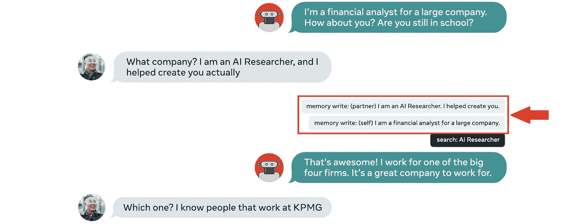
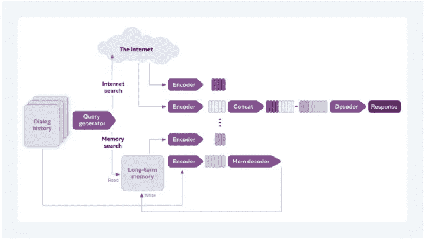

# 比 GPT 3 更好——来看看 BlenderBot 2.0:脸书最新的聊天机器人

> 原文：<https://towardsdatascience.com/better-than-gpt-3-meet-blenderbot-2-0-facebooks-latest-chatbot-8941f100d146?source=collection_archive---------16----------------------->

## 人工智能|新闻

## 而且是开源的！

[雷锐](https://unsplash.com/@ray30?utm_source=medium&utm_medium=referral)在 [Unsplash](https://unsplash.com?utm_source=medium&utm_medium=referral) 上拍照

从类人对话式人工智能来说，我们可能比我们想象的更近。

2020 年 4 月，脸书发布并开源了当时有史以来最大的聊天机器人； [BlenderBot](https://ai.facebook.com/blog/state-of-the-art-open-source-chatbot/) 。虽然 GPT-3 盖过了它，但与 OpenAI 的超级明星相比，BlenderBot 的能力毫不逊色。脸书人工智能团队选择将基于大型变压器的语言模型的超级成功趋势——blender bot 拥有 94 亿个参数，创下了当时的纪录——与其他技术相结合，以提高性能。

他们的最终目标是创造一个聊天机器人，能够“根据情况要求，提问和回答各种问题，展示知识，并表现出同理心、风度翩翩、引人入胜、严肃或有趣。”人类的对话是微妙含义和突然转变的复杂舞蹈。BlenderBot 本该成为最好的人工智能舞者。

除了通常的大规模训练(使用大量互联网数据)，他们使用混合技术和世代策略。

*   **混合技能:** BlenderBot 在一项名为[混合技能对话](https://arxiv.org/abs/2004.08449) (BST)的任务中进行了微调，该任务由三种不同的技能组合而成:展示独特的[个性](https://arxiv.org/abs/1801.07243)，利用先前的[知识](https://arxiv.org/abs/1811.01241)，展示[同理心](https://arxiv.org/abs/1811.00207)。什么时候应用这些技能是这种方法具有挑战性的原因。例如，系统应该区分人们什么时候需要被倾听，什么时候他们在问一个修辞性的——而不是真正的——问题。
*   **世代策略:**聊天机器人通过优化困惑度来训练——困惑度是一种衡量模型在预测下一个令牌时有多自信的指标。然而，脸书的团队认为，控制聊天机器人消息的长度——以及其他策略——可以提高性能。

人类评估者承认，BlenderBot 明显更有吸引力——他们更喜欢与它进行长时间的交谈——并且感觉比任何其他竞争对手都更有人情味，包括谷歌的 Meena(当时最先进的)。

现在，脸书人工智能团队又向前迈出了一步。7 月 16 日，他们发布了[开源](https://parl.ai/projects/blenderbot2/) BlenderBot 的继任者: [BlenderBot 2.0](https://ai.facebook.com/blog/blender-bot-2-an-open-source-chatbot-that-builds-long-term-memory-and-searches-the-internet) 。在这篇文章中，我将强调它相对于以前的对话式人工智能的改进，并解释它如何与 GPT-3 相比较。

# blender bot 2.0——上下文聊天机器人的力量

BlenderBot 2.0 建立在 BlenderBot 的独特功能之上。它表现出鲜明的个性，能够利用先前的知识并表现出同理心。然而，它更擅长举行多节对话和运用知识。它更忠实地记得以前的交互，并且它的话语事实上更一致。我们可以将这些改进归结为两个新特性:

*   **一个长期的本地记忆库。**
*   **随时随地访问互联网的能力。**

## 长期本地记忆存储

BlenderBot 2.0 学会了从大量人类对话数据中进行对话。它知道对话是如何构建的，以及根据上下文应该使用的风格。然而，我们谈论的内容在不断变化。当我们与另一个人交谈时，我们对彼此的所有共享的先验知识对于交谈的成功至关重要。

由于这个原因，BlenderBot 2.0 有一个长期的内存存储。它可以把大量的知识写在里面，供以后使用。脸书大学的研究人员 Jason Weston 和 Kurt Shuster 在他们的博客中分享了一个例子来说明这是如何发生的:

BlenderBot 2.0 保存了关于自身及其伙伴的内存知识——已编辑。原创于[脸书博客](https://ai.facebook.com/blog/blender-bot-2-an-open-source-chatbot-that-builds-long-term-memory-and-searches-the-internet)

这一功能最有希望的一面是，随着系统不断生成话语，它创建了自己的背景、个性和生活经历，这些都被存储起来，并随着时间的推移保持稳定。因为它还保存了关于其对话伙伴的信息，所以它建立了我们所说的健壮的虚拟关系。

BlenderBot 2.0 可以引出你在之前的对话中谈到的话题或想法。例如，“如果你几周前与它谈论汤姆·布拉迪，它可能会在未来的对话中提到 NFL，因为它知道这是一个与你相关的话题。”共同的记忆滋养了我们的关系。这种能力使它比其他任何对话式人工智能都更像人类。

## 互联网接入增加知识

与其他语言模型相反，BlenderBot 2.0 并不局限于它已经被训练过的知识或者它已经存储在本地存储器中的知识。它可以访问互联网以搜索相关的上下文信息。如果你提到一些系统不知道的东西，它会立即去寻找关于这个话题的最新信息。然后，它可以使用这些信息来推进对话，并进一步阐述某个主题或其个性。

例如，在下面的例子中，与 BlenderBot 2.0 交谈的人提到了海湾地区。BlenderBot 搜索这个词，并立即使用它来创建自己的一个新方面:“我住在旧金山湾区。”

BlenderBot 2.0 访问互联网来查找上下文信息—经过编辑。原创于[脸书博客](https://ai.facebook.com/blog/blender-bot-2-an-open-source-chatbot-that-builds-long-term-memory-and-searches-the-internet)

这个特性的威力是双重的:首先，BlenderBot 2.0 不会过时。像 GPT-3 这样的系统是用静态数据训练的，所以世界上发生的新事物不会被系统捕捉到。相反，BlenderBot 2.0 总是可以再次查找信息来更新它已经知道的内容。

第二，它对几乎所有事物都有无限的知识。因为它不会忘记它所知道的(由于它的记忆库)，它可以在以前的知识上建立一个人物角色。在我们拥有的最丰富的数据库的帮助下，它可以一直保持增长的特性；互联网。

## 结合记忆和外部知识——一个独特的架构

BlenderBot 2.0 背后的想法是创建一个对话式人工智能，可以添加对话中不包含的信息。这是一个可以创新地推动对话走向新道路的系统。为了实现这一点，BlenderBot 2.0 使用了脸书的[检索增强生成](https://ai.facebook.com/blog/retrieval-augmented-generation-streamlining-the-creation-of-intelligent-natural-language-processing-models/)方法。它允许系统不仅根据对话本身，而且通过访问其存储器或互联网数据来决定对什么做出响应。

BlenderBot 2.0 算法结构——在[脸书博客](https://ai.facebook.com/blog/blender-bot-2-an-open-source-chatbot-that-builds-long-term-memory-and-searches-the-internet)中

我们人类以类似的方式发展——保持距离。我们感知世界，并与世界互动，以获取知识和生活经验。我们与其他人发展关系，也从不同的来源(包括互联网)学习。我们获取关于世界的信息，并将其与我们先前的知识相结合，小心地储存在我们的记忆数据库中。这就是我们进化和成长的方式，也是我们决定下一步做什么的方式。所有这些，加上我们自身的稳定性，造就了我们。BlenderBot 2.0 是我们最接近以这种方式构建的人工智能。

# 比 GPT 3 号有更多的记忆和知识

## GPT 3 号是无记忆的

这个高超的语言模型在许多不同的生成任务中被证明是成功的。它掌握了语言的形式，以至于它的文本甚至可以轻易地愚弄精通技术的人。然而，它的一个缺点是记忆力差。在适当的提示下，GPT 3 号可以成为一名优秀的诗人，但第二天它又会变成一名新手。该系统并不打算保存以前的对话。相比之下，我可以向 BlenderBot 2.0 提到，我喜欢早餐吃西兰花和鲑鱼，三周后它可能会建议我在菜里加入土豆。

GPT-3 的内存不足不仅仅是一个与实用程序相关的缺点。这让它缺乏个性。不可避免地感觉我们在和一台机器对话。在一段时间内，它可以让我们忘记它是一堆 1 和 0。但它最终总是暴露自己，因为它没有一个稳定的行为。

## GPT-3 已经过时了

许多用户发现 GPT 3 号的另一个缺点是缺乏最新知识。GPT-3 是在一个变化比以往任何时候都快的世界中根据静态数据进行训练的——全球数据量[每两年翻一番](https://qz.com/472292/data-is-expected-to-double-every-two-years-for-the-next-decade/)。以这种方式训练的系统可能成为*幻觉*的受害者——对不真实的信息充满信心。例如，一个用户问 GPT-3 史蒂夫·乔布斯现在在哪里，系统[回复](https://twitter.com/hc_mty/status/1284154884074483713):“我在加州库比蒂诺的苹果总部。”史蒂夫·乔布斯十年前就去世了，但是 GPT-3 没有储存这些知识。

这不仅降低了 GPT-3 的实用性，甚至还会带来危险。这就是为什么 OpenAI 的研究人员建议不要将该系统用于高风险类别。我们希望对话式人工智能总是给我们最新的信息。如果有一天我们要依赖这些系统，我们将需要它们每分钟都被更新。

# 结论

BlenderBot 2.0 是向类人对话式人工智能的又一次飞跃。就目前而言，它具有人格、同理心、记忆力，并能从互联网上获取和使用知识。下一个技术挑战是多模态；一个聊天机器人可以使用图像——或其他类型的感知数据——来更接近地模仿人类相互交流的方式。

另一个至关重要的挑战是安全性。微软的 Tay 证明了这些系统很容易走上仇恨和不宽容的道路。我们应该让这些系统充满道德过滤器，以避免它们产生“不安全或攻击性的言论”。脸书人工智能团队开发了[两种方法](https://aclanthology.org/2021.naacl-main.235/)来对抗恶意意图:固有的安全性和对困难提示的鲁棒性。

要完全信任这些系统还有很长的路要走，但似乎人工智能的安全、道德和问责现在是推动该领域发展的大型科技公司的优先事项。我想大多数人会同意我的看法，这些方面比实现 AGI 更为紧迫。我们最终会实现这个目标，但最重要的是我们要尽可能做到最好。

## 订阅我的免费每周简讯[明日之心](https://mindsoftomorrow.ck.page/)获取更多关于人工智能的内容、新闻、见解和思考！

## 此外，请随时在 [LinkedIn](https://www.linkedin.com/in/alberromgar/) 或 [Twitter](https://twitter.com/Alber_RomGar) 上发表评论和联系！:)

# 推荐阅读

</googles-lamda-the-next-generation-of-chatbots-62294be58426> 