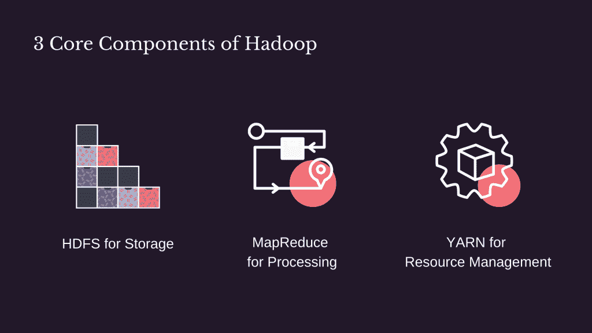
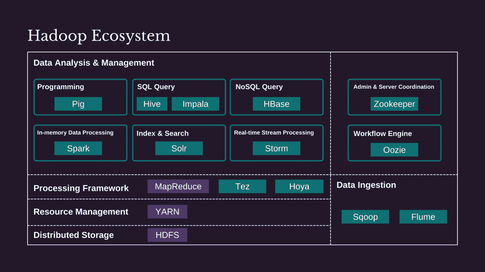
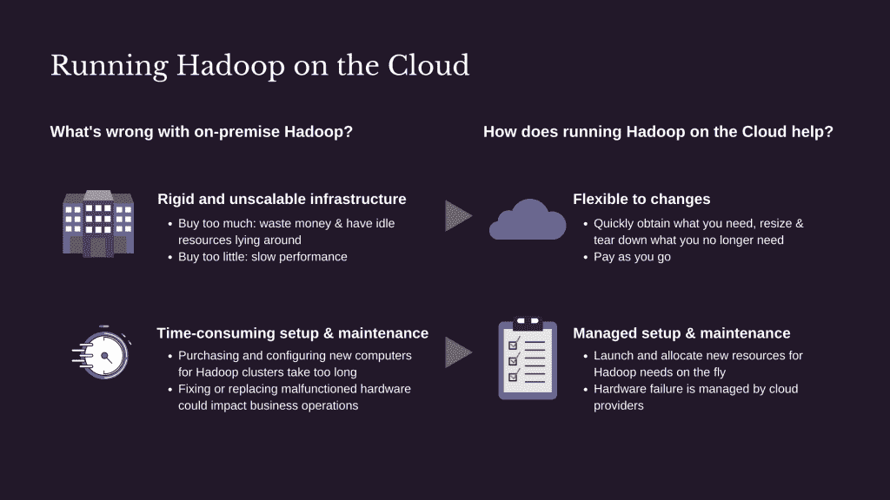

# 在 Hadoop 和云之间:我们将何去何从？

> 原文：<https://towardsdatascience.com/between-hadoop-and-the-cloud-where-do-we-go-from-here-516bf2fb719c?source=collection_archive---------50----------------------->

## 在后新冠肺炎时代，企业必须准备好快速应对和适应。旧的 Hadoop 技术在这个新世界中有一席之地吗？

[韦雪恩(魏贤)成龙](https://unsplash.com/@weixian?utm_source=unsplash&utm_medium=referral&utm_content=creditCopyText)在 [Unsplash](https://unsplash.com/s/photos/cloud?utm_source=unsplash&utm_medium=referral&utm_content=creditCopyText) 上的照片

在 2021 年的新兴世界，大数据和机器学习仍然是圣杯，而对卓越速度和敏捷性的需求继续加快云的采用。旧的 Hadoop 技术在这个新世界中有一席之地吗？为了阐明这个问题，让我们思考一下什么是 Hadoop，以及云是如何影响 Hadoop 的。

**在这篇文章中，你会:**

1.  了解 Hadoop
2.  探索云上的 Hadoop
3.  借助现代云平台展望未来

# 了解 Hadoop

## Hadoop 为何如此重要？

曾几何时，随着我们业务的增长，我们开始产生太多的数据，无法用一台计算机来存储和处理。

也许是时候升级了？好的，所以我们买了一台更好的电脑，比以前的更先进，当然也更贵。

直到有一天，我们又一次产生了太多的数据，这台新电脑也放弃了。然而，购买一台又一台先进的计算机实在是太贵了，负担不起。

如果有太多的数据需要存储在一台计算机上，那么把它分成小块，存储在多台计算机上怎么样？

如果用一台计算机处理所有数据花费太长时间，我们为什么不把处理任务分成更小的任务，让多台计算机并行处理这些数据块呢？

你可能已经猜到了，Hadoop 让这两个想法成为了现实。

再也不用花一大笔钱去追求市场上最先进的计算机了！企业可以购买更多负担得起的日常电脑，以满足不断增长的存储和处理更多数据的需求**。**因此， **Hadoop 的核心是提供一个可靠、可扩展且经济高效的平台，通过将非常大的工作负载分布在许多单独的计算机上来存储和处理数 Pb 的数据。**

## Hadoop 生态系统是什么样子的？

**Hadoop 的核心组件**

作者图片

作为存储层， **HDFS 是捕获所有数据处理任务的数据、中间结果和最终结果的地方。**在 HDFS 存储一个文件时，系统将它分成大小均匀的数据块，并将这些数据块存储在许多单独的计算机中(也称为 Hadoop 集群)。

如果说 HDFS 是将大数据分解成可管理的块进行存储，那么 **MapReduce 就是将一个大问题分成许多小块，这样你就可以并行处理它们，更快地解决问题。**Map 任务在存储数据的计算机上单独处理数据块，而 Reduce 任务将从各个计算机获得的所有结果组合成一个结果集。

MapReduce 负责数据处理，而 **YARN 则负责资源管理，确保每一项工作都分配到合适的计算机上完成。**这种**使 Hadoop 能够运行除 MapReduce 之外的不同工作负载，最终扩展 Hadoop 功能以支持其他应用**处理流数据或运行临时数据分析。

**Hadoop 生态系统的其他部分**

作者图片*(并非生态系统的所有开源组件都包括在内)*

凭借其 3 个核心组件，Hadoop 只是一个存储和处理数据的通用平台，没有任何搜索或查询结构化数据的特殊功能。这意味着它需要其他组件来形成分析大数据的完整解决方案。

例如，我们需要 Sqoop 和 Flume 分别将结构化数据(来自关系数据库或数据仓库)和事件数据(来自物联网设备或社交媒体网络)批量收集到 HDFS 进行分析和洞察。

此外，我们需要额外的工具来满足不同的任务，如用 Pig 编程，用 Hive 或 index 查询结构化数据，用 Solr 搜索。此外，其他工作流管理工具，如 Oozie，也在调度和管理 Hadoop 任务中起着至关重要的作用。

**简而言之，正是开源组件的更大生态系统使得 Hadoop 在回答业务问题时非常有用。**

## 十秒钟外卖

***Hadoop 的核心是提供一个可靠、可扩展且经济高效的平台，通过在许多单独的计算机上分配非常大的工作负载来存储和处理数 Pb 的数据。*** ***您可以购买您需要的多少台计算机，安装您想要的组件，留下您不需要的，并根据您的业务需求添加您的细微差别。***

# 探索云上的 Hadoop

## 云是如何融入 Hadoop 的？

到目前为止，我们只讨论了公司购买、构建和维护许多计算机来存储和处理大数据的本地 Hadoop。但是从那以后，技术发生了巨大的变化。

如果可以在云端运行 Hadoop 会怎么样？换句话说，**你只需从 AWS、谷歌云平台或微软 Azure 等云提供商那里租用你需要的多少台电脑，安装 Hadoop 并处理你想要多长时间(或多短时间)的数据，同时像每月支付电费一样支付给他们。**

在我们探讨为什么有人愿意将 Hadoop 从内部迁移到云之前，理解云的含义很重要。这里有一个简单的定义，摘自我最喜欢的书“[像我 10](https://www.goodreads.com/book/show/38598010-explain-the-cloud-like-i-m-10) 一样解释云”。

> 云是一个计算机网络，通过互联网提供某种服务。你不关心那些电脑在哪里或者它们是如何工作的。你永远看不到他们。你从来不碰它们。它们只是一群供你使用的联网计算机。
> 
> —托德·霍夫

## 我们为什么要考虑在云上运行 Hadoop 呢？

在云上运行 Hadoop 的想法包含了许多引人注目的优势。下面是将 Hadoop 迁移到云中可以很好地解决的两个关键问题。

作者图片

如果不提及以下两点关于在云上运行 Hadoop 的要点，这将是不完整的。

1.  **许多公司不能或不愿意完全放弃昂贵的长期本地基础设施。**因此，他们可以选择混合云架构来在本地运行某些作业(如果出于安全原因数据无法上传到云中)，并在云上处理其他工作负载。那样生活会更复杂，但在特殊情况下会足够好。
2.  在云上运行 Hadoop 并不是解决所有问题的灵丹妙药。比如不能保证存更多的钱。不管你是否使用，你仍然需要为你所请求的东西付费。安装 Hadoop 组件、微调性能和正确处理网络仍然需要时间和专业知识。

## 十秒钟外卖

***既然在云上运行 Hadoop 仅仅意味着一切如常，但是在云中，处理大数据进行分析和洞察还远远不是一个完美的解决方案。然而，它确实提供了一些希望，因为云可以节省您的大量工作，同时让您的 Hadoop 更快地启动和运行。***

# 借助现代云平台展望未来

随着我们更深入地进入新的云世界，我个人看不出在云上运行 Hadoop 的意义。当我们也有一系列选择来通过现代云平台存储和分析大数据时，我们为什么要降低要求呢？

但首先，我们需要知道有哪些选择。所以让我们来了解一下吧！

## 选项 1:托管 Hadoop 服务

Being 是在云上运行 Hadoop 的一个进步，首选意味着利用云提供商提供的预打包 Hadoop 服务。一些例子包括 AWS Elastic MapReduce (EMR)、Google Cloud Dataproc 和 Microsoft Azure HDInsight。

它是这样工作的:**你按需创建 Hadoop 集群，定义需要什么 MapReduce 或 Spark 作业，让它们执行那些数据处理任务，并在得到结果后关闭它们。**虽然您仍然需要为消耗的计算资源付费，但您不必担心如何手动安装和配置 Hadoop 组件以及管理它们的性能。

然而，许多组织持怀疑态度，因为**这样的预打包服务可能不足以应对复杂的需求**或者**导致供应商锁定**。而且之前没用过 Hadoop 的人也在完全绕过它**来避免复杂性和高学习曲线。**

## 选项 2:云大数据解决方案

正如您可能已经猜到的那样，对于那些以前从未使用过 Hadoop 并且很可能负担不起专业知识的人来说，云提供商提供的大数据解决方案可能是真正的解决方案。简单地说，让我们永远摆脱 Hadoop。

在数据生命周期的每个阶段(即摄取、存储、处理和分析、探索和可视化)，**主要云提供商，如** [**【亚马逊】**](https://aws.amazon.com/big-data/datalakes-and-analytics/)**[**谷歌**](https://cloud.google.com/solutions/data-lifecycle-cloud-platform#processing_large-scale_data) **和** [**微软**](https://azure.microsoft.com/en-au/solutions/big-data/) **提供多种解决方案，专门满足终端用户不断变化的大数据需求**。只要看一看他们的产品，我们就可以很容易地看到，与 Hadoop 生态系统相比，他们的选择真的是无穷无尽，而且同样多才多艺。还有呢？大多数云解决方案的直观图形用户界面意味着**用户可以更快地从数据中获得洞察力并做出明智的决策**，而不必首先成为所有方面的技术专家。**

**云解决方案的另一个关键卖点是**人工智能(AI)和机器学习(ML)的附加组件。**选项可以从现成的预训练 ML 模型到托管 AI 平台(用于从头构建您自己的模型)不等。**用准确的预测为数据驱动的决策提供信息的能力**是 Hadoop 难以企及的。**

**当然，生活中的每一件事，总有潜在的取舍。在这种情况下，如果您要用其他东西替换 Hadoop，一定的学习曲线是不可避免的。此外，你对特定于供应商的解决方案参与得越多，你就离开源世界和随心所欲工作的权力越远。**

## **十秒钟外卖**

*****一方面，摆脱 Hadoop 意味着远离开源解决方案，但提供了便利性、易用性和更强的 AI/ML 能力。另一方面，选择托管 Hadoop 平台需要关于 Hadoop 工具的专门知识，同时保留使用任何您想要的开源工具的自由。不幸的是，不存在完美的一刀切的解决方案，因为这是一个选择和优先事项的问题。*****

# **离别的思绪**

**用于大数据的旧 Hadoop 技术在这个大数据和机器学习的新世界中有一席之地吗？我想说，至少现在，Hadoop 不会很快完全消失。但我们正处于过渡阶段，不同的组织在不同程度上表现出让云补充或取代 Hadoop。**

**由于速度和敏捷性的重要性，**云的采用不再是“是否”的问题，而是“多快”和“到什么程度”的问题。**在后新冠肺炎时代，企业必须准备好快速响应和适应，云数据解决方案将蓬勃发展，并可能成为加速大规模创新和释放额外商业价值的重要因素。**

**如果你正在读这篇文章，感谢你的时间，我真的希望你能从这篇文章中得到一些价值。欢迎访问我在[https://thedigitalskye.com/](https://thedigitalskye.com/)的博客，或者通过 [LinkedIn](https://www.linkedin.com/in/skyetran/) 和 [Twitter](https://twitter.com/SkyeTranNH) 与我取得联系，了解关于数据、商业和其他任何事情的激动人心的故事。各位，万岁，繁荣昌盛！**

# **参考**

1.  **[托德·霍夫《像我 10 岁一样解释云》](https://www.goodreads.com/book/show/38598010-explain-the-cloud-like-i-m-10)**
2.  **[Bill Havanki 的《将 Hadoop 迁移到云上》](https://learning.oreilly.com/library/view/moving-hadoop-to/9781491959626/)**
3.  **[Hadoop:汤姆·怀特的权威指南](https://learning.oreilly.com/library/view/hadoop-the-definitive/9781491901687/ch17.html)**

**【http://thedigitalskye.com】原载于 2021 年 3 月 1 日<http://thedigitalskye.com/2021/03/02/between-hadoop-and-the-cloud-where-do-we-go-from-here/>**。****