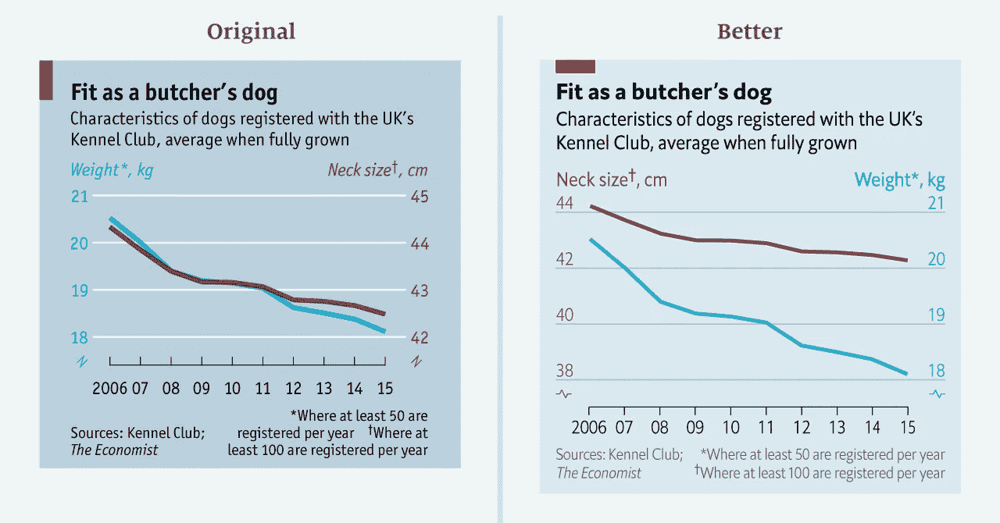

# 小心数据分析中的偏见

> 原文：<https://towardsdatascience.com/beware-of-biases-in-data-analysis-accf0cb9b3a?source=collection_archive---------10----------------------->

## 影响数据分析的认知和统计偏差以及如何克服它们

作为一名产品分析师，你有没有遇到过这样的情况:你的团队有了一个产品想法(你*认为这个想法非常棒)，进行分析和实验，结果看起来不错，然后发布，却发现这个想法实际上很糟糕？然后你开始怀疑也许执行不正确——营销或运营方面出了什么问题？但是你有没有想过**问题可能在你这边？**可能，在你的分析中有一些失败将洞察力引向你*不自觉*希望、**的**方向，而不是它应该在的地方**。***

# *你可能已经注意到了这个迹象——当你继续挖掘数据，直到洞察力似乎“*正确*”。*

**

*图片来源:[https://imgs.xkcd.com/comics/machine_learning.png](https://imgs.xkcd.com/comics/machine_learning.png)*

*人类这种影响自己判断的主观天性被广泛称为 [**偏见**](https://en.wikipedia.org/wiki/Cognitive_bias) 。引用维基百科的说法，认知偏差是一种“*偏离* [*规范*](https://en.wikipedia.org/wiki/Norm_(philosophy)) *或理性判断*的系统性模式”。它已经在许多社会心理学和行为经济学研究中得到确认和使用，因为它影响人们在日常生活中的决策，包括在数据分析工作中。*

# *偏见的类型*

*首先，让我们探讨一下常见的、对数据分析工作有重大影响的各种偏差。*

## *认知偏差*

*认知偏差主要是干扰分析流程的主观性——假设、假设、研究问题，以及最终的探索性优先排序。*

*   ***确认偏见**:以*确认一个人的先入之见*的方式搜索、解释、关注和记忆信息的倾向(来源:维基百科)。这种偏差通常发生在表演的人有一个预先确定的假设，其中数据分析被用来证明它。然后他们继续查看数据，直到这个假设被证明。*
*   ***可用性偏差**:高估记忆中“可用性”更大的事件的可能性的倾向，这可能受到*记忆有多近*或它们可能有多不寻常或情绪化的影响(来源:维基百科)。根据组织中发生的历史事件或分析师的经验，会有一些分析师首先努力和优先分析的“首要”项目和问题。*
*   ***框架**:从相同的信息中得出不同的结论，这取决于信息是如何呈现的*(来源:维基百科)。根据你分析的角度，有些方法可能太窄或太宽。有时，即使选择使用“绝对数字”或“百分比”，或者数据可视化中使用的轴刻度，也会给得出的结论带来巨大的差异。**

****

**左图以某种方式显示了相关性，但当 viz 被调整到正确的比例时，它不再显示相关性(Pic credit:Sarah Leo[https://medium . economist . com/errors-we ve-draw-a-first-8 cdd 8 a 42d 368](https://medium.economist.com/mistakes-weve-drawn-a-few-8cdd8a42d368))**

**让我们举一个这些偏见结合在一起的例子。**

**假设你是一家电子商务公司的业务分析师。业务开发团队提出了一个请求，他们注意到交易量略有增加，希望了解这一现象的原因。**

**然后你*还记得*几周前有报道说市场某个位置发生了滥用推广的行为，膨胀了平台的总交易量。你怀疑同样的事情，虽然已经发生过一次，而且已经处理过了，但还会再次发生( ***可用性偏差*** )。**

**然后记住这个假设，你开始列出研究问题来*证明这个* ( ***证实偏差*** )。你看之前欺诈区域的交易，他们的推广交易，他们新用户的交易等等。**

**然后观察该地区新用户促销交易的增加，您*得出结论*总体交易增加是由于在那里提出 100 万笔交易数据的欺诈。尽管 100 万笔交易仅占整个平台 1 亿笔交易增量的 1%，但这种情况还是会发生——这是我们最初的问题陈述( ***框架偏差*** )。**

**这不是分析和做出商业决策的理想方式，对吗？**

**在维基百科页面上阅读更多关于认知偏见的内容。**

## **统计偏差**

**统计偏差大多是我们在做分析时不自觉陷入的技术谬误。**

*   ****选择偏倚**:在选择个体、群体进行数据分析时引入的[偏倚](https://en.wikipedia.org/wiki/Bias)，这种方法不能实现适当的随机化，从而确保获得的样本不能代表待分析的人群(来源:维基百科)。对于数据分析师来说，这主要发生在 ***产品实验*** 中。有些情况下，实验发生在预先选择的表现最佳的客户群，但实际推出的是所有客户群，这产生了不同的结果。或者当实验在几天的时间框架内完成时，该时间框架不能捕捉产品性质的每周季节性。**
*   ****生存偏差**:关注那些通过了某些选择过程的人或事，而忽略那些没有通过的人或事的[逻辑错误](https://en.wikipedia.org/wiki/Logical_error)，通常是因为他们缺乏可见性(来源:维基百科)。这种生存偏差会导致一些 ***错误信念*** 于治疗所给予的积极影响。例如，你正在分析你的产品中忠诚顾客的行为。你会发现，这些忠诚的客户大多来自客户推荐，最后，你会推荐客户推荐来获得潜在的忠诚客户。你可能会忘记，无论如何，客户推荐在你的新客户获取中占了很大一部分。**
*   ****遗漏变量偏倚**:选择偏倚的一个更具统计学特异性的版本，这是统计模型遗漏一个或多个相关(混杂)变量的情况。在数据建模中，这可能会导致模型拟合不足。或者当它被拟合时，它 ***可能不会足够健壮*** ，因为遗漏了变量。**

**当识别和理解时，这些统计偏差比认知偏差更容易预防，因为技术细节可以被注意到和解决。**

****

**[Ioan F](https://unsplash.com/@ezanu?utm_source=medium&utm_medium=referral) 在 [Unsplash](https://unsplash.com?utm_source=medium&utm_medium=referral) 上的照片**

# **克服偏见**

**现在你知道了在数据分析过程中可能出现的不同偏差，你可能会问“*我该怎么办？*”。这里有一些提示，你可以用来更好地意识到偏见，并防止它们妨碍分析的客观性。**

## **心态**

*   ****不要固执己见。**你可能听说过“强有力的观点弱有力的持有”这句话，简单来说就是尽管你已经做了调查，并且(*你觉得*)你很了解自己的东西，但仍有可能你错了。记住确认偏差及其代价，然后**向新想法**敞开心扉——甚至是那些挑战你观点的想法。即使在检查了那个新想法之后(客观地！)你发现你最初的看法是对的，你会对此更加肯定:)**
*   ****实验重点**。作为上一点的延续，我们可能想训练我们的思维，把分析当成一次旅行，中间有一些实验。通过这些实验，我们探索数据并**揭示洞察力**而不管我们反对它们的立场。**
*   ****避免走捷径**。可以理解的是，大多数科技公司(尤其是初创公司)生活在高速时代，所有事情都需要在一个实例中完成。作为一名分析师，我们被推动着快速获得洞察力，并且更经常地以可用性偏差做出结论，或者以省略变量偏差创建数据模型，因为它们是我们的首选。在这种情况下，分析师和他们的领导应该站出来，在教育用户分析方面发挥咨询作用——这些事情可以很快完成，也不能很快完成。记住**可靠的结果只能通过正确的方法**和技术来实现。**

## **执行技术**

*   ****重新表述你的分析目标和假设**。将分析目标从一个是/否的问题转变为一个更加精细和没有方向的问题。例如，不是“发现新产品是否增加交易”——这是一种假设积极影响的向上语气，我们可能想将其改为“新产品的表现如何？”——哪个**更中性**。**

****

**在 [Unsplash](https://unsplash.com?utm_source=medium&utm_medium=referral) 上由 [Tachina Lee](https://unsplash.com/@chne_?utm_source=medium&utm_medium=referral) 拍照**

*   ****从不同角度丰富你的分析**。为了避免主观性，你可能想把自己放在一个分析的直升机视图中。思考分析中涉及的不同组件以及它们可能如何相互作用，该产品的变化将如何影响不同细分市场的客户—新客户、低使用率客户和忠诚客户。与其他分析师、研究人员、产品经理或设计师进行讨论可能有助于**获得新的观点。****
*   ****合适的样本和数据选择**。特别是对于产品实验设置中的选择偏差，从不同客户群中获取随机样本以获得代表性，确保在进行统计测试之前达到最小样本量，并运行足够长时间的实验以覆盖数据带来的短期波动(即周末的高流量)，这一点很重要。**

# **最后的话**

**知道并意识到偏见的存在是一回事。然后你需要在进行分析时更加注意，做清单以防止偏见干扰分析。希望本文和技巧可以帮助您交付更好的数据分析结果。**