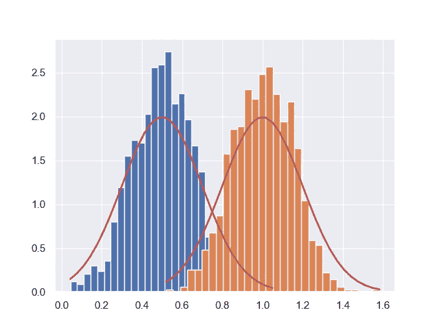

# 小心数据转移

> 原文：<https://towardsdatascience.com/beware-of-data-shifts-162cb32d4d41?source=collection_archive---------37----------------------->

## 数据科学

## 训练数据和实施后数据之间的差异会导致模型性能不佳

艾莉娜·格鲁布尼亚克在 [Unsplash](https://unsplash.com?utm_source=medium&utm_medium=referral) 上的照片

用机器学习算法建立的预测模型在现实世界中往往表现不佳。

即使是由一些世界顶尖专家建造的人工智能，也常常难以在“实验室”之外复制出有前途的性能。一个突出的例子是在[谷歌](https://www.blog.google/technology/health/healthcare-ai-systems-put-people-center/)开发的医疗保健人工智能系统。

人工智能应用旨在帮助诊断。从癌症筛查到疾病检测和风险预测。

当在实验室环境中进行培训和评估时，这些应用非常成功。但是当在真实世界中进行测试时，例如在泰国的诊所中,[性能](https://www.technologyreview.com/2020/04/27/1000658/google-medical-ai-accurate-lab-real-life-clinic-covid-diabetes-retina-disease/)无法与实验室环境相匹配。

在这种情况下，提供给算法的数据质量低于训练数据。但是许多不同的潜在原因导致了同一个问题:数据移动。

数据偏移是一个用来描述数据分布变化的术语。发生这种变化的原因有很多。然而，它们可以归结为三个主要机制。

1.  导致目标变量发生变化的原因(与所使用的解释变量无关)。
2.  导致解释变量变化的原因。
3.  改变目标变量和解释变量之间潜在关系和/或模式的原因。

下面将进一步阐述这些机制。

理解数据转移的根源和影响是解决模型性能比预期差(模型性能下降)相关问题的先决条件。

## 分区在

想象一下。

您希望实现一个预测模型。这样做的过程很清楚。

首先，对可用于训练和验证的数据进行冗长而彻底的探索。然后，开发一堆各种各样的机器学习模型。

最后，正确选择和实现在各种验证过程中表现良好的模型。

什么会出错？

嗯，很多事情。人工智能和人工智能模型最常见的问题之一是数据底层分布的变化。无论是使用相当简单的回归模型还是复杂的算法，如深度神经网络，数据转移都是建模者头疼的一个常见原因。

## **1。先验概率转移**

上面列出的第一种机制正式称为先验概率转移。

它描述了目标变量的分布发生变化，而解释变量(或输入变量)的分布不变的情况。

这可能是由于状态的改变。让我们假设您想要预测给定处方药药店将销售多少，以确保有效的供应管理。

你有一个模型，它考虑了居住在附近的人数、该药物治疗的疾病的发病率、该药物和替代药物的价格以及药房之间的距离。

但是不可预见的事情发生了，导致对该药物的需求发生了变化，尽管解释需求的变量没有变化。

快速嗅觉测试-检查是否应该花费更多资源来检测潜在的先验概率转移-只是绘制 1)用于训练和验证的数据集和 2)模型表现不佳的新数据集的直方图。

如果直方图看起来像下面这样，我们的嗅觉测试表明发生了变化。

由来自 G. Sarantidis 的代码生成的直方图。来源:https://gsarantitis.wordpress.com/

## 2.协变量移位

所列的第二种机制，改变了(的分配！)解释变量(或协变量或输入变量)是协变量移位。

在上面的例子中，如果居住在药店附近的人口大量增加，将会发生协变量转移，但这些人(出于某种原因)都没有任何条件要求他们需求所述药物。

测试协变量变化的一种方法是将新数据(来自模型实施但表现不佳的时期)与训练数据混合。

取出随机样本作为测试数据，并使用剩余的数据来训练模型，以预测观察值是源于原始训练数据还是新数据。

如果原始训练数据和新数据无法区分，就不太可能有协变量偏移。

如果它们是可区分的，你应该重新训练你的模型。

## 3.概念漂移

列出的第三种机制，即目标变量和解释变量之间关系的变化，通常被称为概念漂移。

发生这种情况有几个原因。其中有*选择*(一种确定性的观测去除)，周期性变化(未被检测到)，以及非平稳性。

概念漂移在时间序列中很常见。如何处理取决于具体问题，有时会受到可用数据的限制。

关于这件事的很好的介绍可以在[这里](https://machinelearningmastery.com/gentle-introduction-concept-drift-machine-learning/)找到。

## 外卖食品

数据偏移是机器学习方法的各种实现中的常见问题。从图像识别到预测建模。

发现和解决它们的困难程度因情况而异。

但是思考它们、测试它们、处理它们或者意识到它们如何对给定模型或算法的良好运行提出挑战是至关重要的。

所以亲爱的数据科学家们，当心数据转移。

</stop-using-p-0-05-9743e5cddc21>  </are-your-models-using-the-correct-significance-levels-c88367ee0544> 