# 小心熊猫的虚拟变量陷阱

> 原文：<https://towardsdatascience.com/beware-of-the-dummy-variable-trap-in-pandas-727e8e6b8bde?source=collection_archive---------3----------------------->

## 使用`pandas.get_dummies()`对数据进行编码时需要记住的重要注意事项


[由 www.freepik.com sentavio 制作的 Man vector](https://www.freepik.com/vectors/man)

处理分类变量是机器学习管道的重要组成部分。虽然机器学习算法可以自然地处理数字变量，但这对于它们的分类对应项是无效的。虽然有像 [LightGBM](https://lightgbm.readthedocs.io/en/latest/Advanced-Topics.html#categorical-feature-support) 和 [Catboost](https://catboost.ai/docs/features/categorical-features.html) 这样的算法可以固有地处理分类变量，但大多数其他算法都不是这样。这些分类变量必须首先转换成数字量，以输入到机器学习算法中。有许多方法可以对分类变量进行编码，比如一次性编码、顺序编码、标签编码等。但是本文着眼于 pandas 的虚拟变量编码，并揭示了它的潜在局限性。

# 分类变量—快速介绍

一个 [**变量**](https://www.stat.berkeley.edu/~stark/SticiGui/Text/gloss.htm#variable) 的值在多个类别中变化，称为分类变量，如性别、头发颜色、种族、邮政编码或社会保险号。两个邮政编码或社会保险号的总和没有意义。同样，邮政编码列表的平均值也没有意义。分类变量可以根据它们分组的元素种类分为两个子类别:

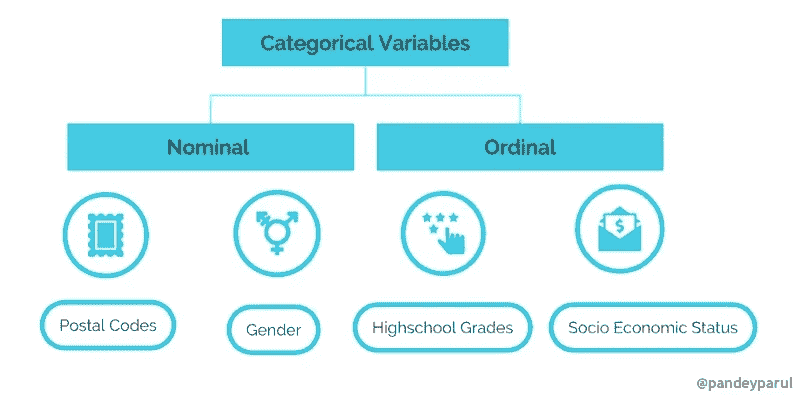

分类变量|作者图片

*   **名义变量**是那些类别没有自然顺序或排序的变量。例如，我们可以用`1`表示红色，用`2`表示蓝色。但是这些数字没有数学意义。也就是不能相加，也不能取平均值。属于这一类别的例子有性别、邮政编码、头发颜色等。
*   有序的变量有一个内在的顺序，这在某种程度上是有意义的。一个例子是跟踪学生的成绩。另一个例子是 T4 人的社会经济地位。

# 用“`pandas.get_dummies()``编码分类变量

现在我们知道了什么是分类变量，很明显我们不能在机器学习模型中直接使用它们。它们必须被转换成有意义的数字表示。这个过程叫做编码。有很多编码分类变量的技术，但是我们将特别关注由 pandas 库提供的一种叫做`[get_dummies()](https://pandas.pydata.org/docs/reference/api/pandas.get_dummies.html)`的技术。

 [## pandas.get_dummies - pandas 1.2.4 文档

### 将分类变量转换为虚拟/指示变量。参数数据类似数组、序列或数据帧的数据…

pandas.pydata.org](https://pandas.pydata.org/docs/reference/api/pandas.get_dummies.html) 

顾名思义，`pandas.get_dummies()`函数将分类变量转换成哑变量或指示变量。让我们通过一个简单的例子来看看它是如何工作的。我们首先定义一个由公司员工属性组成的假设数据集，并使用它来预测员工的工资。

我们的数据集看起来像这样:

```
df
```

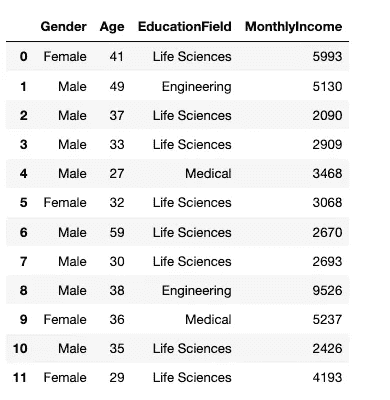

员工数据集|作者图片

我们可以看到在上面的数据集中有两个分类列，即`Gender`和`EducationField`。让我们使用`pandas.get_dummies()`将它们编码成数字量，它返回一个虚拟编码的数据帧。

```
pd.get_dummies(df)
```

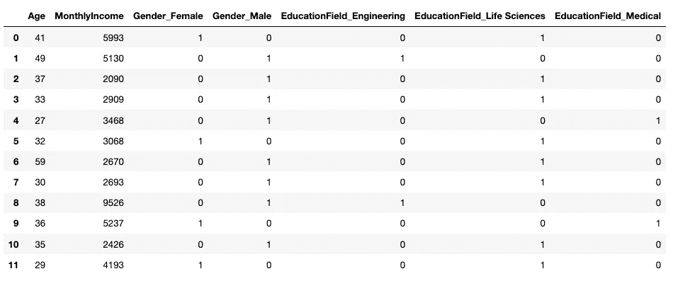

作者图片

列`Gender`被转换成两列— `Gender_Female`和`Gender_Male`，它们的值要么是 0，要么是 1。例如，`Gender_Female`在有关员工是女性的地方有一个`value = 1`，在不是女性的地方有一个`value = 0`。对于列`Gender_Male`也是如此。

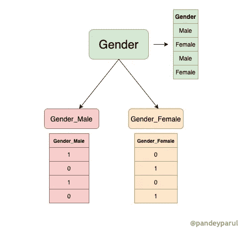

虚拟编码性别变量|作者图片

类似地，列`EducationField`也根据教育领域分成三个不同的列。事情到现在都很明显了。然而，当我们使用这个编码数据集来训练模型时，问题就开始了。

# 虚拟变量陷阱

假设我们想要使用给定的数据来建立一个机器学习模型，该模型可以预测员工的月薪。这是一个回归问题的经典例子，其中目标变量是`MonthlyIncome.`。如果我们使用`pandas.get_dummies()`对分类变量进行编码，可能会出现以下问题:

## 1️⃣.多重共线性问题

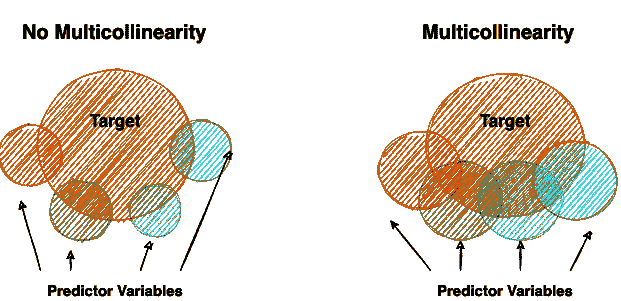

通过维恩图描绘多重共线性|图片由作者提供

> **注**:上图非常直观的解释了多重共线性。感谢[凯伦·格雷斯-马丁](https://www.theanalysisfactor.com/author/kgm_admin/)以如此清晰的方式解释了这个概念。请参考下面的链接转到文章。

[](https://www.theanalysisfactor.com/multicollinearity-explained-visually/) [## 多重共线性的可视化描述——分析因子

### 多重共线性是统计学中的术语之一，通常以两种方式定义:1。非常数学化…

www.theanalysisfactor.com](https://www.theanalysisfactor.com/multicollinearity-explained-visually/) 

回归模型的假设之一是观测值必须相互独立。**多重共线性**发生在**回归模型**中的独立变量相关时。那么为什么相关性是一个问题呢？为了帮助你详细理解这个概念，避免重复发明轮子，我会给你看一篇由吉姆·弗罗斯特**写的[伟大作品，他非常简洁地解释了这个概念。以下段落来自同一篇文章。](https://statisticsbyjim.com/regression/multicollinearity-in-regression-analysis/)**

> **[回归分析](https://statisticsbyjim.com/glossary/regression-analysis/)的一个关键目标是隔离每个[自变量](https://statisticsbyjim.com/glossary/predictor-variables/)和[因变量](https://statisticsbyjim.com/glossary/response-variables/)之间的关系。对[回归系数](https://statisticsbyjim.com/glossary/regression-coefficient/)的解释是，当你保持所有其他自变量不变时，它代表自变量每变化 1 个单位，因变量的[均值](https://statisticsbyjim.com/glossary/mean/)变化。**

**如果所有变量都是相关的，那么模型将很难判断某个特定变量对目标的影响有多大，因为所有变量都是相关的。在这种情况下，回归模型的系数将不会传达正确的信息。**

## **pandas.get_dummies 的多重共线性问题**

**考虑上面的雇员例子。让我们从数据集中分离出`Gender`列，并对其进行编码。**

**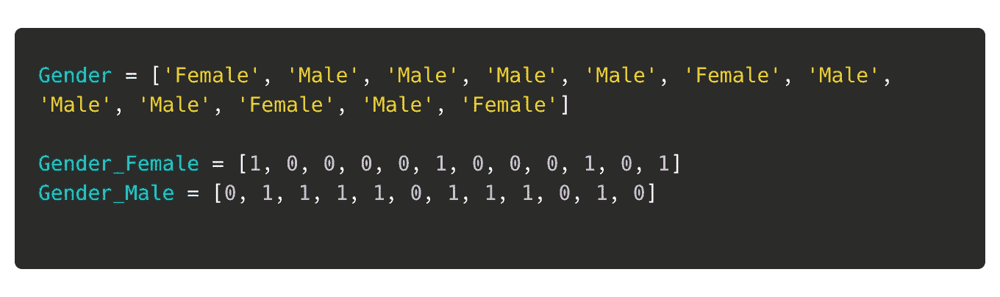**

**如果我们仔细观察，`Gender_Female`和`Gender_Male`列是多共线的。这是因为一列中的值`1`自动暗示另一列中的值`0`。这个问题被称为虚拟变量陷阱，可以表示为:**

```
Gender_Female = 1 - Gender_Male
```

## **解决方案:删除第一列**

**多重共线性是不可取的，每次我们用`pandas.get_dummies(),`编码变量都会遇到这个问题。解决这个问题的一种方法是删除其中一个生成的列。因此，我们可以删除`Gender_Female`或`Gender_Male` ，而不会潜在地丢失任何信息。幸运的是，`pandas.get_dummies()`有一个名为`drop_first`的参数，当设置为`True`时，它就能做到这一点。**

```
pd.get_dummies(df, drop_first=True)
```

**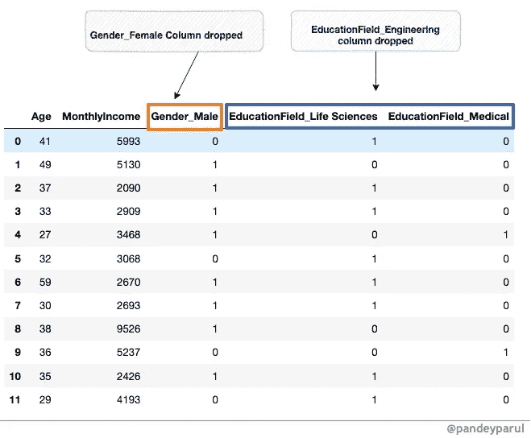**

**作者图片**

**我们已经解决了多重共线性，但是当我们使用 dummy_encoding 时，还存在另一个问题，我们将在下一节中讨论这个问题。**

## **2️⃣.训练集和测试集中的列不匹配**

**为了用给定的雇员数据训练模型，我们首先将数据集分成训练集和测试集，将测试集放在一边，这样我们的模型就不会看到它。**

```
from sklearn.model_selection import train_test_splitX = df.drop('MonthlyIncome', axis=1)
y = df['MonthlyIncome']X_train, X_test, y_train, y_test = train_test_split(X,y, test_size=0.2, random_state=1)
```

**下一步是对训练集和测试集中的分类变量进行编码。**

*   ****编码训练集****

```
pd.get_dummies(X_train)
```

**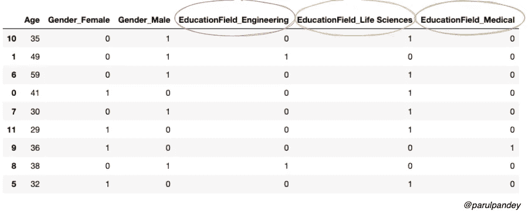**

**正如所料，`Gender`和`EducationField`属性都被编码成数字量。现在，我们将对测试数据集应用相同的过程。**

*   ****编码测试集****

```
pd.get_dummies(X_test)
```

**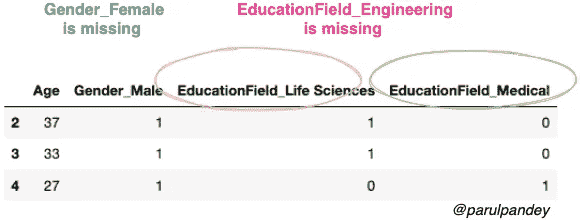**

**等等！定型集和测试集中存在列不匹配。这意味着训练集中的列数不等于测试集中的列数，这将在建模过程中引发错误。**

## **解决方案 1: `Handle unknown by using .reindex and .fillna()`**

**解决这种类别不匹配的一种方法是将对训练集进行哑编码后获得的列保存在一个列表中。然后，照常对测试集进行编码，并使用编码的训练集的列来对齐两个数据集。让我们通过代码来理解它:**

```
# Dummy encoding Training set
X_train_encoded = pd.get_dummies(X_train)# Saving the columns in a list
cols = X_train_encoded.columns.tolist()# Viewing the first three rows of the encoded dataframe
X_train_encoded[:3]
```

**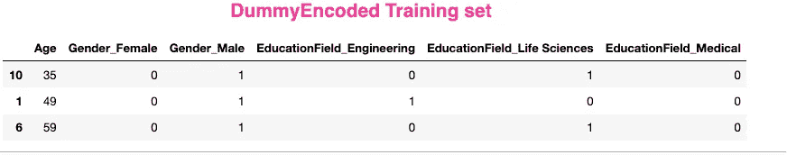**

**作者图片**

**现在，我们将对测试集进行编码，然后重新排列训练和测试列，并用零填充所有缺失的值。**

```
X_test_encoded = pd.get_dummies(X_test)
X_test_encoded = X_test_encoded.reindex(columns=cols).fillna(0)
X_test_encoded
```

**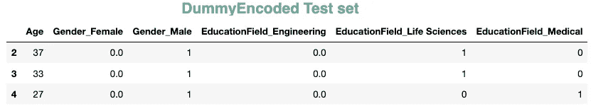**

**作者图片**

**如您所见，现在两个数据集拥有相同数量的列，**

## **解决方案 2:使用`**One Hot Encoding**`**

**另一个更好的解决方案是使用`[sklearn.preprocessing](https://scikit-learn.org/stable/modules/classes.html#module-sklearn.preprocessing).OneHotEncoder().`。此外，我们可以使用`handle_unknown="ignore"`来解决由于稀有类别而导致的潜在问题。**

```
#One hot encoding the categorical columns in training setfrom sklearn.preprocessing import OneHotEncoder
ohe = OneHotEncoder(sparse=False, handle_unknown='ignore')
train_enc = ohe.fit_transform(X_train[['Gender','EducationField']])#Converting back to a dataframe 
pd.DataFrame(train_enc, columns=ohe.get_feature_names())[:3]
```

**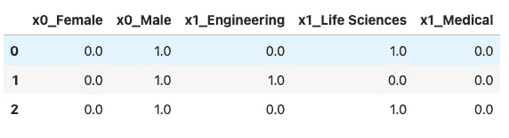**

**作者图片**

```
# Transforming the test settest_enc = ohe.fit_transform(X_test[['Gender','EducationField']])#Converting back to a dataframe
pd.DataFrame(test_enc,columns=ohe.get_feature_names())
```

**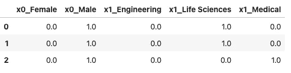**

**作者图片**

**注意，你也可以通过设置参数`drop=’if_binary’`来删除 [OnehotEncoder](https://scikit-learn.org/stable/modules/generated/sklearn.preprocessing.OneHotEncoder.html) 中每个特性的一个类别。更多细节请参考[文档](https://scikit-learn.org/stable/modules/generated/sklearn.preprocessing.OneHotEncoder.html)。**

# **结论和要点**

**这篇文章研究了如何使用 pandas 对分类变量进行编码，以及与之相关的常见注意事项。我们还详细研究了避免这些陷阱的可行解决方案。我希望这篇文章能让你直观地了解什么是哑变量陷阱，以及如何避免它。此外，本文中引用的两篇文章是很好的参考，尤其是如果您想更深入地研究与多重共线性相关的问题。我强烈推荐他们。**

***👉有兴趣看我写的其他文章。这个* [*回购*](https://github.com/parulnith/Data-Science-Articles/blob/main/README.md) *包含了我分类写的所有文章。***