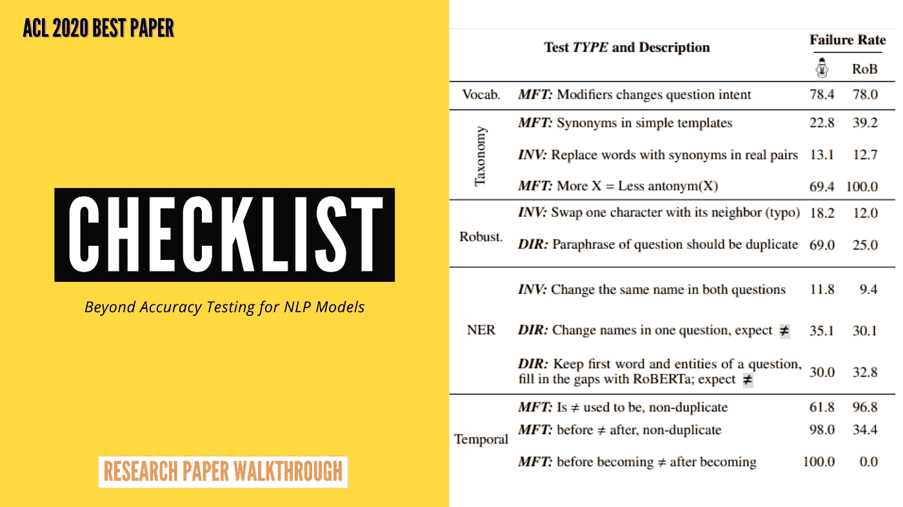
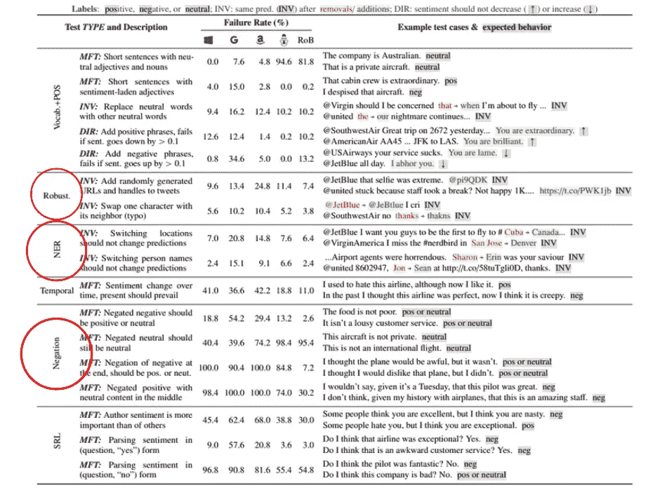

# 超越准确性:NLP 模型的行为测试

> 原文：<https://towardsdatascience.com/beyond-accuracy-behavioral-testing-of-nlp-models-with-checklist-48544db3fef1?source=collection_archive---------20----------------------->

## ACL 2020 最佳论文奖(研究论文演练)

作者图片

在[自然语言处理](https://en.wikipedia.org/wiki/Natural_language_processing) (NLP)中，我们经常将某种准确性度量视为我们模型正确性的证明。但是很明显，这种自动化的客观评估最终导致**高估了模型的性能**，主要是因为**测试分割的代表性不足和低容量**。另一方面，对于如此大量的训练数据，模型很可能学习某些特定于任务的快捷方式以在测试数据上表现良好，而不是学习一些可能对当前任务有用的低级基本语言属性。

考虑到这些普遍存在的挑战，研究人员引入了 [**清单**](https://github.com/marcotcr/checklist) 的概念。清单是一种新的评估方法，用于 NLP 模型的综合功能测试，其中我们有一个由**语言** **能力**组成的矩阵，例如*命名实体转换*、*否定*、*对错别字的鲁棒性*等，以及**测试类型**，如*最小功能测试* (MFT)、*方向期望* (DIR)和*不变性测试*作者还发布了 CheckList 作为工具，使用户能够使用*精心制作的模板、* *词汇库、*、*扰动*、*上下文感知建议使用* [*、罗伯塔*](https://arxiv.org/pdf/1907.11692.pdf) 等生成大量测试用例。现在让我们详细了解一下测试类型—

1.  **最小功能测试(MFT)** 在其能力范围内，在一些精选的任务特定测试样本上检查模型的行为。它的灵感来自软件工程的单元测试。例如检查消极情绪的否定——

***句子:*** *饭菜不差。(消极或积极情绪)*

理想情况下，在这种情况下，模型应该能够预测和理解否定，并输出积极或中性的情绪，如果没有，那么测试用例将被视为模型的失败。

2.**方向期望(DIR)** 查看具有相同意图的当前句子的任何扩展是否改变了模型预测一定的量。比如说—

***原句*** *:我不喜欢这种食物。(-ve 感悟)*

***修饰句*** *:我不喜欢这种食物。* ***真是无味*** *。(-ve 感悟)*

理想情况下，在这种情况下，模型不应该在相反的方向上显著改变情绪。如果超过了用户定义的阈值，那么测试用例将被视为模型失败。

3.**不变性测试(INV)** 通过扰动原始句子来查看类别标签是否改变。扰动可以是 NER 级别的(比如改变句子中的位置)，用同义词替换单词，引入一个字符的输入错误，等等。比如说—

***原句*** *:我要你们成为第一个飞往加拿大的人。(预测 A 类)*

***修饰句*** *:我要你们第一个飞到****Cuba****(预测 A 类)*

理想情况下，在这种情况下，模型不应该改变类标签。如果是这样，那么测试用例将被视为模型的失败。

# 评估 SOTA 模型

作者们继续前进，为**情感分析**、**机器理解**和 **Quora 问题对**的任务评估了一些最先进的(SOTA)研究和商业模型。他们选择了微软，谷歌和亚马逊的付费 NLP APIs 作为商业模型的选择，选择了 BERT，RoBERTa 作为研究模型的选择。来自论文的下图显示了[情感分类](https://en.wikipedia.org/wiki/Sentiment_analysis)任务的各种语言能力测试的上述测试类型的结果。

(修改)图 1 来自[来源](https://www.aclweb.org/anthology/2020.acl-main.442.pdf)

让我们来理解上表中用红色圈出的例子—

作者测试了所有 5 个模型的**健壮性**属性，方法是在推文中添加随机 URL、用户名，甚至诱导一个字符交换作为输入错误。因此，理想的预期是情绪不会改变*(不变性测试)，*，但是他们发现商业模型的**失败率为 5%–25%**，研究模型的**失败率为 3%–11%**这是非常令人震惊的，因为这些是非常简单的鲁棒性检查，没有涉及任何显式的复杂性，然而模型却混淆了。

作者测试了所有 5 个模型的 **NER** 属性，方法是用其他位置替换实际位置，变换人名等。理想的预期是，这不应该影响预测，并让模型将其预测切换到完全不同的类别。但令人惊讶的是，他们发现一些模型的失败率高达 20% ，这意味着它们只有 80%的准确率，如果你在文本中改变一个人的名字，预测就会被推翻。这暗示了训练这些模型的训练数据具有一些常见姓名的主要出现，并且模型已经以某种方式学习了姓名和情感的一些关联，而不是忽略这一点并且仅仅关注触发情感的语言属性和结构。像 RoBERTa 这样的研究模型，即使不完美，也有不错的表现。

作者通过否定给定文本中的否定词、中性词和肯定词来测试所有 5 个模型的**否定**属性。结果确实令人惊讶，因为他们发现对于某些模板，有些**模型****100%**失败，然而，几乎所有的模型都有超过 30% 的**失败率。**

另外，我想请你花至少 2 分钟时间看看上面图片的其他结果。我敢肯定，你会震惊的！！

因此，很明显，如果你已经注意到作者选择的转换类型是非常直接和简单的，没有任何进一步的困难分层，然而付费模型显示了它们的显著局限性。话虽如此，现在看起来是时候使用这样的框架和常规的测试分割测试来更彻底地测试我们的 ML 模型了。

# 注释工具

为了便于大规模生成测试用例，作者开源了清单，启用了模板化功能和屏蔽语言模型建议(如 BERT 和 RoBERTa ),以获得任何屏蔽词的扰动建议和通用扰动，如字符交换(模拟错别字)、缩写、名称和位置变化(用于 NER 测试)等。一个样本模板如下所示—

**Sample _ Template = " I { NEGATION } { POS _ VERB } the { THING } "**

我不喜欢这食物。

我不喜欢这道菜。

Sample_Test_3 =我不喜欢这项服务。

等等…

他们围绕这一点设计了一个非常简单易用的用户界面，以方便非技术人员也能大规模地生成示例。请务必检查其他功能，网址为—

 [## marcotcr/清单

### 超越准确性:NLP 模型的行为测试

github.com](https://github.com/marcotcr/checklist/blob/master/notebooks/tutorials/visual_suggest.gif) 

***P.S.*** *我也正在为这篇论文做一个多语种字幕的视频讲解。一旦发布，我会在评论中更新！同时，我在我的频道上已经解释了很多论文，你可以在—* 查看

 [## TechViz——数据科学家

### 有人说得好，“学习最好的部分是分享你所知道的”。我是普拉卡·米什拉，这个频道是我的…

www.youtube.com](https://www.youtube.com/c/TechVizTheDataScienceGuy) 

**更新—2020 年 8 月 2 日**

*视频讲解者*

清单

> 你也可以查看我写的其他研究论文的解释
> 
> [自然语言处理中 10 种流行的关键词提取算法](https://medium.com/mlearning-ai/10-popular-keyword-extraction-algorithms-in-natural-language-processing-8975ada5750c)
> 
> [用于摘要文本摘要的 BERT](https://medium.com/analytics-vidhya/leveraging-bert-for-extractive-text-summarization-on-lectures-294feb643486)
> 
> [使用 ML 从文本中自动提取上位词关系](https://medium.com/analytics-vidhya/automatic-extraction-of-hypernym-relations-from-text-using-ml-4b04eb33097f)

如果你仍然对某件事感到困惑，一定要朗读这篇文章。也向作者们说声“ **Hi** ”，感谢他们的贡献。

> **论文题目:**超越准确性:NLP 模型的行为测试与清单
> 
> **论文链接:**https://www.aclweb.org/anthology/2020.acl-main.442.pdf
> 
> **论文代号:**https://github.com/marcotcr/checklist
> 
> **作者:** [宏里贝罗](https://www.linkedin.com/in/marcotcr)，[童双吴](https://www.linkedin.com/in/tongshuangwu)，[卡洛斯·盖斯特林](https://homes.cs.washington.edu/~guestrin/)，[萨梅尔·辛格](https://sameersingh.org/)
> 
> 组织:微软研究院，华盛顿大学，加州大学欧文分校

*我希望这篇简短的阅读值得你花时间。如果你喜欢这段内容，一定要在* ***拍拍*** *让大家知道。*

*谢谢！*