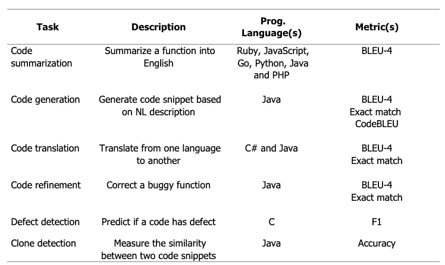
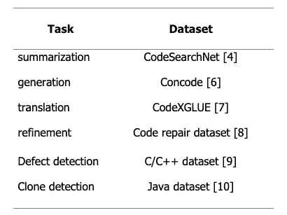

# 超越法典:一个可以训练的代码生成模型

> 原文：<https://towardsdatascience.com/beyond-codex-a-code-generation-model-that-you-can-train-6ac9bdcba07f?source=collection_archive---------9----------------------->

## codeT5 模型的概述和实践教程

潘卡杰·帕特尔在 [Unsplash](https://unsplash.com?utm_source=medium&utm_medium=referral) 上的照片

随着最近 OpenAI Codex 模型的发布，代码生成正在成为 NLP 世界的一个热门话题，这不仅仅是炒作。如果你看一个 Codex 演示，你会看到这些模型将如何塑造软件编程的未来。然而，从研究人员的角度来看，如果需求超出了通过 API 进行尝试，那么使用法典模型可能是不可实现的，因为预先训练的模型不是公开可用的。从技术上来说，你可以使用发表的论文复制 Codex，但你需要一个大型的 GPU 集群，只有少数人能够访问或负担得起。在我看来，这种限制会减慢研究的速度。想象一下，如果作者不共享预先训练好的权重，我们的 BERT 下游应用会减少多少。希望 Codex 不是唯一的代码生成模型。

这篇文章将概述 codeT5，这是一个编码器-解码器代码生成模型，具有公开可用的预训练检查点，您现在就可以尝试。此外，这篇文章包含了如何使用这个模型的实践教程。

# CodeT5 概述

CodeT5 [1]，顾名思义，是基于 T5 [2]编解码模型。与其他代码生成模型相比，它使用一种新颖的标识符感知预训练目标，该目标利用代码语义，而不是像对待任何其他自然语言(NL)文本一样对待源代码。该模型在许多编程语言中的代码生成和其他任务(如代码摘要、代码翻译、克隆检测和缺陷检测)中显示了有希望的结果。

作者[发布了](https://console.cloud.google.com/storage/browser/sfr-codet5-data-research/pretrained_models?pageState=(%22StorageObjectListTable%22:(%22f%22:%22%255B%255D%22))&prefix=&forceOnObjectsSortingFiltering=false)两个预训练模型:一个 6000 万的小版本和一个 2.2 亿的基础版本。他们还在他们的[公共 GCP 桶](https://console.cloud.google.com/storage/browser/sfr-codet5-data-research/finetuned_models?pageState=(%22StorageObjectListTable%22:(%22f%22:%22%255B%255D%22))&prefix=&forceOnObjectsSortingFiltering=false)中发布了他们所有的微调检查点。此外，这两个预先训练好的模型都可以从流行的 [huggingface](https://huggingface.co/Salesforce) 库中获得。

## 预培训

依次使用两个不同的目标对 CodeT5 进行预训练。在前 100 个时期中，用识别符感知的去噪目标来优化模型，该目标训练模型以区分识别符(即，变量名、函数名等。)和特定编程语言(PL)关键字(例如，if、while 等。).然后，使用双峰双代物镜优化 50 个时期。最后一个目标旨在改进 NL 描述和代码之间的一致性。

**识别器感知的去噪目标。**seq 2 seq 模型中的去噪目标用去噪函数掩盖输入序列。然后，解码器尝试恢复原始输入。识别符感知的去噪在三个任务之间以相等的概率交替进行:

*   *掩蔽跨度预测(MSP)。*这个任务类似于 T5 预训练中使用的任务，除了他们使用整体工作掩蔽来避免掩蔽子令牌(例如`##ing`)。此任务提高了模型捕获 PLs 语法信息的能力，从而提高了代码生成性能。
*   *标识符标记(IT)。*在这个任务中，训练模型预测令牌是否是代码标识符，迫使模型学习代码语法和数据流。
*   *屏蔽标识符预测(MIP)。*所有的标识符(如变量名、函数名等。)都隐藏在这个任务中。此外，相同标识符的所有出现都使用相同的标记令牌(即 MASK0)来屏蔽。该模型被训练成以自回归方式预测由标识符和匹配的标记令牌组成的序列。MIP 旨在提高 PL 语义理解，这有助于缺陷检测任务。

下图显示了同一数据样本的标识符感知去噪目标的每个任务的模型输入和目标的示例。

由 Amine Elhattami 执行的标识符感知去噪预训练任务

**双峰双代。**模型被训练用于双向转换，或者从代码到 NL 描述，或者同时从 NL 描述到代码。这个目的类似于 T5 的区间屏蔽，这里屏蔽的区间是整个 NL 描述标记或代码标记。该目标旨在缩小预培训和微调之间的差距。在预训练中，解码器仅看到离散的屏蔽跨度和标识符，而在微调中，解码器生成完整的 NL 描述或代码。下图显示了同一个数据样本的每个任务的模型输入和目标的示例。

由 Amine Elhattami 进行的双峰双代预训练

## 标记器

CodeT5 使用特定于代码的标记器，因为默认的 T5 标记器将一些常见的代码标记编码为未知标记。例如，花括号`{`映射到未知令牌`<unk>`。

CodeT5 记号赋予器是一个字节对编码(BPE) [3]记号赋予器，其词汇表大小类似于 T5 (32k)加上一些特殊的记号。在预训练期间，该标记化器跳过所有不可打印的字符和出现次数少于三次的标记，这导致标记化序列最多减少 45%。较短的靶序列有两个优点。首先，它加速了训练。第二，它使生成任务变得更容易。

## 训练前数据集

CodeT5 在公开可用的 CodeSearchNet 数据集[4]上进行预训练，该数据集包含约 200 万个训练样本，由六种 PLs (Javascript、Java、Go、Python、Ruby 和 PHP)中的代码和描述对组成。此外，作者从 [BigQuery](https://console.cloud.google.com/marketplace/product/github/github-repos) 收集了 C 和 C#数据集。但是，请注意，C 和 C# dataset 是不向公众发布的。但是，微调模型是可用的。

## 微调

CodeT5 已经在各种 PLs 中的大量下游任务上进行了微调。下表总结了所有任务。

Amine Elhattami 的下游任务列表

## 我的想法

在我看来，CodeT5 是一个有趣的模型，因为它可以在同一个预训练模型的多个下游任务中取得良好的结果，特别是在多任务模型中。此外，该模型需要更少的数据进行微调，这意味着训练时间短。例如，java 代码生成数据集只包含 100k 个训练样本。减少数据需求是一个至关重要的方面，因为您可能知道，数据收集是一项耗时的任务。然而，我认为有些地方作者本可以改进:

*   作者声称，与仅编码器和仅解码器模型相比，编码器-解码器模型更优越。然而，如果能与 Codex 模型进行比较就更好了，因为在本文发布时它已经可用了。
*   作者使用 CodeBLEU 作为代码生成任务的评估指标，正如 Codex 论文中所解释的那样，这并不理想。我知道他们选择了这个指标来与当前的结果进行比较。然而，如果能在人类评估数据集[5]上看到结果就更好了，该数据集通过单元测试评估功能正确性。

# 实践教程

## 使用预先训练的模型

以下示例显示了如何使用 huggingface 库来使用预训练模型。该模型可以执行任何预训练任务。但是，您将只使用预先训练的模型来进行自己的微调。

预训练模型示例

## 使用微调模型

要使用经过微调的模型，您必须下载所需的模型二进制文件和正确的模型配置文件。以下脚本下载两者。

下载微调模型

下载完成后，您就可以使用这个模型了。以下示例将预测 python 函数的 docstring。

微调模型示例

## 微调您的模型

除了预训练和微调的模型，作者还分享了他们的[源代码](https://github.com/salesforce/CodeT5)，这意味着你可以微调你的模型。下面的例子训练了 python 代码摘要的微调。更多信息，请查看[的知识库](https://github.com/salesforce/CodeT5)。

微调示例

请注意，上面脚本中使用的数据是 code 5[1]作者共享的现有公共数据集(BSD 许可证)的集合。下表描述了每个子数据集的来源。

Amine Elhattami 的子数据集列表

# 结论

这篇文章概述了 CodeT5 模型，并提供了使用公共检查点和训练模型的例子。也包含了我个人的想法。要了解更多细节，我邀请您阅读 CodeT5 白皮书并查看它们的源代码。我知道 Codex 是一个新手，但是 CodeT5 是目前你可以在任何合理的基础设施上训练的最好的模型(我认为)。

此外，我正在开发一个 VS 代码扩展，它允许您将任何代码生成模型连接到 VS 代码自动完成。所以，敬请期待！

**除特别注明外，所有图片均为作者所有。*

## 在你走之前

在 Twitter 上关注我，我经常在那里发布关于软件开发和机器学习的微博。

# 参考

[1] [CodeT5:用于代码理解和生成的标识符感知的统一预训练编码器-解码器模型](https://arxiv.org/pdf/2109.00859.pdf)。

[2] [用统一的文本到文本转换器探索迁移学习的极限](https://arxiv.org/abs/1910.10683)

[3] [具有子词单元的稀有词的神经机器翻译](https://aclanthology.org/P16-1162.pdf)

[4] [评估语义代码搜索状态的 CodeSearchNet 挑战](https://arxiv.org/pdf/1909.09436.pdf)

[5] [人体评估数据集](https://github.com/openai/human-eval)

[6] [将语言映射到编程环境中的代码](https://aclanthology.org/D18-1192.pdf)

[7] [CodeXGLUE:用于代码理解和生成的机器学习基准数据集](https://arxiv.org/pdf/2102.04664.pdf)

【8】[通过神经机器翻译在野外学习 Bug 修复补丁的实证研究](https://arxiv.org/pdf/1812.08693.pdf)

[9] [设计:通过图形神经网络学习全面的程序语义进行有效的漏洞识别](https://proceedings.neurips.cc/paper/2019/file/49265d2447bc3bbfe9e76306ce40a31f-Paper.pdf)

[10] [用图形神经网络和流增强抽象语法树检测代码克隆](https://arxiv.org/pdf/2002.08653.pdf)

[CodeT5 公共 GCP 斗](https://console.cloud.google.com/storage/browser/sfr-codet5-data-research)

[CodeT5 Github 库](https://github.com/salesforce/CodeT5)

[BigQuery Github 活动数据](https://console.cloud.google.com/marketplace/product/github/github-repos)