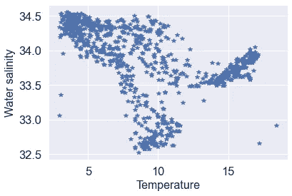
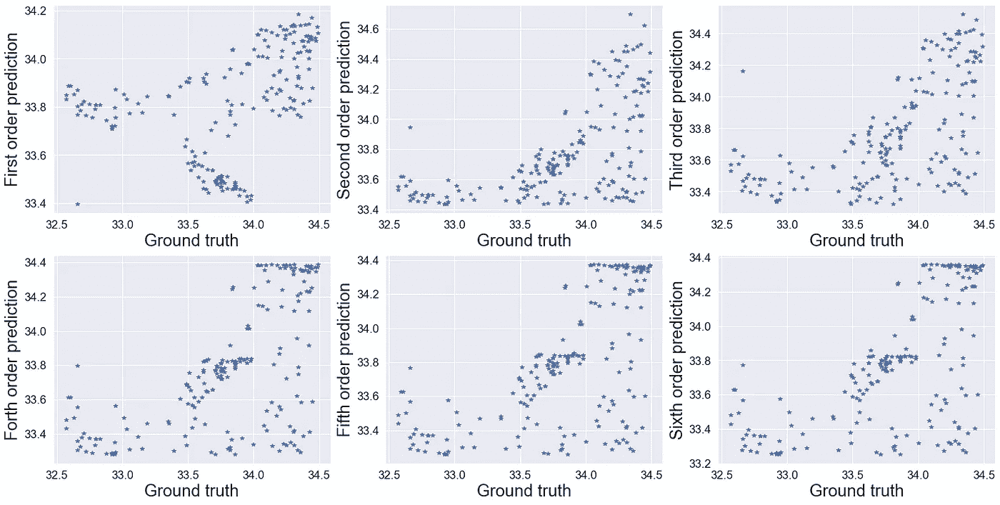

# 除了相关系数和均方误差

> 原文：<https://towardsdatascience.com/beyond-correlation-coefficients-and-mean-squared-error-952bd966cedb?source=collection_archive---------26----------------------->

## 回归模型比较的 MAD 分析——提高您对极限情况的理解。

作者图片

回归模型的性能可以用一个数字来概括——我们可以将模型在验证/测试集上的输出与实际情况进行比较。比较回归模型性能的常规方法有[均方误差(MSE)](https://en.wikipedia.org/wiki/Mean_squared_error) 和相关系数，如 [Spearman 秩序相关系数(SROCC)](https://en.wikipedia.org/wiki/Spearman's_rank_correlation_coefficient) 或 [Pearson 线性相关系数(PLCC)](https://en.wikipedia.org/wiki/Pearson_correlation_coefficient) 。

在许多情况下，这些就足够了，但是，我们可以做得更好——深入了解模型预测的极限情况。

最大差异(MAD)分析于 2008 年在这篇[视觉期刊论文](https://jov.arvojournals.org/article.aspx?articleid=2193102)中首次提出。后来在 2020 年进行了改进和扩展，举办了一场 [gMAD 比赛](https://ieeexplore.ieee.org/document/8590800)。两篇论文都是针对评价[图像质量评价方法](/deep-image-quality-assessment-30ad71641fac)的问题。其中模型比较受到验证数据的高成本的限制——来自人类观察者的主观分数。MAD 分析的关键思想是对两个竞争模型的预测差异最大的例子进行基准测试。

根据我的经验，最好的解释通常是基于一个例子。这篇文章中的一个例子可以在一本 [Jupyter 笔记本](https://github.com/mikhailiuk/medium/blob/master/MAD-analysis/MAD-analysis.ipynb)中找到，供那些对即插即用感兴趣的人使用。

# 问题设置

在机器学习中，一切都从数据开始。我们正在解决的回归问题是基于来自 [kaggle](https://www.kaggle.com/sohier/calcofi) 的 CalCOFI 数据集(超过 60 年的海洋学数据)的一个很小的子集(不是 i.i.d .也不代表仅用于示例的数据集)。我们对模拟水的盐度和温度之间的关系感兴趣。

自变量和目标变量的散点图。图片作者。

为了模拟这种关系，我们使用了六种回归模型——从一阶多项式到六阶多项式。在这里，我们对最佳模型性能不感兴趣——模型只是用于举例。

每极预测与地面真实目标的散点图。图片作者。

# 最大差异分析

给定两种回归方法，MAD 过程的假设是任何两个条件之间的距离将更好地反映在更精确的尺度中。

例如，如果两个点根据二阶多项式拟合而接近，根据一阶多项式拟合而远离，并且根据地面实况而接近，则二阶拟合被认为是更好的模型，对于根据二阶多项式拟合而远离并且根据一阶多项式拟合而接近的情况，情况相反。

模型预测差异巨大的点选择示例。由红线连接的点将由 MAD 分析选取。图片作者。

## 实际例子

让我们把手弄脏，投入到 MAD 分析的实践中去。

在我们的示例中，对于每对回归方法，我们选择 100 对条件，这些条件根据测试方法具有不同的质量，根据基准方法具有相似的质量。因此，对于两个回归量 Rt 和 Rb，我们选择以下条件 oi 和 oj:

类似的 100 个条件，反之亦然。我们需要为基础数据中被认为相似和不同的东西建立规则。这总是有点棘手，理想情况下应该包括模拟温度分布，并选择一个统计上合理的阈值。然而，为了举例说明，如果两次测量之间的绝对温度差小于 1 度，我们假设这两次测量具有相同的温度，否则温度是不同的。

在选择了分数预测在两种方法中显著不同的点之后，我们可以计算统计数据。任何合理的措施都会奏效。

这里，我们通过测量一种方法将一对图像分类为相同或不同的能力来量化该方法的性能。和报告精度——被测试的质量度量正确分级并识别为不同的对的数量除以所选对的总数。行中的高值表示相应行中的度量对相应列中的度量的攻击成功率很高。

矩阵的每一项都是来自相应行的测试度量与来自相应列的基准质量度量配对时的精度。模特是按平均分排序的。图片作者。

请注意，根据 PLCC 和 RMSE 的说法，四阶、五阶和六阶多项式的性能相当。MAD 分析讲述了一个不同的故事，与其他模型相比，四阶拟合可以更好地区分配对。有趣的是，三阶拟合也比六阶多项式表现更好。内在 MAD 分析可以显示过度拟合的迹象。

## 如何用于主动学习

对于许多应用来说，我们用来比较算法性能的基本事实可能很难获得或者很难获得。想象一下，在上面的例子中，我们有机会获得 100 个额外的测量值。我们将对一组已知独立变量(温度)的五次多项式与六次多项式的预测值进行散点图绘制，然后选择他们最不一致的水盐度测量值进行采样。

该设置实现了两个目的:

*   我们得到了关于哪种方法区分得更好的信息
*   我们得到了一个新的度量标准来完善这个模型

# 总结和超越

实践和研究经验告诉我，没有单一的方法可以告诉你你的模型有多好。总会有一个指标支持你的解决方案，而另一个则反对。

MAD 分析是理解模型性能的另一种方法。MAD 不仅仅是规模比较的程序。除了比较模型之外，它还可以适用于在模型最不一致的情况下顺序获取地面实况数据的主动学习。虽然它在一维输出中的应用相当简单，但是将它扩展到更高的维度可能具有挑战性。

在错误分析中，有更多的技术是有用的，尤其是在模型投入生产之前！我强烈推荐[这篇来自 Neptune.ai 的文章](https://neptune.ai/blog/must-do-error-analysis)，它介绍了探索数据的更多方法。

如果你喜欢这篇文章，请与朋友分享！要阅读更多关于机器学习和图像处理的信息，请点击订阅！

我错过了什么吗？不要犹豫，直接给我留言、评论或发消息吧！