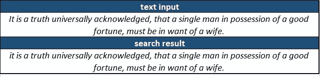
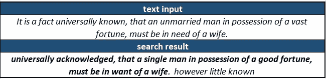
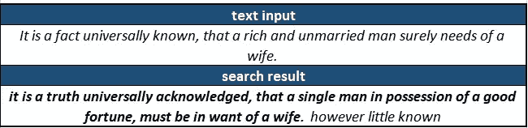
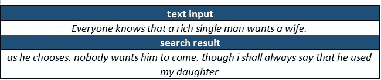
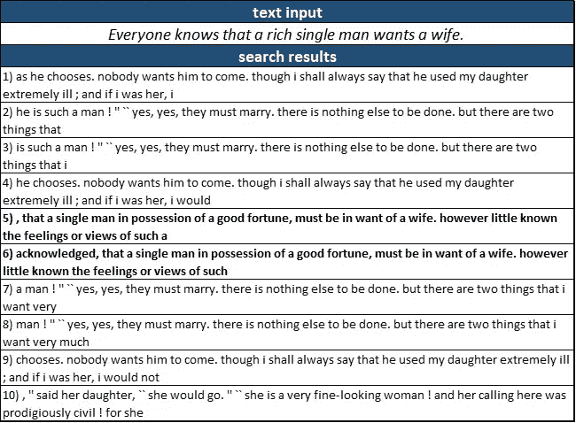
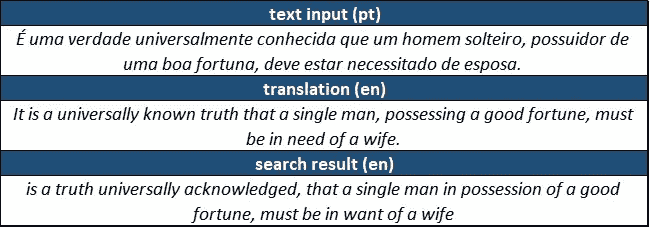
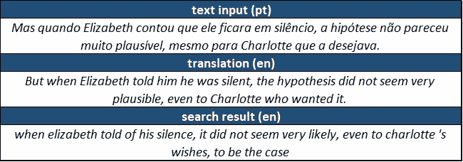
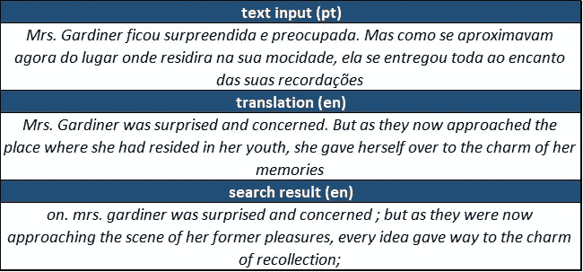
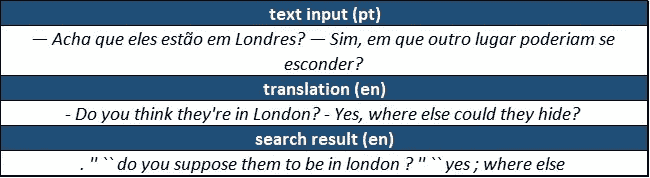
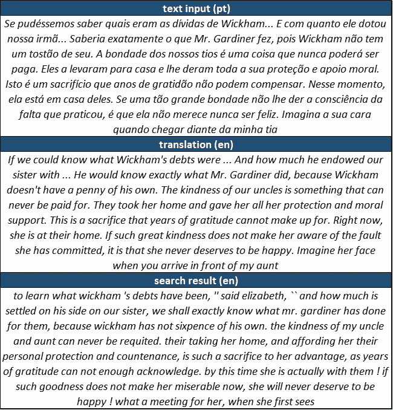

# 超越 CTRL+F

> 原文：<https://towardsdatascience.com/beyond-ctrl-f-44f4bec892e9?source=collection_archive---------42----------------------->

## 使用单词嵌入在文档中实现语义搜索

雷切尔·福雷兹在 [Unsplash](https://unsplash.com?utm_source=medium&utm_medium=referral) 上的照片

# 介绍

我们都习惯于这样的情况:我们需要在文档中找到一段文本，但却不太记得它到底是什么。我们可以回忆起一些重要的单词或文章的整体意思，但大多数文本处理器(从记事本到 Microsoft Word)只允许我们进行词汇搜索(即在文本中搜索与我们提供的输入完全匹配的内容)。确实没有别的办法:找到我们要找的东西的唯一方法是点击`CTRL+F`(或者一些等价的组合，这取决于您的系统)来搜索一个单词或一个小表达式，并浏览一个潜在的大结果列表，直到我们找到与我们要找的东西相对应的那个。

当我们不确定目标结果中包含的某些确切单词时，这种做法会更加不方便。我们可能需要搜索不同同义词和不同词序的组合，直到找到匹配。

我最近一直在思考一个想法，那就是根据文本的意思而不是确切的单词来比较摘录。显而易见，不同的文本段落可以表达非常相似的意思，同时使用不同的词语、表达方式和词语安排。还有一种情况是，有时一段文字被修改了，但人类读者可以很容易地识别出它是从哪里来的。然而，从算法上确定它们之间的等价性绝非易事。

在本文中，我们将应用一种结合了 ***单词嵌入*** 和 ***词性过滤*** 的技术来实现文档内的语义搜索。为了说明这种技术的工作原理以及我们可以获得的结果，我们将尝试在简·奥斯汀的《傲慢与偏见》中搜索几段在书中不完全匹配的摘录。在第一个应用程序中，我们将从书中的第一个句子开始，搜索逐渐改变的版本，直到短语减少到最少。然后，我们将从巴西葡萄牙语翻译中提取一些段落，通过简单地调用 Google Translate 将它们转换成英语，并尝试在原文中找到这些段落。

在本文中，我不会深入讨论 Python 实现的细节。如果你感兴趣，你可以在 GitHub 上查看详细的笔记本[这里](https://github.com/fabio-a-oliveira/semantic-search/blob/main/semantic_search.ipynb)。你也可以通过[这个链接](https://colab.research.google.com/github/fabio-a-oliveira/semantic-search/blob/master/semantic_search.ipynb)在 Google Colab 上打开它，这将允许你使用一个简单的表格自己运行一些关于[古腾堡计划](https://www.gutenberg.org/)公共领域图书目录中任何作品的例子。

# 该方法

下面是我们在一本书里查找一段意思相同的段落的一系列步骤:

1.  使用 ***单词嵌入*** 将书中的每个单词和请求的句子转换为密集向量表示(在这种情况下，我们将使用[手套](https://nlp.stanford.edu/projects/glove/)嵌入)。这种表示捕获了 300 维向量空间中单词的含义*和*。如果你对“单词嵌入”这个术语的含义没有信心，我强烈建议你花几分钟时间玩一下 [TensorFlow 嵌入投影仪](https://projector.tensorflow.org/)。真的很好玩！
2.  将 ***词性*** (如*名词、动词、介词*等)掩码应用于书籍和请求的句子:不属于任意定义的相关*词性列表*的每个单词都将嵌入转换为空向量。我见过的大多数 NLP 应用程序更喜欢从文本中删除一列*停用词*(经常出现的词，可以从文本中删除而不会失去太多意义)。我个人倾向于使用一个允许的词类列表，这让我可以更好地控制哪些词类将被保留或屏蔽。对于这个应用程序，我基本上保留了所有的名词、形容词和动词。
3.  将 ***词袋*** 方法应用于句子嵌入:对句子中每个词的嵌入进行平均，并获得单个向量来表示其语义内容。用这种方法，文章意思的表达就是每个单词意思的平均值。
4.  使用一个*滑动窗口，将*单词袋*句子嵌入和*词性*过滤器应用于整本书，滑动窗口的长度为所请求的句子加上一个选定的边距(考虑到我们可能会提供所需摘录的一个非常短的版本)，并对窗口内的单词嵌入进行平均。*
5.  *计算请求句子嵌入和滑动窗口嵌入之间的 ***余弦距离*** 。*
6.  *选择书中距离所要求的句子最近的位置。*

*总之，我们从书中找到与输入内容意思相似的段落的方法非常简单:我们将采用一个固定字数的滑动窗口，删除不相关的单词，平均出单个单词的意思，并满足于更接近输入内容的窗口。*

# *搜索具有相似含义的文本*

*在这一系列的例子中，我们将从书中的第一句话开始，并使用我们提出的策略来搜索日益修改(屠宰，真的！)的版本。*

*这是我们要寻找的原始句子:*

> *一条举世公认的真理是，一个富有的单身男人一定想要一个妻子。*

*首先，让我们尝试寻找完全相同的句子，以确保代码正常工作:*

**

*搜索精确匹配*

*毫无疑问，搜索成功了。毕竟，我们在寻找完全相同的句子。让我们把它变得更难一点，并改变 synonims 的一些单词:*

**

*搜索修改的句子*

*太好了！我们确实找到了对应的原句。但是，我们可以看到结果中有一点错位:缺少前 4 个单词，在末尾添加了 3 个额外的单词(或 4 个标记，考虑到点号)。这是反应的常见假象。因为我们使用的是滑动窗口，所以句子之间有很大的重叠，结果通常会靠右或靠左的几个单词。*

*现在，让我们超越同义词，更实质性地修改句子，包括一些简化。因为我们的输入会比我们预期的输出短一些，所以我们将以 10 的边距进行搜索(滑动窗口将比提供的输入长 10 个单词)。实际上，当使用由这种方法驱动的搜索引擎时，用户可能不得不试验这个参数。*

**

*搜索简单句*

*我们又有比赛了！*

*现在，让我们尝试一个极端的例子，只提供句子的要点作为算法的摘录。我们将再次使用 10 个单词的空白。*

**

*搜索最小句子*

*进展不太顺利。该算法找到了一个与我们在书中想要的原始句子不对应的匹配。*

*但是，我们可以循环浏览一些最热门的结果，看看是否会弹出实际的句子:*

**

*浏览多个结果*

*仔细查看前 10 个结果，我们看到我们正在寻找的原始摘录对应于条目 5 和 6。结果之间有很多重叠，所以在这个选择中实际上只有 4 个不同的部分，其中我们想要的结果是第三个。*

*编写一个识别这些重叠并将它们合并成单一结果的函数是相当简单的。在这种情况下，我们想要的摘录将是列表中的第三个结果。*

# *根据译文寻找原文*

*我们现在将转移到一个略有不同的应用程序，在这个应用程序中，我们将查找与巴西葡萄牙语翻译相对应的摘录，而不是搜索从原著中手动修改的句子。*

*对于这些摘录，我们将使用`googletrans`库自动将它们翻译回英语。然后，我们将使用我们的搜索例程，尝试在原书中找到相应的摘录。*

*你会注意到译文与原文大相径庭。虽然它肯定有相同的意思，但单词的选择和顺序是非常不同的。*

*我们从几个单句开始，从书中的第一句开始，然后再尝试几个单句:*

**

*单句*

*现在，稍微长一点的:*

**

*较长的句子*

*显然，翻译回英语的文本具有相同的含义，但措辞明显不同:*

**

*多个句子*

*较短的段落更难准确找到，但我们仍然能够正确识别它们:*

**

*简短对话*

*当我们提供更长的句子作为输入时，该方法更加健壮，因为找到另一个部分匹配的情况要少得多:*

**

*整段*

*在所有这些例子中，该方法能够从原始文本中识别出正确的摘录(在左边或右边给出或取出几个单词)，即使翻译与原始文本非常不同。*

# *结论*

*本文中提出的方法在搜索文档中与给定句子的意思相对应的摘录方面表现得非常好。将单词翻译成有意义的向量表示的核心和灵魂是由 GloVe word embeddings 提供的，大多数 NLP 工具都是从`nltk`包中使用的。*

*我们将这种技术应用于一本书中某个段落的严重修改/简化版本的输入，以及一本书翻译的摘录，都得到了相似的正面结果。*

*不可否认，在给出的结果中有一些精选，尤其是在选择`margin`参数时。在实际应用中，用户可能需要为该参数尝试几个不同的值，或者滚动候选结果的简短列表。然而，没有一个比当前的`CTRL+F`程序更复杂，我们都不得不比我们想要的更频繁地执行。*

*通过一些小的修改，如合并重叠的结果和提高正确识别结果中相应段落的开始和结束的能力，该技术可以很容易地应用于搜索大型文档中的内容，这在目前是一项低效和耗时的任务。*

*如果您想知道如何选择通过结合单词嵌入和单词包方法来表示句子，而不是直接使用 transformers 来表示句子嵌入，请知道我的初衷正是如此。然而，当我使用单词嵌入的方法来获得基线结果时，我被结果的健壮性惊呆了，所以我决定保持简单并像这样呈现它们。*

# *进一步的工作*

*在这一分析的下一次迭代中，我确实打算调查使用适当的句子嵌入会如何影响结果。*

*我相信这种方法可以作为一些文本处理程序的附件或作为 web 服务来实现。如果我有时间实现其中的任何一个，我会在这里发布链接！*

*我还认为这可以应用于监督学习的合成数据集的生成:基于翻译的书籍，它可以用于生成成千上万个具有等价含义的段落示例。*

# *我们连线吧！*

*如果你觉得这篇文章很有趣，并且想要联系，请在 [LinkedIn](https://www.linkedin.com/in/fabioarbacholiveira/) 上给我留言！你也可以看看我在 [Medium](https://fabio-a-oliveira.medium.com/) 或[Fabio-a-Oliveira . github . io](http://fabio-a-oliveira.github.io)上的一些作品。*