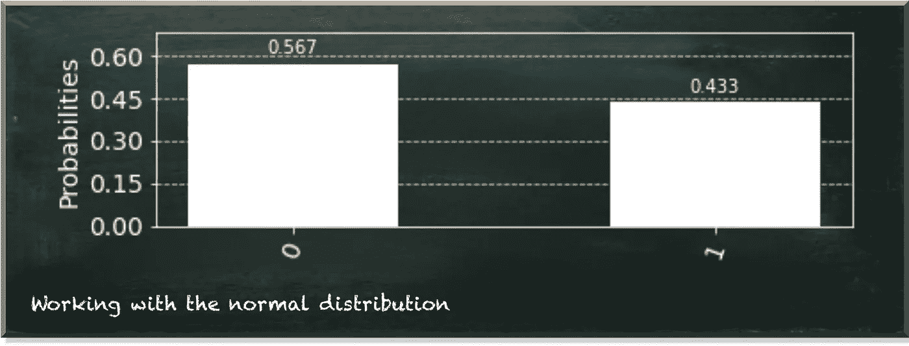
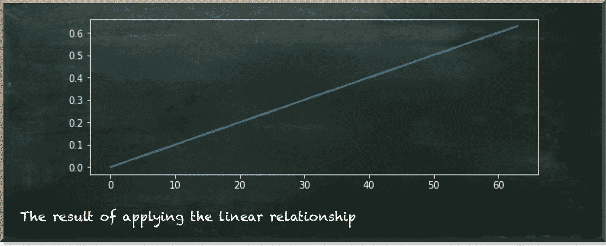
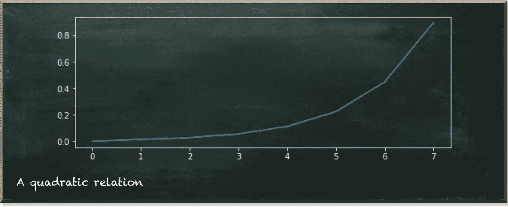
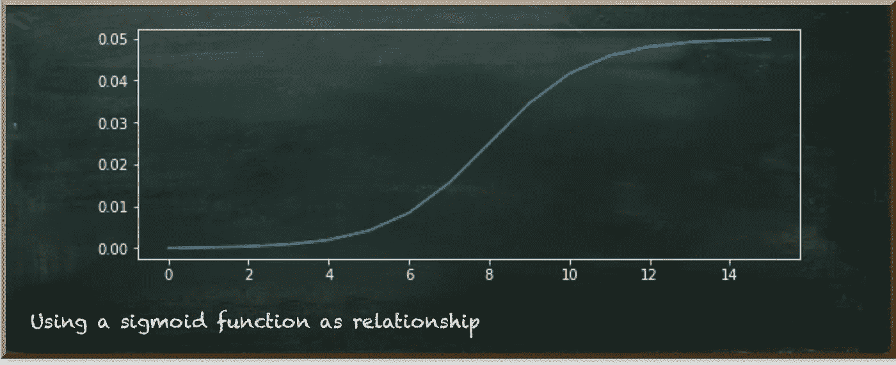

# 超越线性量子关系

> 原文：<https://towardsdatascience.com/beyond-linear-quantum-relations-e8f64bf5ab07?source=collection_archive---------29----------------------->

## 使用量子正态分布的经验教训

量子机器学习要不要入门？看看 [**动手量子机器学习用 Python**](https://www.pyqml.com/page?ref=medium_beyondlin&dest=/) **。**

我想我卷入了一些事情。恐怕我现在也把你卷进来了。它始于一个无害的[量子正态分布](/quantum-normal-distribution-cc6710c27879)。我想如果我们用量子位来模拟高斯正态分布会很酷。

真的是。

用 Qiskit 创建正态分布是小菜一碟，因为 Qiskit 为此提供了一个现成的量子电路，如下面的清单所示。


作者图片

通常，这种类型的分布描述了一个群体的特征。我在最后几篇文章中使用的例子是一个人的身高。大多数人的身高接近平均水平。但是，一个人的身高离平均值越远，就越不可能看到这样的人。例如，你很少看到身高超过 2.1 米(6.9 英尺)的人，但你经常看到身高在 1.8 米(5.9 英尺)左右的人。

正态分布本身很好，但还没用。将这个值与一个因变量联系起来会很有趣，比如这个人是否需要闪开。

我不知道我在做什么。

我从简单开始。

我翻转了代表因变量(不属于正态分布的那个)的量子位，只有当我们将其他量子位中的一个测量为 1 时。

这种天真的方法奏效了，并产生了一些好的结果。



作者图片

但这意味着什么呢？一个状态的量子位越多是 1(而不是 0)，闪避的概率就越高？这意味着个子小的人(数值为 011=3)比个子高的人(数值为 100=4)更容易闪避。

所以，[我建立了一个人的身高和闪避需求之间的线性关系](/how-to-work-with-a-quantum-normal-distribution-170ccc4e2da2)。我展示了一种比通过非门选择每个状态并逐个模拟效果更好的方法。

我们可以利用量子位的顺序，以及量子位的位置越高，它的效果就越高的事实。

我费力地编写了下面的代码。

首先，我们旋转三个量子位元中的每一个。第二，我们需要考虑一个问题，那就是我们不能简单地将量子位元所代表的机率相加。这对于最多由三个量子位组成的正态分布是可管理的。

所以，经过大量的反复试验，我想出了这个具体例子的一个概括，它适用于任何数量的量子位和任何斜率。

它工作得很好，并且产生了与从属伯努利变量的线性关系，即使对于如下所示的六量子位正态分布也是如此。



作者图片

所以，我坐在椅背上，想:*“如果闪避的需要并不线性地依赖于人的身高呢？如果这个关系是二次的呢？如果这种关系可以用一个任意函数来描述呢？”*

我花了将近一周的时间来编写产生线性依赖关系的函数。所以仅仅十行代码就完成了一周的工作。但是当然，我不允许自己不尝试创建这样一个函数。

于是，我开始思考一个二次关系。

这一次，我很幸运。我只花了四个小时就想出了如何修改我的代码来产生这个美丽的关系。



作者图片

四个小时听起来还不错。嗯，我也是这么想的。但是后来，我又看了看。变化是三个小字。

这是二次函数。

变化是在`val = val + sign * prob_to_angle(step*(2**sum(2**q for q in part)))`行增加了`2**`

值得称赞的是，我不得不提到这四个小时的结果超出了我的预期。函数允许我们用公式表达任何可能的关系。

例如，下图所示的 sigmoid 函数怎么样？



作者图片

只需用这条线代替上面提到的线(对于四量子位正态分布):

```
val = val + sign * prob_to_angle(step*(5/(1+e**(0.8*(8-sum(2**q for q in part))))))
```

无意中，我创建了一个函数，它处理多个量子位如何形成一个变量。它抽象了单个量子位的处理，并提供了一个编程接口来插入我们想要的任何关系函数。

# 结论

这篇文章简要总结了过去几周关于如何对不同的发行版建模以及如何使用它们的文章。在量子计算中，我们经常使用伯努利分布，因为它们自然地符合量子位的概率观点。

但是在数据科学中，我们通常使用各种分布，比如正态分布。此外，我们不仅希望用这样的分布来表示我们的数据，而且我们还使用它们来模拟两个变量之间的关系。

因此，这篇文章探讨了如何使用我们已经开发的代码来建模这样的关系。

在我的下一篇文章中，我们将深入探讨这个函数。

量子机器学习要不要入门？看看 [**动手用 Python 学习量子机器**](https://www.pyqml.com/page?ref=medium_beyondlin&dest=/) **。**


在这里免费获得前三章。