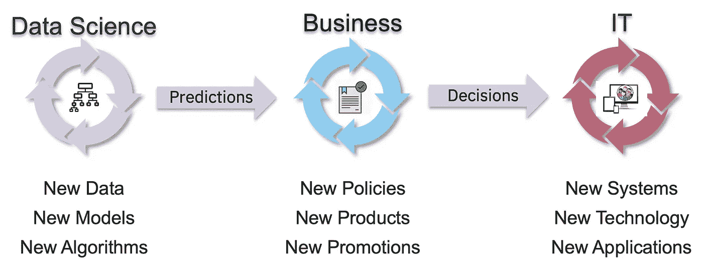
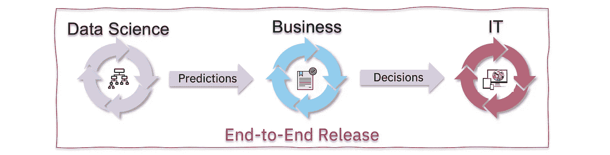
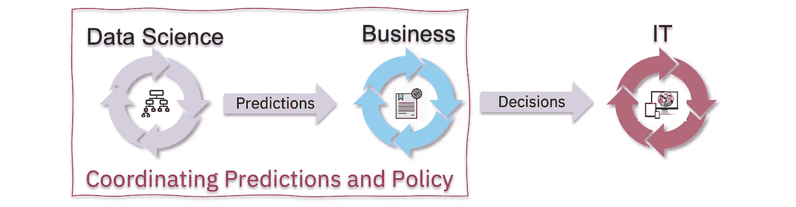
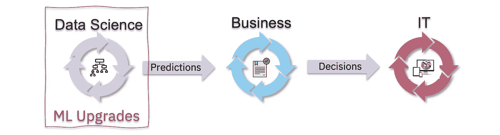

# 超越 ML Ops:业务自动化的治理

> 原文：<https://towardsdatascience.com/beyond-ml-ops-governance-for-enterprise-decisioning-6efc69622e4e?source=collection_archive---------44----------------------->

## 如何用商业政策和 IT 系统操作机器学习

对于企业应用和业务自动化，机器学习(ML)很少孤立使用。部署的 ML 模型几乎总是被一个“策略层”或一组业务规则所包围，以管理它如何被调用以及如何解释结果。有关为什么需要这些规则的详细信息，请参见上一篇文章。

结果，我们剩下三个很大程度上独立的生命周期，每个周期出于不同的原因产生新的版本:

三个独立的生命周期需要协调

当我们有新的数据进行训练时，当数据科学家改进他们的模型或应用新的算法时，新的 ML 模型就会被创建。同时，业务分析师细化业务策略，管理新产品的引入或营销推广。在 IT 方面，当引入新系统、应用新技术或开发新的应用程序版本时，就会发生升级。

正如所料，由于数据科学、业务和 IT 是独立的部门和独立的角色，我们的行业已经达成了很大程度上独立的治理解决方案:

*   **数据科学:MLOps** 专注于 ML 模型的治理，包括再培训、版本控制和对漂移和公平性的监控。
*   **业务:数字决策**，或决策管理——或自动化平台忙于业务规则、工作流程或其他形式的业务政策的版本化。
*   **IT: CI/CD** 和**数据治理**分别专注于支持应用开发和数据治理。

实际上，我们现在有三个半独立的生命周期需要协调。我们可以允许它们自主旋转，使用各自的“最新和最好的”，或者我们可以将它们锁定在一起，强制进行某种“全局版本控制”。

您应该选择哪一个取决于上下文，这是我们将在本文中探讨的。我们将使用三个经典的 ML 用例来使其更加具体:

*   客户流失—管理零售业或电信业的客户保持率
*   产品推荐——根据购买倾向对产品进行排名
*   贷款风险评分——评估贷款承销的违约风险

**“一次完成”:端到端升级**

作为第一个示例，我们将探讨一个需要跨以下方面进行协调的案例:

假设我们预测了客户流失风险——客户取消产品订购的可能性——并且该预测目前使用的是一个 ML 模型，该模型针对*客户细分、产品订购、时间客户*和*月度使用*进行了培训。

这四项数据记录了客户的类型、他们订阅了多少产品以及他们使用了多少产品。但是，为了记录客户最近主动决定继续与我们合作的情况，我们还可以包括一个新字段，比如说， *TimeOfLastSubscription。*

添加新的数据字段会引发全面的变化:

1.  ML 训练需要从某个操作数据存储(由某个 IT 系统提供)中找到并提取新的数据字段。当被调用时，重新训练的 ML 模型现在除了原始的四个参数之外还需要新的 *TimeOfLastSubscription* 字段。
2.  在业务方面，当请求基于 ML 的预测时，我们现在需要提供新的字段。此外，由于我们的预测现在更好了，我们可能能够删除现有的政策规则(例如，“如果客户在不到 3 个月前订购了产品，则永远不要提供保留优惠”)。
3.  连锁反应持续到 IT 系统中，现在当请求保留提议决策时，IT 系统也需要提供 *TimeOfLastSubscription* 。负责跟踪订阅的 IT 系统也需要将这些数据提供给 ML 培训，从而形成闭环。

总之，当您向整个循环添加数据时，通常需要跨数据科学、业务和 IT 部门以协调的方式进行所有更改。就当这是“重大升级”吧。

**“ML+规则”:预测与政策协同升级**

作为第二个例子，我们将看一个案例，ML 和策略版本需要协调，但 IT 系统不需要。

考虑一个基本的产品推荐系统，其中我们使用 ML 来提供“购买倾向”预测。对于特定的客户和产品对，这可以预测客户购买产品的可能性。这种预测使我们能够创建一个排序的产品列表，以便向每个客户推广。围绕这一预测，我们通常有一套规则来过滤客户不符合条件的产品、客户所在地区没有的产品或客户已经拥有的产品。

现在考虑在我们的产品目录中引入一种新产品。最初，我们拥有该产品的客户非常少，因此 ML 模型不太可能准确地推荐它。结果是，我们没有向足够多的客户或错误的客户推荐它，因此新产品的采用速度很慢。

这个“先有鸡还是先有蛋”的问题需要通过积极的干预来解决，例如通过推翻基于 ML 的预测来推荐新产品并引导采用。在这种方法中，我们添加了一个规则，该规则“窃取”与新产品目标受众相似的旧产品的一定比例的推荐，并将这些推荐重定向到新产品。随着时间的推移，随着 ML 模型赶上并开始足够频繁地推荐新产品，这种重定向规则可以被逐步淘汰。

从实际治理的角度来看，这需要我们协调到新 ML 模型的升级和新版本的业务策略(包括重定向规则)。

这个用例是一个一般情况的例子，其中新的或重新训练的 ML 模型需要逐渐引入到操作系统中。当预测(还)不可靠时——不管是什么原因——有一段时间我们会忽略或调整预测以达到期望的业务结果。

**“使用最新”:独立的 ML 升级**

在许多情况下，来自 ML 模型的预测发展得比前两个例子慢得多。在这些稳定时期，在中断之间，我们可以频繁地自动重新训练和升级 ML 模型，而不需要与政策规则协调或审查 IT 系统。

例如，考虑贷款批准场景中的风险分数。ML 模型用于评估客户拖欠贷款的风险，给出客户的信息和历史，结合所申请贷款的规模和类型。该风险模型可以频繁地重新训练，以使评分更加精确，但是调用该模型所需的参数保持不变，并且返回的预测只会随着时间的推移而逐渐变化。

在这些情况下，当需要预测时，我们总是可以调用最新的 ML 模型版本，并且不需要对策略规则进行调整。然而，这要求用于重新训练模型的流水线是健壮的，并且能够检测数据错误，例如，并且监控 ML 模型随时间的漂移。

此外，即使有这些安全措施，谨慎的业务团队仍然会每月或每季度执行一次业务模拟——跨政策规则和预测——以确保生成的贷款决策提供预期的业务成果，并符合有关公平性等的法规。

**总结**

将机器学习应用于业务自动化并不困难，因为需要复杂的 ML 技术。它通常主要基于结构化数据，而回归或决策树等“经典”ML 方法通常足以对业务交易进行评分、风险评估和分类。

棘手的是业务自动化的“操作”方面(大规模决策)以及不断变化的业务目标和政策规则。改进基于最大似然的预测——当政策改变时——需要基于用例及业务环境而变化的方法。

在本文中，我们看了三个场景:

*   跨数据科学、业务和 IT 的端到端发布
*   数据科学和商业版本的协调
*   独立 ML 再培训

Greger 在 IBM 工作，常驻法国。以上文章为个人观点，不一定代表 IBM 的立场、策略或观点。