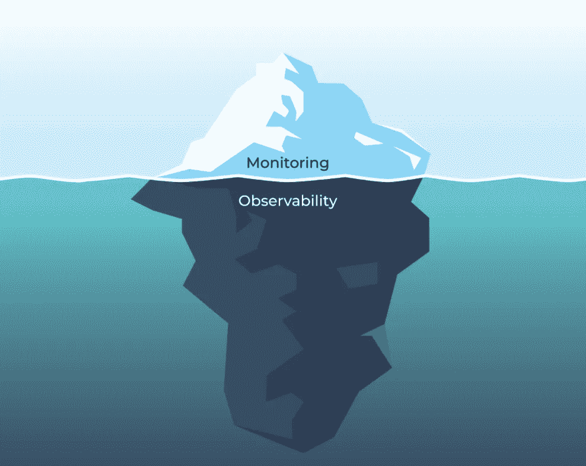

# 超越监控:可观察性的兴起

> 原文：<https://towardsdatascience.com/beyond-monitoring-the-rise-of-observability-d3940dfc0cf6?source=collection_archive---------22----------------------->

## 意见

## 现代数据和机器学习系统需要监控和可观察性。原因如下。

图片由作者提供。

重复的数据集或陈旧的模型可能会导致意想不到的(但严重的)后果，单靠数据监控是无法捕捉或预防的。解决办法？可观察性。

[*巴尔摩西*](https://www.linkedin.com/in/barrmoses/)*[*蒙特卡洛*](http://www.montecarlodata.com) *和* [*阿帕纳迪纳卡兰*](https://www.linkedin.com/in/aparnadhinakaran/)*【CPO】*[*阿里泽艾*](https://arize.com/?gclid=CjwKCAjwy42FBhB2EiwAJY0yQgbunI2QGmBX2TgAwYft-BSde5W6dq821WkRG4qb4YFM6_Up3GVhHhoClvYQAvD_BwE) *的联合创始人，讨论它与传统监测有何不同，以及为什么它对于构建更值得信赖和可靠的数据产品是必要的。**

***垃圾进，垃圾出**。这是数据和 ML 团队中的一个常见说法，有充分的理由-但在 2021 年，它不再是足够的。*

*数据(及其支持的模型)可能会在管道中的任何一点中断，仅仅在接收时考虑数据质量问题是不够的。类似地，当您部署 ML 模型时，可能会出现无数在测试或验证期间没有发现的问题，不仅仅是数据本身。*

*当你不知道你的环境中发生了什么，更不用说它是如何发生的，它会损害你的分析和实验的完整性，更不用说你的利益相关者的信任。*

*对于企业来说，这可能意味着收入损失、资源浪费和不明智的决策。在现实世界的应用中，由坏数据驱动的 ML 模型的后果可能更加严重。例如，2020 年，底特律的一名黑人在被面部识别软件错误识别后[被错误逮捕](https://www.nytimes.com/2020/06/24/technology/facial-recognition-arrest.html)并入狱，可能是因为[偏见问题](https://sitn.hms.harvard.edu/flash/2020/racial-discrimination-in-face-recognition-technology/)，其中包括以白人和男性为主的训练数据集。*

*不可否认，ML 中的坏数据问题非常普遍。由于种族主义、性别歧视和攻击性的标签，麻省理工学院最近撤下了他们全部 8000 万个微型图像数据集，在在线艺术项目 ImageNet Roulette 暴露出类似问题后，庞大的 T2 ImageNet 图书馆删除了 60 多万张图像。这些数据集多年来一直被用于训练 ML 模型——有严重缺陷的标签等等。*

*数据质量问题很常见，因为它们很难解决。以大多数数据和 ML 项目所需的规模维护干净、高质量的数据极其耗时——如果没有正确的方法，这几乎是不可能的。这就是**可观察性**的用武之地。*

# *定义数据可观察性*

*界定“垃圾数据”(不管它存在于系统中的什么地方)影响的一个简单方法是通过软件应用程序可靠性的镜头。在过去十年左右的时间里，软件工程师利用 New Relic 和 DataDog 等目标解决方案来确保应用程序的高正常运行时间(换句话说，工作的、高性能的软件)，同时将停机时间(中断和落后的软件)降至最低。*

*在数据方面，我们把这种现象叫做 [**数据停机**](https://www.montecarlodata.com/the-rise-of-data-downtime/) 。数据宕机指的是数据不完整、错误、丢失或不准确的时间段，随着数据系统变得越来越复杂，它只会成倍增加，从而支持无止境的源和消费者生态系统。*

*通过将软件应用程序可观察性和可靠性的相同原则应用于数据和 ML，可以识别、解决甚至预防这些问题，让数据团队对其数据充满信心，从而提供有价值的见解。*

## *数据监控与数据可观察性*

*经常出现的一个问题是:“我已经监控了我的数据。为什么我也需要可观测性？”*

*这是个很好的问题。长期以来，这两者一直被交替使用，但是监控和可观察性是两个非常不同的东西。*

*数据可观察性支持监控，这是大多数技术从业者都熟悉的:我们希望在出现问题时第一个知道，并快速排除故障。数据质量监控以类似的方式工作，当数据资产看起来与既定的度量或参数不同时，向团队发出警报。*

*例如，如果某个值超出了预期范围，数据没有按预期更新，或者 1 亿行突然变成了 100 万行，数据监控就会发出警报。但是，在为数据生态系统设置监控之前，您需要了解我们刚刚讨论过的所有属性，这就是数据可观察性的用武之地。*

*数据可观察性还通过提供关于数据的粒度、上下文信息来实现主动学习。团队可以探索数据资产，审查模式变更，并确定新问题或未知问题的根本原因。相比之下，监控基于预定义的问题发出警报，以聚合和平均值的形式表示数据。*

*有了数据可观察性，公司可以洞察[数据健康的五个关键支柱](https://www.montecarlodata.com/introducing-the-5-pillars-of-data-observability/):新鲜度、分布、容量、模式和沿袭。对于机器学习从业者来说，可观察性有助于提供一定程度的信心，即提供给模型的数据是完整的和最新的，并且在可接受的范围内。*

**

*数据可观察性的五大支柱。图片由巴尔·摩西提供。*

*当问题出现时，模式和沿袭的可见性有助于快速回答关于哪些数据受到影响的相关问题；可能进行了哪些更改，何时进行的，由谁进行的；以及哪些下游消费者可能会受到影响。*

*可观察性包括对数据健康五大支柱的监控，还包括对问题和端到端自动化数据谱系的警报和分类。这些功能结合在一起，使得数据可观察性成为现代数据堆栈的必备功能。*

## *一个空值破坏了仪表板*

*知道你的数据管道坏了是一回事。但是你怎么能真正弄清楚发生了什么以及为什么呢？*

*与监控不同，当数据管道中断时，数据可观察性可用于处理 [**根本原因分析**](https://www.montecarlodata.com/the-data-engineers-guide-to-root-cause-analysis/) 。理论上，根本原因听起来就像运行几个 SQL 查询来分割数据一样简单，但在实践中，这个过程可能相当具有挑战性。事件可能以不明显的方式出现在整个管道中，并影响多个(有时是数百个)表。*

*例如，数据停机的一个常见原因是数据的新鲜度，即数据异常过时。这种事件可能是由多种原因造成的，包括作业卡在队列中、超时、合作伙伴未及时提供其数据集、错误或意外的计划更改从 DAG 中删除了作业。*

*通过获取数据资产的历史快照，数据可观察性为您提供了确定“为什么”的必要方法在破损的数据管道背后，即使问题本身与数据本身无关。此外，许多数据可观测性解决方案所提供的谱系赋予了跨职能团队(即，数据工程师、数据分析师、分析工程师、数据科学家等)。)协作解决数据问题的能力，以免它们成为更大的业务问题。*

# *ML 监控与 ML 可观察性*

*当在生产中信任您的数据时，数据可观察性是一个难题，但是您的 ML 模型呢？*

*类似于数据可观察性如何帮助回答*为什么*，ML 可观察性使模型所有者能够对[模型故障](/the-models-shipped-what-could-possibly-go-wrong-a657ad919868)进行根本原因分析。当模型性能下降时，监控会向您发出警报。ML 可观察性帮助你弄清*为什么*。一旦出现问题，弄清楚需要做什么是更大、更难的问题。*

*对于软件应用程序，您通常会关注 SLA 和应用程序停机时间。对于机器学习，你看到的是数据和[性能](/the-playbook-to-monitor-your-models-performance-in-production-ec06c1cc3245)与基线的偏差。*

*ML 可观察性允许团队从生产中的培训、验证或之前的时间周期设置基线，并比较转变到性能下降的根本原因。*

*有了 ML 可观察性，公司可以洞察模型健康的主要支柱:模型和特征漂移检测、输入和输出数据质量、模型性能和可解释性。*

*当问题出现时，ML 可观察性使从业者能够查明为什么模型的性能在生产中不如预期，以及当他们应该重新训练他们的模型、更新他们的训练数据集、向他们的模型添加新特征或者甚至回到绘图板时的清楚信号。*

## *大海捞针*

*那么 ML 可观测性是如何工作的呢？让我们举个例子:你预测交易是否是欺诈的模型出了问题，并开始有更多的误报。我们如何弄清原因？*

*能够自动显示性能较低的群组对于追踪模型对于特定数据子集的性能好坏至关重要。ML 可观察性有助于您缩小特定地理区域、特定客户群或特定时间窗口中是否存在明显更多的误报。*

*性能下降的一个常见原因是[漂移](/using-statistical-distance-metrics-for-machine-learning-observability-4c874cded78)。因为模型是根据数据训练的，当数据与他们已经看到的相似时，他们表现得很好。可观察性比较基线分布和当前分布之间的分布变化。有漂移时，模型所有者可以进行有针对性的上采样。*

*理论上，根本原因在 Jupyter 笔记本中听起来很容易，但在实践中，您必须通过自动设置和即时分析，在数十亿次预测中将其扩展到数百个功能、模型和模型版本。*

**

*ML 可观测性。图片由 Aparna Dhinakaran 提供。*

*我们很高兴看到下一代数据和 ML 领导者如何解决这个问题，使回答这个问题和许多其他问题变得更加容易。*

****对学习更感兴趣？伸出手去*** [***巴尔***](https://www.linkedin.com/in/barrmoses) ***或者*** [***阿帕纳***](https://www.linkedin.com/in/aparnadhinakaran/) **。***