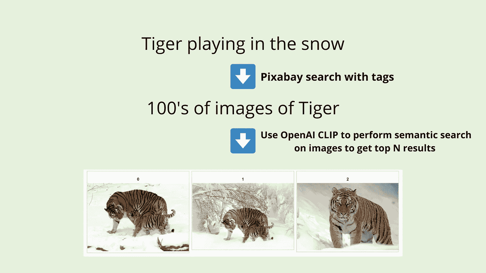
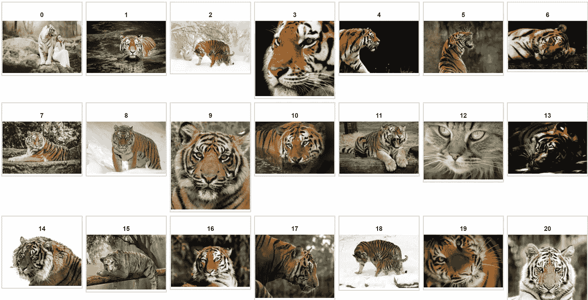
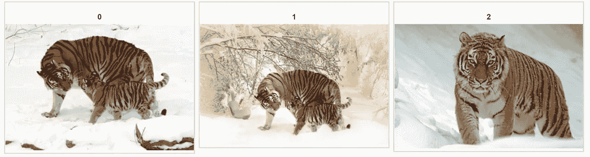
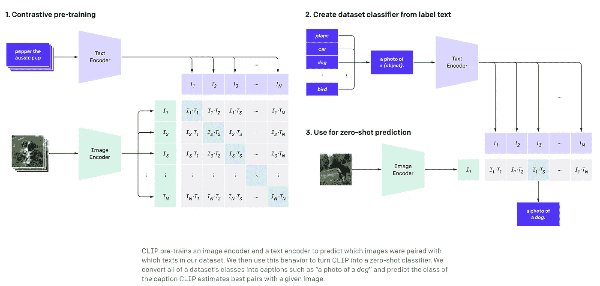
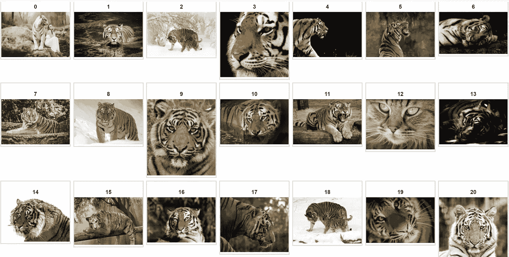
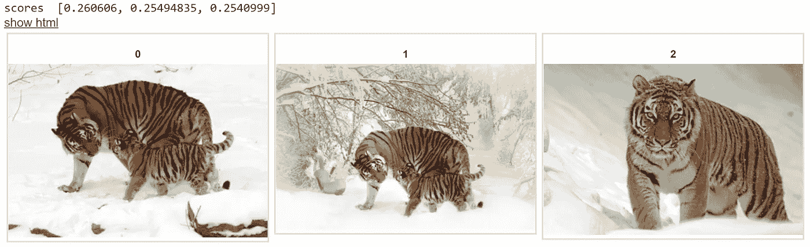
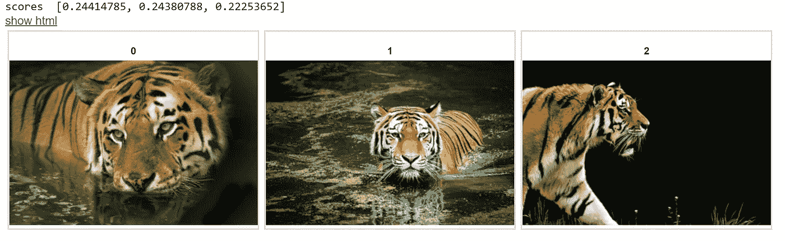
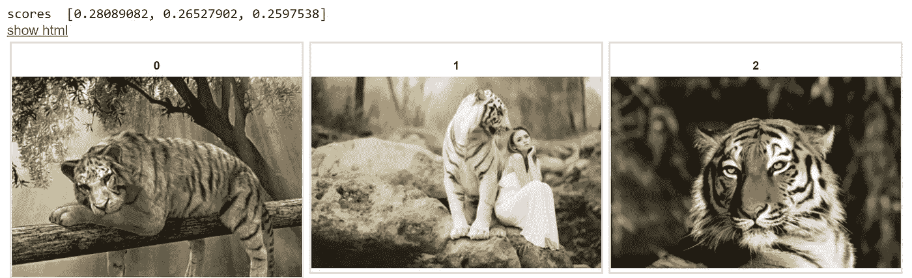

# 超越标签，用 OpenAI CLIP 进入图像语义搜索时代

> 原文：<https://towardsdatascience.com/beyond-tags-and-entering-the-semantic-search-era-on-images-with-openai-clip-1f7d629a9978?source=collection_archive---------16----------------------->

## 用 OpenAI CLIP 探索真实世界用例的 Google Colab 代码笔记本

作者图片

# 问题陈述:

假设你是一名作家，你正在寻找与你的博客或书相匹配的最佳图片。你脑海中有一个搜索短语，比如“老虎在雪地里玩耍”。你进入 Pixabay 或 Unsplash 等无版权图片网站，尝试各种关键字组合，如**【老虎】****【雪】****【虎雪】**等，找到相关图片。

如果你幸运的话，你会在第一页或者在**前 N 名**检索结果中找到你正在寻找的**精确图像**。

由于这些网站中的图片只有**标签**，你受到标签检索结果的限制，你需要**人工监督**进一步过滤与你的搜索词**“老虎在雪地里玩耍”最**相关的图片**。**

如果您经常寻找与您的搜索短语相关的图像，这是一个问题，并且在从标签中检索的图像上进一步过滤**非常耗时。**

你需要的是在检索到的带有标签的图片上进行语义搜索。

**语义搜索**是指搜索引擎考虑搜索短语的意图和上下文含义的能力。语义搜索不是试图在输入短语中找到单词的精确匹配，而是捕捉更广泛的上下文和单词之间的关系，并检索与搜索查询的上下文更密切相关的结果。

如果 Pixabay/Unsplash 库中的每个图像都用一个描述它的句子加了标题**和**，那么我们可以使用 Sentence-BERT 或其他类似的算法将句子编码成一个向量，并执行相似性来提取**前 N 个标题**和语义上与搜索查询匹配的相关图像。

但是给数据库中的每张图片加标题是很昂贵的。大多数时候我们最好的只是标签。 [OpenAI 夹子](https://openai.com/blog/clip/)来救我们了。

# 解决方案:

在文字搜索中，如果你问一个类似**“美国第 45 任总统是谁？”**如果你有**数百万**的文档来寻找答案，你首先做一个**轻量级**过滤器(例如； **BM25 in Elastic Search** )可以快速浏览所有百万个文档，并获得可能有答案的前 **100 个左右的**文档。然后你使用一个更重的算法(例如:句子-BERT 语义搜索)来从这 100 个过滤的文档中提取出确切的段落。

对于给定的搜索查询，首先，我们有一个轻量级的快速过滤器来查找潜在的候选文档。我们称这个**为寻回犬**。检索者的目标是筛选出明显的负面案例。

然后我们有**阅读器**，它使用计算量更大的算法(例如:基于 Transformer)来缩小到文档中使用语义搜索得到答案的精确区域。

将类似的**类比**应用于**图像搜索，**我们看到，基于**标签**检索给定搜索查询的图像是非常快速和轻量级的。这是**取回器**的部分。例如，您只需使用标签**“Tiger”**进行搜索，就可以从 Pixabay 中检索到 Tiger 的所有图像。

作者使用 Pixabay 图像制作的图像

然后我们有 [OpenAI CLIP](https://openai.com/blog/clip/) 作为我们的**阅读器**，它使用计算量更大的算法来编码我们从标签中检索到的每个图像，以与我们编码的句子进行比较，例如:**“老虎在雪地里玩耍”**，并基于语义相似性返回前 N 个结果。

作者使用 Pixabay 图像制作的图像

# OpenAI 剪辑

OpenAI 最近(2021 年 1 月 5 日)推出了一个名为 [CLIP](https://openai.com/blog/clip/) 的神经网络，它可以从自然语言监督中高效地学习视觉概念。CLIP 代表对比语言-图像预训练。

CLIP 建立在大量关于零镜头转换、自然语言监督和多模态学习的工作之上。你可以点击阅读更多关于夹子[的信息。](https://openai.com/blog/clip/)

对于我们的用例，我们需要了解 CLIP 是用一大组带有相应标题的图像来训练的，因此当对图像和文本的编码都应用相似性度量(例如:余弦)时，它学会了预测哪个图像标题(文本)与哪个图像紧密匹配。

所以在训练之后，你可以给出一个随机的图像，然后在向量空间中用两个向量的短语找到该图像的余弦相似度“这是一张狗的照片吗？”，“这是猫的照片吗？”并且看哪一个具有最高的相似性来找到图像的类别。所以在某种程度上，它具有像 GPT-2 和 GPT-3 一样的零射击分类能力。

图片来自 OpenAI 剪辑[博客](https://openai.com/blog/clip/)

# 密码

说够了给我看看代码😃

一个易于使用的谷歌 Colab 笔记本可以在[这里](https://colab.research.google.com/drive/1d5YfQ_HiXilg1VGfePjL6R1hKN-kTpuv?usp=sharing)找到。

我改编了 OpenAI 剪辑团队最初的 [Github repo](https://github.com/openai/CLIP) 的代码。

我将关注我为这个用例修改的代码部分。

## 1.使用 Pixabay 检索给定标签的图像

首先，我们使用 [Pixabay API](https://pixabay.com/api/docs/) 来检索给定搜索标签的图像。例如: **Tiger** 并使用易于使用的绘图库 [ipyplot](https://github.com/karolzak/ipyplot) 显示检索到的图像。

从 Pixabay 检索到标签为 **Tiger** 的图像

作者使用 Pixabay 图像制作的图像

## 2.预处理图像和文本的功能

在下面的代码中，我们对图像和文本进行预处理，对它们进行编码，并用模型将它们转换成固定大小的向量。

我们也有一个函数来寻找编码文本短语之间的余弦相似性，例如:**“老虎玩雪”**和所有检索图像的向量。然后我们**基于相似性对图像进行排序**以获得与文本短语相似的前 N 个图像。

## 3.用任何短语搜索，得到前 N 个语义相似的图片

在这一节中，下面的代码获取任何搜索短语，如**“老虎在雪地里玩耍”**，将文本编码成一个向量，并计算所有图像向量的**余弦相似度**，过滤**前 N 个**选择并显示。

输出:在过滤了从标签(Tiger)中检索的 Pixabay 图像后，我们得到了与我们的搜索短语**“Tiger playing in the snow】、**最相似的前 N 个图像。

作者使用 Pixabay 图像制作的图像

类似地，用短语**“浸在水中的老虎”**搜索会检索到如下所示的这些图像。

作者使用 Pixabay 图像制作的图像

再来一个:

搜索短语— **“老虎坐在树枝上”**

作者使用 Pixabay 图像制作的图像

# 使用自然语言处理的问题生成——教程

我推出了一个非常有趣的 Udemy 课程，名为“使用 NLP 生成问题”,扩展了这篇博文中讨论的一些技术。如果你想看一看，这里是[链接](https://www.udemy.com/course/question-generation-using-natural-language-processing/?referralCode=C8EA86A28F5398CBF763)。

# 结论

希望你喜欢我们如何使用两天前刚刚发布的 OpenAI 的前沿研究，并解决了一个现实世界的问题。

祝 NLP 探索愉快，如果你喜欢它的内容，请随时在[推特上找到我。](https://twitter.com/ramsri_goutham)

如果你想学习使用变形金刚的现代自然语言处理，看看我的课程[使用自然语言处理的问题生成](https://www.udemy.com/course/question-generation-using-natural-language-processing/?referralCode=C8EA86A28F5398CBF763)