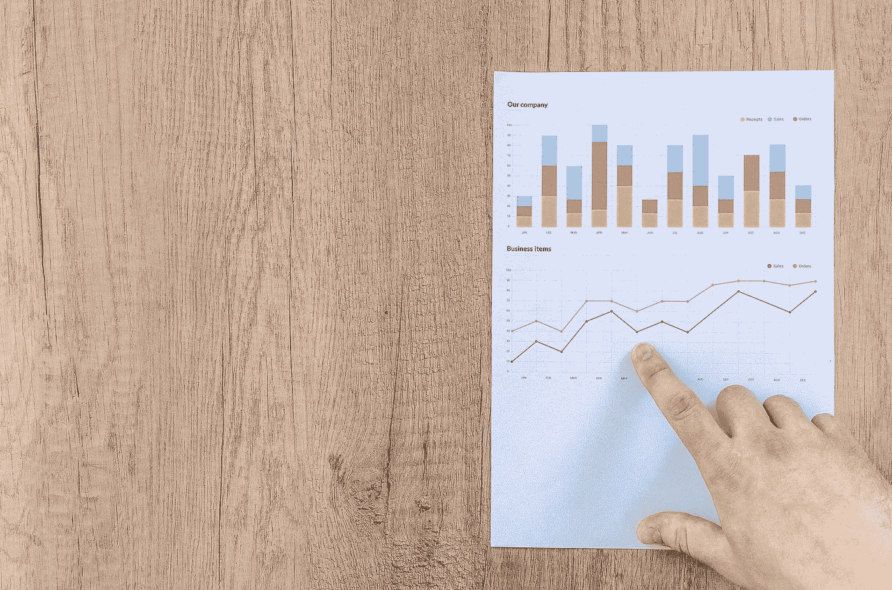
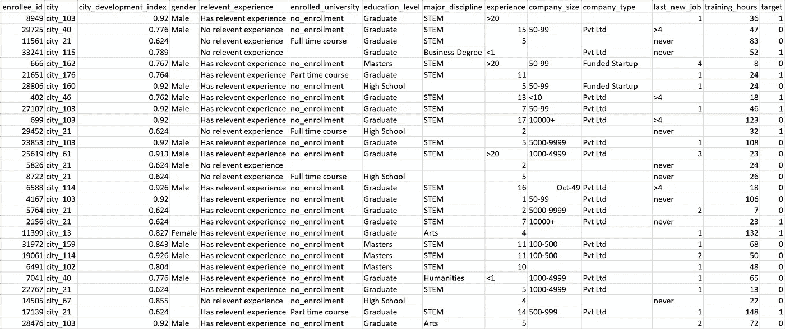
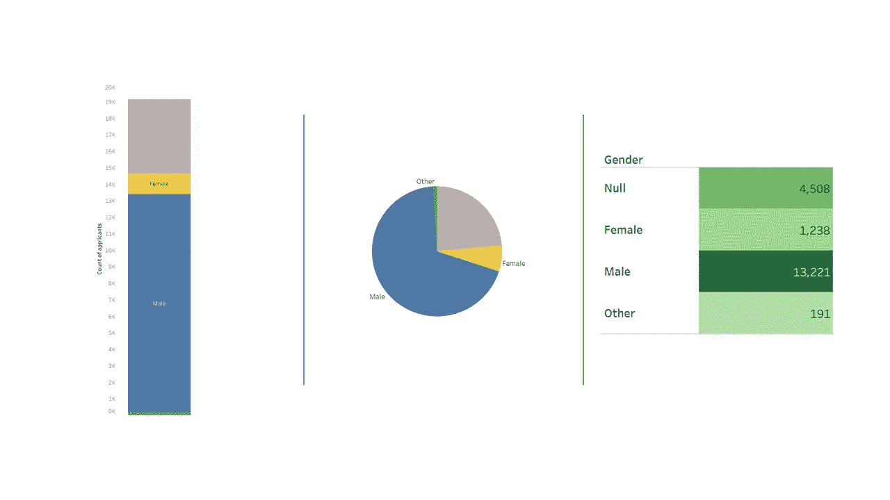
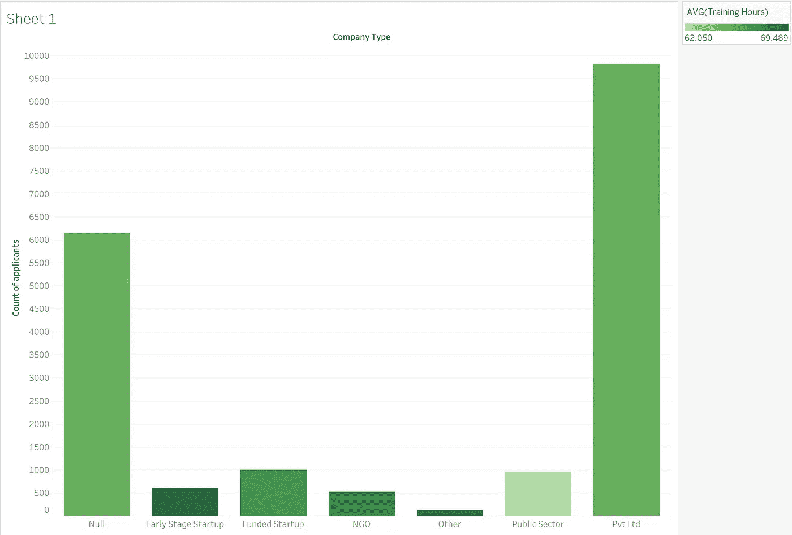

# 超越可视化的基础

> 原文：<https://towardsdatascience.com/beyond-the-basics-of-visualization-5bcb0e7528e7?source=collection_archive---------37----------------------->

## 最新指南

## 不要对你的创造性努力沾沾自喜

来源: [Pixabay](https://pixabay.com/photos/chart-graph-finance-financial-data-2779164/)

> 示例数据:[https://www . ka ggle . com/arashnic/HR-analytics-job-change-of-data-scientists？select=aug_train.csv](https://www.kaggle.com/arashnic/hr-analytics-job-change-of-data-scientists?select=aug_train.csv)

回到 2019 年 6 月，我在 Medium 上写了我的第一篇[文章](/beyond-bar-graphs-and-pie-charts-beb7f48cda5d)。我一直对数据可视化充满热情，并想写一篇关于它的文章，更多的是为我自己，而不是为任何阅读它的人。我创建了示例视觉效果，并梳理资源以找到有见地的提示，但我真的不期望人们真的会阅读它。令我惊讶的是，人们读了它，并告诉我一些我思维中的错误。差不多两年了，有了更多的经验之后，是时候用我现在所知道的来更新这个指南了。

免责声明:我绝不是专家，我只是这门手艺的学生。这些真的只是我试错学来的新手小技巧，想分享一下！

# 提示 1:做一些研究

l̶e̶s̶s̶o̶n̶̶1̶:̶̶k̶n̶o̶w̶̶w̶h̶a̶t̶'̶s̶̶a̶v̶a̶i̶l̶a̶b̶l̶e̶̶t̶o̶̶y̶o̶u̶

在创建视觉效果或图形之前，了解数据的组成和试图用数据展示的内容是至关重要的。首先要检查的几件事:数据存储在哪里以及如何存储，数据的类型是什么——数值型、分类型、二进制型等等，以及是否需要先进行标准化或转换(通过标识符汇总或标准化文本来创建类别是否有益？)一旦你开始想象，这会改变你的方法，帮助你更好地考虑你的选择。例如，如果您的数据不断更新，当您完成时，停滞的图形可能没有帮助。

为什么这一步很重要？很容易假设您的数据是干净和完美的，但通常情况下，它远非如此。尤其是当数据由用户输入或从网上搜集时，事情会变得非常混乱(当 M&T 和 M&ampT 有两个独立的类别时会出现的挫折值得采取预防措施)，当你努力可视化你的数据时，你希望它尽可能清晰。快速浏览一下，确保你有正确的数据，并且数据的格式有助于你形象化。如果不是，为了节省时间，首先预处理这些数据对您最有利。

来源:Taylor fog arty——这些数据可能看起来相对干净，但根据您计划如何可视化，您可能需要采取一些步骤。你可能想了解“上一份新工作”的真正含义，或者“相关经验”是如何衡量的。您可能还想通过删除非数字字符将“经验”列转换成数字值。这些步骤将帮助你确保你的视频讲述你想要的故事。

“知道有什么可用的”和“做研究”有什么区别？以前，我认为为了创造视觉效果，了解你所拥有的工具是很重要的，然而，我开始意识到，努力去了解你需要工具的材料会更好。知道这些工具仍然很重要，但是你可能有一个你最熟悉的工具，这很好！然而，如果你想探索和学习一些新的东西，可以看一看我的原始文章，寻找一些不同的选择。

# **提示 2:考虑你的选择**

̶l̶e̶s̶s̶o̶n̶̶2̶:̶̶p̶i̶c̶k̶̶t̶h̶e̶̶r̶i̶g̶h̶t̶̶k̶i̶n̶d̶̶o̶f̶̶g̶r̶a̶p̶h̶

如前所述，有很多不同的工具可以使用，在你开始视觉化之前应该考虑这些工具以及你想要创建的视觉类型。如果您有持续提取的数据，并且不断更新视觉效果会很有好处，那么有一些软件可以帮助您毫不费力地做到这一点，如 Tableau 或 Microsoft Power BI。或者，如果你想为一个报告或文章创造一个停滞的视觉效果，这是不必要的，可能会引起更多的混乱。方法的选择在很大程度上取决于舒适度，但也取决于工具在帮助你创建你心目中的视觉效果方面有多有用。

无论您决定使用哪种可视化方法，在呈现数据时都可能有很多选项可供选择！你想用线形图或条形图，甚至冲积图？重要的是要记住，每种类型的视觉都有特定的目的和目标，你应该确保这些与你的目标一致。如果你想显示事物如何随时间变化，折线图比一系列饼图好得多(至少在大多数情况下)。你可能认为研究已经随着最后一个提示结束了，但是，还是要做你的研究！通过真正理解你创造的视觉类型，它将帮助你使它更具交流性和有效性。

来源:Taylor fog arty——上面的三张图片代表相同的数据，但不一定是相同的信息。堆叠条形图(左)显示了数据集中显示的申请人总数，以及他们如何按性别细分的高级视图。饼状图(中间)只告诉你性别的细分，但没有显示有多少申请人组成了数据集。表格(右侧)显示了细分情况，但也允许您查看每个类别的确切申请人数以及所有类别标签。

在你开始创建图表之前，用手勾画出你所想象的图表的样子或它将包含的内容通常是有帮助的，这样你就有了一个开始的地方。从那里，您可以查看相似类型的图表，以添加视觉上更有趣的变化或图表。

# 技巧 3:不要害怕定制

̶l̶e̶s̶s̶o̶n̶̶3̶:̶̶c̶u̶s̶t̶o̶m̶i̶z̶e̶̶y̶o̶u̶r̶̶v̶i̶s̶u̶a̶l̶s̶,̶̶d̶o̶n̶'̶t̶̶s̶e̶t̶t̶l̶e̶̶f̶o̶r̶̶o̶r̶a̶n̶g̶e̶̶a̶n̶d̶̶b̶l̶u̶e̶

定制可能是你最好的朋友，特别是如果你想在公共场合使用你的视觉效果。如果你不是，如果视觉是为了一个任务或探索的目的，自定义视觉可能不值得你花时间。同样，这一切都回到你的视觉目标。

如果你想让视觉效果更有凝聚力，视觉上更有趣，可以考虑使用某种定制来帮助表达你的观点。当然，为了清晰起见，你应该总是添加标题、图例等，但是你也可以使用颜色、突出显示的数据点和尺寸来赋予你的视觉效果以生命。只要这些自定义不偏离视觉效果的目的或隐藏重要信息，它们就有助于将读者的注意力引向特定的结论。

重要的是要记住颜色是有意的。颜色是一种很好的视觉品牌，并使他们有凝聚力的方式，但如果使用不当，它会无意中造成混乱。跨视觉效果重用颜色变化可以通过将一个值与另一个值相关联来帮助连接它们，但是如果它们在视觉效果中不一致，它可能会导致读者第一眼就误解视觉效果。

来源:Taylor fog arty——虽然这种视觉效果本身看起来不错，但如果它存在于包含提示 2 中的表格的仪表板中，可能会引起混淆，因为绿色刻度对应不同的值，第一个值代表申请人数，而这个刻度代表所需的平均培训小时数。

如果视觉材料是为其他人制作的，例如雇主或客户，颜色和其他附加物的使用可能有助于视觉材料的消费。通过利用他们品牌的颜色、字体和术语，你的受众会积极地联想到这种识别，并可能对视觉效果或内容更加开放。

# 技巧 4:谨慎添加

̶l̶e̶s̶s̶o̶n̶̶4̶:̶̶b̶e̶̶c̶a̶r̶e̶f̶u̶l̶̶h̶o̶w̶̶y̶o̶u̶̶e̶n̶c̶o̶d̶e̶

我们在创造视觉效果时喜欢做的一件事是添加额外的信息层，不管它们是否相关，以防某些东西很有趣。或者额外的几层可能对你的结论很重要。无论哪种方式，添加数据都需要深思熟虑和谨慎。我们不应该让我们内心的创造力永远占上风。

视觉效果必须清晰，但视觉效果必须吸引人，必须有趣。同样，我们循环回到视觉的目标来决定哪条路线更好。如果你的目标是创建一个发人深省和美丽的视觉，然后编码到你的心的内容，但如果你的目标是有效地沟通信息，你可能要重新考虑。如果你编码的数据没有增加任何新的理解或帮助读者得出相同的结论，在这种情况下应该避免。

来源:Taylor fog arty——这种视觉效果试图用气泡图来显示性别、专业和申请人数，但它在几个关键方面失败了。这也显示了清理数据的重要性——如果您查看带注释的气泡，您会发现许多气泡缺少一个或多个我们试图查看的变量。虽然这可能会让您深入了解数据集中缺失值的位置，但如果您的目标是查看按性别划分的专业，这并不能完成工作。许多气泡非常小，如果没有工具提示，就不可能知道它们代表什么。

有时，如果能表达重点，基本条形图是最好的选择。大部分人都知道如何非常快速的解读一个条形图，折线图，或者饼状图，基本上一目了然。当你的发现需要快速消化或无需解释时，使用简单性。

# 提示 5:不要忘记上下文

̶l̶e̶s̶s̶o̶n̶̶5̶:̶̶c̶r̶e̶a̶t̶e̶̶y̶o̶u̶r̶̶g̶r̶a̶p̶h̶̶c̶o̶m̶p̶l̶e̶t̶e̶l̶y̶

绝对不要忘记你的标题和标签，以确保你的读者理解数据，但也不要忘记在你完成创建后考虑数据的上下文。这可以帮助你再次检查你的视觉显示的信息是否是你想要的，也可以防止你做得过火。希望在整个过程中，你已经记住了你的视觉效果的目标和目的，但是如果没有，你应该现在就返回。确保看到该视觉效果的人能够理解它——毕竟，您可能已经使用数据有一段时间了，应该比第一次看到它的人对它有更好的理解。

# 额外提示:犯错

正如我在开头提到的，我不是专家，但我学到的东西很大程度上是通过试错。不要害怕犯错误，但一定要从中吸取教训！你创造的第一个视觉效果不会完美，这没关系。修改它，接受批评，因为它们只会在你的旅程中帮助你。