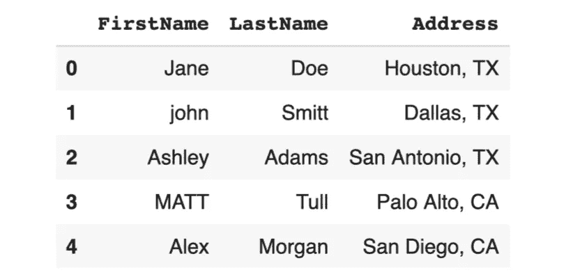
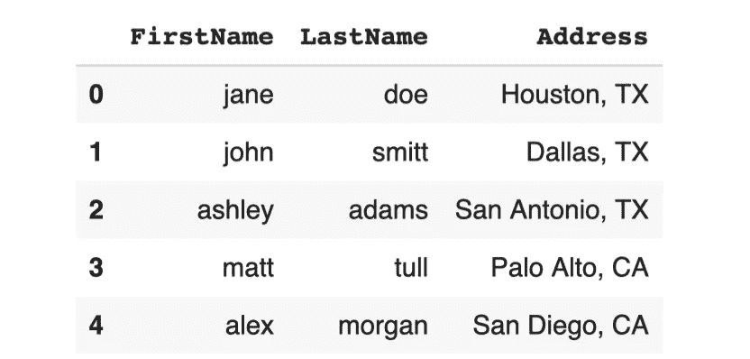
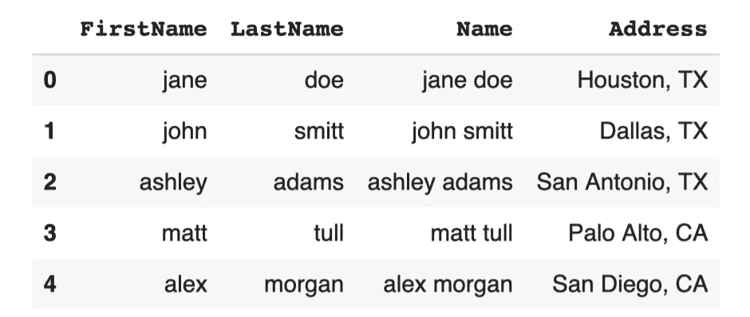
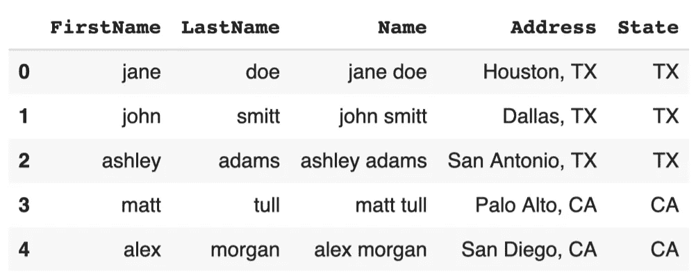
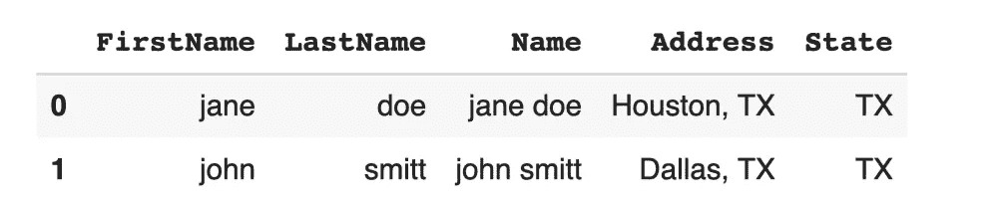
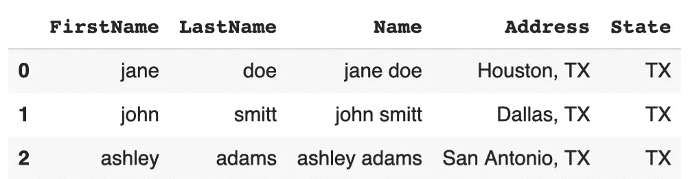
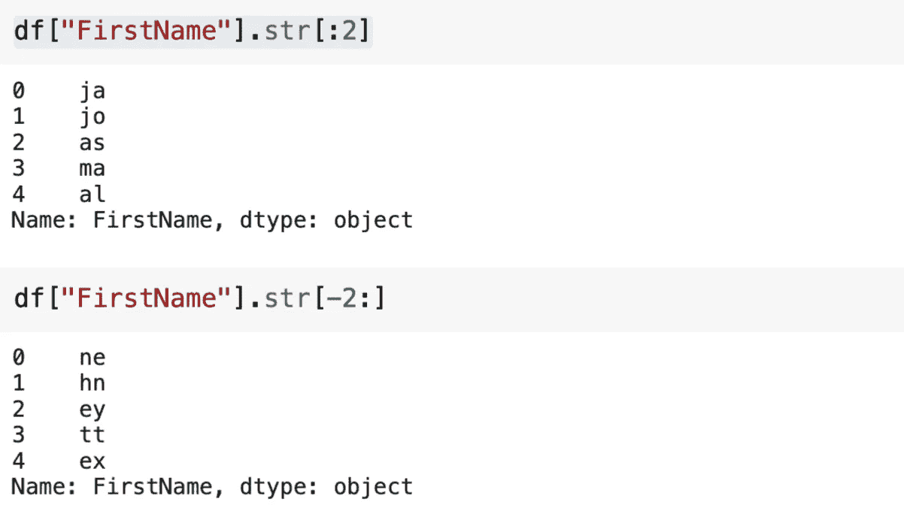

# 蟒蛇熊猫的数量之外

> 原文：<https://towardsdatascience.com/beyond-the-numbers-with-python-pandas-38395e5cb87?source=collection_archive---------21----------------------->

## 如何处理文本数据？


萨曼莎·加德斯在 [Unsplash](https://unsplash.com/s/photos/simple?utm_source=unsplash&utm_medium=referral&utm_content=creditCopyText) 上的照片

Pandas 是使用最广泛的 Python 库之一。它提供了许多功能和方法来执行有效的数据分析和操作。

我们倾向于将表格数据与数字联系起来。然而，大量的原始数据是以文本形式出现的。幸运的是，Pandas 有几种方法来处理文本数据。

操作字符串的方法可以通过 str 访问器来访问。在本文中，我们将通过例子来探讨这些方法。

让我们从用模拟数据创建一个样本数据框开始。

```
import pandas as pddf = pd.DataFrame({ "FirstName": ["Jane","john","Ashley", "MATT", "Alex"],
   "LastName": ["Doe", "Smitt", "Adams", "Tull", "Morgan"],
   "Address": ["Houston, TX", "Dallas, TX", "San Antonio, TX", 
            "Palo Alto, CA", "San Diego, CA"]})df
```



(图片由作者提供)

我们注意到的第一件事是名字中的字母不兼容。有大写字母也有小写字母。最好是标准格式的。

我们可以将它们全部转换成大写或小写。熊猫有两种操作方法。

```
df["FirstName"] = df["FirstName"].str.lower()df["LastName"] = df["LastName"].str.lower()df
```



(图片由作者提供)

我们可以通过组合名字和姓氏来创建姓名列。

```
df.insert(2, 
          "Name", 
          df["FirstName"].str.cat(df["LastName"], sep=" "))df
```



(图片由作者提供)

我使用了 insert 函数，能够在姓氏之后创建新的列。默认情况下，新列添加在末尾，但是插入允许在特定位置创建新列。

str 访问器下的 cat 方法组合字符串。它用在 insert 函数的第三个参数中，我们在这里定义新列的值。

字符串的另一个常见操作是拆分。在某些情况下，文本数据包含多条信息。例如,“地址”列包括城市和州名。我们可以通过拆分该列来提取城市或州的信息。

```
df["State"] = df["Address"].str.split(",", expand=True)[1]df
```



(图片由作者提供)

在某些情况下，我们需要根据字符串过滤数据点(即行)。例如，我们可能对以字母 j 开头的名称或包含“TX”的地址感兴趣。

startswith 和 endswith 方法允许分别基于字符串的第一个或最后一个字母进行过滤。如果我们在一个字符串中搜索一个字符序列，那么可以使用 contain 方法。所有这些方法都可以在 str 访问器下使用。

```
df[df["Name"].str.startswith("j")]
```



(图片由作者提供)

```
df[df["Address"].str.contains("TX")]
```



(图片由作者提供)

值得注意的是，startswith 和 endswith 方法接受多个字符。因此，我们可以使用它们来过滤以字符序列开头或结尾的字符串。

replace 方法可用于替换字符串中的字符序列。让我们做一个例子来演示它是如何使用的。

```
df["Address"] = df["Address"].str.replace("TX", "Texas")df
```


(图片由作者提供)

str 访问器还可以用于对字符串进行索引。例如，我们可以用“str[:2]”表达式选择前两个字符，用“str[-2:]”表达式选择后两个字符。



(图片由作者提供)

## 结论

Pandas 字符串方法组合在 str 访问器下。我们已经介绍了您可能会更经常使用的工具。

文本数据拥有非常有价值的信息，将永远存在于我们的生活中。因此，学会如何操纵和处理它是非常重要的。

感谢您的阅读。如果您有任何反馈，请告诉我。