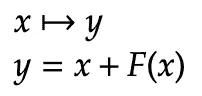
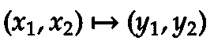
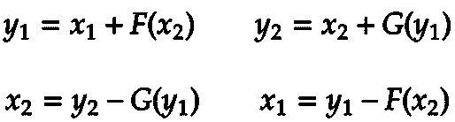
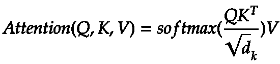
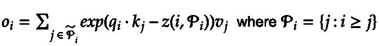
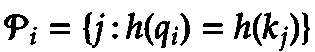

# 超越普通变压器

> 原文：<https://towardsdatascience.com/beyond-the-vanilla-transformer-602d3c57d0db?source=collection_archive---------29----------------------->

## 一瞥 NLPs 最先进建筑的发展前景


乔斯林·莫拉莱斯在 [Unsplash](https://unsplash.com/s/photos/vanilla?utm_source=unsplash&utm_medium=referral&utm_content=creditCopyText) 上的照片

现在是 2017 年，论文《注意力是你需要的全部》为 NLP 提供了一个新的有前途的架构:变压器。四年后——深度学习领域的永恒 Transformer 仍然是最先进的架构，用于各种 NLP 任务。但是世界并没有停滞不前——至少在这个领域没有，更多的论文已经开始转变，并为进一步的发展提供了新的方法。我想在这里讨论一些有前景的。

我们将从 2019 年已经发表的论文开始:“ *Transformer XL:超越固定长度上下文的专注语言模型*”。下面这篇论文将是“*重整器:高效的变压器*”，在最近一篇文章(2021 年 6 月)之前:“*打包:迈向 2 倍 NLP BERT 加速*”将被讨论。

关于 Transformer 还有很多有前途的文章，但是我必须做出选择，这样这篇文章就不会超出范围。我希望我没有对任何一位论文作者不公🙃！

## Transformer-XL:超越固定长度上下文的注意力语言模型

本文讨论变压器处理不定长文本的有限能力。标准转换器使用最大长度、截断和填充来处理不同的序列长度。同时，这种固定长度是扩展依赖学习的障碍，在扩展依赖学习中，注意机制会抓住超过这一限制的连接。

虽然短期依赖性可能不会对大多数用例造成问题，但是固定长度限制可能会由于截断及其不遵守语义边界的属性而降低性能。作者称之为*语境碎片*。

他们的解决方案听起来很简单:通过不从头开始计算隐藏状态，最后一个状态可以作为当前段的内存状态。有了这种循环连接，信息不会丢失，而是会从一个状态传递到另一个状态。这显然解决了丢失语义信息的问题，并导致了长期的依赖性。

与普通变形金刚相比的变化可以在注意力层中找到。键和值将由来自前一段的缓存进行扩展。我不想谈论更多的细节。但是我强烈推荐阅读 Transformer XL 论文中的章节*带状态重用的段级递归*。

在关注层内使用先前段的缓存需要一些额外的改变。作者提出的问题是:"*[……]当我们重用状态时，如何保持位置信息的一致性？*(戴等 2019)。而在默认转换器中，序列顺序由位置编码提供。当使用缓存时，不考虑前一状态的位置编码(我们刚刚讨论过)。这导致性能不佳。为了克服这个问题，作者的方法是只编码隐藏状态中的相对位置信息，并将其注入注意力得分。从他们的角度来看，这种方法更直观:

> 例如，当查询向量 qτ，I 涉及关键向量 **k** τ，≤i 时，不需要知道每个关键向量的绝对位置来识别片段的时间顺序。*(戴等 2019)*

相对距离足以使查询向量能够通过元素的不同距离来区分元素。此外，可以从相对距离获得绝对位置。请在原始论文中阅读更多关于这方面的内容。

总结一下:通过缓存之前的片段来改善注意力机制似乎是一个有希望的步骤。这不仅增加了长期依赖性，而且还解决了文本分割带来的上下文碎片问题。


照片由[乔斯林·莫拉莱斯](https://unsplash.com/@molnj?utm_source=unsplash&utm_medium=referral&utm_content=creditCopyText)在 [Unsplash](https://unsplash.com/s/photos/vanilla?utm_source=unsplash&utm_medium=referral&utm_content=creditCopyText)

## 改革者:高效的变压器

变压器是有很多参数的巨大模型。从零开始训练他们实际上只能由行业或平等的大玩家来完成。幸运的是，我们可以使用像伯特这样预先训练好的模型。但即使是 24 层版本的 BERT，也很难在单个 GPU 系统上进行训练。如果我们不希望这种模型只能由大公司来训练和运行，变压器需要变得更有效率。

Kitaev、Kaiser 和 lev Shaya——*改革者*论文的作者介绍了解决上述问题的三项变革:

*   使用可逆层仅存储整个模型的激活的单个副本。这将使存储激活所需的内存减少 *N 倍*
*   在前馈层内分割激活并将它们作为块进行处理有助于减少这些层所需的内存。前馈层通常比例如关注层广泛得多，因此负责高存储器使用率。
*   使用局部敏感散列注意力，将注意力层内的因子从 *O(L )* 改变为 *O(L log L)*

作者确信“*[……]与标准变压器*相比，这些技术对训练过程的影响可以忽略不计”(Kitaev 等人，2020)。我将谈论第一个和最后一个想法——在我看来，它们是最有趣的。为了不至于失控，第二种方法将不再讨论。

**可逆变压器**

在他们的论文中:*可逆残差网络:不存储激活的反向传播，* Gomez 等人提出了*可逆残差网络* (RevNets)。这个想法是，每次激活都可以从下一层恢复，并且在反向传播期间不需要存储——以计算换取更多的内存。剩余层(也称为跳过连接)执行对单个输入和单个输出进行操作的功能:



可逆层有两个输入:



根据这些等式(并通过减法反转):



在*可逆变压器的上下文中，*这意味着前馈层( *G* )和关注层( *F* )被组合在可逆模块内。

*Y₁ = X₁ + Attention(X₂)* 和 *Y₂ = X₂ + FeedForward(Y₁)*

通过这种实现，不再需要存储激活；因此节省了内存。即使这意味着需要稍微多一点的计算。

**区分位置的哈希注意**

变形金刚的核心是注意力机制。不是没有原因，最初的论文叫做*注意力是你所需要的全部。因此，开发出使这种机制更有效的方法只是时间问题。*

在标准转换器中，使用缩放的点积注意力:



输入包含查询和键以及值。所有查询和键的点积都是在缩放之前计算的。之后，应用 softmax 函数。最后，中间矩阵和值矩阵的矩阵乘法产生关注度分数。

作者正在寻找一种更有效的记忆注意力机制，并提出了*位置敏感哈希注意力(LSH)* 的想法。目的是将复杂度从 *O(L )* 降低到 *O(L log L)。*粗略地说，该算法旨在将数据点分组到所谓的桶中，以便彼此接近的数据点以很高的概率获得相同的散列。与其他散列技术相比，散列冲突被最大化，而不是最小化。在最近邻居的帮助下，我们可以将注意力集中在靠近查询的关键字上。

下面你看一下 LSH 在论文中阐述的注意事项:



单个查询位置 I 的等式

*‘P’*指' *i'* 为部分的集合，' *z'* 表示配分函数。 *LSH* 背后的思想是集合 *P* 元素被限制为关注单个哈希桶的元素:



*LSH* 作为全神贯注的近似方法，能够通过增加计算成本来减少内存使用，计算成本随着哈希数的增加而增加。希望这将使大型变压器更容易使用——不仅仅是对在多个 GPU 上运行它们的机构。

## 包装:接近 2 倍 NLP BERT 加速度

如前所述，预训练 BERT 是因为它对计算能力的巨大需求，只适用于大型行业或研究机构。Kosec、Fu 和 Krell——这篇论文的作者希望通过去除填充来提高效率，从而减少这一障碍。他们提出了一种算法，利用维基百科数据集将预训练速度提高了 2 倍。

处理填充令牌可以被视为计算的浪费。文本长度分布越宽，在这个过程中损失的计算就越多。打包方法希望完全填充每个序列长度，因此不再需要填充。这种想法基于这样的假设，即序列是可以互换的，所以顺序并不重要。装箱方法是一个经典的规划问题([装箱](https://en.wikipedia.org/wiki/Bin_packing_problem)或[下料问题](https://en.wikipedia.org/wiki/Cutting_stock_problem))。由于该问题是 NLP 特有的，因此提出了两种算法:

*   最短包装优先直方图包装
*   非负最小二乘直方图打包

理解这些算法的细节并不重要；分析包装带来的问题要重要得多。作者们通过详细地解决这些问题做了大量的工作。让我们谈一谈它们。

顾名思义，BERT(来自变压器的双向编码器表示)利用了双向自我关注。但是，打包(填充段，不留出填充空间)会创建没有相应序列的段。像 GPT3 这样注意力不集中的语言模型不会面临这个问题，因为它们只关注以前的标记。本文介绍了用于注意层的掩模，以防止不同序列之间的污染。让我们看看文章中提供的一些代码:

```
mask = np.array([[1, 1, 1, 2, 2]]) # input
zero_one_mask = tf.equal(mask, mask.T) # 0, 1 mask #for use with softmax:
softmax_mask = tf.where(zero_one_mask , 0, -1000)
```

这个实现创建了一个块对角掩码，减少了填充，并且可以简单地由像 *numpy 这样的框架实现。*

包装面临的另一个挑战是损失和准确性的计算。在 BERT 中，交叉熵损失是按序列计算的。当使用打包时，不再为序列计算损失。该模型将收敛到不同的最优值。为了解决这个问题，作者的想法是:

> “为了实现每序列丢失，我们通过处理每令牌丢失来有效地‘解包’传入的逻辑和标签。我们计算属于第一序列的所有记号的损失，然后计算属于第二序列的所有记号的损失，等等“*”(Kosec，et al. 2021)。*

本文中有一个很好的代码示例解释了它们的实现——请查看。

与其他两篇文章不同，打包方法旨在优化前期培训。尽管这个过程可能会花费大量的时间和金钱，但这里显示的改进是有希望的。

现在，我们已经了解了改善变压器的各种方法，不得不说，所有这些方法都是优化性能而非质量输出的独特方法。这可能是由于我的选择和这样一个事实，即 Transformer 作为一个有前途的架构越来越只对大玩家可用，或者至少是由他们创建的。GTP3 就是一个典型的例子。

我希望这些描述是可以理解和理解的。解释的一些概念不是特别容易理解，所以解释本身并不是最直接的任务。谢谢你一直读到最后。下次见——再见。

## 参考

艾丹·戈麦斯，叶萌·任，拉克尔·乌尔塔森和罗杰·b·格罗斯:可逆残差网络:不存储激活的反向传播。 [*arXiv: 1707.04585，*](https://arxiv.org/abs/1707.04585)*2017*

阿什什·瓦斯瓦尼、诺姆·沙泽尔、尼基·帕尔马、雅各布·乌兹科雷特、莱昂·琼斯、艾丹·戈麦斯、卢卡斯·凯泽和伊利亚·波洛苏欣:你所需要的只是关注。[*arXiv:1706.03762*](https://arxiv.org/abs/1706.03762)*，* 2018

马特伊·科塞克、傅生和马里奥·迈克尔·克雷尔:打包:向 2 倍 NLP BERT 加速前进。[*arXiv:2107.02027*](https://arxiv.org/abs/2107.02027)*，* 2021

Nikita Kitaev，ukasz Kaiser 和 Anselm Levskaya:改革者:高效的变革者。[*arXiv:2001.04451*](https://arxiv.org/abs/2001.04451)*，* 2020

戴子航，，，Jaime Carbonell，Quoc V. Le，Ruslan Salakhutdinov:Transformer-XL:固定长度语境之外的注意力语言模型。[*arXiv:*](https://arxiv.org/abs/1901.02860)*2019*

*感谢所有写出如此精彩文章的作者！🤗*