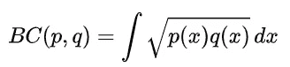
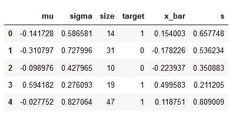
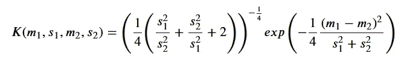

# Bhattacharyya 核和数据集上的机器学习

> 原文：<https://towardsdatascience.com/bhattacharyya-kernels-and-machine-learning-on-sets-of-data-bf94a22097f7?source=collection_archive---------9----------------------->

## 使用集合元素的概率分布来提取特定于集合的特征


塞布·阿特金森在 [Unsplash](https://unsplash.com?utm_source=medium&utm_medium=referral) 上拍摄的照片

当一个特征不是被定义为单个数字，而是一组对象时，集合上的机器学习问题就出现了。一个很好的例子是，当您试图根据订单历史推断客户的一些情况时。我在过去的这些文章中介绍了 set 上的深度学习方法:

[](/graph-neural-network-and-permutation-invariance-979754a08178) [## 图形神经网络与置换不变性

### 用不变性理论学习图形和关系数据

towardsdatascience.com](/graph-neural-network-and-permutation-invariance-979754a08178) [](/set-attention-models-for-time-series-classification-c09360a60349) [## 用于时间序列分类的集合注意模型

### 真实世界时间序列数据的深度学习算法

towardsdatascience.com](/set-attention-models-for-time-series-classification-c09360a60349) 

但是在本文中，我将回顾如何使用内核方法来学习集合。

# 核心方法

最新一代的数据科学家可能从未使用过任何内核方法。然而，在大约 20 年前，它们被广泛使用。它们都基于将输入空间映射到另一个空间，其中给定的机器学习问题可以使用线性方法来解决:

尖括号表示点积。那么任何函数都可以用线性组合来表示:

内核方法的要点是，您并不真的需要在输入空间中导出映射。知道核函数就足够了。核函数可以被认为是指示两个数据点之间的*相似性*。最著名的基于核的方法是支持向量机，但还有很多，包括核 PCA，高斯过程和贝叶斯优化。

# Bhattacharyya 内核

原始核定义在单个向量的输入空间上。如果你的输入空间是向量集呢？我们可以找到每个集合中向量的概率分布，并计算核函数作为两个概率分布相似性的度量[1，2]。一个很好的相似性度量是 Bhattacharyya 系数:



来源:[https://en.wikipedia.org/wiki/Bhattacharyya_distance](https://en.wikipedia.org/wiki/Bhattacharyya_distance)

该系数计算两个分布之间的重叠。它总是大于零，并且具有一个很好的性质，即 **BC(p，p) = 1，**这使得可以将其解释为两个分布之间的“角度”的余弦。它可以对指数族的所有概率分布进行封闭形式的计算，如正态、伯努利、多项式等。Bhattacharyya 系数实际上是一个正定矩阵，因此是集合间核的一个很好的候选。

# 量子力学中的类比

在量子力学中，系统(稳态)状态由波函数 **ψ(x)** 定义，其平方模数是概率密度函数:

以下量称为*转变幅度*:

而它的平方模是*跃迁几率，*也就是系统处于ψ1 态也处于ψ2 态的几率。可以看到，跃迁幅度是复数希尔伯特空间中的 Bhattacharyya 核，它给出了 Bhattacharyya 系数平方对概率的解释，即一个分布的样本也可以解释为第二个分布的样本。换句话说，它可以解释为两个概率密度函数的重叠。

# 概率乘积核

这些内核值得一提，因为它们是 Bhattacharyya 内核的扩展。它们被定义为:

对于 **ρ=1/2** ，这个内核简化为 Bhattacharyya 内核。当 **ρ=1** 时，该核称为*期望似然核。*这个内核没有一个很好的性质 **K(q，q) = 1** ，除非 **ρ=1/2** 。此外，在一般情况下，积分不能保证收敛。

# 实验性研究

我们创建了一个简单的实验来衡量基于 Bhattacharyya 内核的算法的表达能力。我们生成了 1000 组数字，每组数字都遵循带有随机参数的正态分布。然后，对于每个集合，我们拟合正态分布，并尝试预测 60%分位数是高于还是低于指定值。

在这里，我们定义了集合的数量和分布参数的范围、集合大小的范围、目标分位数和比较值。我们现在将为每个参数集生成随机参数集:

该数据框包含每个集合的正态分布参数以及集合大小。我们现在准备生成集合:

对于每个集合，我们可以计算分位数目标变量以及平均值和标准偏差。这里我们遵循频率主义者的方法。贝叶斯方法需要稍微不同的实验设计。



作者图片

这种情况下的核函数可以解析计算。给核函数两个自变量，让 *𝑚* 1 和 *𝑠* 1 是第一分布的参数，而 *𝑚* 1 和 *𝑠* 1 是第二分布的参数。

则内核计算如下:



作者图片

是时候分成训练集和测试集，并使用支持向量分类器进行训练了:

训练集和测试集的模型准确性

```
model.score(X_train, y_train, )0.9775model.score(X_test, y_test, )0.975
```

准确率相当高，但即使在训练集上也不是 100%。通过调整超参数 *𝜌* ，使用更一般的概率乘积核可能有助于获得更高的精度

# 结论

在本文中，我们讨论了 Bhattacharyya 内核和相关内核，当训练数据表示集合而不是数据点时，这些内核会很有用。这个核的假设是，符合相似概率分布的集合彼此相似。我们设计了一个简单的实验来评估支持向量机分类器的内核性能。实验结果不错，但并不令人印象深刻。我们可以注意到，核函数不依赖于集合大小，只要它们符合相同的分布，它就会将不同的集合视为相同的，即使它们的大小非常不同。使用贝叶斯方法代替频繁方法可以帮助我们在核建模中保留关于集合大小的信息。这篇文章的所有代码都在我的 github 页面上。

# 参考

[1]t .杰巴拉和 r .孔多尔(2003 年)。Bhattacharyya 和期望似然核。*人工智能讲义(计算机科学讲义系列)*， *2777* 。[https://doi.org/10.1007/978-3-540-45167-9_6](https://doi.org/10.1007/978-3-540-45167-9_6)

[2]t .杰巴拉、r .孔多尔和 a .霍华德(2004 年)。概率乘积核。*机器学习研究杂志*， *5* 。