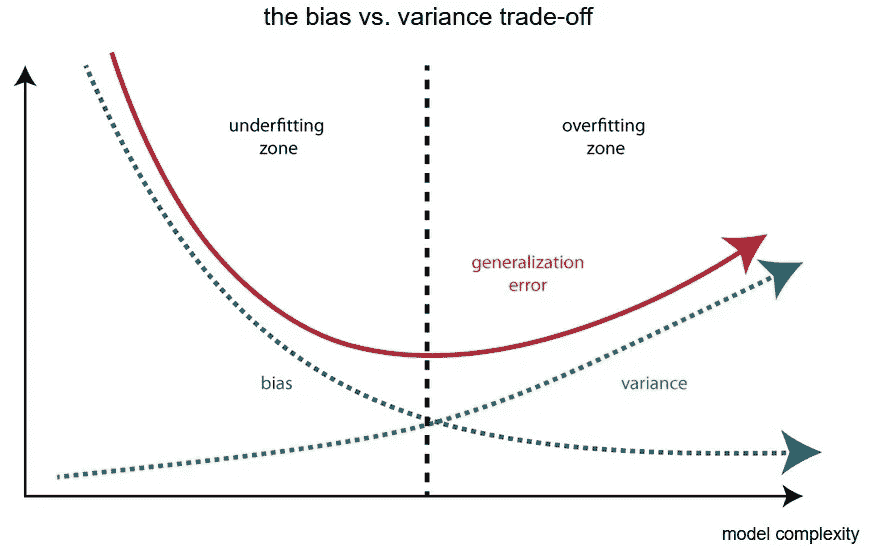
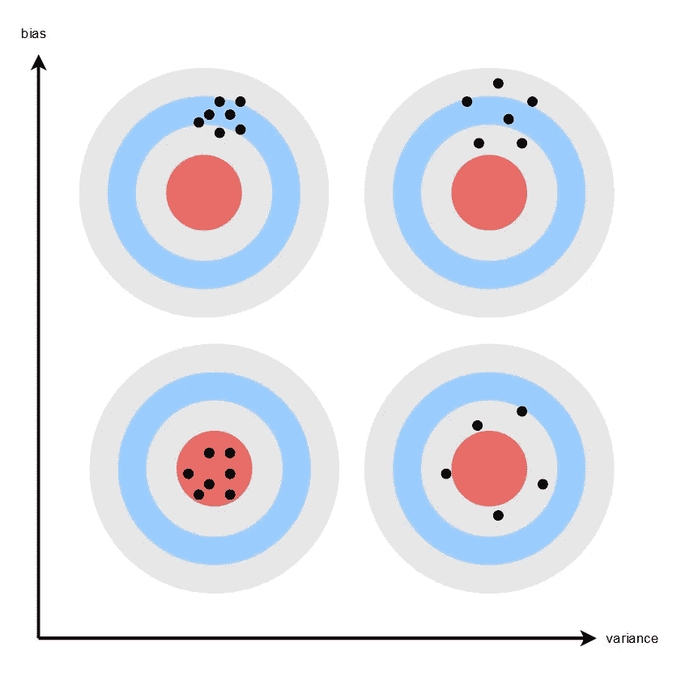

# 偏见和差异背后的直觉

> 原文：<https://towardsdatascience.com/bias-and-variance-but-what-are-they-really-ac539817e171?source=collection_archive---------11----------------------->

## 偏差和方差通常用技术术语表示，但它们也有直观的解释。

如果你参加机器学习课程，在某些时候你会遇到[偏差-方差权衡](https://en.wikipedia.org/wiki/Bias%E2%80%93variance_tradeoff)。你可能觉得你*有点*理解它，但不是真的。后来，你看到这两个词在书籍、文章和谈话中随处可见，你意识到你对什么是偏差和方差仍然没有很好的直觉。这篇文章是给你的。

我不打算进入技术定义，我将省略任何公式。我假设我的观众理解基本的 ML 概念，例如为什么数据被分为训练集、验证集和测试集，一些超参数的选择如何影响训练模型的“复杂性”(例如，决策树的最大深度越高，决策规则集越精细)，以及交叉验证如何用于为模型找到好的超参数。

让我们从定义偏差和方差开始:

*   一些模型过于简单，忽略了训练数据中的重要关系，而训练数据本可以提高它们的预测。据说这样的模型有很高的**偏差**。当一个模型有很高的偏差时，它的预测总是错误的，如果不是整个范围的话，至少对于数据的某些区域是这样。例如，如果您试图用一条线来拟合散点图，其中数据似乎遵循曲线-线性模式，那么您可以想象我们不会有很好的拟合。在图的某些部分，线会落在曲线下面，而其他部分会在曲线上面，笨拙地试图跟随曲线的轨迹。由于直线跟踪模型的预测，因此我们可以看到，当直线低于曲线时，预测始终低于实际情况，反之亦然。所以当你想到“偏差”这个词时，就想到**预测总是偏离**。高偏差模型被称为**欠拟合**【训练数据】，因此训练数据和测试数据的预测误差都很高。
*   有些模型过于复杂，在寻找变量之间重要关系的过程中，它们也会偶然发现某些关系，而这些关系最终只是噪音的结果。换句话说，该模型考虑了训练数据中的某些“侥幸”，这些数据不能推广到测试数据。在这种情况下，模型的预测再次被关闭，但重要的是:它们是**而不是** *持续*关闭。稍微改变一下数据，我们最终会得到非常不同的预测。为什么？因为模型对数据的变化过于敏感和*反应过度*。高方差模型被称为**过度拟合**【训练数据】，因此它们的预测误差在训练数据上看似很低，但在测试数据上却很高，因此缺乏通用性。

上述极端情况分别由下图的左侧和右侧表示:

中间的垂直虚线显示了一种“快乐的中间状态”(没有双关语的意思)，其中模型的复杂性正好是模型既不欠拟合也不过拟合的量。垂直轴表示模型的预测误差。红色曲线代表测试数据的平均误差。图片作者。

也许下面的类比会帮助你的直觉:假设你刚和你的两个朋友看完一部电影。你现在转向每个人，问“你觉得这部电影怎么样？”。你的一个朋友是个内向的人，为了避免拖累谈话，他会给你一个笼统的说法，比如“很好”另一个朋友是外向的人，为了延长谈话时间，他对电影进行了复杂的分析，有很多细节似乎“离题了”。听完每个朋友的话，你仍然不知道他们喜欢这部电影。所以你转向你的第一个朋友，请他详细说明一些，你要求另一个朋友简化他们的描述，避免跑题。你能猜出哪个朋友偏差大，哪个方差大吗？如果你仍然不确定，我鼓励你从头再看一遍这篇文章。答案应该是明确的。

既然您对这些概念已经比较熟悉了，那么让我们将它们与这些术语在更一般的上下文中的使用联系起来。

*   你可能听过人们称一个**有偏见的人**(偏见)。这和 ML 中的偏倚有关系吗？很高兴你问了。当我们说某人有偏见时，我们的意思是他们倾向于妄下结论，忽视相反的证据。这可以是有意的，也可以是无意的。小孩子经常会有偏见，因为他们通过泛泛而谈来了解世界(例如陌生人的危险)，在成长的过程中，他们*完善了*他们的世界模型。另一个常见的情况是当我们提到**有偏硬币**时:如果一个模型非常适合，那么(测试数据上的)误差应该看起来像随机噪声，就像无偏硬币的结果看起来随机且不可预测一样。但是，如果模型在数据的某个区域有偏差，那么预测总是高于或低于标准，使得误差总是分别为负或正。因此，误差的符号*就像一枚有偏差的硬币。*
*   方差呢？方差还有很多其他的名字。我更喜欢更广泛的术语可变性，其他术语包括利差和风险(后者在金融领域很常见，指的是缺乏可预测性)，但让我们坚持使用方差。在更广泛的背景下，当我们说某事有很高的方差时，这意味着它倾向于对反馈反应过度。想象一个函数，它的输出对输入的变化非常敏感。这和 ML 有什么关系？回想一下，对于 ML 算法，输入是训练数据，输出是经过训练的模型，然后可以使用该模型来获得对测试数据的预测。因此，当我们使用稍有不同的训练数据重新训练同一模型时，高方差模型的预测会以意想不到且看似随机的方式发生变化。在英语中，我们用“对某事读得太多”来描述这种我们在没有模式的地方看到模式的行为。因此，你可以说高方差模型对训练数据的细微差别和微妙之处解读过多，将噪声误认为信号。

也许下面的可视化可以帮助巩固你的理解:

上图中的每个点代表一个训练实例，也就是一个训练好的模型。从一个点变化到另一个点的是训练数据。如果经过训练的模型在测试数据上的误差很低，它的点应该落在红色圆圈内。当这些点聚集在一起时，这意味着底层的训练模型是一致的，当它们散开时，这意味着它们具有高方差。低偏差低方差的最佳点对应于左下方的目标。图片作者。

如果到目前为止你还和我在一起，那么有一件事应该是清楚的:为了知道我们的模型是否有高偏差，高方差，或者是否在最佳点，我们需要三样东西:

1.  在训练集和测试集之间拆分数据，以便我们可以比较训练和测试数据的错误。
2.  一遍又一遍地重新训练相同的模型(这里相同意味着我们使用相同的超参数),以查看预测如何响应训练数据的变化而变化。
3.  重新训练几个不同的模型(这里的不同是指使用另一组超参数)，以便我们可以比较不同复杂程度的训练模型。我们通常将这一步骤称为**超参数调整**，但在正确的上下文中，它也称为**模型选择。**为了正确地做事，我们应该对训练数据、验证数据和测试数据进行**三分**:我们选择在验证数据上具有最佳性能的模型，并在测试数据上评估该模型，以获得**最终(更现实)的性能估计**。或者，如果我们愿意支付额外的培训费用，我们可以使用[交叉验证](https://en.wikipedia.org/wiki/Cross-validation_(statistics))。

交叉验证包括将“训练数据”分成 k 个折叠(我使用引号，因为说训练和验证数据更准确):我们训练 k 次，每次使用除了一个折叠之外的所有折叠进行训练(显示为绿色)，剩余的一个折叠(显示为蓝色)进行验证。验证折叠在每次迭代之间旋转(在上面的视图中称为 split)。图片取自[scikit-learn.org](https://scikit-learn.org/stable/modules/cross_validation.html)。

即使您对 ML 相对陌生，步骤 1 和 3 应该看起来很熟悉，但对步骤 2 来说不一定如此。这一步让数据科学家看起来像是在 excel 电子表格中打开他们的数据，手动更改数字，以便他们可以重新训练一个新模型，看看它的预测会发生什么。深呼吸:实际上根本不是这么回事。在实践中，步骤 2 几乎总是被跳过，因为步骤 3 已经可以告诉我们是否过度拟合以及过度拟合到什么程度，所以步骤 2 更像是描述如果我们的模型过度拟合会发生什么。在使用交叉验证时，从某种意义上说，您可能会认为第 2 步是在内部实现的，因为每次迭代之间的训练数据相差一倍。例如，在上面的视图中，迭代 4 和 5 中使用的训练数据集具有相同的折叠 1-3，但是折叠 4 和 5 在两次迭代之间交换。

如果有太多东西要打开，你不是唯一一个。有些微妙之处需要时间去理解。数据科学家倾向于反复无常地使用他们的术语，这也于事无补。例如，许多数据科学家交替使用测试数据和验证数据这两个词，并假设从上下文中可以清楚地看出这一点。这可能会让新的数据科学家感到困惑，但我希望您在阅读本文后不会感到那么困惑。

最后一点，对于神经网络，情况有所不同，但是如果有足够的兴趣，我将在后续文章中写这方面的内容。