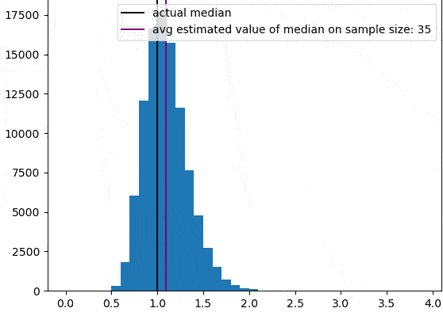

# 偏差、一致性和为数据驱动的工作设计 KPI

> 原文：<https://towardsdatascience.com/bias-consistency-and-designing-kpis-for-data-driven-endeavors-e643e09a945d?source=collection_archive---------33----------------------->

我们将在本文中讨论“数据驱动”意味着什么，以及为什么坚实的统计基础是一个重要的因素。

# 一、关键绩效指标:数字胜于雄辩

假设你是初创公司雇佣的第一位数据科学家。他们没有数据驱动的文化或框架，这就是他们让你参与变革的原因。你从哪里开始？以下是您需要采取的步骤:

1.  开始衡量:没有数据就不能被数据驱动。着手建立强大的数据收集渠道。例如，如果公司运营一个网站，记录用户做的任何事情。他们采取的行动、花费的时间等。然后需要将日志存储在某个数据库中。这是一项数据工程任务。数据科学家不应该害怕卷起袖子，帮助做一些事情。它可以是内部解决方案或工具，如[谷歌分析](https://analytics.withgoogle.com/?utm_source=google-growth&utm_medium=cpc&utm_campaign=2019-q4-amer-all-gafree-analytics&utm_content=analytics&gclid=CjwKCAjwq9mLBhB2EiwAuYdMtdqXmTOUgrhpZDwersc5yC8vEWsDeqXktJ4opmaGqVSqYJ3xbCabGxoCxdMQAvD_BwE&gclsrc=aw.ds)或[微软的 clarity](https://clarity.microsoft.com/utm/gad/yyfbCKjcrP8BEMWRjJQC?utm_source=googleads&utm_medium=paidsearch&utm_campaign=ctysus&utm_content=googl1&gclid=CjwKCAjwq9mLBhB2EiwAuYdMtVE9jirhAILqbKD5oKaGR8jgVF0wDqQCuag_RYJEev9TTAzx1HyTsxoC89kQAvD_BwE) 。
2.  定义 KPI:术语 KPI 代表“关键绩效指标”。这是一个总结你所关心的健康状况的数字。静息心率是心脏健康的一个关键性能指标(大多数人会从降低心率中受益)。可以有不同的 KPI 来衡量不同的事物。为了保持事物的可解释性，它们最好是单调的。这意味着你总是想让他们更高或更低。比如每天新用户的数量。你会想尽你所能让它变得更高。这些 KPI 已经成为整个组织的通用语言。正在实施的所有计划都应与正在跟踪的核心 KPI 之一相关联。这有助于量化工作的影响和确定项目的优先级。仔细考虑 KPI 的行为方式及其属性非常重要。这就是统计估计理论的一些知识大有帮助的地方。
3.  监控 KPI:一旦人们对 KPI 达成一致，你就可以从你建立的数据管道中想出计算它们的最佳方法，等等。是时候设置一些仪表板了，每个人都可以随着时间的推移直观地看到它们，看看它们的功能如何帮助移动它们等等。您已经为数据驱动型组织奠定了基础，每个人在日常生活中都需要您的数据。现在，您可以在 KPI 上设置监视狗，以便在出现突然变化时利用异常检测和警报。您可以设置受控环境来测量各种变化和功能对这些 KPI 的影响，并在统计实验设计和假设检验中应用您的专业知识。随着公司的发展，你可能会扩大团队来满足所有这些需求。

在本文中，我们将关注第二个要点，利用统计评估理论来设计可靠的 KPI。

# 二汇总统计:数据->数量

作为一名数据科学家，你必须获取数据库中的原始数据，并将其提炼为可操作的东西。通常，这包括将其总结为几个数字，每个人都可以理解，每个人都同意应该被驱动到一些目标值。大多数情况下，这些目标是“尽可能低”或“尽可能高”。例如，如果你想让你的网站的用户的页面加载时间低，平均加载时间可能是一个 KPI，你想把它变为零。所有 KPI 的共同主题是什么？

1.  它们总是基于一些数据。
2.  他们以某种方式将这些数据汇总成一个数字。

这些正是“汇总统计”的确切属性。它们是将您的数据作为输入并输出一个数字的函数。如果 x1，x2，…是你的数据点，T(。)是函数，t 是我们的汇总统计数据:

T(x1，x2，…) = t

由于几个世纪以来，人们在汇总统计理论及其属性方面投入了大量精力，因此将我们的 KPI 建立在这些理论的基础上是有意义的。在博客的其余部分，我们将互换使用这两个术语。

## 对数据的贪婪

每一个数据科学家都应该对数据充满贪婪。就像吸血鬼如果不总是渴望鲜血就不算是吸血鬼。假设您收集了一些数据，并基于这些数据计算了一个 KPI。然后你意识到，一些数据已经被删除了。您回溯步骤并设法恢复丢失的数据。然后，根据完整的数据集再次计算 KPI。很明显，基于较大数据集的第二个数字应该被认真对待，而第一个数字(基于较小数据集)应该被丢弃。这是因为更多的数据模糊地转化为更多的信息。

这个概念可以在决策质量方面具体化。如果你根据有更多数据支持的 KPI 来做决定，从长远来看，你会做出“更明智”的决定，因此会更“成功”。现在，这不是一个牢不可破的法律。很容易构建一个病理案例，收集稍微多一点的数据会有伤害。但从长远来看，更多的数据确实会给拥有它的人带来优势(所有其他因素，如数据的性质和质量是相同的)。

从这个思考过程的逻辑结论来看，它意味着最值得信赖的汇总统计数据是根据无限多的数据计算出来的。由于我们总是处理有限的数据，我们只能努力尽可能接近这个假设值。这个讨论中隐含的一个假设是，如果我们收集了无限量的数据，我们的汇总统计数据*将*具有某个固定值。这意味着它“收敛”于某个东西，当然不是所有汇总统计数据(甚至是大部分汇总统计数据)的情况。但是*不*有这个属性的汇总统计是没有目的的；不会真的去任何地方，所以，我们应该要求他们这样做。我们暗示的另一件事是，我们的汇总统计数据应该可以在越来越大的数据量上以合理的效率进行计算。

> 脚注 1:作为一个例子，考虑一个公平的硬币(同样可能正面或反面落地)。假设我们收集十次投掷的数据。不知何故，我们正好有五个头和五条尾巴。如果我们以逻辑的方式估计使用这个数据的头的概率(头的数量除以总投掷数)，我们碰巧在正确的答案上是李子，0.5)。收集数据再折腾一次，只能让我们远离正确答案。即使我们收集了更多的数据，我们也不会比 10 次投掷做得更好。但是，我们看到这个数据，却无从得知硬币其实是公平的。它很可能是一个有 60%正面概率的硬币，碰巧给了你 5 个正面和反面。如果我们知道正面的真实概率，就没有必要抛硬币和收集数据了。鉴于我们依靠数据来估计硬币的真实性质，尽可能多地收集总是明智的。
> 
> 脚注 2:这让人想起另一个行为类似的定律(依靠大量数据的统计特性)，热力学第二定律。爱因斯坦宣称这是最不可能被任何东西取代的物理理论。

## II-B 终极游戏:无限数据

我们已经将汇总统计描述为一个函数，它将您的数据作为输入，并生成一个标量作为输出。我们将此描述为:

T(x1，x2，…xn) = t

其中 T(…)是可以接受任意数量的数据作为输入的函数，T 是计算出的汇总统计数据。例如，我们可以定义:

T(x1，x2，…xn) =(x1+x2+…+xn)/n __(1)

这是样本平均值。或者我们也可以定义:

T(x1，x2，…xn) =x1 __(2)

或者

T(x1，x2，…xn) =7.5 __(3)

等式(2)中的汇总统计仅仅是样本中的第一个数据点，并且它具有不期望的属性。无论 n 有多大(收集的数据量)，它都不会“沉淀”。如果你做了两次实验，每次都收集了大量的数据，你会得到不同的值，因为每次收集的第一个样本是不同的。我们可以说这个统计不收敛。

对于等式(1)中的统计数据(样本均值)，每次我们收集(比如说)一百个数据点时，结果都会发生变化，但是随着我们收集的移动，对于大多数分布，结果开始收敛，并且我们开始在重复实验时获得一致的结果。

无论我们收集了多少数据，等式(3)中的统计量(仅 7.5)都是收敛的，但由于显而易见的原因，这是无用的。

很明显，我们希望我们的统计数据具有趋同性。这符合整个‘科学实验应该是可重复的’的理念。在统计学中，数据中固有的随机噪声使得这种可重复性变得困难，但是对于足够大的数据集的收敛保证应该是不可协商的。这使我们想到了我们希望汇总统计数据/ KPI 具有的最重要的属性。

# 三一致性

如果您设法找到一个收敛的汇总统计数据，如果收集了大量数据，它收敛到的值是生成数据的分布本身固有的一些属性。例如，无限量数据的样本平均值就是分布的真实平均值。在数据量有限的情况下(任何真实世界的情况都是如此)，我们仅仅是在估计真实的平均值。在这个阶段，我们的汇总统计不仅仅是一个汇总统计(一个总结我们数据的数字)，而是对数据之外的东西的估计。如果在收集大量数据时，估计量收敛于任何估计量，则称为一致估计量。任何汇总统计量都可以被标记为分布的任何属性的估计量。例如，等式(2)中的汇总统计量是分布平均值的估计量。但是它不是一个一致的估计量，因为即使对于一个无限的样本，它也不能决定真实的平均值(不能决定任何事情)。成为一个“估计者”是给汇总统计一个目的。我们的 KPI 应该是汇总统计数据，用于估计我们想要测量的系统的一些固有属性。

## III-A 不一致的例子

对大多数分布一致的估计量是样本均值。事实上，这大致就是统计学的[大数定律](https://en.wikipedia.org/wiki/Law_of_large_numbers)所说的:样本均值收敛于真实均值。也就是真正的中庸存在的时候。作为病理情况的例子的分布是柯西分布，其中真实均值不存在(它不会爆炸或任何东西，[只是真正不存在](https://stats.stackexchange.com/questions/36027/why-does-the-cauchy-distribution-have-no-mean/36028#36028))。如果我们从该分布中收集一些样本，并根据它们按照等式(1)计算样本均值，那么无论我们收集多少样本，它都不会收敛到任何值，而是随机跳跃。另一个均值不存在的分布是形状参数为< 1 的洛马克斯分布。在这种情况下，它会爆炸到∞。

另一个对大多数分布收敛的汇总统计是中位数。它被定义为这样一个点，使得随机样本高于或低于它的可能性相等。为了从数据的随机样本中估计它，我们取样本的“中点”:

1.  按升序排列数据。
2.  如果样本数为奇数，则第 n 个位置的点为中值，否则为第 n 个和第(n+1)个点的中点。

上述汇总统计将收敛到为大多数分布生成数据的分布的真实中值。当样本是伯努利随机变量(可以是 0 或 1，每个概率为 0.5)时，就会出现病理情况。不管收集了多少样本，上面描述的汇总统计同样可能是 0、1 或 0.5。因此，当我们增加样本量时，它不会收敛到一个单一的数字。结论是，几乎总是可以构建一个病理分布，使得任何汇总统计数据都不会收敛。

## 仅有 III-B 一致性是不够的

对于分布的任何给定性质，可能有许多相一致的估计量。例如，如果我们想估计一个分布的平均值，我们从它那里收集一些样本，对它们进行平均，得到样本平均值:

T(x1，x2，…xn) =(x1+x2+…+xn)/n __(1)

对于大多数分布来说，均值实际上是存在的，根据大数定律，当 n → ∞时，样本均值将收敛到真实均值。但这里有另一个估计平均值的汇总统计数据:

T(x1，x2，…xn) =(x1+x2+…+xn)/(n+1)

这也符合吗？当 n → ∞时会发生什么？分母中的(n+1)也可以是 n，因为与大的 n 相比，1 可以忽略不计。因此，该估计量也收敛于真实均值，并且也是一致的。同样的道理，我们可以把分母中的 n 和任何有限的数相加，最终仍然得到一致的估计量。

我们也可以忽略一些样本，把它们从分子中的和中省略掉。这也不会使估计量不一致，因为当 n 趋于无穷大时，一些丢失的样本没有影响。

如果上面讨论的所有估计量都是一致的，我们如何在它们之间进行选择？虽然一致性是我们希望所有评估者都具备的，但我们还可以要求其他东西。大多数这些会告诉我们，方程中的估计量是这里讨论的所有估计量中“最好的”。

# IV 无偏性

我们看到了估计量的一致性是一个重要的属性，它促进了可重复性的科学租户(至少如果收集了足够的样本)。但是这还不足以确定最好的评估者或者排除一些明显不好的评估者。在这一节中，我们将讨论一个标准，它确实有助于我们排除除一个估计量之外的所有估计量。它被称为 UMVUE 标准，在拼写时也会发出令人愉快的声音。

## IV-一个简单的无偏性

一致性的性质是指当收集的样本数量足够大时，估计量的行为。在现实世界中，我们总是在处理数量有限的数据。有限的样本量意味着我们的估计器可能不会直接到达它所估计的任何数量。我们从汇总统计中得到的数字将是“off”；它会有一些误差(比如 e)。此外，这个误差是一个随机量(如果不是，我们就从我们的汇总统计中减去它，就不再有误差了)。如果我们用相同的样本量重复实验(或者考虑在平行宇宙中进行的实验)，我们将得到这个误差的不同值。因此，误差项是产生样本的分布、样本数量以及我们用来将样本汇总成一个数字的汇总统计量的函数。处理嘈杂的误差项是工作描述的一部分。我们可以退而求其次，研究它的性质。一致性要求要求随着收集的样本变得足够大，误差变为零。无偏性要求要求即使对于有限的样本，误差平均为零。如果这个平均值不为零，那么它的值就叫做估计量的偏差。

让我们回到我们在第 III-B 节中讨论的一些例子。如果我们收集 n 个样本，并基于它们计算样本均值，我们会得到真实均值的一致且无偏的估计值。另一种估计方法是在分子或分母(或两者)上加一个有限的数。

T(x1，x2，…xn)=((x1+x2+…+xn)+C1)/(n+C2)_(4)

如果 c1 和 c2 都为零，我们将得到常规样本均值。同样清楚的是，只要 c1 和 c2 是有限的，估计量仍然是一致的(因为大的 n 将使 c1 和 c2 不相关)。但是无偏性呢？这次我们不能指望 n 是大的，因为无偏性对任何 n 都成立(不仅仅是大的)。不难看出，使等式①中的估计量对所有 n 都无偏的唯一方法是 c1=c2=0。因此，无偏性的额外要求帮助我们排除了一整族都一致的估计量。另一方面，在一个估计量中，除了有限数量的样本之外，我们去掉了所有的样本；例如:

T(x1，x2，…xn)= (x1+x2)/2

或者

T(x1，x2，…xn) = x1

将是无偏的，但不一致，因为无论 n 变得多大，仍会有一些噪声。这是否意味着一旦我们既考虑无偏性又考虑一致性，样本均值是唯一仍然有效的估计量？不完全是。

## 最小方差无偏估计量

如果我们决定取出有限数量的样本，取剩下的样本的平均值，会怎么样？比方说，我们总是去掉前两个样本:

T(x1，x2，…xn)=(x3+x4+…+xn)/(n-2)_(5)

首先，如果我们有两个或更少的样本，这种估计就失效了，而样本均值(来自等式①)甚至对一个样本也有效。但是让我们先把这个放在一边，假设我们总是有三个或更多的样本。

等式(5)中的估计器正在做与等式①几乎相同的事情，但是在丢弃一些数据之后。所以，它在某些可量化的方面一定是次等的。然而，它检查盒子是否一致和公正。它的不足之处在于方差更大。如果在给定的有限样本量下多次运行该实验，则等式(5)中的估计值将比等式(1)中的样本均值“波动”更多，即使它们的平均值都是真实均值。

这就是最小方差无偏估计量概念的由来。可能有许多无偏估计量，并且它们可能都是一致的，但是对于任何给定的样本量，只能有一个无偏估计量具有最小的方差。不难看出，在本节考虑的所有估计量中(这些估计量基本上以某种方式损害了样本均值)，等式①中的样本均值对于生成数据的所有基础分布具有最低的方差。对于正态分布，它具有任何无偏估计量的最小方差，周期。然而，如果生成样本的基础分布是均匀的，则有另一个估计器的表现也比样本均值更好，它是无偏的，但具有更小的方差(见[此处](https://stats.stackexchange.com/questions/535041/how-can-a-statistician-who-has-the-data-for-a-non-normal-distribution-guess-bett))。

## 为什么不偏倚

不清楚无偏性是不是我们应该一直争取的东西。当然还有其他评估标准(比如效率，我们在这里不讨论)。但我认为这是 KPI 背景下值得追求的东西。我们之前讨论过，我们希望我们的 KPI 是一些潜在属性的估计值的汇总统计。我们也希望估计量是一致的。这必然意味着，随着样本数 n 的增加，任何偏差都应趋于零。这种偏差最终趋于零的特性被称为“渐近无偏性”。如果我们不要求 KPI 的无偏性，当样本数 n 很小时，可能会有一些非零偏差。但是，当 n 趋于无穷大时，偏差将减小到零(因为我们确实需要一致性，这需要渐近无偏性)。因此，增加 n 将导致 KPI 的系统性变化。这一点在 V-B 部分的图 1 中得到了证明，即样本中位数，一个有偏估计量。

这种运动是不受欢迎的。这意味着，即使基础分布(比如你的平台性能或其吸引新用户的能力)没有改变，我们也可以注意到 KPI 的系统性变化，因为我们收集了不同数量的样本。由于我们将跟踪这些 KPI，并在人们移动时提醒他们，这是有问题的。我们不希望对一些系统性的运动发出警报，因为这种运动的唯一原因是我们收集了或多或少的数据。

在无偏估计量中，方差最小的估计量应该是首选的。当单个估计量保证在被估计的潜在参数的所有可能值上具有最小方差时，它被称为“一致最小方差无偏估计量”或 UMVUE。

# 五.更多例子

到目前为止，我们已经讨论了样本均值的变异估计量。显而易见的估计量(样本均值本身)被证明是正确的。再来说几个事情不太明显的地方。

## 正态分布的方差

正态分布可能是统计学中最著名的。中心极限定理，即无论单个样本的分布如何，足够大数量的 iid 样本的平均值都接近它，这赋予了它一种无处不在的特性。

它完全由两个参数确定，均值和方差。我们前面提到过，样本均值是真实均值的最小方差无偏估计量。对于方差，有一个转折。因为它被定义为平均值的均方差，所以显而易见的是:

1.  先求样本均值(μ1)(估计真实均值，我们不知道)。
2.  计算每个点和样本平均值之间的差异。
3.  计算所有这些差值的平方，然后取这些平方的平均值。

我们称这个估计量为σ1 = ∑(xi-μ) /n。事实证明，这是真实方差σ的有偏估计量。如果我们除以 n-1 而不是 n，我们可以“修复”这个问题并消除偏差。这导致另一个估计量 s 恰好是无偏的:s = ∑(xi-μ) /(n-1)。要了解为什么会出现这种情况，请参见[这里的](/why-sample-variance-is-divided-by-n-1-89821b83ef6d)。它也是正态分布方差的 UMVUE。

## V-B 中位数

我们在第 III-A 节中把中位数描述为分布中的一个点，使得从中随机抽取的样本有可能小于中位数，也有可能大于中位数。所以，“将分布减半”的观点。对于许多分布来说，样本中位数是一个有偏估计量。如果分布是对称的(像正态分布)，这不是问题。但是在大多数情况下，我们会计算中值，这些数量总是正的(比如延迟，人的高度，等等)。).并且这种分布必须是非对称的，因为它们的右尾趋向于无穷大，而左尾在零处有界。用于描述总是为正的数量的一个流行分布是[对数正态分布](https://en.wikipedia.org/wiki/Log-normal_distribution)。在下图中，我从对数正态分布中抽取了一些样本(如图所示)。然后，我重复这个实验 10 万次，估计每次的中间值。这 100，000 个中间值绘制在直方图中。它们的平均值以紫色显示，真实的中值(我知道，因为我生成了数据)以黑色显示。您可以看到，紫色线从正偏差开始，随着收集的样本数量的增加，该偏差减小到零(渐近无偏)。

图 1:随着样本量的增加，中位数偏差缩小。一些样本(如图所示)是从对数正态分布中产生的。对于每个样本大小，该实验重复 100，000 次，并将 100，000 个中值绘制在直方图中。这 100，000 个中间值的平均值是紫线，而真正的中间值是黑线。

我在下面包含了用于生成该图的代码。

## 点过程的 V-C 失效率

到目前为止，我们已经讨论了根据样本(x1，x2，…xn)收集的数据。这些可能是某些操作、评级等的等待时间。为了说明数据有不同的风格，考虑一下一段高速公路上的事故数量。对于高速公路的设计者来说，一个很好的 KPI 是事故发生率(比如每年的事故数量)。在这种情况下，数据的单位是观察窗的长度。再比如，我目前在微软 Azure 做数据科学家。我们的客户从我们这里租赁虚拟机。我们担心这些虚拟机中的崩溃(一种[点过程](https://en.wikipedia.org/wiki/Point_process))。我们使用的一个关键 KPI 是我们看到崩溃的比率；每虚拟机小时的崩溃次数。数据收集的单位是观察到的虚拟机小时总数，崩溃率的估计值是观察到的崩溃总数除以同一观察期间的虚拟机小时总数。更新理论中有一个定理(布莱克威尔定理)说，这是一个对各种各样的点过程的真实失效率的无偏估计量。