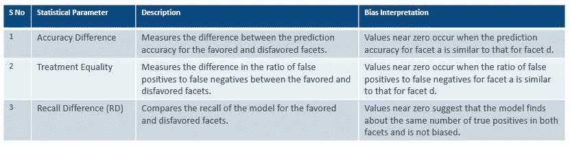

# 使用 Amazon SageMaker Clarify 的机器学习模型中的偏差检测

> 原文：<https://towardsdatascience.com/bias-detection-in-machine-learning-models-using-amazon-sagemaker-clarify-d96482692611?source=collection_archive---------10----------------------->

## 理解 AI/ML 环境中的偏差，它可能发生在 AI 生命周期的什么地方，面临的挑战，以及如何使用 SageMaker Clarify 来检测数据集和 ML 模型中的偏差

来源:https://unsplash.com/

# 1.介绍

你的 AI 解决方案公平可信吗？

如果几年前有人问这个问题，那么他/她很可能不会被重视。

传统上，人工智能/机器学习解决方案的重点一直是开发新算法和优化现有模型以提高性能准确性。

我们假设人工智能模型的决策是公平的，人们可以信任它。

然而，最近的一些实例已经挑战了人工智能模型的公平概念。

亚马逊人工智能招聘也被发现没有公平地评价候选人，并显示出对女性的偏见。([链接](https://www.reuters.com/article/us-amazon-com-jobs-automation-insight/amazon-scraps-secret-ai-recruiting-tool-that-showed-bias-against-women-idUSKCN1MK08G)

基于人工智能的预测刑事再犯风险的解决方案被发现可以预测黑人被告的更高风险值。([链接](https://www.technologyreview.com/2020/07/17/1005396/predictive-policing-algorithms-racist-dismantled-machine-learning-bias-criminal-justice/))

一种旨在预测哪些患者可能需要额外医疗护理的医疗保健风险预测算法被发现存在偏见，白人患者比黑人患者更受青睐。([链接](https://science.sciencemag.org/content/366/6464/447))

在上述所有例子中，AI solution 做出的决定都是有偏见的。模特不应该根据自己的种族、性别、宗教或社会经济背景来做决定。

重要的问题是，我们能做些什么来确保人工智能/人工智能解决方案没有偏见。朝着这个方向的第一步是意识到我们的数据和算法中存在偏见，然后采取措施减轻偏见的影响。

在这项研究中，我们重点了解人工智能和人工智能解决方案中存在的意外偏差，它在人工智能生命周期中的表现，识别偏差的挑战以及领先的云供应商为该问题提供的工具和技术。然后，我们应用 AWS SageMaker Clarify 来检测真实世界数据集和基于这些数据集训练的模型上的偏差。

# 2.AI/ML 生命周期中的偏差

**什么是 AI 偏见？**

偏见没有单一的定义，可以根据问题的背景有不同的含义。我遇到过一个这样的定义，它指出“人工智能偏见是机器学习算法输出中的异常现象。这可能是由于算法开发过程中的偏见假设或训练数据中的偏见。”

**AI 偏差的来源有哪些？**

人工智能偏见可以在许多方面表现出来。下面我们描述 AI/ML 模型中偏差的重要原因

来源:图片由作者提供，灵感来自论文《金融领域机器学习的公平标准》

**哪里出现偏差**

为了有效地识别偏见，我们需要在人工智能生命周期中寻找偏见的存在。

来源:作者图片，灵感来自[https://docs . AWS . Amazon . com/sage maker/latest/DG/clarify-fairness-and-explability . html](https://docs.aws.amazon.com/sagemaker/latest/dg/clarify-fairness-and-explainability.html)

*预训练阶段的偏差*

1.训练数据创建期间的偏差检查需要验证数据是否没有任何选择偏差，是否代表不同的细分市场；创建的数据标签和要素没有偏见

*模型训练中的偏差&验证*

2.最近，在开发公平性度量方面已经做了大量的工作。这些公平性指标包含在算法的目标函数中吗

3.我们的模型验证和测试管道是否包括对相关公平性指标的检查

*模型部署期间的偏差*

4.一个在开发和验证时没有偏差的模型，如果用于对未经训练的数据进行预测，可能会给出有偏差的结果。我们是否包括检查以确定这一点

*模型监控期间的偏差*

5.我们如何减轻模型部署后可能随着时间推移而产生的偏见的影响？是否创建了反馈循环来跟踪随时间的漂移，并将这些反馈发送给算法进行自我修复？

# 3.偏差检测的主要挑战

来源:图片来自作者，灵感来自论文《数据驱动的人工智能系统中的偏见》

大体上，我们可以将这些挑战分为四类:

1.*数据收集:*在为模型构建任务收集数据时，通常没有关于代表性不足的细分市场的足够数据。这导致了选择偏差。此外，随着众包数据的日益流行，人们需要考虑数据和标签创建者的个人偏见。

2.*敏感特征*:我们如何识别可能导致意外偏差的敏感特征。目前还没有标准的方法来帮助识别这些敏感特性，我们依靠探索性分析和领域知识来识别这些特性。

3.*多模态数据:*当前许多识别和减轻偏倚的方法都是为结构化数据建立的。但越来越多的人工智能解决方案是在包括文本/图像/视频在内的多模态数据上进行训练的。需要加强偏差检测能力以处理多模态数据。

4.*复杂特征工程*:特征工程改善了模型性能，但同时复杂特征很难追溯到起源。当我们在处理当代 NLP 和计算机视觉解决方案时，这一挑战会变得更大，在这些解决方案中，来自开源数据的预训练嵌入非常普遍。

# 4.云供应商的偏差检测产品

下面，我们确定了来自领先云供应商(如 IBM、微软、AWS)的著名偏差检测工具包。这些工具包与供应商提供的其他 AI/ML 产品很好地集成在一起。

IBM**:****AI Fairness 360 toolkit(AIF 360)**是一款开源软件工具包，可以帮助检测和消除机器学习模型中的偏见。AIF360 使人工智能开发人员和数据科学家能够轻松检查他们机器学习管道中多个点的偏差，根据他们的情况使用适当的偏差度量。它还提供了一系列最先进的偏差缓解技术，使开发人员或数据科学家能够减少任何发现的偏差。

微软 **:** **Fairlearn** 是一个开源工具包，让数据科学家和开发人员能够评估和改善他们的人工智能系统的公平性。它有两个组成部分:一个交互式可视化仪表板和不公平缓解算法。这些组件旨在帮助在公平性和模型性能之间进行权衡。

AWS **:** 亚马逊 **SageMaker Clarify** 为机器学习开发人员提供了对其训练数据和模型的更大可见性，以便他们可以识别和限制偏差并解释预测。通过检查您指定的属性，Clarify 服务有助于在数据准备期间、模型训练之后以及您部署的模型中检测潜在的偏差。它还提供了量化不同类型的可能偏差的详细报告。

# 5.使用 AWS SageMaker Clarify 进行偏差检测

为了证明偏差检测解决方案的有效性，我们将 AWS SageMaker Clarify 应用于两个数据集的偏差检测:

**i)问题陈述:**

1.  识别数据集中的偏差
2.  识别模型预测中的偏差。

**二)数据来源:**

Dataset1 是一个 Kaggle 数据，用于测量印度不同邦的不同电信运营商在 4G、3G 等电信网络中的掉话率，测量时间为一个月。

来源:取自 Kaggle 的样本数据

数据集 2 是模拟投资世界中真实数据集的合成数据。对于那些对合成数据感兴趣的人，请参考我之前关于该主题的[博客](/synthesis-of-tabular-financial-data-using-generative-algorithms-e90415f889ba)。

来源:综合数据，图片由作者提供

**iii)使用 SageMaker Clarify 进行偏差检测的解决方案:**

我们利用 SageMaker Clarify 来确定上述两个数据集的偏差。下面是数据集中偏差检测的高级解决方案。

来源:作者图片

第一步，我们识别那些可能导致偏差的属性。这些属性可能与性别、年龄、国籍等有关。

二。一旦我们确定了敏感属性，我们就确定了这些属性中代表不受欢迎群体的值的范围。

三。敏感属性和敏感值被提供给偏差算法。

四。在偏差算法中，数据集根据指定的敏感要素和值分为受欢迎组和不受欢迎组。

动词 （verb 的缩写）进行统计测试，并为偏差检测计算训练前和训练后的度量。基于对统计指标的解释，我们确定是否存在偏差。

**四)探索性分析结果:**

在偏倚检测过程之前，对两个数据集进行了数据探索。

***数据集 1***

我们观察到数据集 1 有更多来自一些优势群体的观察结果。大多数数据是针对 4G 网络测量的，几乎 80 %的观察结果是客户对掉话感到满意的。

来源:作者图片，数据集 1 的探索性分析

**数据集 2:**

数据集 2 是经过清理和归一化的合成数据。我们删除了一些可以识别最终客户的敏感属性，并使用 SMOTE(一种合成过采样方法)平衡了训练数据。

来源:作者图片，数据集 2 的探索性分析

**v)偏差检测结果**

**a)数据集 1 上的偏差检测结果**

对于数据集 1，我们使用敏感属性检查偏差的存在，如具有较少观察值的网络类型、代表不足的州以及订户较少的运营商。

对于大多数敏感特征，我们发现统计指标如 KL 散度、JS 散度(测量不同组的结果分布在熵上彼此偏离多少)是显著的，从而表明数据中存在偏倚。我们还发现了 CDDL 度量的统计显著值，该度量通过数据的子组来测量差异。

来源:作者提供的图片，来自数据集 1 的预训练指标的偏差检测结果

下表有助于解释上面分享的一些培训前指标:

来源:AWS Image，[https://docs . AWS . Amazon . com/sage maker/latest/DG/clarify-measure-data-bias . html](https://docs.aws.amazon.com/sagemaker/latest/dg/clarify-measure-data-bias.html)

基于对上述预训练指标**的解释，我们得出结论，在数据集 1 中存在显著偏差。**由于在数据集 1 中发现了明显的偏差，我们没有继续在该数据上建立模型。

**b)数据集 2 上的偏差检测结果**

对于数据集 2，我们对敏感属性进行了偏差测试，如年龄和某些标识金融产品来源的标志。

以下是我们在上述测试中获得的一些预培训指标结果。

来源:作者图片，澄清偏差检测的预训练结果

**我们在敏感特性的大多数统计指标**中没有发现明显的偏差。这可能是由于数据是合成产生的，并且我们在偏差检测之前应用了平衡和标准化技术。唯一可见的偏差是在阶层不平衡指标中，该指标衡量不同群体之间成员数量的不平衡。

由于在数据集 2 中没有发现**偏差，我们继续在数据上训练了一个分类模型，该模型预测客户选择给定产品的倾向。对生成的模型预测进行了偏差检测测试，以下是训练后指标的结果**

来源:作者图片，培训后偏差指标的结果

下表有助于解释上面分享的一些培训后指标

来源:图片 AWS，[https://docs . AWS . Amazon . com/sage maker/latest/DG/clarify-measure-post-training-bias . html](https://docs.aws.amazon.com/sagemaker/latest/dg/clarify-measure-post-training-bias.html)

**根据培训后指标的结果，我们得出结论，模型预测中不存在任何重大偏差。**

# **6。未来的挑战**

为了更广泛地采用偏置检测解决方案，仍然需要应对一些公开的挑战，如下所示:

目前，偏见和公平的概念高度依赖于应用程序，没有一个统一的方法可以应用于一个问题。

没有商定的方法来选择衡量偏差的属性。

在选择用于测量偏差的特定预训练偏差度量时缺乏标准化；这仍然受到社会、法律和其他非技术因素的指导

需要进一步研究图像/文本/视频等非结构化数据的偏差识别。

# **7。参考文献**

1) **亚马逊 SageMaker Clarify**—[https://docs . AWS . Amazon . com/SageMaker/latest/DG/Clarify-fairness-and-explability . html](https://docs.aws.amazon.com/sagemaker/latest/dg/clarify-fairness-and-explainability.html)

2)**AI Fairness 360**-https://developer . IBM . com/technologies/artificial-intelligence/projects/AI-Fairness-360/

3) **金融领域机器学习的公平性度量**—[https://pages.awscloud.com/rs/112-TZM-766/images/Fairness.Measures.for.Machine.Learning.in.Finance.pdf](https://pages.awscloud.com/rs/112-TZM-766/images/Fairness.Measures.for.Machine.Learning.in.Finance.pdf)

4)**fair learn**—[https://www . Microsoft . com/en-us/research/publication/fair learn-a-toolkit-for-assessing-and-improving-fair-in-ai/](https://www.microsoft.com/en-us/research/publication/fairlearn-a-toolkit-for-assessing-and-improving-fairness-in-ai/)

5) **偏向于艾，** [偏向于 https://research.aimultiple.com/ai-bias/](https://research.aimultiple.com/ai-bias/)

6) **数据驱动的人工智能系统中的偏差** —介绍性调查—[https://arxiv.org/pdf/2001.09762.pdf](https://arxiv.org/pdf/2001.09762.pdf)

*免责声明:本文分享的观点是我个人的观点，不一定代表富达国际或任何关联方的观点。*