# 数据集中的偏见:新冠肺炎案例研究

> 原文：<https://towardsdatascience.com/bias-in-your-datasets-covid-19-case-study-d065aa698b74?source=collection_archive---------31----------------------->

## 偏见如何通过过度拟合来影响深度学习模型的性能？让我们关注医学图像的模型可解释性。

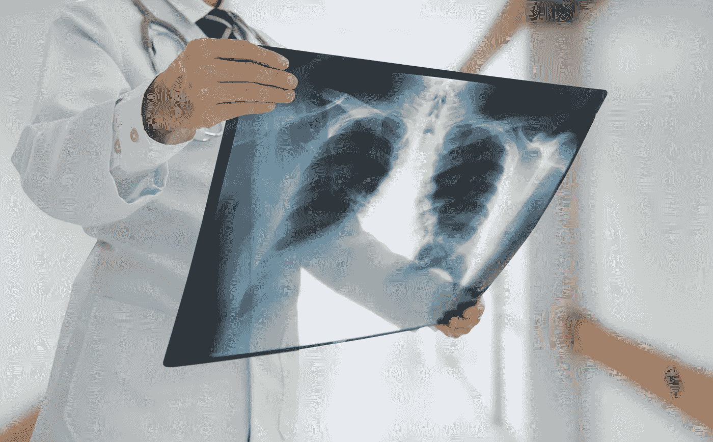

胸部 x 光打开[快门架](https://www.shutterstock.com/fr/image-photo/doctor-checking-chest-xray-film-ward-560923156)

# 动机

在过去的几年里，大量的实验显示了人工智能(AI)在医学成像服务中的兴趣，特别是在放射学中。这是由于大型数据集的可用性、计算能力的巨大进步以及新的深度学习算法的出现而成为可能。然而，由于这些人工智能算法在实验阶段和真实条件下的实现之间的性能退化，这些技术今天没有广泛普及。对这一现象的解释之一与过度拟合有关:该算法不会在新数据上广泛传播。

在这个项目中，我们想说明偏倚如何显著影响胸部 X 射线(CXR)图像分类模型的性能。除了对数据集进行简单的探索性分析，我们试图证明这些偏差的存在，并对其进行表征。

主要目的是开发一种算法，该算法将从 CXR 图像中预测患者是否患有**病毒性肺炎**、**新冠肺炎**或无病(**正常**)。在这种情况下，使用了这三类中每一类的 CXR 图像的三个数据集，即具有平衡分布的 3886 个射线照相图像:[新冠肺炎射线照相数据库](https://www.kaggle.com/tawsifurrahman/covid19-radiography-database)【1，2】。

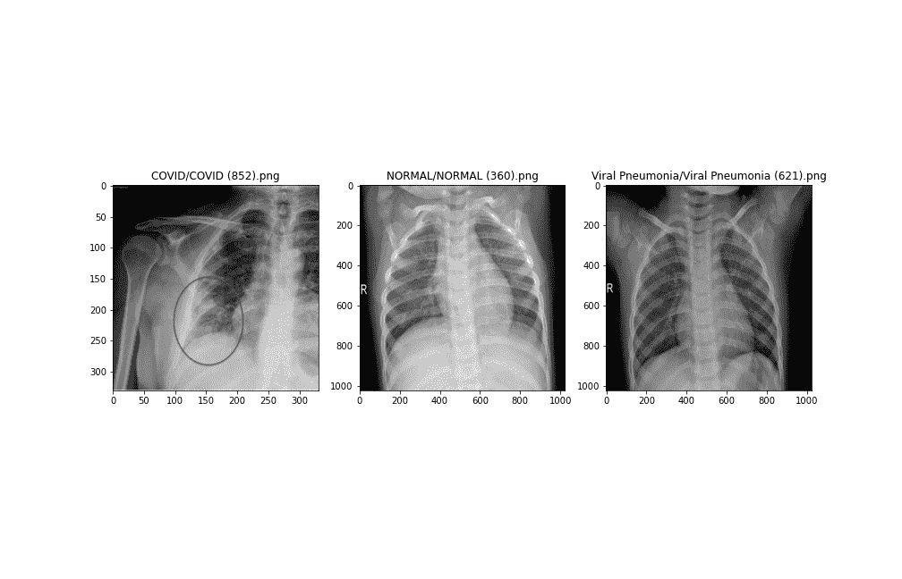

包含 3 个类别的数据集:COVID、NORMAL、PNEUMO(作者提供的图片)

作为深度学习领域的新手，我们选择了一个简单的 CNN 模型来实现(LeNet)两个卷积层。你猜怎么着，我们得到了 97%的测试准确率🎊！

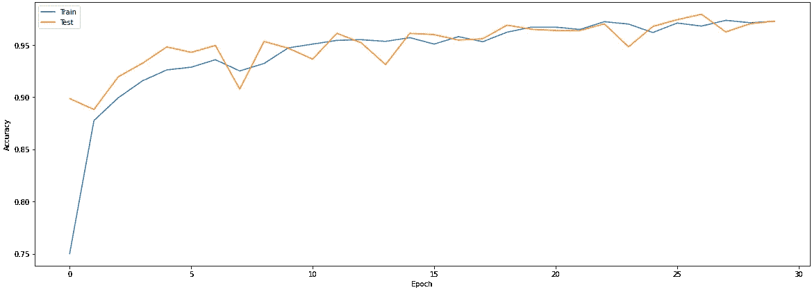

使用 30 个时期的(LeNet)模型实现 97%的准确性(图片由作者提供)

我们没有公布 2021 年诺贝尔医学奖的结果，而是问了自己以下问题:

> 用一个简单的 2 层卷积神经网络模型检测胸部疾病几乎有 97%的准确率是对的吗？

***答案是否定的*** 。这就是为什么在训练[迁移学习](https://datascientest.com/transfer-learning)模型之前，深入研究数据集的偏差并尝试纠正它们是非常重要的。

# 我们的数据集中存在哪些偏见？

第一步是试图找出图像的差异和异质性。为此，比较了正常图像和 COVID 图像之间的亮度分布。

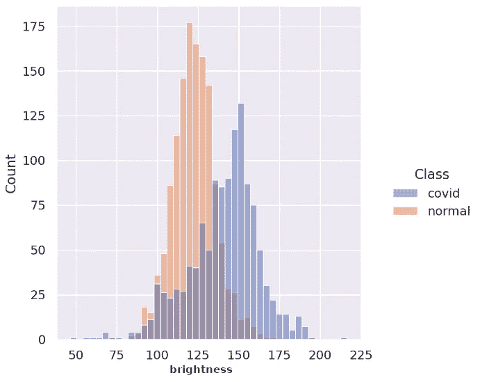

Covid/正常图像的亮度分布(图片由作者提供)

观察到亮度分布的显著差异。因此，这个全局特性足以以“正确”的方式区分这两个类别，并为我们之前注意到的高性能提供了第一个解释(LeNet)。

# 让我们进一步分析…

为了可视化数据集的偏差，我们已经开始寻找可以将 3 个类分开的局部特征。想法是将图像投影到更小的维度空间中，以观察 3 个类别的图像中的趋势。为此，图像被调整为 28x28:

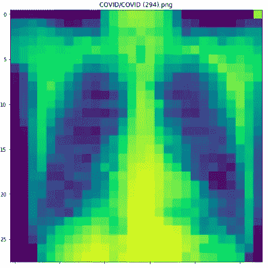

CXR 图片尺寸调整为 28x28 像素(图片由作者提供)

由于缺乏细节，理论上不可能检测出 covid 或肺炎。

t-SNE 算法[3]是一种非线性聚类方法，可以通过连续迭代在二维或三维空间中表示一组高维空间的点。然后，数据可以以点云的形式可视化:

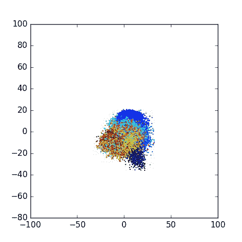

用 t-SNE 算法可视化高维数据(来自[https://zaburo-ch.github.io/images/mnist_process.gif](https://zaburo-ch.github.io/images/mnist_process.gif)

t-SNE 应用了像素强度的两个分量，数据集显示在这两个轴上。令人惊讶的是，使用无监督聚类方法和没有细节的图像，可以在 2D 投影上区分 3 个类别！

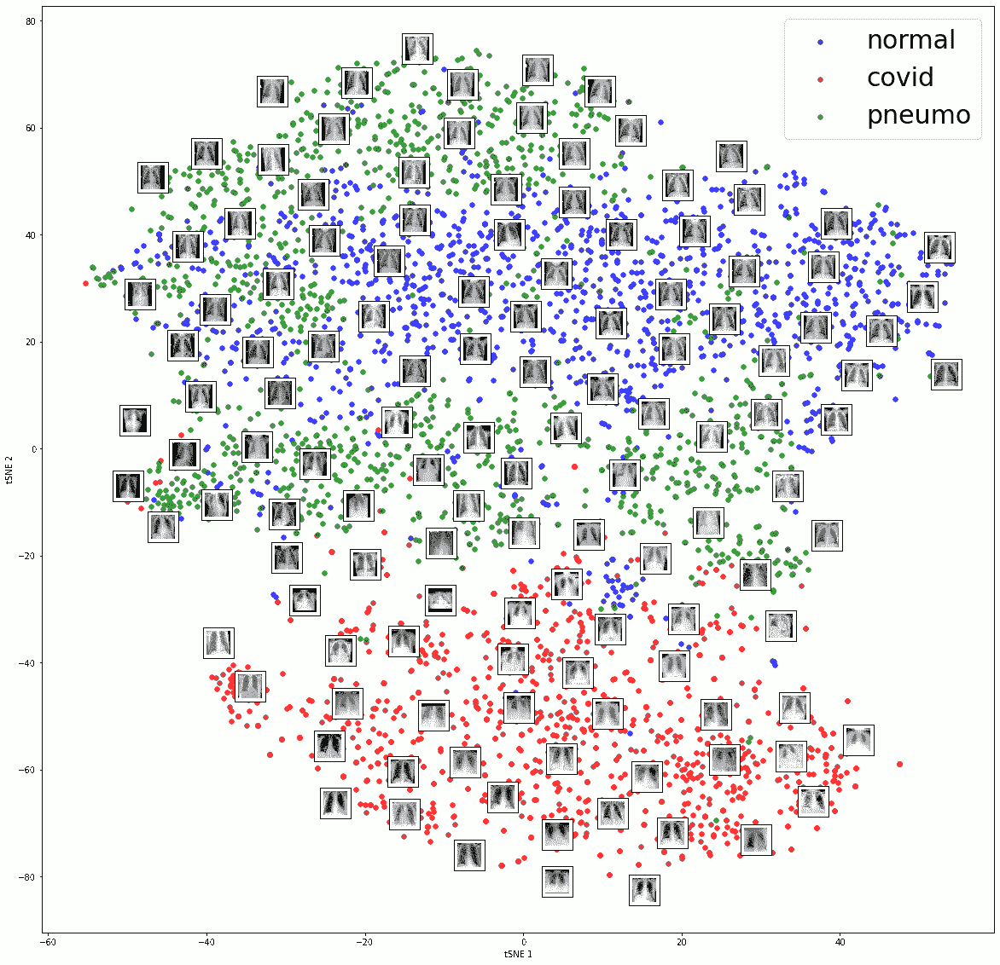

数据集的 t-SNE 可视化，然后进行 SVM 分类(图片由作者提供)

事实上，通过在对应于两个 t-SNE 轴的两个变量上应用 SVM，获得了 84%的准确度。

t-SNE 算法似乎可以从 28x28 的非细节图像中提取重要信息，使其能够进行良好的分类。为了便于解释，让我们用 PCA 做同样的事情。

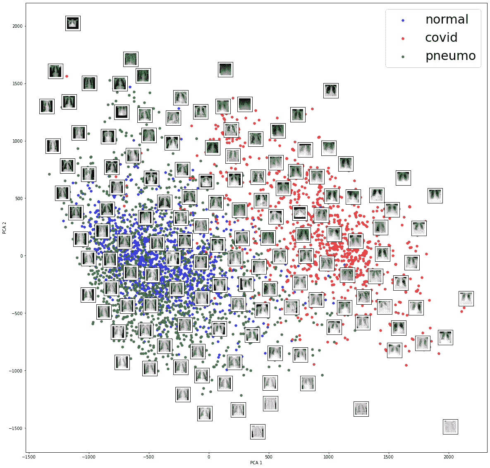

数据集的 PCA 可视化(图片由作者提供)

投影的效率低于 t-SNE 方法，但我们注意到第一模式(x 轴)可以正确地将 Covid 图像与非 Covid 图像分开。根据这一观察，我们可以显示向量“pca.components_[0]”，仅取系数的绝对值，并查看 28x28 热图:

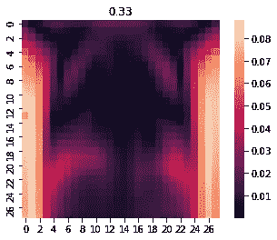

第一个 PCA 组件的热图(图片由作者提供)

从上面的投影(第一主成分)可以看出，重要的像素位于图像的左右边缘。因此，边缘的亮度使我们能够正确地将数据集中的 covid 图像与非 covid 图像分开，这在我们的研究中代表了一种真正的偏差！

# 让我们更进一步…

对神经网络最常见的批评是难以提取和以人类可读的形式解释决策过程。它们通常被视为“黑匣子”。但这还不包括最近解决这个棘手问题的出版物:

> 卷积神经网络如何决定？

Grad-CAM 是 2017 年发布的一种方法[4]，有助于解读 CNN 的结果。它通过计算从决策反向传播到最后卷积层的梯度，提供由神经网络确定的类别的激活图:

Grad-CAM 架构(图片由作者提供)

Grad-CAM 算法应用于具有 12 个随机 COVID 图像的第一个原型(LeNet ),激活图向我们显示网络主要使用图像的边缘来做出决策，而不是在肺部内部寻找有用的信息:

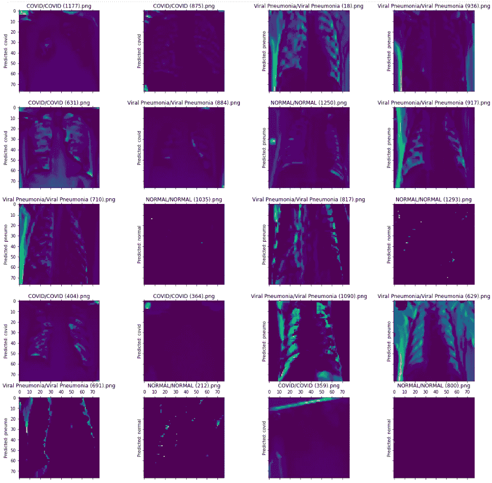

绿色/黄色区域是基于网络决策的感兴趣区域，蓝色区域是不感兴趣区域。(图片由作者提供)

# 如何纠正这些偏见？

在对数据集的偏差进行分析后，我们观察到分类算法主要基于图像边缘的像素来做出决定。因此，我们的想法是去除这些边缘，并且只关注具有分类所需信息的肺。

这需要使用一个 U-Net 神经网络，该网络是根据 CXR 图像预先训练的，是专门为肺部分割开发的。

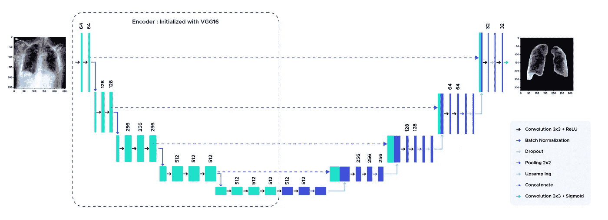

U-Net 架构(图片由作者提供)

下面的序列说明了经过所有预处理方法后的图像转换:

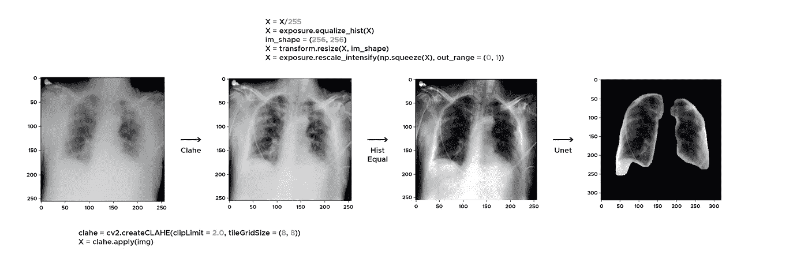

细分渠道(图片由作者提供)

分割后，图像在肺部周围以 10 像素的边缘被裁剪。

然后，均匀化和裁剪后的图像用于构建我们的新数据集，以训练和测试深度学习模型。

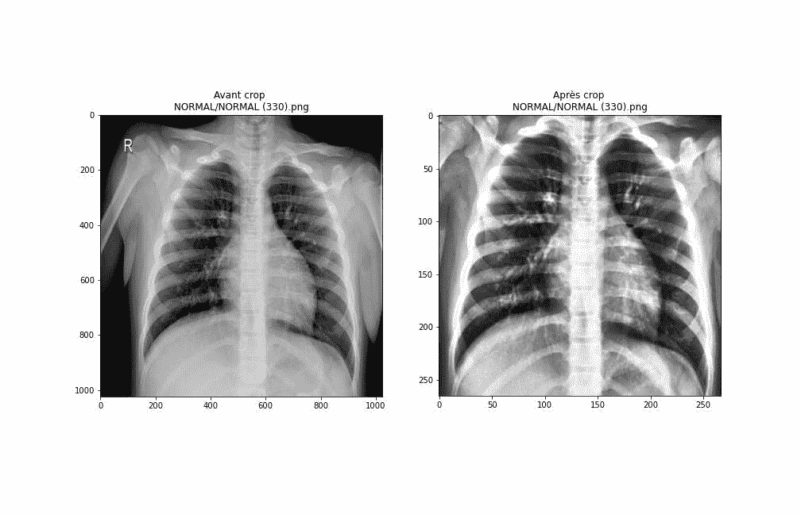

预处理前后(图片由作者提供)

# 最后，它有用吗？

通过对裁剪后的图像应用 t-SNE 方法，仍然可以在数据集中观察到偏差，因为无监督算法仍然能够分离类别😭：

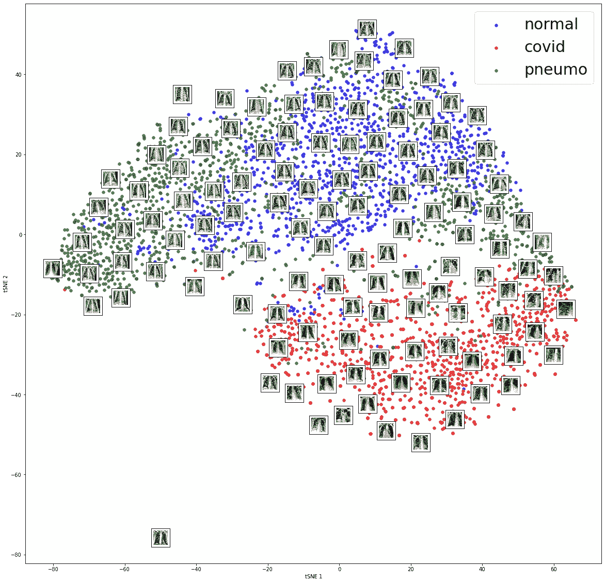

预处理数据集上的 t-SNE(图片由作者提供)

# 预处理图像的迁移学习

测试了两个迁移学习模型:DenseNet121 (121 个卷积层😮)和 VGG16 架构，两者都在庞大的 Imagenet 数据集上进行了预训练。

PS:因为 CXR 是黑白的，所以在输入之后插入了一个卷积层来给图像“上色”。

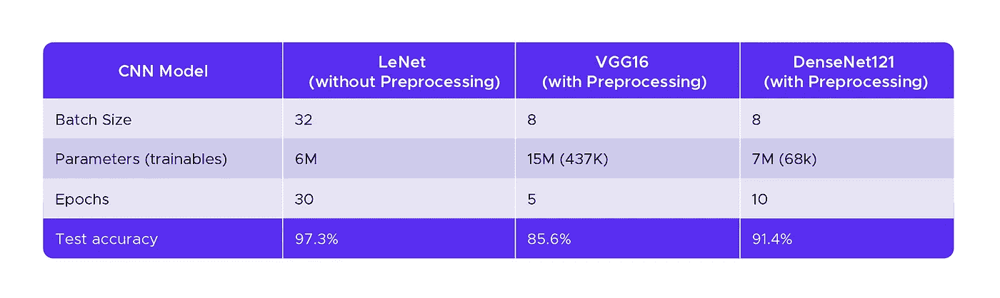

训练参数和准确度(图片由作者提供)

两个迁移学习模型的准确性低于 LeNet 的准确性，但是 Grad-CAM 激活图向我们显示，他们主要是在肺部做出决定。

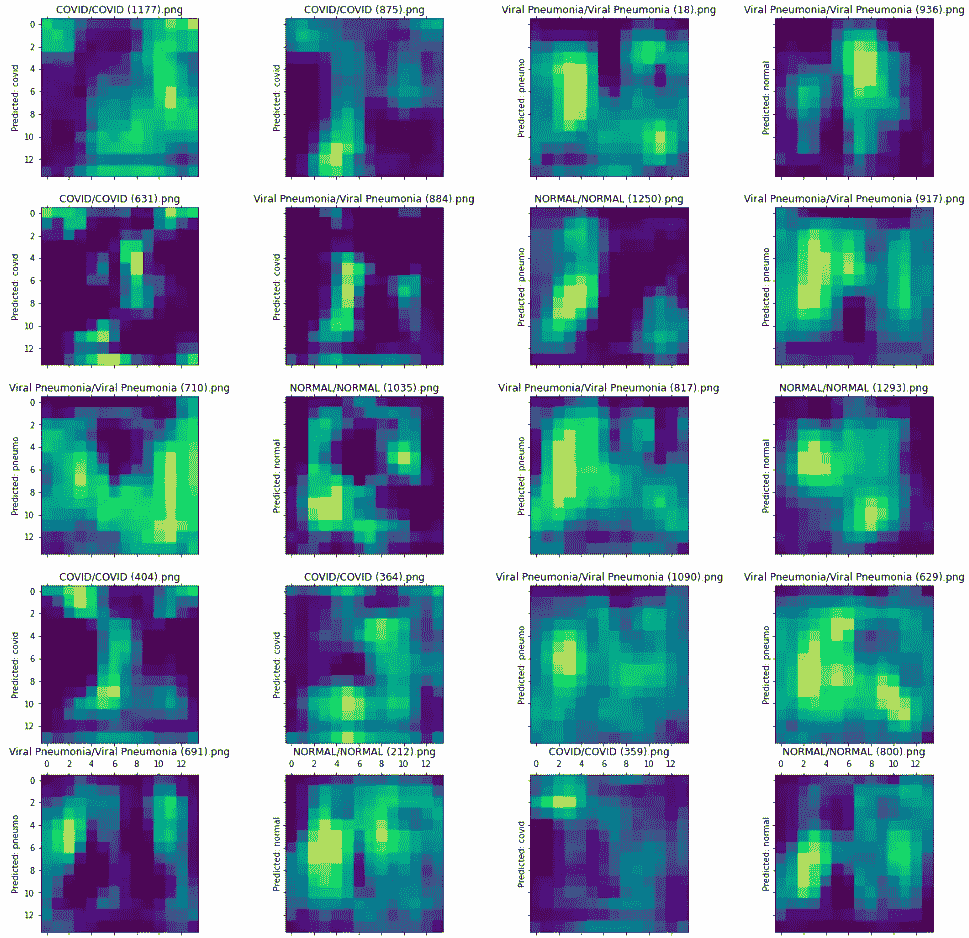

Grad-CAM 激活图应用于 VGG16，经过预处理(图片由作者提供)

您还可以使用您的图像测试这 3 个模型，并通过以下地址提供的 Streamlit 应用程序观察 Grad-CAM 激活图:[https://studio.datascientest.com/project/covid/](https://studio.datascientest.com/project/covid/)。

# 结果

*   通过 t-SNE 和 PCA 方法降维突出数据集偏差。
*   通过分割肺来均衡直方图和从图像中去除边缘的流水线的开发。
*   用(Densenet121 和 VGG16)迁移学习。
*   使用最近的 Grad-CAM 方法可视化神经网络类激活图。

# 思想

*   通过对每个类别使用不同来源的新图像，纠正预处理后仍然存在的偏差。
*   通过训练更多的 epochs 和解冻预训练网络的一些层来继续优化网络性能。
*   与放射科医生合作，评估 grad-CAM 卡在患者图像上的适用性
*   除了图像之外，将患者信息添加到模型中:症状、病史、年龄、性别、位置、日期等；以便使该模型更加稳健并忠实于实际的医学诊断。

# 道德

> 拥有出色的性能是没有意义的，你必须限制数据集中的偏差！

> ***在深度学习中，决定算法是什么的主要是数据。***

# 作者

巴蒂斯特·莫罗:[领英](https://www.linkedin.com/in/baptistemoreau/)

查迪·马斯里:[领英](https://www.linkedin.com/in/chadi-masri/)

卡莉玛·本尼亚:[领英](https://www.linkedin.com/in/karima-bennia-7108009a/)

# 参考

[1] CHOWDHURY，Muhammad EH，RAHMAN，Tawsifur，KHANDAKAR，Amith，*等*AI 能否帮助筛查病毒性和新冠肺炎肺炎？。 *IEEE Access* ，2020 年，第 8 卷，第 132665–132676 页。

[2] RAHMAN，Tawsifur，KHANDAKAR，Amith，QIBLAWEY，Yazan 等.利用胸部 X 射线图像探索图像增强技术对新冠肺炎检测的影响.生物学和医学中的计算机，2021 年，第 132 卷，第 104319 页。

[3]范德马腾，劳伦斯和辛顿，杰弗里。使用 t-SNE 可视化数据。机器学习研究杂志，2008 年，第 9 卷，第 11 期。

[4] SELVARAJU，Ramprasaath R .，COGSWELL，Michael，DAS，Abhishek，等. Grad-cam:通过基于梯度的定位从深度网络进行视觉解释.IEEE 计算机视觉国际会议论文集。2017.第 618-626 页。