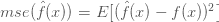
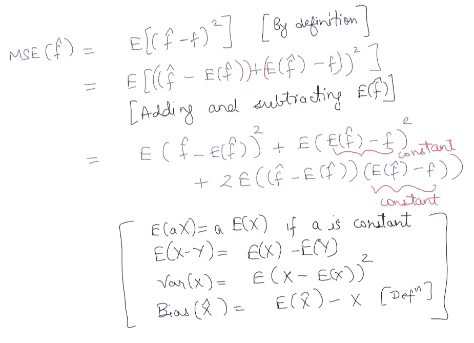
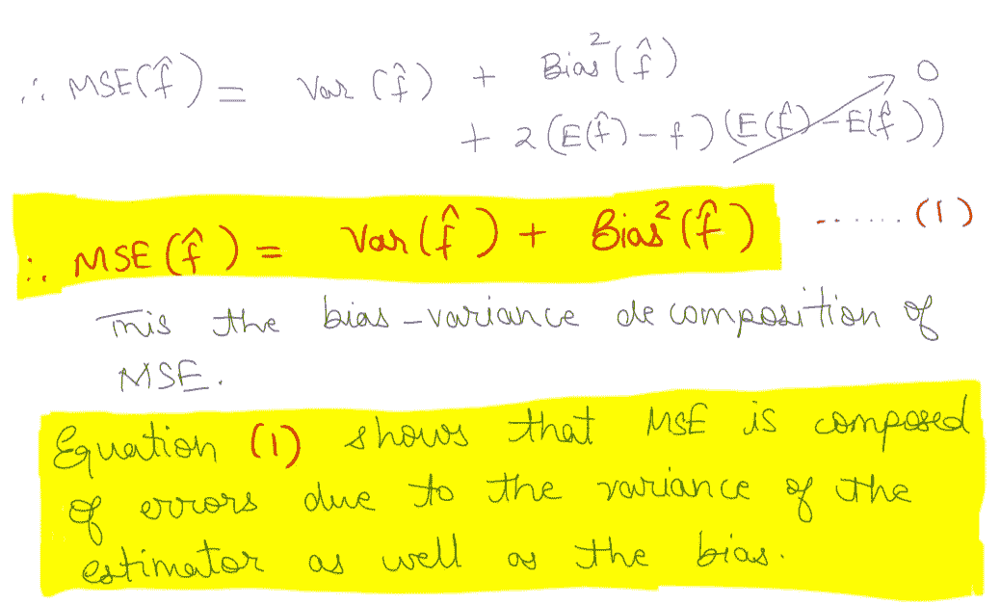
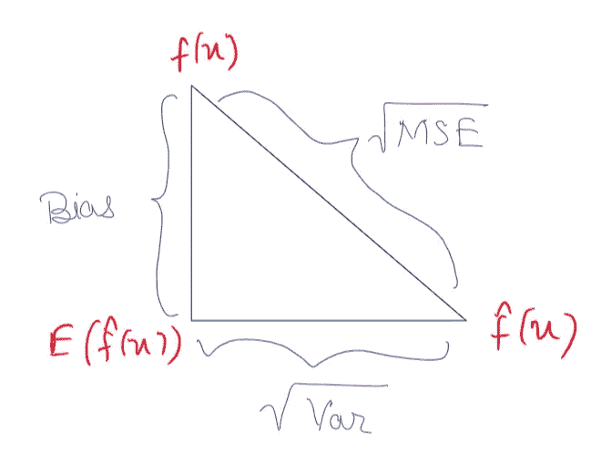
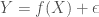
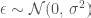
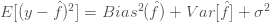
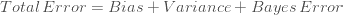
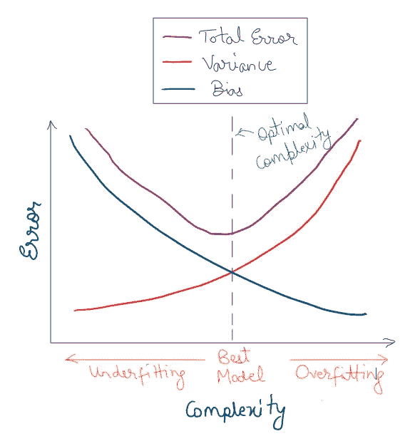
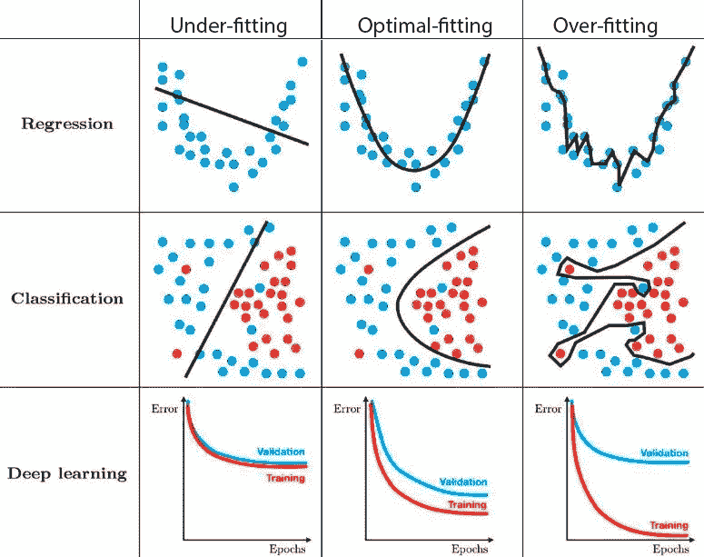

# 偏差方差权衡

> 原文：<https://towardsdatascience.com/bias-variance-trade-off-7b4987dd9795?source=collection_archive---------22----------------------->

## 了解偏差、方差和总误差与模型复杂性和过度拟合/欠拟合的关系。

马克西姆·霍普曼在 [Unsplash](https://unsplash.com?utm_source=medium&utm_medium=referral) 上的照片

偏差-方差权衡是机器/深度学习领域的每个人都应该知道的重要概念。无论您计划将模型应用到哪个应用领域，这些概念都将帮助您采取措施，潜在地解决为什么您的模型在您的训练或测试集上表现不佳的问题。

# 引言[1]

偏差方差权衡将帮助我们理解模型对训练数据过度拟合和欠拟合的概念。我们将能够判断我们的模型是否能够将误差降低到特定值以上。

在开始偏差和方差的概念之前，我们将看看 ML/DL 模型作为一种估计基础函数的方法。

机器学习以及深度学习中的一般任务是从训练数据中估计底层函数。我们将使用下面的符号。

*   **f(x)** :真函数
*   **f̂(x)** :估算函数

在经典估计理论中，在估计实际模型参数之前，需要根据数据的特征和属性对数据进行数学建模。对于信号处理，概率密度函数(pdf)是基于数学模型的未知参数定义的。例如，均值和方差是高斯过程的参数。

然而，PDF 的规格是决定一个好的估算器的关键因素。这些 pdf 不是给我们的，而是需要选择的，它不仅与问题约束一致，而且在数学上是易处理的，或者在合理的时间内实际上是可解的。每个 PDF 都有一组潜在的假设，所有的数学都是有效的。如果不满足这些条件，那么估计器就不会按预期运行。

对于 DL/ML 模型，这些参数是权重和偏差矩阵。我们没有定义 pdf 的类型，而是关注于架构类型、初始化技术、损失函数等。基于问题定义。我们试图根据训练数据找出这些矩阵的最佳可能值。我们使用基于梯度下降的优化技术来寻找逼近实际函数的最优或最佳函数。【你可以在这里了解更多:[梯度下降解开](/gradient-descent-unraveled-3274c895d12d?sk=6122cde994c08b8750d183cca5421519)

# 寻找最佳估计量

寻找最优估计量通常需要一个最优性准则。对于 DL/ML 模型，这个准则就是我们使用的损失函数。有几种损失函数可供选择。函数的选择取决于您试图解决的问题，例如分类、回归、分段等。

然而，均方误差(MSE)是最自然的一种，定义如下。

估计函数的 MSE 是估计函数与实际函数之差的平方的期望值。我不会讨论什么是期望，因为这超出了本文的范围。然而，如果你想了解更多，我推荐以下内容。

*   [https://ee.stanford.edu/~gray/sp.pdf](https://ee.stanford.edu/~gray/sp.pdf)(期望在第 4 章中有所介绍。但是你也需要前几章的概念。)
*   https://en.wikipedia.org/wiki/Expected_value

MSE 衡量估计值与真实值的平均均方偏差。它有一个漂亮的凸面，即向上弯曲，只有一个最佳值。因此它非常适合于各种各样的优化技术。

# 偏差方差分解

MSE 误差可以分解成两项，即偏差和方差。我将在下面展示和解释分解推导。为推导起见， **f(x)** 表示为 **f** ， **f̂(x)** 表示为 **f̂** 。

但在此之前，我将简要给出偏差和方差的数学定义:

## 偏见

偏差定义为:b(**f̂**)= e(**f̂)**-**f**

b( **f̂** )这里是估计量的偏差。它本质上是测量估计者的期望值和被估计参数的真实值之间的差异。【你可以在这里了解更多。[https://en.wikipedia.org/wiki/Bias_of_an_estimator](https://en.wikipedia.org/wiki/Bias_of_an_estimator#:~:text=In%20statistics%2C%20the%20bias%20(or,objective%20property%20of%20an%20estimator.)

## 差异

方差定义为:Var(f) = E[(f - E(f)) ]

随机变量的方差是随机变量与其期望值之差的平方的期望值。所以它是随机变量与其自身均值的均方偏差。高方差意味着 X 的观测值将远离平均值，反之亦然。你可以在这里阅读。[https://www.stat.auckland.ac.nz/~fewster/325/notes/ch3.pdf](https://www.stat.auckland.ac.nz/~fewster/325/notes/ch3.pdf)

现在我们用 MSE 函数的定义开始推导。接下来是对 **f̂.期望的战略性加减**然后，我们使用一些属性和定义来得到偏差和方差分量。

来源:作者

来源:作者

偏差-方差分解可以用下面的三角关系来表示。

来源:作者

偏差是估计量的期望值和实际基础函数之间的差异。方差是模型的可变性。在估计理论中，存在不同类型的估计量。然而，对于经典的估计理论，从实用的角度来看，最小均方误差估计需要被放弃，因为这个标准导致不可实现的估计。我们经常求助于最小方差无偏(MVU)估计量，它有更专业的版本，如最佳线性无偏估计量(BLUE)等。如果你对估计理论[统计信号处理基础感兴趣，第一卷:估计理论](http://users.isr.ist.utl.pt/~pjcro/temp/Fundamentals%20Of%20Statistical%20Signal%20Processing--Estimation%20Theory-Kay.pdf)是一个惊人的资源。

在深度学习的情况下，网络在没有任何明确定义的情况下作为强大的估计器工作。上面所做的所有分析也直接适用于这种情况。

现在让我们看看，如果我们给随机过程添加一些噪声，分解会是什么样子。这是因为对于我们可用的随机过程的观测值 Y，总是包含一些固有的噪声。可以这样写:

**ϵ** 具有均值和方差为零的正态分布 **σ** 。

这个假设在 MSE 分解中增加了一项。由于求导和没有噪声项几乎一样，所以我直接写尾方程。不过，如果你对推导感兴趣，请参考[这个链接。](https://en.wikipedia.org/wiki/Bias%E2%80%93variance_tradeoff#Derivation)

**σ** 项表示贝叶斯误差，可表示如下。

**贝叶斯误差是指任何分类器的最低可能误差，类似于不可约误差。它也被称为最佳误差。即使你建立了一个完美的模型，这个误差也无法消除。这是因为训练数据本身并不完美，包含了噪声。**

因此，模型的总误差是三种误差的叠加:

*   模型偏差导致的误差
*   由于模型差异造成的误差
*   不可约误差(贝叶斯误差)

# 偏差和方差对模型总误差的影响

偏差、方差和总误差之间的关系可以用下图来解释。x 轴代表我们模型的复杂性，y 轴是误差值。

来源:作者

*   我们看到，随着模型复杂性的增加，偏差继续减少，方差继续增加。这是因为如果模型变得越来越大，它表示函数的能力就会不断增加。事实上，如果你让模型足够大，它可以记住整个训练数据，导致误差为零(如果贝叶斯误差为零)。然而，拥有一个过于复杂的模型将导致较差的泛化能力，即使你将获得良好的训练性能。这叫做过度拟合。
*   另一方面，如果你的模型太简单，它会有很高的偏差和很低的方差。即使对于训练样本，误差也会非常高。如果您观察到，即使在许多个时期之后，您的模型仍然具有较差的定型数据性能，这可能意味着您的数据具有损坏的标签，或者模型不够复杂，无法逼近基础函数。这就是所谓的不适应。
*   正如我们在图中看到的，总误差继续降低，直到达到最佳复杂度点。这是仅留下贝叶斯误差并且模型具有最高性能的地方。在这一点上，我们在偏差和方差之间取得了恰当的平衡。

以下是欠拟合、最佳拟合和过拟合的一些例子。

来源:作者[5]

我们观察到，对于具有高方差的模型(最右列)，潜在的噪声也被捕获。这导致了令人敬畏的训练表现，但是可怕的测试表现。因为在这种情况下泛化能力最差。相反，对于具有高偏差的模型(最左边的列)，模型不能捕捉数据中的潜在模式。因此，该模型即使在训练数据上也表现不佳。最佳模型是最好的模型，也是最通用的模型，因为它有适当的偏差和方差。

# 结论

我们看到了偏差-方差分解是如何工作的。模型复杂性如何影响总误差、偏差和方差。我们讨论了贝叶斯误差，这是一种最小误差，它总是存在于噪声观测中。最后，我们看到过拟合、欠拟合和最佳拟合是什么样子的。在我未来的一篇文章中，我计划讨论深度学习中使用的技术，以克服过拟合/欠拟合的问题。感谢您阅读我的文章。希望你觉得有用。

# 参考

[1] [统计信号处理基础:估计理论。](http://users.isr.ist.utl.pt/~pjcro/temp/Fundamentals%20Of%20Statistical%20Signal%20Processing--Estimation%20Theory-Kay.pdf)

[2]https://en.wikipedia.org/wiki/Expected_value

[3]https://en.wikipedia.org/wiki/Bias_of_an_estimator

[https://www.stat.auckland.ac.nz/~fewster/325/notes/ch3.pdf](https://www.stat.auckland.ac.nz/~fewster/325/notes/ch3.pdf)

[5] [Pinterest 图片](https://i.pinimg.com/originals/72/e2/22/72e222c1542539754df1d914cb671bd7.png)