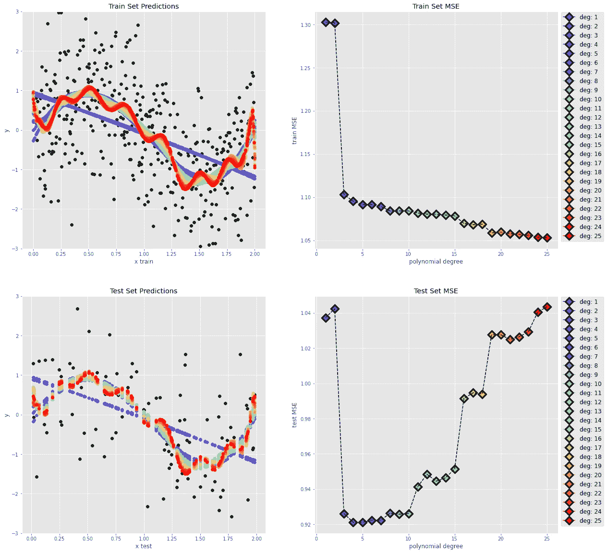

# Python 示例中的偏差-方差权衡

> 原文：<https://towardsdatascience.com/bias-variance-trade-off-with-python-example-6519d2084be4?source=collection_archive---------13----------------------->

## 根据误差估计选择最佳拟合模型

图片作者。

这篇文章旨在通过 Python 中的一个实际例子来展示*偏差-方差权衡*。

偏差-方差权衡指的是机器学习模型的两个竞争属性之间的平衡。

监督机器学习问题的目标是找到解释输入预测值(x)和观察结果(y)之间关系的数学表示(f):

其中ɛ表示数据中的噪声。

例如，我们通过选择正弦波作为两者之间的关系来创建我们的合成 x 和 y:

其中{ x ∈ R ∣ 0 < x < 2 }

We also assume a normally distributed noise, with mean=0 and variance=1.

Image by author.

In a real-world scenario, we would not know the relationship between predictors and outcome.

Given a dataset, our task is to find suitable candidate models and choose the one that better fits our information.

To this aim, we split our data in, *至少*，两个不同的集合:

1.  **训练集**:拟合模型的部分数据。
2.  **测试集**:评估模型性能的数据部分。

由于测试集包含模型以前未见过的数据，因此评估该测试集的性能可以更好地估计模型在真实世界中对未知数据的表现。

我们将原始数据分为训练集(80%)和测试集(20%)，如下所示:

图片作者。

现在，我们希望在训练集上训练一些模型，并在测试集上评估它们的性能。

特别是，我们希望最小化模型在从预测器预测结果时产生的误差；对于我们所有的观察(n)，这种误差通常是预测结果(y_predicted)和观察结果(y_observed)之间的距离的度量。

在这种情况下，我们可以使用**均方误差**，定义如下:

此外，我们可以证明这个误差可以分解为三个量的和:

任何模型，无论多好，都是数据间复杂关系的近似，因此所谓的不可约误差是不可避免的。

从公式中可以看出，一个好的模型应该将偏差和方差最小化:让我们来定义这些术语。

# **偏置**

偏差考虑了模型预测和真实结果之间的差异。

这主要取决于我们选择的解决问题的模型，以及**模型假设如何恰当地解释预测因素和结果之间的关系**。

通过观察我们的训练集图，我们注意到一个非线性趋势。如果我们选择用线性回归来模拟 x 和 y 之间的关系，模型假设显然不能解释我们的 f，我们知道 f 是非线性的。在这种情况下，我们将获得一个具有高偏差的模型。

我们可以凭经验评估模型遭受高偏差，因为它在训练集上显示高误差。或者换句话说，训练表现不佳:这种情况被称为**训练不足**。

> *偏高:*
> 
> -模型假设未能解释预测因素和结果之间的关系。
> 
> -涉及“更简单”(不太灵活)的模型，如线性回归。
> 
> -导致装配不足(列车组性能不佳)。

# **方差**

方差衡量训练集的不同选择如何影响模型参数。

当我们训练一个机器学习模型时，我们希望通过选择一个稍微不同的训练集，函数不会发生显著变化。否则，我们将获得一个在输入数据的微小变化面前无法概括的模型:这被称为**过拟合**。

直觉上，具有较少假设的模型不会遭受高方差，因为它们在训练集中的小变化面前不会改变。因此，高方差是一个影响更灵活的模型(如决策树)的问题。

由于该模型足够复杂，足以在训练集上过度拟合，我们会期望高训练性能(或低训练误差)，但也会期望差的测试性能，因为该模型需要参数的显著变化来解释数据中的小变化。

> *高方差:*
> 
> -涉及更“复杂”的模型(更灵活)，比如决策树。
> 
> -导致过度拟合(测试集性能不佳)。

这幅图概括了这个概念:

来自:Trevor Hastie、Robert Tibshirani 和 J H. Friedman，“统计学习的要素:数据挖掘、推理和预测”，纽约:Springer，2001 年。

为了在我们的示例中说明这些概念，我们在训练集上拟合多项式次数递增的多个多项式模型，然后观察 MSE 随模型复杂度增加的趋势:

图片作者。

如果我们从左到右观察多项式次数(模型复杂度)的 MSE 图，**模型**复杂度的增加导致训练误差的**减少(*较低偏差*)，但测试误差** ( *高方差*)也显著增加**。**

另一方面，我们也注意到**模型**复杂度的降低导致**较差的训练集性能** ( *高偏差*)以及**在测试集** ( *低方差*)上更好的泛化。

最佳拟合由最小化测试误差的多项式次数表示:

总之，最佳拟合显示了两个特征:它很好地拟合了训练集(低训练集误差)，并且它很好地概括了看不见的数据(低测试集误差)，因为它最小化了方差和偏差。在我们的例子中，误差较大的模型要么表现出高方差，要么表现出高偏差。因此，这个名字叫做偏差-方差权衡。