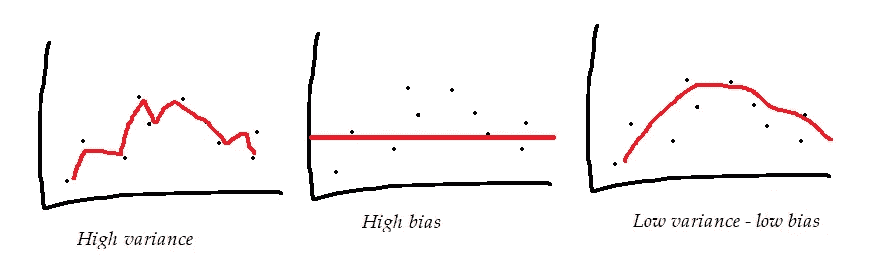
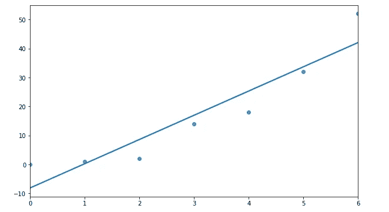
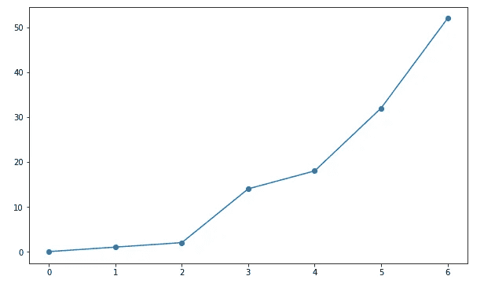
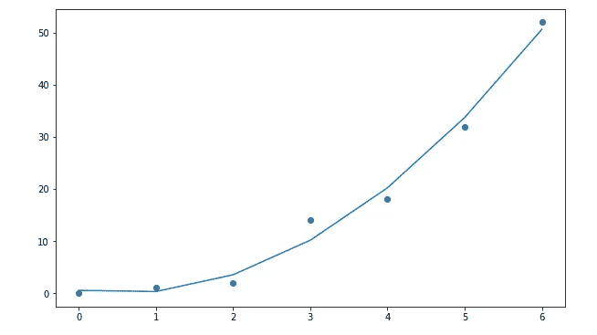

# 机器学习中的偏差-方差权衡:一种直觉

> 原文：<https://towardsdatascience.com/bias-variance-tradeoff-in-machine-learning-an-intuition-da85228c5074?source=collection_archive---------20----------------------->


由古斯塔沃·托里斯在 [Unsplash](https://unsplash.com?utm_source=medium&utm_medium=referral) 上拍摄的照片

## 在糟糕的和高度优化的模型之间进行选择

# 一般直觉

如果我们口袋里有更多的钱，我们会花得更多——这几乎是每个人都知道的事实。但人们通常不知道收入和支出之间的确切关系，也就是说，在已知收入的情况下，人们会花多少钱。

一个近似的解决方法是，通过观察人们的收入和支出，建立一个统计模型。数据越多，模型越好。然后，我们可以把这个模型应用到一个未知的地方或人群，并有合理的把握。

但该模型无法做出 100%准确的预测，因为人们的行为会随着时间和空间而变化(嗯，这就是为什么这被称为统计模型而不是确定性模型)。然而，即使这个模型不是通用的，我们也想让它具有足够的普遍性——一个**“平均** **模型”**，能够适应各种各样的变化和情况。

让我们考虑一个不同的背景，当我们真的想要为一个同质的群体建立一个模型时，他们的行为或多或少是可以预测的。在这种情况下，我们的目标是**“优于平均水平的模式”**适合特定人群。然而，我们知道，这种模式是为目标人群定制的，因此在异国环境中会失败。

我们构建的平均模型有偏差，但它具有很高的灵活性，可以在各种情况下工作，而优于平均水平的模型是定制的，偏差较小，但在接受训练的人群之外表现不佳。

现在让我们把这两个模型都发挥到极致。在一个光谱中，我们将模型简化得太多，以至于它失去了所有的预测能力；随机猜测比模型表现更好。在另一个极端，让我们基于群体中的每个个体构建模型，并对模型进行调整，使其对该群体具有高预测能力。

**那么哪款更好呢？**

取决于你想如何使用模型。一个坏的模型在任何地方都表现很差，一个普通的模型在大多数情况下表现一般，而一个微调的模型在一种情况下表现很好，但在其他情况下就不那么好了。

建立模型的目的是解释现实世界的现象，我们使用模型是因为这些现象会在空间和时间上发生变化。但是我们能建立一个适用于任何地方和任何时间点的模型吗？

答案是否定的。这就是偏差-方差权衡的概念有用的地方。

# **偏差-方差权衡**

现在让我们将这种直觉与**偏差-方差权衡**的正式概念联系起来。

在机器学习中，每个模型都被指定了许多决定模型性能的参数。一个好的模型在训练和样本外数据上都表现良好。

有些型号可以使用默认参数。但是，如果我们不调整参数，模型就有可能无法发挥最佳性能。这种情况被称为欠适配。

因此，我们调整参数以适应训练数据，然后根据测试数据评估模型性能。重复该过程，直到模型达到期望的性能。但是这种定制模型如果放归野外会有怎样的表现呢？这种高度调整的模型很可能在样本外数据中表现不佳，这就是所谓的过拟合问题。



高调优模型与差模型和一般模型(来源:作者)

适应不足和适应过度同样不好——它们不擅长做出一般的预测。因此，偏差-方差权衡无非是维持欠拟合和过拟合之间的平衡，在高方差和高偏差之间进行选择。数据科学家找到了最佳点，因此他们相信该模型在样本外数据中表现良好。

# 一个例子

现在让我们用 Python 中的一个例子来扩展直觉和偏差-方差权衡的概念。为此，我将首先导入几个库(`numpy` 和`seaborn`)并创建两个小数组——x 和 y——来演示。

```
import numpy as np
import matplotlib.pyplot as plt
import seaborn as snsx = [0, 1, 2, 3, 4, 5, 6]
y = [0, 1, 2, 14, 18, 32, 52]
```

现在让我们画出 x 和 y 变量，并拟合一条线性回归线。

```
# linear fit
sns.regplot(x,y, ci=False);
```



线性模型似乎不太适合数据，它显然看起来像一个坏模型，大多数数据点远离直线。它有很大的偏差，偏差很小。因此，显然有机会改进这一模式。

现在让我们拟合一条高次多项式线，看看模型表现如何。

```
# polynomial fit
poly_fit = np.poly1d(np.polyfit(x,y, 6))plt.plot(x, poly_fit(x), linestyle='-')
plt.scatter(x, y);
```



多神奇啊！6 次多项式完美地拟合了数据——实际上太完美了，没有误差。该模型捕捉数据中的每一点噪声。这个模型有很高的(完美的)方差，没有偏差。

这是我们想要的型号吗？

大概不会。随着多项式阶数的增加，模型的复杂性增加。不能保证该模型在其他数据上的表现也是如此。

那么更好的模型应该是什么样的呢？介于太坏和太好之间的东西？让我们尝试将多项式次数从 6 降低到 2。

```
# polynomial fit
poly_fit = np.poly1d(np.polyfit(x,y, 2))plt.plot(x, poly_fit(x), linestyle='-')
plt.scatter(x, y);
```



这个 2 次多项式模型有一些误差，当然没有 6 次模型好，但也没有简单的线性拟合差。因此，事实证明，高次多项式更适合数据，但它也使模型变得复杂。

# 有什么解决办法？

复杂模型过度拟合训练数据，但无法在测试和样本外数据中做出高质量的预测。另一方面，一个简单的模型不符合训练数据，在测试数据中也表现不佳。

因此，数据科学家的目标是找到一个平衡点来平衡权衡。但是在实践中到底是怎么做的呢？

欠拟合很容易发现，因为它显示在模型性能中。然而，过拟合很难捕捉，因为模型在误差度量方面表现良好。对于数据科学家来说，扔掉一个非常适合的模型，选择一个性能较低的模型也是非常困难的。但是有一些工具可以让这个决定变得更容易。这里有几个选项:

1)错误与复杂性的直观解释:通常，一个好的实践是通过绘图来选择模型:

*   训练数据中的误差与复杂性
*   测试数据中的误差与复杂性
*   检查两条曲线的相交处，并相应地调整参数

在回归中，偏差-方差权衡可以通过绘制均方误差(MSE)与模型复杂性的关系图来检查。在分类中，同样可以通过将错误分类的数量与复杂性相对比来检查。

2)正则化:这是一种通过在成本函数中添加小偏差来优化模型性能的技术。这种小偏差会缩小特征系数，降低其灵敏度。

如果数据集中有太多的要素，正则化*会控制*它们的影响，并降低它们的敏感度。这是通过将模型系数向零收缩来实现的。通常使用两种类型的正则化-L1(套索回归)和 L2(岭回归)，它们由超参数λ控制。

## 摘要

总结偏差-方差权衡的概念:

*   如果模型过于简单且不符合训练数据，它在实际预测中的表现也会很差。
*   根据训练数据高度调整的模型也可能表现不佳。
*   偏差-方差权衡允许检查平衡以找到合适的模型。
*   有两种方法来检查权衡——a .错误与复杂性的直观解释，b .正则化。

希望这是对机器学习中这个重要概念的有益讨论，如果你有意见，请随时写在下面，或者通过[媒体](https://mab-datasc.medium.com/)、[推特](https://twitter.com/DataEnthus)或 [LinkedIn](https://www.linkedin.com/in/mab-alam/) 与我联系。