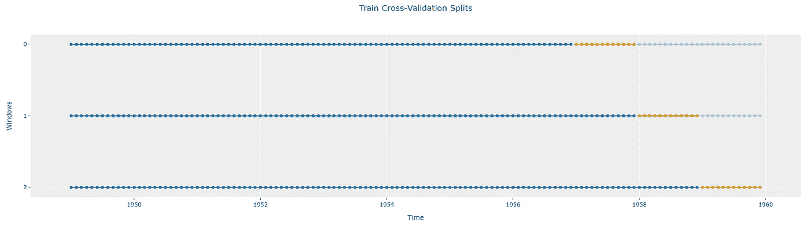
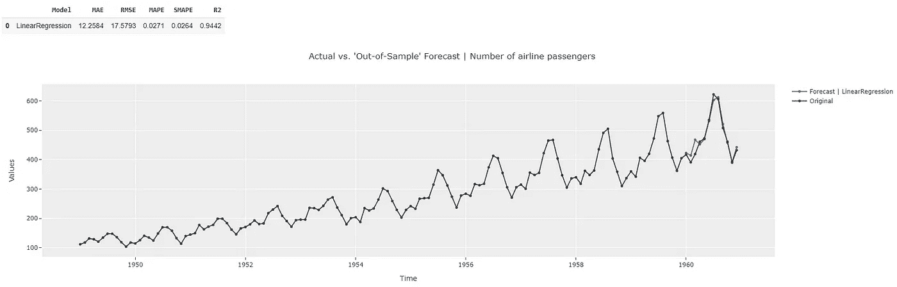

# 时间序列中的偏差-方差权衡

> 原文：<https://towardsdatascience.com/bias-variance-tradeoff-in-time-series-8434f536387a?source=collection_archive---------11----------------------->

## 使用 PyCaret 时序模块


照片由[艾萨克·史密斯](https://unsplash.com/@isaacmsmith?utm_source=medium&utm_medium=referral)在 [Unsplash](https://unsplash.com?utm_source=medium&utm_medium=referral) 拍摄

# 📚背景

在为任何机器学习问题建立模型时，我们必须注意偏差-方差权衡。具体来说，对于时间序列:

1.  偏差太大(拟合不足)意味着模型无法捕捉数据中的所有信号，因此在训练阶段(进而在预测阶段)会导致更高的误差。
2.  模型中有太多的变化(过度拟合)意味着模型不能很好地概括未知的未来数据(即，它可以很好地处理训练数据，但不能像它训练的那样预测未来数据)。

让我们看看如何用 PyCaret 来诊断这个问题。

# 🚀PyCaret 中的解决方案概述

PyCaret 中的解决方案是基于吴恩达的建议[1]。我强烈建议读者在继续阅读本文之前，先浏览一下这个短片。PyCaret 中遵循的步骤是:

1.  时间序列数据首先被分成训练和测试两部分。
2.  然后，在多个折叠中交叉验证训练分割。交叉验证误差用于在超参数调整阶段从多个模型中进行选择。
3.  在整个“训练分割”中训练具有最佳超参数的模型
4.  然后，该模型用于做出与“测试分割”中的时间点相对应的预测。然后，通过将这些“测试”预测与测试分割中的实际数据进行比较，可以报告最终的泛化误差。
5.  一旦满意，用户可以使用在前面步骤中获得的“最佳超参数”来训练整个数据集(训练+测试分割),并进行未来预测。

## 1️⃣设置

我们将使用经典的“航空公司”数据集[6]在 PyCaret 中演示这一点。本文的 Jupyter 笔记本可以在这里 找到 [**，也可以在文章末尾的“参考资料”部分找到。**](https://github.com/ngupta23/medium_articles/blob/main/time_series/pycaret/pycaret_bias_variance_tradeoff.ipynb)

```
from pycaret.datasets import get_data
from pycaret.internal.pycaret_experiment import TimeSeriesExperiment**#### Get data ----**
y = get_data(“airline”, verbose=False)**#### Setup Experiment ----**
exp = TimeSeriesExperiment()**#### Forecast Horizon = 12 months & 3 fold cross validation ----**
exp.setup(data=y, fh=12, fold=3, session_id=42)
```

## 2️⃣火车-测试分裂

为了诊断偏差-方差权衡，PyCaret 最初将时间序列数据分为训练和测试两部分。当执行这种分割时，数据的时间依赖性得以保持。测试集的长度与设置实验时指定的预测范围相同(本例中为 12)。这显示在设置摘要中。


设置摘要[图片由作者提供]

这种分割也可以使用`plot_model`功能可视化。

```
exp.plot_model(**plot="train_test_split"**)
```


时间序列训练-测试分割[图片由作者提供]

## 3️⃣交叉验证

接下来，训练分割被分解成交叉验证折叠。这样做是为了使训练不会因为一组训练数据而产生偏差。例如，如果过去 12 个月的数据是异常的(比如由于 Covid)，那么这可能会影响一个本来很好的模型的性能。另一方面，它可能会让一个糟糕的模型看起来不错。我们希望避免这种情况。因此，我们在不同的数据集上进行多次训练，并对性能进行平均。

在跨这些多个数据集(也称为“折叠”)进行训练时，再次保持时间依赖性是很重要的。可以应用许多策略，如扩展或滑动窗口策略。关于这一点的更多信息可以在[2]中找到。

在设置阶段可以控制折叠的次数。默认情况下，PyCaret 时序模块使用 3 倍。再次使用`plot_model`可以可视化训练数据中的褶皱。蓝色圆点代表用于每个文件夹中训练的时间点，橙色圆点代表用于验证训练文件夹性能的时间点。同样，橙色点的长度与预测范围(12)相同

```
exp.plot_model(**plot="cv"**)
```



训练分割中的交叉验证折叠[图片由作者提供]

## 4️⃣创建初始模型

在本文中，我们将以简化回归模型为例。关于简化回归模型的更多信息可以在[3]中找到。

```
model = exp.**create_model("lr_cds_dt")**
```


跨交叉验证折叠的基线模型性能[图片由作者提供]

性能显示在 3 个折叠上。3 次折叠的平均绝对误差(MAE)大于 30，平均绝对百分比误差(MAPE)大于 8%。根据应用的不同，这可能还不够好。

交叉验证完成后，PyCaret 将返回在整个定型拆分中定型的模型。这样做是为了让模型的泛化可以在我们之前展示的测试数据集上进行测试。

```
exp.**predict_model**(model)
exp.**plot_model**(model)
```


测试数据上的基线模型性能[图片由作者提供]

使用此模型的预测现在显示了对应于测试数据集(蓝线)的时间点的预测。还显示了这些“测试”预测的指标。这些指标比交叉验证期间获得的指标更差。由于指标一开始就很糟糕(交叉验证错误率很高)，这表明模型中的偏差很大(即模型在这一点上不能很好地捕捉数据集的趋势)。此外，测试指标比交叉验证指标差。这表明差异很大(详情请参考[1])。这在预测图中也是可见的，其显示在测试期间蓝色预测线不接近相应的黑线。

让我们看看是否可以通过调整模型的超参数来改善偏差。

## 5️⃣调整模型以提高性能

调整过程会尝试各种超参数组合，以查看哪些组合最适合模型。更多信息可在[4]和[5]中找到。一旦尝试了各种超参数组合，就会根据“折叠”的平均交叉验证误差挑选出最佳超参数。然后显示使用这些最佳超参数的交叉验证指标。

```
tuned_model = exp.**tune_model**(model)
```


跨交叉验证折叠调整模型性能[图片由作者提供]

因此，我们已经能够将交叉验证阶段的错误减少到大约<= 20 and the MAPE is < 5% by performing hyper-parameter tuning. This is much better than before and we have reduced the underfitting significantly. But now we need to ensure we are not overfitting the data. Let’s look at the performance across the test dataset again.

```
exp.**predict_model(tuned_model)**
exp.**plot_model(tuned_model)**
```



Tuned Model Performance on the Test Data [Image by Author]

The forecasts across the test dataset show better performance than the cross-validation metrics indicative of a lack of overfitting. The plot also shows a good match to the actual data points during the test period.

So this model looks good. But what we need is the ability to predict the true “unknown” future data. This can be done by finalizing the model.

## 6️⃣ Finalizing the Model to make Future Predictions

Finalizing the model takes the hyperparameters from the model (tuned_model in this case), and fits the entire dataset using these hyperparameters.

```
final_model = exp.**finalize_model(tuned_model)**
print(exp.predict_model(final_model))
exp.plot_model(final_model)
```


Future Predictions from Finalized Model [Image by Author]

And there you have it. Our best model is now able to make future predictions. Note that metrics are not displayed at this point since we do not know the actual values for the future yet.

# 🚀 Conclusion

Hopefully, this workflow example has shown why it is important to diagnose bias-variance tradeoff. For time series, this process is complicated by the fact that the temporal dependence must be maintained when performing the splits and cross-validation. Luckily, the PyCaret Time Series module makes managing this process a breeze.

That’s it for this article. If you would like to connect with me on my social channels (I post about Time Series Analysis frequently), you can find me below. Happy forecasting!

🔗 [LinkedIn](https://www.linkedin.com/in/guptanick/)

🐦[推特](https://twitter.com/guptanick13)

📘 [GitHub](https://github.com/ngupta23)

*喜欢这篇文章吗？成为* [***中员***](https://ngupta13.medium.com/membership) 继续 ***无限制学习*** *。如果您使用以下链接* ***，我将获得您一部分会员费，您无需支付额外费用*** *。*

[](https://ngupta13.medium.com/membership) [## 加入 Medium，我的推荐链接——Nikhil Gupta

### 阅读尼克希尔·古普塔(以及其他数千名媒体作家)的每一篇故事。您的会员费直接支持…

ngupta13.medium.com](https://ngupta13.medium.com/membership) 

# 📗资源

1.  [**Jupyter 笔记本**](https://github.com/ngupta23/medium_articles/blob/main/time_series/pycaret/pycaret_bias_variance_tradeoff.ipynb) 包含了本文的代码

# 📚参考

[1]吴恩达[模型选择与训练/验证/测试集](https://www.youtube.com/watch?v=MyBSkmUeIEs)。

[2][PyCaret 中时间序列交叉验证](https://github.com/pycaret/pycaret/discussions/1761)

[3] [时间序列预测的简化回归模型](https://github.com/pycaret/pycaret/discussions/1760)

[4][pyCaret 中时间序列模型的基本超参数整定](https://github.com/pycaret/pycaret/discussions/1791)

[5][pyCaret 中时间序列模型的高级超参数整定](https://github.com/pycaret/pycaret/discussions/1795)

[6]可通过 sktime python 软件包根据 BSD 3-条款许可证获得航空公司数据集。