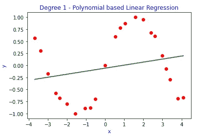
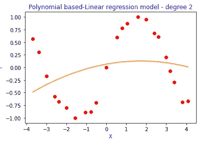
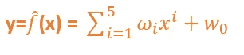
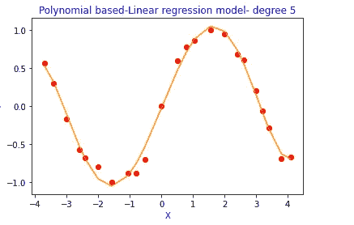
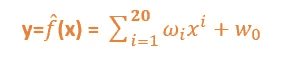
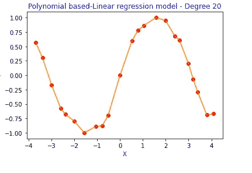
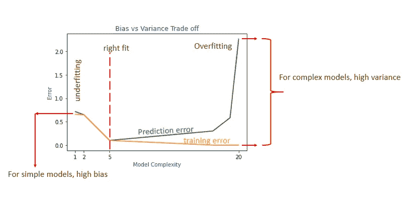
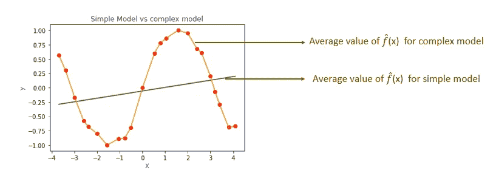

# 偏差与方差的权衡——解释清楚

> 原文：<https://towardsdatascience.com/bias-vs-variance-trade-off-clearly-explained-3becf5454b30?source=collection_archive---------22----------------------->

## 偏差与方差，过度拟合与欠拟合

照片由 [Pexels](https://www.pexels.com/photo/illustration-of-woman-analyzing-financial-line-graphic-6289065/?utm_content=attributionCopyText&utm_medium=referral&utm_source=pexels) 的 Gabby K 拍摄

# 为什么我们需要偏差-方差权衡

在机器学习中，我们收集数据，并使用训练数据建立模型。我们将该模型应用于该模型未见过的测试数据，并进行预测。我们的主要目的是减少预测误差。

我们通过最小化训练误差来建立模型，但是我们更关心测试误差/预测误差。预测误差取决于偏差和方差。

以下情况需要偏差-方差权衡。

1.  为了克服欠配合和过配合情况
2.  预测的一致性。

让我们在本文中详细了解偏差-方差权衡背后的概念。

# 模型结构

在进行偏差-方差权衡之前，让我们看看当我们增加模型复杂性时，训练误差和预测误差有什么不同。

假设，我们有这样的数据点。我们必须找到 X 和 y 之间的关系。

作者图片

X 和 Y 之间的真关系或真函数表示为 **f(X)** 。这个功能未知。

**Y=f(X)+ε**

现在，我们必须建立一个模型来描述 X 和 y 之间的关系。

**输入→模型→输出**

**学习算法:**学习算法将接受输入并返回一个描述 X 和 y 之间关系的函数。

**输入→学习算法→ f̂(X)**

示例:在线性回归中，学习算法是梯度下降法，它根据成本函数 OLS(最小二乘法)找到最佳拟合线。

假设给定一个数据集，我们把它分成训练数据和测试数据。

训练数据—使用训练数据
测试数据构建模型—使用选择的模型预测输出。

**现在，让我们考虑基于训练数据构建的 4 个模型。**

在所有的模型中，我们都在假设 y 和 x 的关系。

1.  **简单模型→1 度→ y=f̂(x) = w0 +w1x**

作者图片

在这个简单的模型中，拟合线远离数据点，因此拟合误差/训练误差会很高。

## 2.二次多项式

**y=f̂(x) = w0 +w1x + w2x**

作者图片

**3。五次多项式**

作者图片

**4。复杂模型→20 度**

作者图片

这里，在这个复杂的模型中，拟合的曲线穿过所有的数据点，因此拟合误差/训练误差将接近于零。这个模型试图将数据和噪音一起记忆下来，而不是将其一般化。因此，这个模型在看不见的测试数据/验证数据上表现不好。这种情况被称为**过度拟合。**

现在，如果我们使用这 4 个模型对验证数据进行预测，我们将得到不同的预测误差。

现在绘制训练误差和预测误差与模型复杂性(在我们的例子中，多项式的次数)的关系

作者图片

从上面的图表中，我们可以看到，随着模型复杂度的增加[1 度、2 度、5 度、20 度]，训练误差趋于减小。

但预测误差在一定程度上减小，当模型变得更复杂时，预测误差会增大。

在训练误差和预测误差之间存在权衡。在两条曲线的末端，一端有高偏差，另一端有高方差。因此，在偏差和方差之间存在一个折衷，以实现理想的模型复杂性。

作者图片

# 什么是偏差-方差权衡？

# **偏向**

假设 f(x)是真实模型，f̂(x)是模型的估计值，那么

**)= bias(f̂(x)**

偏差告诉我们期望值和真实函数之间的差异。

E[f̂(x)] →模型的期望值。

## 如何计算模型的期望值？

我们建立模型(**)**)使用相同的形式(例如。多项式次数 1)在从训练数据中抽取的不同随机样本上。然后我们将计算所有函数的期望值，记为**e[f̂(x)】**。

作者图片

在上图中，橙色拟合曲线是对从训练数据中抽取的不同随机样本执行的所有复杂模型(度数=20)的平均值。

在上图中，绿色拟合线是对从训练数据中抽取的不同随机样本执行的所有简单模型(度数=1)的平均值。

从上面的图中，我们可以看到简单模型有很高的偏差。因为平均函数离真实函数很远。

复杂模型具有较低的偏差。它们完全符合数据。

# 差异

方差告诉我们一个 f̂(x 与 E(f̂(x)).模型的期望值有多大的不同

**variance(f̂(x))= e[(f̂(x)]-e[f̂(x)]]**

因此，对于复杂的模型，方差往往更高，因为训练样本中的微小变化将导致不同的 f̂(x).因为复杂的模型，把数据点背下来。

对于简单的模型，在 f̂(x 不会有太大的区别)，如果我们稍微改变一下训练样本。简单的模型概括了这种模式。

所以，根据偏差和方差，我们可以说，

> 简单模型可能具有高偏差和低方差。
> 复杂模型可能具有低偏差和高方差

偏差和方差之间有一个权衡，因为两者都会导致误差。

# 预期预测误差

预期预测误差取决于三个误差

1.  偏见
2.  差异
3.  噪声(不可约误差)

# 预期预测误差公式

*EPE=偏差+方差+不可约误差*

使用模型 f̂(x)，我们预测不在训练数据中的新数据点(x，y)的值。

那么期望的均方误差将是

EPE =E[(y-f̂(x) ]

从 EPE 公式中，我们知道误差取决于偏差和方差。

作者图片

所以，从上面的情节来看

1.  当偏差高时，预测误差高。
2.  当方差高时，预测误差高。

*   一次多项式→训练误差和预测误差高→ **欠拟合**
*   2 次多项式→训练误差和预测误差高→拟合不足
*   5 次多项式→训练误差较小，并且训练误差和预测误差之间的差异较小。→ **最佳拟合**
*   20 次多项式→训练误差较小，预测误差很大**→过拟合**

# 关键要点

*   简单模型可能具有高偏差和低方差。
*   简单的模型会更加通用，有时会显得不够合适。
*   复杂模型可能具有高方差和低偏差。
*   复杂的模型会记住数据，并且倾向于过度拟合。
*   最佳拟合模型将具有低偏差和低方差。

感谢阅读，我希望你们都喜欢它。

*如果你喜欢看我的更多教程，就关注我的* [***中***](https://medium.com/@IndhumathyChelliah) ，[***LinkedIn***](https://www.linkedin.com/in/indhumathy-chelliah/)***，*** [***推特***](https://twitter.com/IndhuChelliah) ***。***

*点击这里成为中等会员:*[*https://indhumathychelliah.medium.com/membership*](https://indhumathychelliah.medium.com/membership)