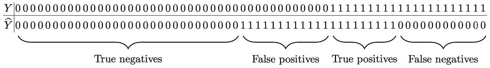
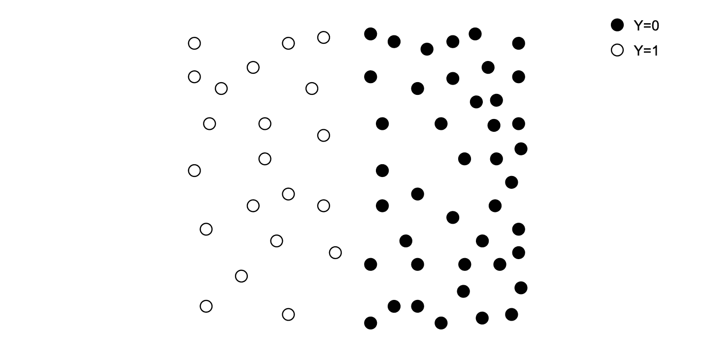
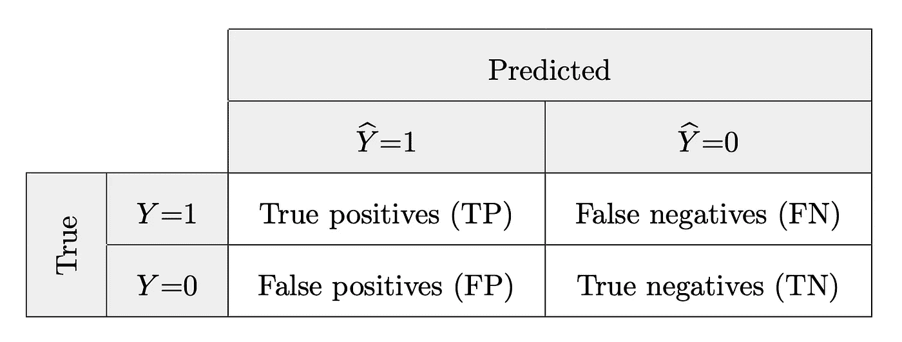
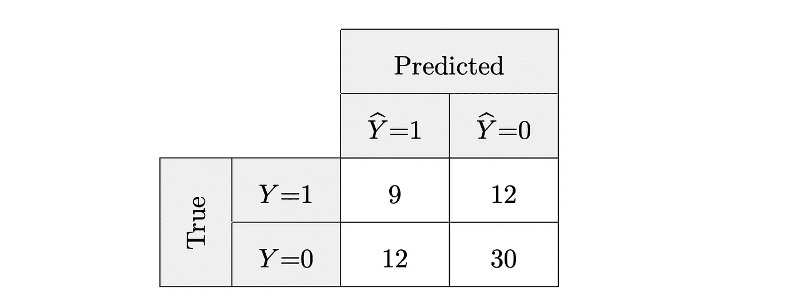
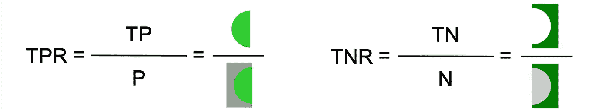
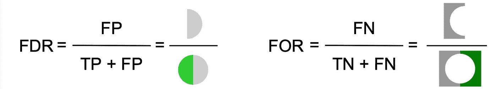
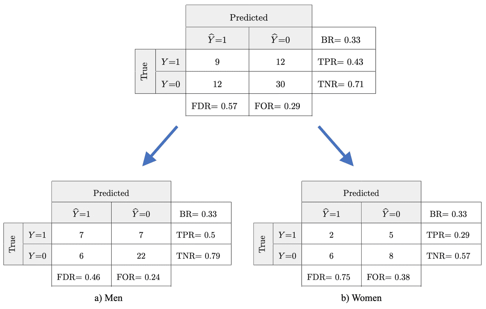

# 有偏见的 AI，引擎盖下的一个眼神

> 原文：<https://towardsdatascience.com/biased-ai-a-look-under-the-hood-5d0a41968f16?source=collection_archive---------17----------------------->

## 受偏见困扰的人工智能系统到底是怎么回事？

Pawel Czerwinski 在 [Unsplash](https://unsplash.com?utm_source=medium&utm_medium=referral) 上的照片

*人工智能(AI)中的偏见问题最近成为许多负面头条。这些报告表明，人工智能系统有可能无意中歧视敏感的子群体。例如，一家国际技术公司开发的人工智能招聘系统被发现系统性地偏向男性申请人，而不是女性申请人。在这篇文章中，我将揭示一些当人工智能变成流氓时发生的内部过程。它的灵感来自于我发表的一篇关于这个主题的研究论文。[1]*

为了更好地理解这个问题的背景，让我们首先介绍一些关于机器学习的基础知识。与传统编程相比，一个主要区别是算法决策背后的推理不是由人类明确编程的硬编码规则定义的，而是通过示例数据学习的:数千个、有时数百万个参数在没有人类干预的情况下得到优化，最终捕获数据的广义模式。由此产生的模型允许对新的、未知的数据进行高精度的预测。

# 请举例

为了说明这个概念，让我们考虑一个关于保险索赔中欺诈检测的示例场景。核实保险索赔的合法性对于防止滥用是至关重要的。然而，欺诈调查对保险公司来说是劳动密集型的。此外，对于某些类型的保险，许多索赔可能同时发生，例如，由于影响整个地区的自然灾害。另一方面，对于投保人来说，补充检查可能很烦人，例如当他们被要求回答进一步的问题或提供额外的文件时。双方都对快速决策感兴趣:客户期待及时的补救措施，而公司试图保持低成本。因此，加速这项任务的人工智能系统可能会非常有用。具体地说，它应该能够可靠地识别合法的保险索赔，以便能够迅速付款。潜在的欺诈案例也应该被可靠地检测到并标记出来，以便进一步调查。

# 你的 AI 表现如何？

现在，让我们深入研究一下技术细节。为了评估这种分类器的性能，我们通常将预测输出*ŷ*与真实输出值 *Y* 进行比较。在索赔数据中，输出值 *1* 代表欺诈索赔，而 *0* 代表合法索赔。下表包含我们正在运行的示例的示例预测。

与预测相反的真实输出等级 y*ŷ*

为了更好地说明，请在下面的动画中找到相同的结果。黑点对应于负样本( *Y* =0)，这里是实际合法声明。白点代表正样本( *Y* =1)，在本场景中为实际欺诈索赔。红色大圆圈构成了分类器的边界:圆圈外的点被预测为阴性/合法(*ŷ*= 0)，圆圈内的点被预测为阳性/欺诈(*ŷ*= 1)。不同的背景颜色进一步显示了分类器的正确位置(浅绿色和深绿色)，以及错误位置(浅灰色和深灰色)。

值得注意的是，在这个过于简单的二维例子中，画一个理想的边界来分隔黑白点，从而定义一个完美的分类器是显而易见的。然而，在高维真实世界用例中，几乎不可能获得错误率为零的完美分类器；优化始终是一个权衡的问题。

示例场景的图形表示。作者制作的动画。

# 结束混乱

所谓的“混淆矩阵”有助于可视化和计算通常用于检查 ML 模型性能的统计测量。矩阵的行代表实际的输出类，在我们的例子中是 0 或 1。这些列表示给定分类器预测的输出类。预测类别对应于实际类别的单元格包含正确分类的实例的计数。只要类别不同，分类器就会出错，数字代表分类不正确的样本。

在抽象层次上，单元格中的数字通常由下表中提供的术语来标识。

混淆矩阵模式

以运行示例中的数据为基础，相关的混淆矩阵如下所示。正如您所注意到的，给定的分类器正确预测了 9 个欺诈性声明和 30 个合法声明。然而，它也错误地预测了 12 项索赔是合法的，实际上是欺诈性的，12 项索赔是欺诈性的，实际上不是。

样本数据的混淆矩阵

重温上面的动画插图，我们进一步认识到图式中的彩色片段对应于混淆矩阵中的不同单元:真阳性(浅绿色)、假阳性(浅灰色)、真阴性(深绿色)和假阴性(深灰色)。

# 把公式拿来！

从混乱矩阵中，我们可以提取大量有趣的统计测量。首先，我们对数据集中的**实际阳性**进行计数。这个数字是真阳性和假阴性的总和，假阴性可以被视为遗漏的真阳性。同样，**实际阴性**的数量是真阴性和假阳性的总和，假阳性也可以被视为遗漏的真阴性。在我们的示例中，这些数字代表实际欺诈索赔和实际合法索赔的数量。

实际阳性(P)和实际阴性(N)

(阳性)**基本比率**，有时也称为患病率，代表实际阳性相对于整个数据集的比例。在我们的示例中，该比率描述了数据集中实际欺诈索赔的份额。

基本利率

**真阳性率**和**真阴性率**分别描述正确分类的阳性和阴性实例在其实际发生时的比例。在本例中，真实肯定率描述了被检测到的所有实际欺诈索赔的份额。真正的负比率是成功发现的实际合法索赔的份额。

真阳性率(TPR)和真阴性率(TNR)

**错误发现率**描述了所有肯定预测的误分类肯定分类的份额。因此，它是关于被错误识别或发现的积极分类实例的比例。相反，**假漏检率**描述的是假阴性预测占所有阴性预测的比例。这些实例实际上是积极的，但被忽略了——它们被错误地忽略或省略了。在我们的示例中，错误发现率是被归类为欺诈的所有索赔的错误率。虚假遗漏率描述了所有被归类为合法的索赔中实际欺诈性索赔所占的份额。

错误发现率(FDR)和错误遗漏率(FOR)

存在大量的其他统计方法[来评估 ML 模型的性能。然而，为了证明人工智能的偏见，上面介绍的指标已经足够了。](https://en.wikipedia.org/wiki/Confusion_matrix)

# 你忽略了一些东西

到目前为止，我们将数据作为一个群体进行分析，没有考虑数据中可能存在的敏感亚组。然而，由于最大似然算法的决策通常会影响人类，许多数据集包含敏感的数据子群。例如，这种分组可以按性别、种族或宗教来定义。为了分析一个分类器是否有潜在的偏差，我们增加了这个额外的维度，并根据这个敏感属性将结果分成子组。这允许调查它们之间可能的差异。任何这种偏离都可能是对一个敏感群体的歧视。

我们现在检查我们的运行中的保险欺诈检测的例子。来自训练模型的输出保持不变，但是这一次我们假设数据中有两个敏感的亚组，例如我们将数据分成男性和女性。

敏感子群的独立混淆矩阵

我们注意到，两个亚组中的基本比率(BR)是相同的，这意味着在这个例子中，男性和女性提出欺诈性(或合法)索赔的可能性相同。然而，男性的真实负比率(TNR)为 0.79，而女性为 0.57。这意味着 79%由男性提出的有效索赔被正确归类为合法，而对于女性来说，只有 57%的同类索赔是合法的。另一方面，男性的错误遗漏率为 24%，女性为 38%。因此，在我们虚构的示例场景中，女性提交的欺诈性索赔比男性提交的欺诈性索赔更有可能不被发现。

# 那又怎么样

当一个敏感亚组与另一个敏感亚组之间的统计测量值(如上所述)存在显著差异时，就出现了 AI 偏倚。换句话说，当系统对不同的群体表现不同时，它是有偏差的。由于大多数机器学习算法的黑盒性质，特别是在输出不能由人眼直接评估的应用领域(例如分数)，这个问题可能会在很长时间内不被注意。然而，由于人工智能对人们生活的影响越来越大，因此必须检测和减轻人工智能偏见，以防止对来自敏感亚群体的个人的系统性不平等待遇，并确保负责任地使用人工智能。

既然我们对有偏见的人工智能到底出了什么问题有了更清晰的认识，我们可以把注意力转向问题的根源。在我的下一篇文章中，我深化了这些偏见到底来自哪里的问题。

*非常感谢 Antoine Pietri 为撰写本文提供的宝贵支持。除非另有说明，所有图片均为作者所有。*

## 参考

[1] B. Ruf 和 M. Detyniecki，[《走向人工智能中的正确的公平》](https://arxiv.org/abs/2102.08453) (2021)，ECML/PKDD 工业追踪。