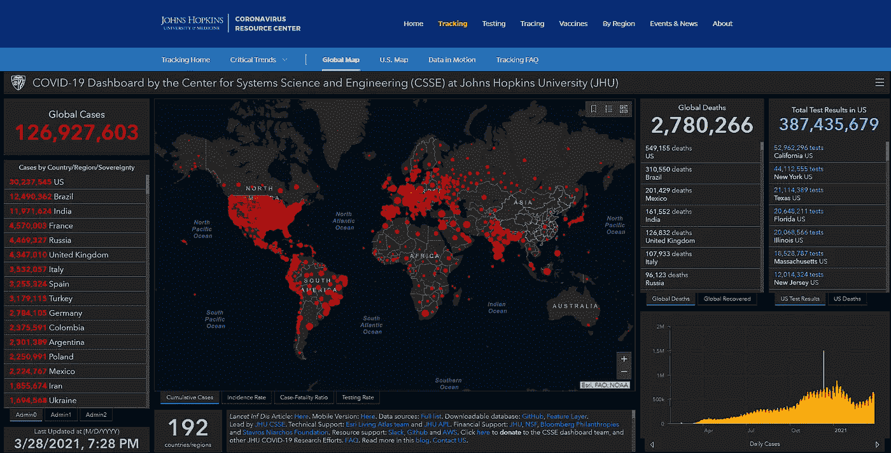
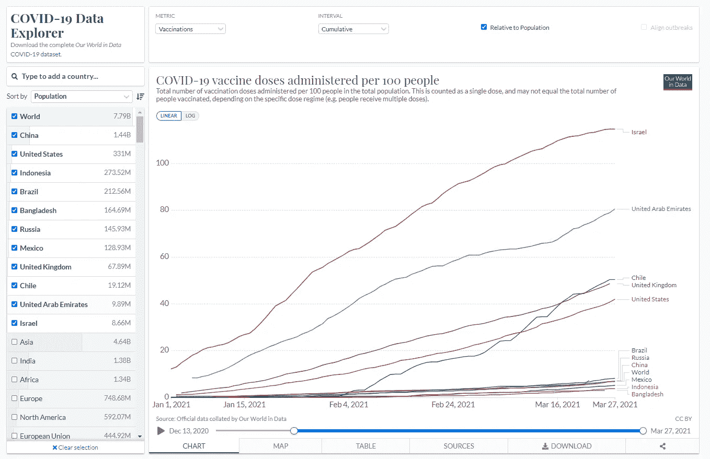
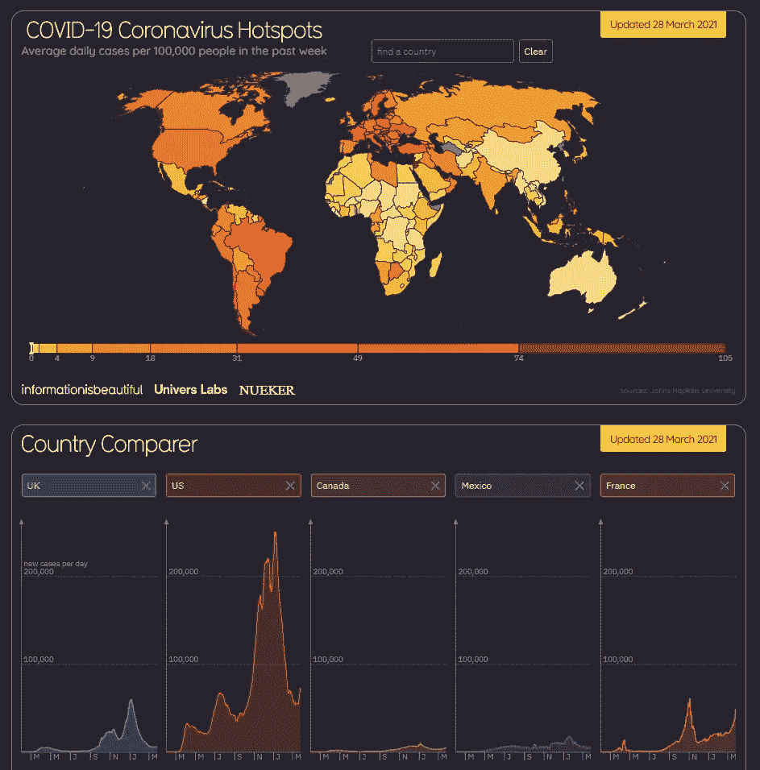

# 大数据和新冠肺炎:数据可视化的一年

> 原文：<https://towardsdatascience.com/big-data-and-covid-19-a-year-in-data-visualizations-ea78cd6c21cc?source=collection_archive---------24----------------------->

## 我们对新冠肺炎的看法是如何通过数据可视化随着时间的推移而演变的

回到未来——多洛瑞恩作者:杰森·梁

尽管新冠肺炎疫情在过去的一年中有许多负面影响，但它已经在数据可视化领域引发了**创造力的爆发。图形设计师、研究人员和其他数据爱好者已经将他们的才能用于公共利益，以清晰和解释性的图形呈现与新冠肺炎相关的大数据。从基础到互动地图，从彩色到非典型图表，你可能已经看到了数百个与新冠肺炎相关的数据可视化。**

**但是你有没有注意到他们是如何模仿我们对冠状病毒的认识的？**事实上，随着时间的推移，数据可视化已经与我们一起发展，同时帮助我们——普通人、记者、政治家——更好地了解正在发生的事情。在本文中，我想带我们回到 2020 年初，追溯数据可视化的发展以及这种新型冠状病毒的传播。你准备好出发了吗？我们走吧！

# 1.记录和跟踪新冠肺炎病例

> 从 2019 年底开始，一些网站开始收集世界各地的数据，以集中这种新型病毒的传播数据。汇总数据使研究人员、媒体和公众能够更广泛地了解情况，而不必掌握语言和从几十个国家寻找原始数据来源。

关于**记录和更新每日与新冠肺炎**相关的病例和死亡人数的先驱之一是 [Worldometer](https://www.worldometers.info/coronavirus/) 网站。除了致力于计算地球上居住人数的实时计数器，该网站还开发了一个非常可靠的冠状病毒部分。正如他们自己解释的那样，他们“从官方报告中收集数据，直接从政府的沟通渠道收集数据，或通过被认为可靠的当地媒体来源间接收集数据”。尽管 Worldometer 的设计相当基础，但它经常被世界各地的媒体和机构作为可靠的数据来源。

这些机构中包括位于马里兰州巴尔的摩的约翰霍普金斯大学。2020 年 1 月 22 日，他们首先发布了一张全球地图来追踪与新冠肺炎相关的病例和死亡。这个最初的项目后来发展成为约翰·霍普金斯冠状病毒资源中心(CRC)，该中心包括“260 多个来源”，在美国的行动范围更广(如检测、追踪、疫苗)。

[约翰·霍普金斯大学系统科学与工程中心(CSSE)的新冠肺炎仪表板](https://coronavirus.jhu.edu/map.html)

# 2.了解最新的新闻

> 数据可视化也有助于说明我们的社会必须克服的众多挑战。从谷歌趋势到疫苗，它们让我们更好地理解想法和传达关键信息。

从谷歌搜索词开始，我想起了 Alberto Cairo 在 2020 年 1 月至 4 月期间在[网站上进行的这项研究。作者调查了美国与**冠状病毒相关的顶级搜索趋势**，并从中构建了富有洞察力的可视化效果。这里有一个例子:随着时间的推移，我们看到搜索从“什么”搜索演变而来，比如“什么是疫情？”更务实的问题，如“如何使用缩放？”。](https://searchingcovid19.com/)

在试图**理解感染对我们社会的影响**时，以创新的方式可视化数据将帮助我们更好地理解一些文章的观点。例如，这篇[纽约时报的文章](https://www.nytimes.com/interactive/2020/03/15/business/economy/coronavirus-worker-risk.html)用一个相当基本的散点图制作了一篇互动文章:基于两个维度(接触疾病和与他人的身体接近)的感染概率。在这里，技术的使用支持了作者的说法，因为它迫使读者向下滚动页面继续阅读，从而积极地让读者参与进来。

随着时间的推移，关于**社会距离**的问题出现了:在他们的“[电晕模拟器](https://www.washingtonpost.com/graphics/2020/world/corona-simulator/)中，来自华盛顿邮报的作者通过动画展示了各种社会距离措施(从“免费开放”到强制隔离)如何有助于平坦化感染曲线。在那个时代，社交距离对我们大多数人来说都是一个新概念，如此强大的可视化功能清楚地表明，这是摆脱疫情的一种方式。

最近发布了新的“数据追踪器”来追踪世界各地新冠肺炎疫苗接种的进展。来自[我们的世界数据](https://ourworldindata.org/covid-vaccinations)的图表就是一个很好的例子。它们是基于开源数据(查看他们的 GitHub 知识库[这里](https://github.com/owid/covid-19-data/tree/master/public/data/vaccinations))并以图表形式展示了世界上每天服用的新冠肺炎疫苗剂量。对我来说，这个网站的优势在于你可以轻松地在不同的指标(病例、死亡、检测、疫苗接种)和不同类型的图表(线图、世界地图、数据表)之间切换，以便可视化你正在精确寻找的内容。

新冠肺炎数据浏览器关于疫苗接种的数据[我们的世界](https://ourworldindata.org/covid-vaccinations)

# 3.退一步看全局

> 在后新冠肺炎时代，数据可视化的另一个主要方面是透视。尽管有悲惨的消息，数据可视化也可以帮助我们把每天的数字放到一个更广阔的背景中。

当我们正在经历有生以来第一次全球性的疫情时，我们可能会忘记人类历史上曾经发生过**次大流行病**——而且它们造成的损失要大得多。这就是为什么我觉得这张由 Data Visualist 制作的信息图特别发人深省。当然，目前的疫情是致命和令人担忧的，但时至今日，艾滋病毒已经造成更多的死亡，而我们还没有任何疫苗来对抗它。

最终，通过**将多个数据可视化汇总到仪表板**中，可以更好地理解疫情。这就是一些网站所做的，将所有与新冠肺炎相关的当前数据集中在一个地方。尽管在图表的选择和呈现方式上存在潜在的偏见，但这些仪表板允许读者从许多数据源中获得最多的信息。与已经格式化的文章相比，它们为读者解释留下了更多的空间，因此每个人都可以从显示的许多图表中得出自己的结论。

新冠肺炎数据仪表盘由[信息漂亮](https://informationisbeautiful.net/visualizations/covid-19-coronavirus-infographic-datapack/)

# 结论:回归基础

你喜欢这趟旅程吗？我刚刚向你们展示了一年多来与新冠肺炎·疫情相关的数据可视化。现在，当你遇到一个新的数据可视化时，我想给你一些建议，特别是如果它与冠状病毒这样的“热门话题”有关。

在我看来，在考虑任何数据可视化时，有两个主要问题需要考虑，无论它是否与新冠肺炎有关:

*   **数据来源**:使用的数据来自哪里？来源可靠吗(政府、知名机构……)？
*   **图表真实性**:你是否发现了作者可能用来误导读者的潜在偏见？

一旦你确定这两个条件都令人满意地满足，享受数据即！

# 信用

*   图一:[梁朝伟在 Unsplash](https://unsplash.com/photos/pSLIG2E_gaw) 上。[在知识共享 CC0 许可下](https://unsplash.com/license)。
*   图片 2: [约翰·霍普金斯大学系统科学与工程中心(CSSE)的新冠肺炎仪表板](https://coronavirus.jhu.edu/map.html)。[版权所有 2020，约翰霍普金斯大学，保留所有权利](https://coronavirus.jhu.edu/map-faq)。
*   图片 3: [新冠肺炎数据探索者通过我们的世界在数据](https://ourworldindata.org/covid-vaccinations)。[许可知识共享协议](https://ourworldindata.org/about#legal)。
*   图 4:由[信息美丽](https://informationisbeautiful.net/visualizations/covid-19-coronavirus-infographic-datapack/)团队制作:[大卫·麦坎德斯](http://davidmccandless.com/)，[斯蒂芬妮·斯塔林博士](https://www.linkedin.com/in/stephanie-starling-phd-ba52526a/)，[奥米德·卡尚](https://omid.uk/)，法比奥·贝尔加玛斯基 [Univers Labs](https://universlabs.co.uk/) 。

你喜欢读这篇文章吗？ [*成为*](https://marie-lefevre.medium.com/membership) *的一员，加入一个不断成长的充满好奇心的社区吧！*