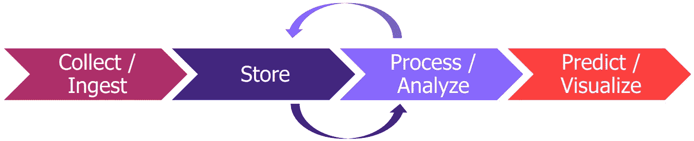
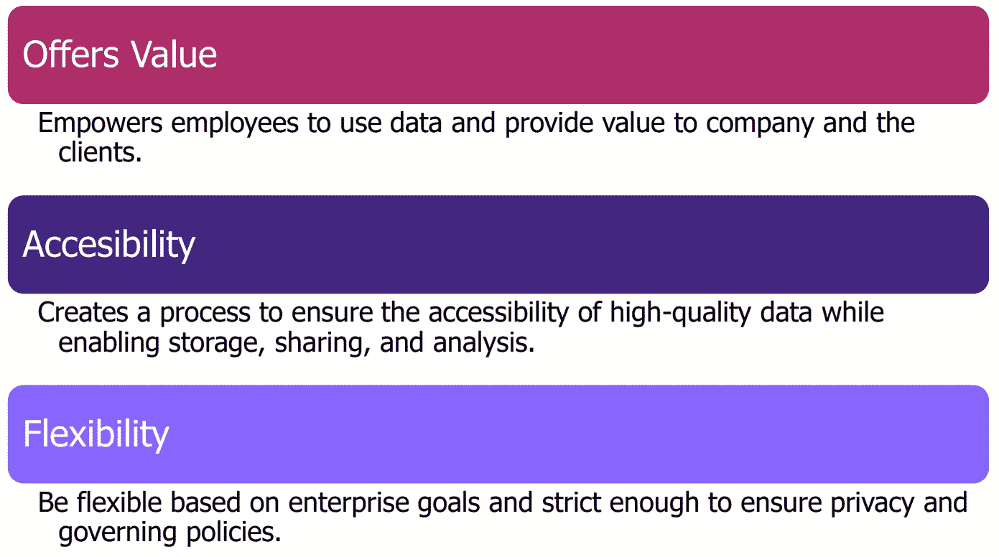
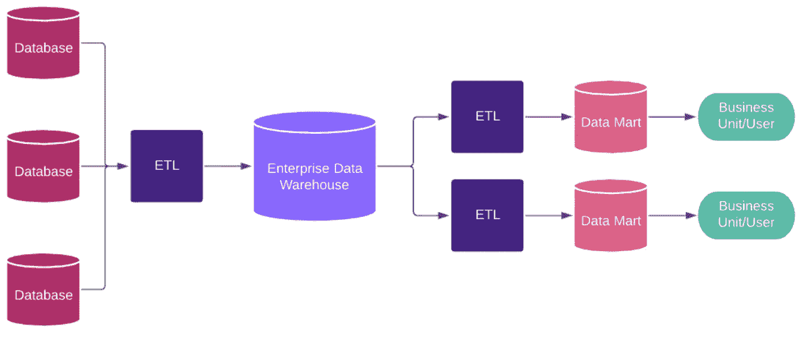
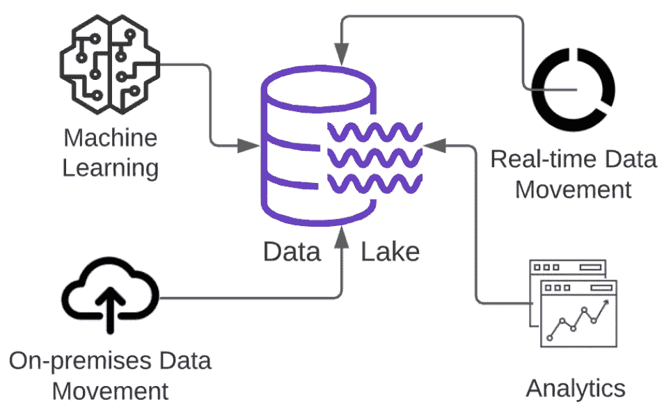

# 大数据管理:数据存储库策略和数据仓库

> 原文：<https://towardsdatascience.com/big-data-management-data-repository-strategies-and-data-warehouses-bfa9b45c95de?source=collection_archive---------19----------------------->

# 介绍

管理大量结构化和非结构化数据对于每个需要系统化组织和治理以确保其数据高质量并适合分析和商业智能应用的公司的成功至关重要。虽然大数据的关键方面可以概括为流行的 3 个 v，即容量、速度和多样性，但在选择存储和转换数据所需的适当流程时，每个公司还需要问其他一些关键问题。

## 大数据方面

> **Volume:** 传入的数据流有多大，需要多大的存储量？
> 
> **速度:**指的是数据生成的速度和需要访问的速度。
> 
> **品种:**数据需要以什么格式存储？结构化(如表格)或非结构化(如文本、图像等)。
> 
> **值:**存储所有数据得出什么值？
> 
> **准确性:**数据来源、类型及其处理的可信度如何？
> 
> **粘度:**数据如何在流中流动，阻力和可加工性如何？
> 
> **病毒式:**数据在网络上分发的能力及其在用户间的分散率

# 大数据管理

由于企业数据存储呈指数级增长，管理大数据已成为一项越来越具有挑战性的任务。跨行业研究表明，大多数组织在决策分析中只使用了一半的结构化数据和近 1%的非结构化数据。许多组织倾向于保留尽可能多的数据，因为没有办法预测哪些数据源在未来会有价值。[1]

他们经常会发现过时的数据或与其他系统中的其他副本发生冲突，并且由于有如此多的数据源可用，实施高效的数据管理技术可能是一项繁琐的任务。数据分散可能会导致跨多个位置维护记录，并带来重复的风险，从而导致管理成本增加和安全策略不一致。

没有数据管理战略会导致缺乏信任、错失良机、客户满意度下降，以及违规和监管处罚。由于这些原因，组织倾向于通过投资能够帮助他们满足需求的策略和大数据工具来实施数据管理原则。

大数据管理可以被视为一个宽泛的术语，包括数据清理、集成、迁移、准备、丰富、分析、质量、管理、报告、治理和规划。根据企业的需求，每个流程的关注点和资源分配可能会有很大的不同。

图一。从数据收集到预测分析

# 数据存储策略

通过将数据集中在一个引用元数据和单个逻辑名称空间的系统中，数据存储库可以成为解决数据管理挑战的一个很好的解决方案。它们用于将特定的数据群体隔离在一个或多个数据存储实体中，以挖掘数据用于业务洞察、报告需求或机器学习。这个术语经常与数据仓库或数据集市一起使用，它的主要好处是由于数据被隔离，使得报告或分析更容易。

一个有效的数据存储库策略需要一个一致的策略来统一、管理、评估和部署大量的数据资源。这将增强数据管理功能，最终提高分析和查询性能。

定义数据存储库策略的第一步是阐明组织数据目标的主要目的，这将指导他们的数据管理方法。健壮的数据策略包含几个要素。这包括创建一个覆盖整个企业的数据架构，定义业务需求，并确定数据质量和集成的优先级。此外，它还通过定义数据保留标准以及降低风险和复杂性来实现问责制。[2]

在实施数据策略时，公司面临着多种方法，他们的决策是基于组织的可用资源或以前的经验。虽然有些策略有助于组织确保管理数据隐私和通过内部来源分发的数据的完整性的指导原则，但其他策略可能更侧重于通过创建快速框架来支持业务决策，这些框架提供实时快速洞察、预测性建模和交互式仪表板。虽然大多数公司需要这两种方法的平衡，并选择灵活性来取得成功，但有些公司会更加强调一种具有适当权衡的方法。

图二。决定数据策略时的关键因素

# 数据仓库

## 企业数据仓库

企业数据仓库(EDW)可以概括为一个面向主题的数据库或一组数据库，这些数据库将来自多个来源和应用程序的数据收集到一个集中的来源中，以便进行分析和报告。它存储和管理企业的所有历史业务数据。[3]组织、转换和聚合数据源的各种输入可以为人工智能(AI)就绪数据结构节省宝贵的时间和管理成本。

这是提取、转换、加载(ETL)或 ELT 方法经常使用的地方，Hadoop 或 Apache Spark 等大数据分布式框架帮助组织进行繁重的数据清理和转换。

图 3。数据仓库概述

数据仓库和标准操作数据库之间的关键区别在于，后者经过优化以保持实例中的精确准确性，并跟踪快速数据更新，而数据仓库则提供随时间变化的大范围数据视图。尽管数据仓库是管理大数据的常用工具，但当组织需要扩展它们时，它们会变得非常昂贵，并且在处理非结构化或复杂的数据格式时，它们的性能也不好。

EDWs 的架构复杂性为组织提供了许多好处:

1.  将多个数据源集成到单个数据库中，用于单个查询
2.  维护数据历史，提高数据质量，保持数据一致性
3.  为整个企业的多源系统提供一个集中视图
4.  重构数据以提高复杂查询的性能

## 数据集市

虽然数据仓库(DW)可以有效地处理大型数据集，但实时人工智能和针对不同业务运营子集的数据分析需要使用数据集市(DM)。DMs 可以被认为是 DWs 的缩小版本，具有更有限的范围或它们的逻辑子集，旨在满足不同业务单位或部门的特定最终用户群的信息需求，并且通常为重点内容或定制的决策支持提供聚合数据。它们有相互依赖和相互独立的格式，前者从 EDW 中填充，后者直接从操作数据存储(ODS)中获取。

DM 减少了来自组织中其他数据源的查询、转换和繁重网络使用的负载，并为最终用户提供了一个定制的 DM，使他们能够进行更多的访问和控制。DMS 还会带来一些固有的问题，如信息孤岛和限制用户访问。

## 数据湖

数据湖(DL)是另一种类型的数据存储库，它的一个关键区别是数据以原始格式存储，没有任何转换。数据可以是结构化的，也可以是非结构化的，这使得 DLs 适用于批量数据类型，如服务器日志、点击流、社交媒体或传感器数据。

数据只是存储在存储库中，不知道将进行什么类型的分析，也不知道它是否会在分析中使用。当数据需要用于业务洞察时，这反过来将需要大量的预处理。

图 4。数据湖的简单表示

由于 DLs 更具开源性和未定义的结构，因此其存储成本更低，并且可以建立在具有内部管理的组织数据中心或不同供应商(如 Amazon、Microsoft 或 Google)的云服务中。

虽然数据仓库的目标是已经进行了转型的决策者，但数据仓库需要专业的数据科学家来预处理和分析数据，他们可以改善客户交互、R&D 创新并提高运营效率。

## 交易型商店

事务数据存储(TS)针对基于行的操作进行了优化，例如在维护数据完整性的同时读写单个记录。然而，它们并不是专门为分析而构建的，但由于它们在生产环境中已存在多年，因此可以用于分析查询以及低延迟信息监控。

TSs 是 ACID(原子性、一致性、隔离性、持久性)兼容的，这意味着尽管有错误，它们也能保证数据的有效性，并确保数据不会因为某种故障而损坏。这对于需要高度数据完整性的业务用例至关重要，例如银行交易。

TSs 设计为在生产系统中运行，由于其基于行的低延迟特性，可以运行需要与主数据库几乎同步的操作或查询。虽然 dw 由于其基于列的特性而被优化用于读取数据，但是 ts 在写入时性能更好。对于拥有少量数据的公司来说，这可能不是一个大问题，但随着可用数据的增加，这可能会在选择正确的数据策略方面产生影响。

## 操作数据存储

操作数据存储(ODS)是减轻从 DWs 中查询最新数据的挑战的另一种方法，可以被视为提供查询功能的临时区域。ODS 可以提供更接近实时的细粒度非聚合数据，因为它是在繁重的转换和加载操作之前接收的，从而减轻了事务性系统的负担。它们用于运营报告，并作为 EDWs 的补充元素。

它们的一般目的是通过数据清理、解决冗余和建立业务规则，将不同来源的数据集成到一个单一的结构中。ODS 可以是 EDW 的关键组成部分，并且由于其多用途结构，可以实现事务和决策支持处理。存储在 ODS 中的数据是面向事务的，与 DWs 相比，其大小更小。[5]

# 结论

大数据管理是每个公司的必需品。它提高了他们对客户的理解和开发新产品的创新能力，同时由于对每个部门的大量数据进行分析，使他们能够做出重大的财务和业务决策。建立数据策略需要定义问题并了解每个公司的业务需求，以改进他们的数据系统和源管理。

尽管并非所有公司都需要在一开始就开始担心大数据管理，但当传统数据库表现不够好，无法提供大数据存储库的优势时，就需要开始考虑这一点。当竞争优势、创新、收入增长和客户获取的各个方面都达到稳定水平时，这一点通常会变得很明显。

值得一提的是，每个数据存储库都有自己的缺点。一些公司通过存储所有数据来使用数据湖，而没有有效地利用每个部门的信息提取，这使他们的业务战略计划失败。将没有任何目标的数据转储到数据仓库将导致高管理成本，失去对存储内容的跟踪，并且不能利用新建立的资源。

在大多数情况下，数据策略可能不会在一夜之间提供商业价值，而是需要通过反馈和评估在每个阶段逐步改进。数据存储库并不能保证公司数据策略的成功；然而，它确实减少了常见故障场景的可能性、从数据中提取价值所花费的过多成本和时间，并为公司的未来创新指明了方向。

# 参考

1.  你的数据策略是什么？关键是攻防平衡。莱安德罗·达勒姆勒和托马斯·达文波特(2017 年 5 月至 6 月)
2.  让您的数据仓库井然有序，麦肯锡公司 2018
3.  企业数据仓库:概念、架构和组件，2019
4.  “大数据质量日益重要”。数据圆桌会议。检索于 2020 年 6 月 1 日。
5.  构建操作数据存储(第 2 版。)，英蒙，威廉 1999