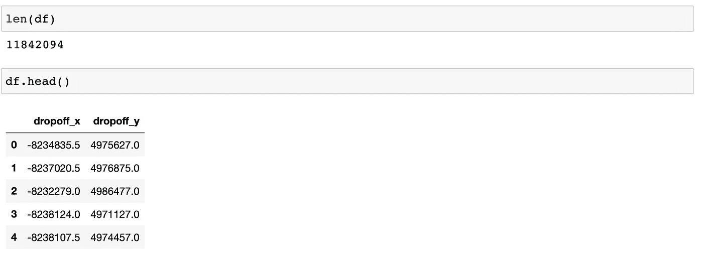
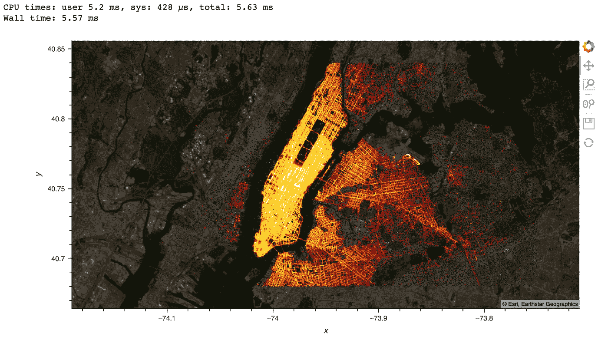
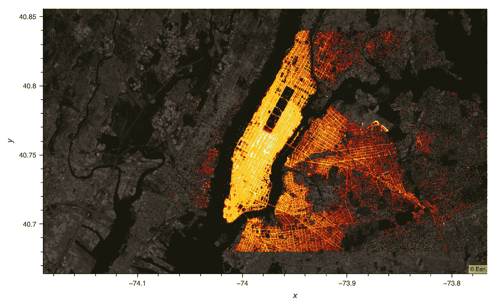
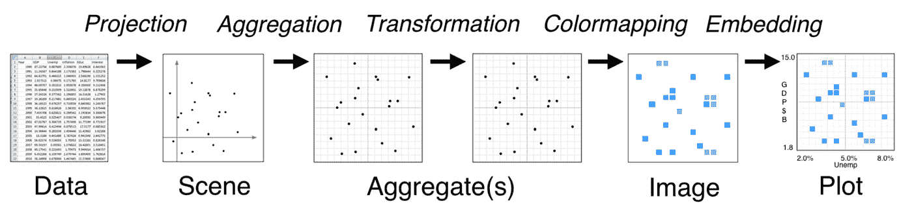
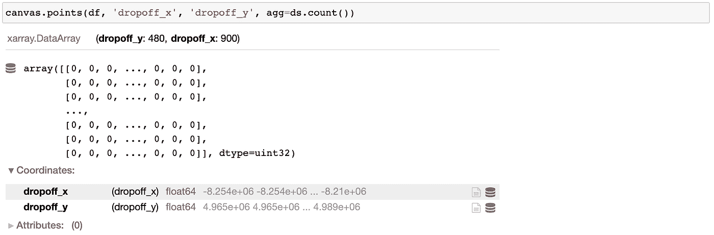
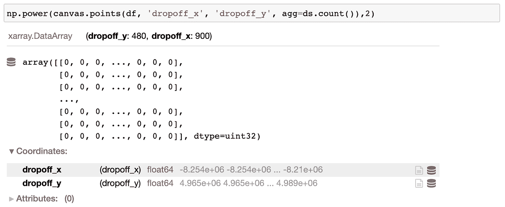
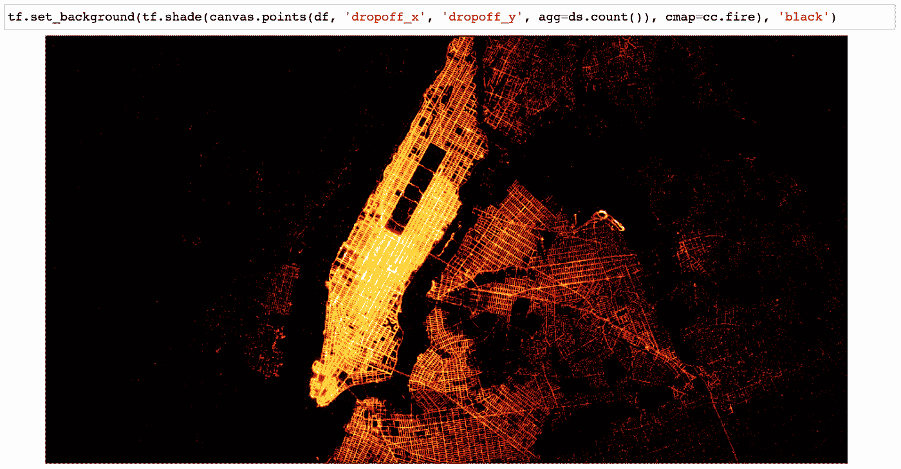
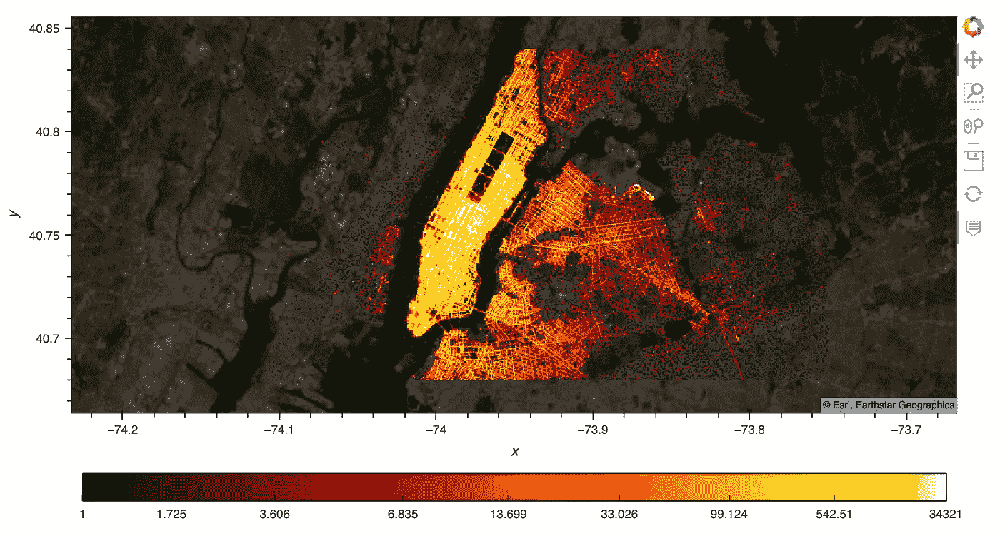

# 使用 Python 中的 Datashader 实现大数据可视化

> 原文：<https://towardsdatascience.com/big-data-visualization-using-datashader-in-python-c3fd00b9b6fc?source=collection_archive---------0----------------------->

## [理解大数据](https://towardsdatascience.com/tagged/making-sense-of-big-data)

## 【Datashader 是如何工作的，为什么速度会如此之快？

图片来自[https://examples.pyviz.org/opensky/opensky.html](https://examples.pyviz.org/opensky/opensky.html)经许可

几个月前，我写了一篇关于我最喜欢的 Python Viz 工具——holo Viz 的文章。许多人有兴趣了解更多关于 [Dashshader](https://datashader.org/) 的信息 HoloViz 家族中的大数据可视化工具。我非常喜欢 Datashader，喜欢 Datashader 如何快速创建大型数据集的有意义的可视化。因此，在本文中，我将带您浏览一个简单的 Datashader 示例，解释 Datashader 是如何工作的，以及它为什么这么快。

# **为什么大数据可视化很难？**

以我的理解，大数据可视化主要有两个障碍。

*   首先是速度。如果您使用常规的 Python 绘图工具来绘制我下面的例子中的 1100 万个数据点，将会非常慢，并且您的 Jupyter 内核很可能会崩溃。
*   第二是画质。即使它没有崩溃，并且您愿意等待，大多数绘图库也会简单地将每个新数据点绘制为一个圆形或其他形状，这将导致过度绘图。在这种情况下，即使为重叠点添加 alpha 透明度也不总是有帮助。想象一下，在一幅图像上，你有许多点一个接一个地显示:你所看到的将是一个斑点，并且很难从这个斑点中提取信息。

Datashader 为这两个障碍提供了优雅且看似神奇的解决方案。接下来，我将向您展示一个示例，并探究其中的神奇之处。

# **使用 Datashader 的大数据可视化—示例**

该示例来自 pyviz.org 的纽约市出租车数据示例。完整示例请参见[https://examples.pyviz.org/nyc_taxi](https://examples.pyviz.org/nyc_taxi/nyc_taxi.html)。

*   **导入需要的包**

`conda install`您的 Conda 环境中所需的软件包:

然后在 Python 文件中导入包:

**读入数据**

对于非常大的文件，您会希望使用像 Dask 这样的分布式处理库和 Datashader，但是这里我们有一个“只有”1100 万条记录的 Parquet 文件，Datashader 可以在使用 Pandas 的笔记本电脑上轻松处理它，而不需要任何特殊的计算资源。在这里，我们将加载两列来表示出租车的下车地点。

*   **绘图**

在这里，我们使用 Datashader 绘制数据。我只用了 4 行代码和 6 毫秒的时间，用我的笔记本电脑绘制了 1100 万行数据，覆盖在纽约地区的地图上:

或者，不使用`datashade`函数，我们可以使用`hvplot`和`rasterize=True`来使用 Datashader 应用栅格化。如此简单！我强烈推荐使用 hvplot 进行可视化。

如果您正在实时运行它，那么您将能够放大到此地图的任何区域，并且绘图会动态更新以使用该缩放级别的全分辨率。

# 【Datashader 是如何工作的？

图一。Datashader pipeline(图片经许可来自 Datashader)。

Datashader 使用五步管道将您的数据转化为绘图。 [Datashader 文档](https://datashader.org/getting_started/Pipeline.html)说明了管道在每个步骤中是如何工作的——投影、聚合、转换、色彩映射和嵌入。我将把我前面的例子分解成这些小步骤，这样我们就可以确切地看到 Datashader 在幕后做什么。

让我们首先安装底层的 Datashader 函数，这样我们就可以运行各个步骤:

*   **投影**

首先，我们为要投影的数据定义一个具有宽度和高度的 2D 画布。画布定义了我们希望在最终图像中看到多少像素，并可选地定义将映射到这些像素的`x_range`和`y_range`。此处，要绘制的数据范围未在画布中设置，因此它们将在下一步中根据数据框中数据 x 和 y 值的最大值和最小值自动填充。画布定义了投影的内容，但是为了加快速度，每个点实际上都是在聚合步骤中投影的。

*   **聚合**

在定义了投影画布之后，我们将每个点投影到二维输出网格中，并聚合每个像素的结果。Datashader 支持这种聚合的许多选项，但在本例中，我们只是通过遍历数据点并在该点所在的位置增加像素，来计算有多少数据点投影到每个像素中。这种情况下的结果是一个计算每个像素衰减的二维直方图:

*   **转换(可选)**

无论原始数据集有多大，上一步的结果现在都是固定大小的格网。一旦数据在这个网格中，我们可以对它进行任何类型的转换，比如只选择某个范围的计数，根据其他数据集或值的结果屏蔽数据，等等。在这里，衰减数据的范围从一些像素的零到其他像素的数万，如果我们试图直接绘制网格，我们只会看到几个热点。为了使所有不同的水平都可见，如上图所示，使用图像处理技术“直方图均衡化”对数据进行转换，以显示计数的分布，而不是它们的绝对值。直方图均衡化实际上被合并到下面的色彩映射步骤中，但是如果我们愿意，我们可以在这个阶段进行显式转换，例如对计数求平方:

*   **色彩映射**

接下来，我们可以将入库的网格数据渲染到图像的相应像素。通过线性插值或自动变换(例如，通过对每个值调用对数函数，或如这里使用直方图均衡化)，每个箱值被映射到色图中定义的 256 种颜色之一。这里我们使用 Colorcet 的“fire”色图，它从黑色开始，代表最低的计数(1 和 2 衰减)，经过红色，代表更高的值(以百为单位)，然后是黄色，代表更高的值(以千为单位)，最后是白色，代表每像素的最高计数(在本例中为数万)。我们将背景设置为黑色，以便更好地显示数据。

*   **嵌入**

如您所见，Datashader 只渲染数据，而不渲染任何轴、彩条或您在完整绘图中预期的类似特征。为了获得那些有助于解释数据的特性，我们可以将 Datashader 生成的图像嵌入到一个绘图中。最简单的方法是使用 HoloViews，这是一个高级绘图 API，它提供了使用 Matplotlib、Bokeh 或 Plotly 作为后端的灵活性。这是一个使用全息视图定义一个“点”对象，然后对所有点进行数据阴影处理的例子。在这里，我们演示了一个替代方法“光栅化”而不是“数据阴影”，这样 Bokeh 就负责变换和色彩映射步骤，并允许悬停和彩条工作。

# **为什么 Datashader 速度如此之快？**

首先，我们需要谈谈原始数据格式。Datashader 非常快，以至于读入数据通常是最慢的一步，尤其是当您的原始数据是一堆 JSON 文件或 CSV 文件时。对于像 dropoff points 这样的列数据，Parquet 文件格式通常是一个很好的选择，因为它很紧凑，可以快速加载，只有效地读取您需要的列和范围，并在适当的时候支持分布式和核外操作。

第二，使用正确的输入文件格式，我们可以研究下一个最昂贵的任务，这是组合的投影+聚集步骤。这一步需要计算数百万个数据点中每一个的值，而所有后续计算都使用最终的固定大小的网格，因此速度更快。那么，Datashader 怎么做才能让这一步走得快呢？

*   Datashader 的聚合计算是用 Python 编写的，然后使用[**【Numba】**](http://numba.pydata.org/)即时编译成超快的机器代码。例如，这里是[代码](https://github.com/holoviz/datashader/blob/5633ae7681c04f09d8b66ef9e0788c8c316a7122/datashader/reductions.py#L266-L308)，在这里对每个箱子进行计数。
*   上面的例子使用了一个 CPU，但是 Datashader + Numba 也支持 **CUDA** cudf 数据帧作为 Pandas 数据帧的替代，如果你有一个 GPU，它会运行得更快。
*   Datashader 还可以并行化其管道([代码示例](https://github.com/holoviz/datashader/blob/6bb4736be8114a9ee83a8884a2b65c5257af2602/datashader/data_libraries/dask.py))，以便您可以利用所有可用的计算核心，扩展到更大的数据集，并提供更快的结果。

因为 Datashader 非常快，我们实际上可以交互地可视化大数据，无论何时缩放或平移，都可以动态地重新绘制。这里有一个[示例](https://examples.pyviz.org/nyc_taxi/dashboard.html)，您可以在面板仪表盘中交互查看纽约市出租车数据。我最喜欢的关于[船舶交通](https://examples.pyviz.org/ship_traffic/ship_traffic.html)的例子说明，即使你看到的只是 Datashader 渲染的像素化图像，你仍然可以检查单个数据点并理解你所看到的。examples.pyviz.org 的另一个例子展示了大得多的文件的数据散列，在一台普通的笔记本电脑上高达数十亿个点。

# **在哪里可以了解到更多关于 Datashader 的信息？**

*   [https://datashader.org/](https://datashader.org/)
*   [https://www.youtube.com/watch?v=v0QiTptWt3w](https://www.youtube.com/watch?v=v0QiTptWt3w)
*   [https://www.youtube.com/watch?v=t5oFw9NUhlQ](https://www.youtube.com/watch?v=t5oFw9NUhlQ)

总之，本文向您展示了一个使用 Datashader 可视化 1100 万行坐标数据的示例，并解释了为什么 Datashader 能够如此快速地生成有意义的可视化效果。值得注意的一点是，Datashader 可以用于任何类型的数据，而不仅仅是上面例子中的地理点。我强烈推荐看看 Datashader.org 大学的许多好例子。

# **确认**

非常感谢 Jim Bednar 对本文的指导和反馈。

# **参考文献**

【https://examples.pyviz.org/nyc_taxi/nyc_taxi.html 

[https://datashader.org/getting_started/Pipeline.html](https://datashader.org/getting_started/Pipeline.html)

[http://numba.pydata.org/](http://numba.pydata.org/)