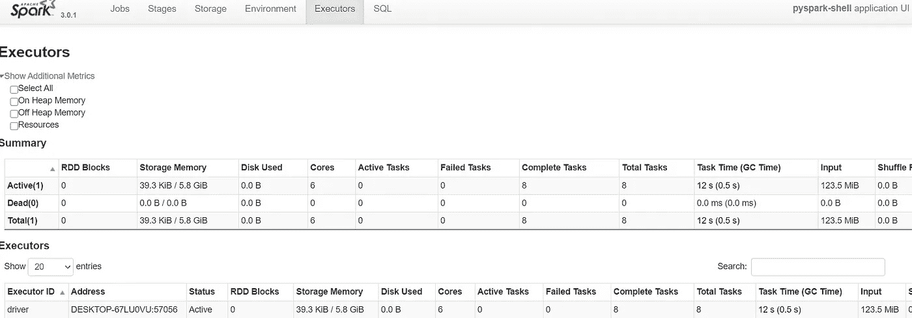
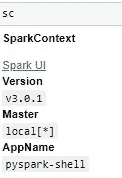

# 大数据和机器学习

> 原文：<https://towardsdatascience.com/big-ger-data-and-machine-learning-71104e3c229f?source=collection_archive---------35----------------------->

## 探索我的电脑在这个领域的极限


马库斯·斯皮斯克在 [Unsplash](https://unsplash.com?utm_source=medium&utm_medium=referral) 上的照片

最近，我在一个项目中面临着越来越多的数据——达到了千兆字节。在使用我的雇主提供的工具时，我很好奇:如果我在我的家用机器上工作，并且只能访问免费资源，会怎么样？

**TL / DR: PySpark 在 25%的时间里做两倍于 Python 的工作，PySpark 的优势受限于一个用户的机器。**超越这一点意味着转向云提供商(未来文章的重点)。

# **语境**

在一个令人筋疲力尽的工作周结束时，我选择了 Coursera 大数据专业的天气 csv 数据集。该数据集包含气压/温度、风速/方向和雨水累积/持续时间，所有这些都是为了预测相对湿度。

这个监督学习问题使用了一个 123 MB 的数据集:远小于我在工作中处理的数据集，但我可以轻松地从我的家用电脑开始使用它来评估不同的工具。

本文的带有代码和数据集的 GitHub repo 是这里的。

# 方法和工具

> **Python**

我决定比较使用 PySpark 和 Python 的方法。我在这里的重点不是特征工程或选择；我的[其他故事](https://medium.com/@rangys3)涵盖这些话题。

在使用 pandas read.csv 读入数据集后，我定义了 x 和 y 数据帧。在测试训练分割之后，进行了 5 重交叉验证，在 *max_depth* 和 *learning_rate* 超参数上执行网格搜索。

```
from sklearn.model_selection import GridSearchCV, KFold
from sklearn.metrics import mean_squared_errorcv = KFold(n_splits=5)gbr_param_grid = {"max_depth": [2,10], "learning_rate" : [0.01, 0.1]}gsXGBr = GridSearchCV(gbtr, gbr_param_grid, cv = cv, scoring='neg_mean_squared_error', refit =  True, verbose=True ,return_train_score=True)gsXGBr.fit(xtrain,ytrain)XGB_best = gsXGBr.best_estimator_ypred = XGB_best.predict(xtest)import numpy as npnp.sqrt(mean_squared_error(ytest,ypred))
```

这个脚本需要多长时间？2459 秒或者说不到 41 分钟。只是为了在我的 6 核 12 GB 内存惠普 Pavilion 上回归。

> **PySpark**

Apache 的 Spark 是处理大型数据集的便利工具。它最初是用 Scala 编写的，PySpark 为我们提供了一个 API，用于在 Python 中使用 Spark 的功能。

这篇[文章](https://medium.com/@ashish1512/how-to-setup-apache-spark-pyspark-on-jupyter-ipython-notebook-3330543ab307)可以方便地安装 Spark 并使其运行。使用下面的代码测试 PySpark 的成功安装。

```
%pip install findspark*import findspark
findspark.init()*
```

SparkSession 是一个方便的入口点，它结合了 SparkContext 和 SQLContext 等其他命令授予的访问权限。虽然我通常使用 SparkSession，但我将使用 SparkContext，这样我可以首先为这个 stackoverflow [线程](https://stackoverflow.com/questions/26562033/how-to-set-apache-spark-executor-memory)配置可用内存。

```
from pyspark.sql import SparkSession
from pyspark import SparkConf, SparkContext, SQLContextconf=SparkConf()
conf.set("spark.executor.instances", "4")
conf.set("spark.driver.memory", "10g")sc = SparkContext.getOrCreate(conf)spark = SQLContext(sc)
```

在读入数据集之前，我单击了创建的 SQLContext 的用户界面，并查阅了 Executors 选项卡。在 Spark 中，执行器执行实际的计算工作，并由驱动程序管理。



图 1: Spark UI 执行器选项卡。图片作者。

我只有一个执行器，即驱动程序，因为我运行在本地模式。随着代码的运行，我可以保持这个窗口打开，观察内存和磁盘空间的使用如何随着代码的运行而变化。我还确保使用了主 URL 下面星号所暗示的所有可用线程。



图 2:主 URL。图片作者。

为了方便起见，我放弃了一些功能——详见 repo 现在我将构建机器学习模型。

```
from pyspark.ml.regression import GBTRegressorgbtr = GBTRegressor(labelCol='relative_humidity')train,test = df_no_date_row_no_null.randomSplit([0.6,0.4])
```

您将观察 Python 的机器学习和 PySpark 的机器学习库(MLib)包之间的语法差异。我发现后者稍微麻烦一点，但我希望它会随着时间的推移而逐渐消失。

```
from pyspark.ml.tuning import CrossValidator, ParamGridBuilder
from pyspark.ml.evaluation import RegressionEvaluatorparamGrid = ParamGridBuilder().addGrid(gbtr.maxDepth, [2, 10]).addGrid(gbtr.stepSize, [0.01, 0.1]).build()rg = RegressionEvaluator(metricName="rmse",  labelCol=gbtr.getLabelCol(),
predictionCol=gbtr.getPredictionCol())cv = CrossValidator(estimator=gbtr,evaluator=rg,numFolds=5, estimatorParamMaps=paramGrid)from pyspark.ml.feature import VectorAssemblerfeatures_input = (df_no_date_row_no_null.drop('relative_humidity')).columnsdassember = VectorAssembler (inputCols = features_input, outputCol='features')df_feat = dassember.transform(df_no_date_row_no_null)from pyspark.ml.pipeline import Pipelinepl = Pipeline(stages=[dassember,cv])
Model = pl.fit(train)
Pred = Model.transform(test)
rg.evaluate(Pred)
```

repo 中的代码还包括对分类器的训练和评估。

H 使用 PySpark 进行回归和分类需要多长时间？ **698 秒或略多于 11.5 分钟。**

# 外卖

PySpark 更快的内存处理显示:大约是 Python(仅分类)25%时间的两倍工作(回归和分类)。

不过，在一天结束时，我只使用了我的 12gb RAM 机器的资源，尽管通过 PySpark 的多核更有效。如果我通过云使用 Linux 和其他计算资源，我可以使用 Apache [Livy](https://livy.apache.org/) 。

我将转向微软 Azure 的免费层来探索这里的选项，包括数据块。我试图注册社区版，但目前看到该产品已关闭。

我将在随后的文章中介绍我对 Azure 和 Databricks 的测试。一如既往，我欢迎任何反馈。