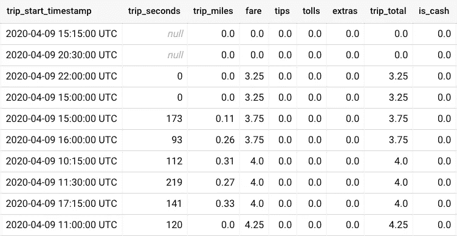
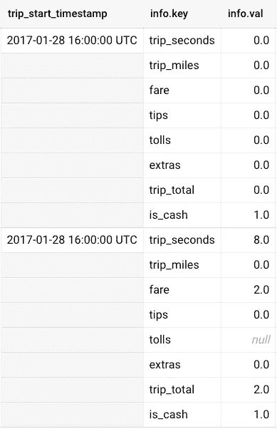
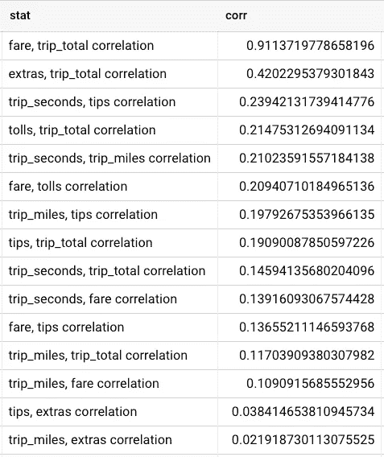
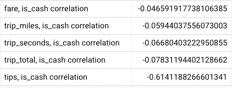

# BigQuery Hack:灵活查询任意数量的列

> 原文：<https://towardsdatascience.com/big-query-hack-flexible-queries-for-any-number-of-columns-713fa0c6f6a5?source=collection_archive---------12----------------------->

## [理解大数据](https://towardsdatascience.com/tagged/making-sense-of-big-data)

## 如何使用 BigQuery 处理多列的表？下面是如何使用脚本和表元数据。

BigQuery 很棒，但是它如何处理有很多列的表呢？尤其是当我们甚至不知道有多少列的时候？(图片来源:[伊尔泽·奥尔塞尔](https://unsplash.com/@lgtts?utm_source=medium&utm_medium=referral))

BigQuery (BQ)是一个 Pb 级的专有谷歌数据仓库产品。在我的工作中，几乎每天我都使用 BQ 来处理数十亿行数据。但有时，棘手的情况会出现。例如，如果我的表有大量的行和列，该怎么办？BQ 是如何处理的？

与所有其他 SQL 语言一样，除了一些语法技巧，如`*`和`EXCEPT`，每个查询都要求我们手动输入所有所需列的名称。但是，如果我有一个有数百列的表，我想计算，比如说，所有的成对相关，该怎么办呢？使用`CORR`功能，我不需要手动输入 100 个✕100 ~ 10000/2 组合吗？

当然，我可以利用 BASH/python 来获取列名，并运行一些特殊的脚本来完成这项工作。但是，如果我们可以避免设置不同的连接器，并在 BQ 中本地完成所有工作，这不是很好吗？

感谢 BQ 的[脚本](https://cloud.google.com/bigquery/docs/reference/standard-sql/scripting)功能和表[元数据](https://cloud.google.com/bigquery/docs/information-schema-tables)，事实证明这终究是可能的！因此，让我们深入一些测试数据，看看它是如何工作的。

# 数据样本

让我们获取一些样本数据。我们将使用 BQ 关于芝加哥出租车出行的公共数据集。下面是在我们自己的数据集中创建我们自己的表的查询(`MyDataSet`):

查询以创建我们自己的芝加哥出租车信息表

注意，我们使用`PARTITION BY`添加了一个分区列，这总是一个好主意。该查询将花费 13GB = 0.065 美元。如果我们想进一步降低成本，我们可以使用`CREATE VIEW`来代替(尽管预览将不可用)。

最终的表格应该如下所示:

芝加哥出租车样本数据预览

这里的目标是计算所有变量(`trip_seconds`、`trip_miles`、`fare`、…、`is_cash`)之间的成对相关性。我们如何进行？

# 列到行

我们如何在不显式引用所有列的情况下查询所有列？嗯，我们可以找到一种方法来重组数据，使多列变成一行。怎么做呢？我们可以使用`ARRAY`和`STRUCT`在 BQ 中创建一种模拟字典，有效地将列转置为行。这是最终结果的样子:

我们希望将所有列压缩到一列数组中，这就像一个字典

我们如何创造这种结构？以下是查询:

将多列转置为多行的查询

注意，我们使用了`[]`和`STRUCT`来显式创建数组。当然，查询仍然引用单个列的名称，当列数太大时，这会很快变得难以处理。要解决这个问题，我们可以:

1.  查询`INFORMATION_SCHEMA.COLUMNS`以获得所有相关的列
2.  使用`FORMAT`使用列信息构建一个查询字符串
3.  使用`EXECUTE IMMEDIATE`执行构造的查询字符串

所有这些步骤都可以在 BQ 脚本中串起来。让我们一步一步地分解它。

# 使用元数据的 BQ 脚本

我们可以使用各种元数据表获得给定数据集中的所有表元数据。对于与列相关的信息，我们可以简单地查询

> `SELECT * FROM MyDataSet.INFORMATION_SCHEMA.COLUMNS`

(该查询是免费的，因为它处理 0 个字节)

例如，我们可以提取所有数字列:

查询以提取所有数字列的名称

为了提取所有的数字列，我们在`data_type`上应用了一个过滤器。使用`ordinal_position`和/或`is_partition_column`还有其他可能性。

现在，我们不仅仅想要列名；我们想为`EXECUTE IMMEDIATE`命令构建一个查询字符串。因此，我们使用 BQ [脚本](https://cloud.google.com/bigquery/docs/reference/standard-sql/scripting)，并将列名转换成一个字符串数组，以便于稍后构建查询字符串:

查询来提取字符串数组，这样我们就可以在以后构造查询字符串

我们使用`FORMAT`将`column_name`转换成我们之前用于将列转置为行的`'STRUCT(... key, ... val)'`模式。

`ARRAY`将查询结果转换成一个数组，该数组存储在变量`query_ary`中，供 BQ 脚本使用(标记为`BEGIN ... END`)。

现在我们已经准备好构造列转置查询，但是不引用任何特定的列名！

BQ 脚本将所有数字列提取到一个数组中，并构造和执行一个将列转置为行的查询

我们增加了两个额外的步骤:

1.  将字符串数组`query_ary`格式化为查询字符串`query_string`
2.  使用`EXECUTE IMMEDIATE`执行构建的查询。

请注意，在我们的 BQ 脚本中没有提到任何列！

# 成对相关

我们还缺少最后一步:如何使用转置表计算成对相关性？这可以使用一个简单的聚合来完成(可以插入到上面的 BQ 脚本中):

计算成对相关的查询

该查询执行以下操作:

1.  `UNNEST``info`数组两次，创建数组中所有可能的项目组合
2.  `i1 < i2`删除重复项，并确保只保留比较不同变量的组合
3.  `GROUP BY`和`CORR`计算每个唯一对的相关性，使用`FORMAT`构建一个好看的输出

最终结果应该是这样的:

芝加哥出租车数据的前 15 个正相关性

不出所料，最大的相关性来自于`trip_total`和`fare`，因为`trip_total`等于`fare + tips + tolls + extras`，而出租车费很可能是一次乘车总成本的最大组成部分。更令人惊讶的是，`trip_miles`和`trip_seconds`与`trip_total`并不完全相关，这表明更长的旅程并不一定会导致司机收入的显著增加。

我们也可以看看最负的相关性:

芝加哥出租车数据的倒数 5 个负相关性

有趣的是，现金支付似乎与小费的减少有关！有人可能会认为这是因为现金很可能被用来支付更便宜的旅行，但这种相关性不是那么强。另一种可能性可能是现金小费一直没有报告，或者现金的使用与不太富裕(非商务)的乘客有关，但这些当然是推测。

# 结论

使用 BQ 脚本和表元数据，我们可以纵向(大量行)和横向(大量列)扩展 BQ 中的分析。

如果你觉得这篇文章有帮助，你可能也会对我的其他 BQ 技巧感兴趣。欢迎随时留下评论/问题，BQ 黑客快乐！👋

 [## BigQuery Hack:使用物化视图聚合效率提高 1000 倍

### 了解如何使用物化视图增强聚合查询

medium.com](https://medium.com/swlh/bigquery-hack-1000x-more-efficient-aggregation-using-materialized-view-7243e07208da)  [## BigQuery Hack:在一个查询中创建多个表

### 了解如何在一个查询中创建多个表(串联)

medium.com](https://medium.com/swlh/bigquery-hack-create-multiple-tables-in-one-query-bc47e52bf44a)  [## BigQuery Hack:使用 Javascript UDF 免费计算

### 不像吃角子老虎机，BigQuery 让你免费生成随机数！

medium.com](https://medium.com/swlh/bigquery-hack-monte-carlo-simulation-for-free-57d18fb87076)