# 大型销售市场回归再探:进入潮流模型

> 原文：<https://towardsdatascience.com/big-sales-mart-regression-revisited-enter-the-tidymodels-a6a432be58d4?source=collection_archive---------22----------------------->

## 使用 Tidymodels 的介绍性机器学习回归项目

Tidymodels 是一个元包，很像 tidyverse，它将一组有用的 tidy 包加载到您的会话中。不同之处在于它加载了一系列在机器学习模型开发过程中使用的包。

当我们使用它们时，我将介绍每一个，并提供实际的使用案例。Tidymodels 由 Max Kuhn 开发，他是 RStudio 的成员，开发了一种生成机器学习模型的整洁友好的方法。库恩之前最著名的作品是《脱颖而出》,是《下雨了》**Ca**tegorical**Re**gression**T**raining。Caret 本身已经是一个非常强大的包，可以与 Python 的 Scikit-Learn 相媲美。


照片由[粘土堤](https://unsplash.com/@claybanks?utm_source=medium&utm_medium=referral)在 [Unsplash](https://unsplash.com?utm_source=medium&utm_medium=referral) 上拍摄

但是，每个模型类型都有其特定的包、输入要求、规格和训练方法。Tidymodels 试图通过简化工作流程和创建生成机器学习模型所需的统一语法来解决这个问题。

大销售市场数据集可通过分析 Vidhya 和他们向成员提供的免费项目之一获得。

[https://courses . analyticsvidhya . com/courses/big-mart-sales-prediction-using-r](https://courses.analyticsvidhya.com/courses/big-mart-sales-prediction-using-r)

该项目的目的是开发和评估一系列回归模型，根据一些输入变量预测商品经销店销售额。

当我亲自完成这个项目时，许多方面都是用 base R 编写的，并不像它应该的那样直观，也没有利用 tidyverse 包提供的易用性。因此，我看到了一个真正的机会，将这个项目转化为“整洁”的思维方式，并展示 tidymodels。

**探索性数据分析**

```
#Load Packages
library(tidymodels)
library(magrittr) #Tidy pipes
library(patchwork) #Visualisation grids
library(stringr) #String Manipulation
library(forcats) #Working with Factors
library(corrr) #Develop tidy Correlation Plots
library(vip) #Most important feature visualisations
```

加载一系列包，最重要的是 tidymodels 元包。与 tidyverse 非常相似，它实现了一系列较小的包，这些包有不同的用途，并在模型开发过程中发挥作用，还有 dplyr、ggplot2、purrr、tibble 等。随着模型开发的进展，我们将介绍每个包。

```
#Load Data
train = read_csv("train.csv")
skim(train)
```

数据被加载到项目中，我们使用 skimr 包中方便的 skim 函数检查结构。有 12 个变量(7 个字符和 5 个数字)和 8，523 行数据。

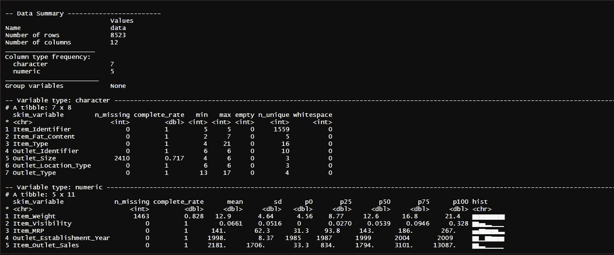

skim 输出的屏幕截图(图片由作者提供)

从这里开始，我们需要用一些丢失值的变量来整理数据集。我们通过可视化数据集中的每个变量来进一步研究。

我编写这个函数是为了使我的数据科学项目的初始 EDA 步骤非常简单，并通过 purrr 的 map2()创建一个图列表，并传递给 patchwork 的 wrap_plots()以生成一个图网格。

```
viz_by_dtype <- function (x,y) {
  title <- str_replace_all(y,"_"," ") %>% 
           str_to_title()
  if ("factor" %in% class(x)) {
    ggplot(combi, aes(x, fill = x)) +
      geom_bar() +
      theme(legend.position = "none",
            axis.text.x = element_text(angle = 45, hjust = 1),
            axis.text = element_text(size = 8)) +
      theme_minimal() +
      scale_fill_viridis_d()+
      labs(title = title, y = "", x = "")
  }
  else if ("numeric" %in% class(x)) {
    ggplot(combi, aes(x)) +
      geom_histogram()  +
      theme_minimal() +
      scale_fill_viridis_d()+
      labs(title = title, y = "", x = "")
  } 
  else if ("integer" %in% class(x)) {
    ggplot(combi, aes(x)) +
      geom_histogram() +
      theme_minimal() +
      scale_fill_viridis_d()+
      labs(title = title, y = "", x = "")
  }
  else if ("character" %in% class(x)) {
    ggplot(combi, aes(x, fill = x)) +
      geom_bar() +
      theme_minimal() +
      scale_fill_viridis_d()+
      theme(legend.position = "none",
            axis.text.x = element_text(angle = 45, hjust = 1),
            axis.text = element_text(size = 8)) +
      labs(title = title, y  ="", x= "")
  }
}
variable_list <- colnames(train) %>% as.list()
variable_plot <- map2(train, variable_list, viz_by_dtype) %>%
  wrap_plots(               
    ncol = 3,
    nrow = 4,
    heights = 150,
    widths = 150
  )
```

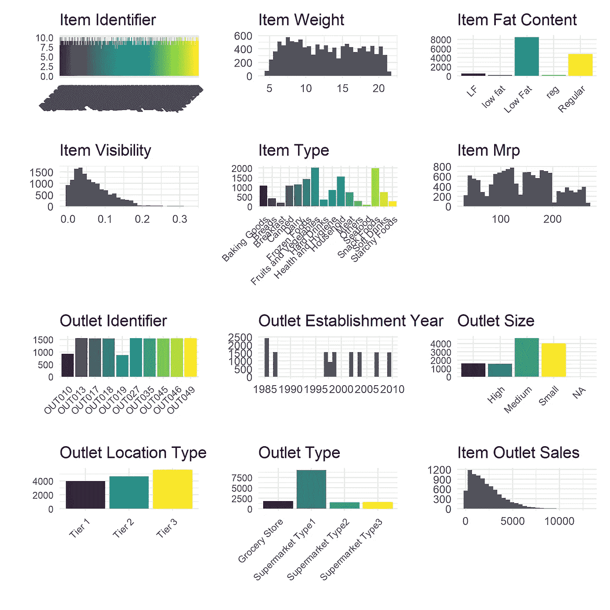

通过数据类型适当的可视化简化 EDA(图片由作者提供)

由此我们注意到:

*   项目标识符有 1559 个单独的值，为了简化模型，我们将删除这个变量
*   项目重量没有明显的分布
*   项目脂肪含量标签不一致
*   项目可见性是右偏的
*   项目类型有多种标签
*   物料 MRP 有四个主要组
*   插座标识符有 10 个独特的标签
*   奥特莱斯建立的年份是多种多样的，许多商店从 90 年代中期开始
*   插座尺寸标签不一致
*   插座位置类型有三个标签
*   出口类型有四个标签
*   商品出口销售是右偏的

此外，让我们研究一下 Item_Outlet_Sales 和其他数字变量之间是否存在有趣的关系。使用 GGally 的 ggscatmat()，我们生成了一个简洁的双变量分析，沿对角线进行了高斯平滑，并为每个变量对生成了皮尔逊相关性。

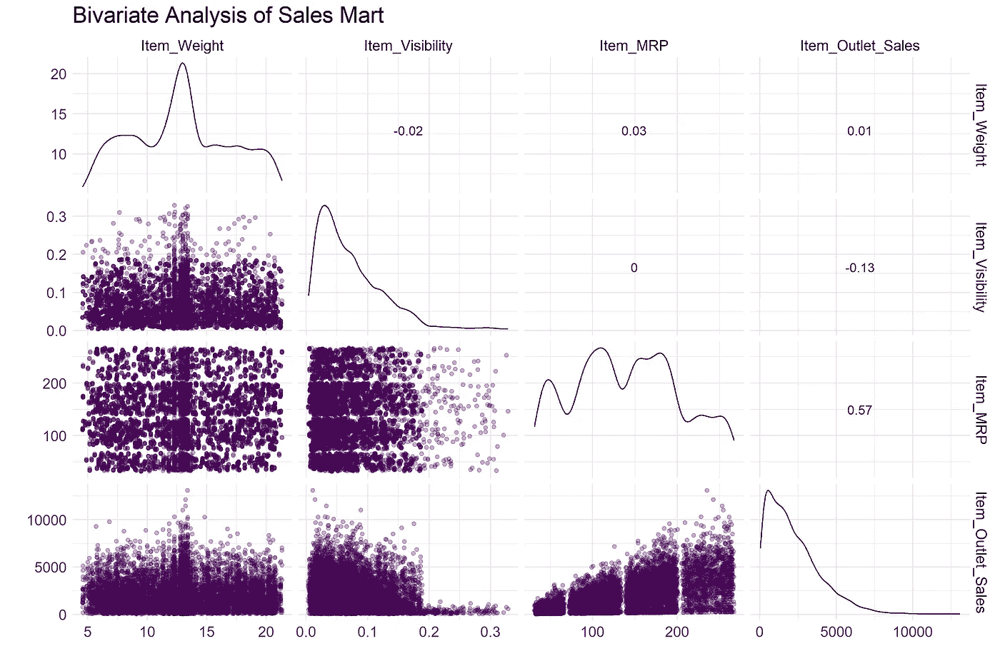

连续变量的二元分析(图片由作者提供)

我们发现，把数字变量和目标变量对应起来，有三种不同的观察结果。

*   物品销售在物品重量的整个范围内分布良好，没有任何明显的模式
*   Item_Visibility 与 Item_Outlet_Sales 没有关系
*   Item_MRP 有四个不同的级别，并与 Item_Outlet_Sales 适度相关，我们将在稍后的特性工程中利用这一点。

**数据角力**

如前所述，我们需要修正一些变量输出。

```
#Correct mislabeled Item_Fat_Contenttrain %<>% mutate(Item_Fat_Content = if_else(Item_Fat_Content %in% c("reg", "Regular"), "Regular", "Low Fat"))#Outlet Size is missing a labeltrain %<>% mutate(Outlet_Size = if_else(is.na(Outlet_Size),"Small",Outlet_Size))
```

经销店规模是根据与小型经销店具有非常相似的 Item_Outlet_Sales 分布的 NA 标签估算的。

**模型开发:引入 tidymodels**

到目前为止，我们已经使用了一系列 tidyverse 包来争论和可视化数据，现在让我们来看看使用 tidymodels 元包开发机器学习管道的过程。

**数据拆分— rsamples**

很像 sci-kit 学习测试训练分割模块，rsamples initial_split 完成类似的操作。在下面的示例中，使用 intial_split 函数生成 mc_split 对象 mart_split，传递我们的训练数据帧，将比例设置为 75%，并按 Item_Outlet_Sales 变量分层。

这有效地创建了两个数据帧的列表，由 training()或 test()调用。我们将使用测试数据框架来判断我们的模型在看不见的数据上表现如何。

```
set.seed(55)
mart_split <- initial_split(train, prop = 0.75, strata = Item_Outlet_Salesmart_train <- training(mart_split)
mart_test <- testing(mart_split)
```

**特征工程—配方**

recipes 包提供了大量用于处理变量的函数，并使它们对机器学习友好。配方包的三个主要功能是

*   recipe() —定义一系列连续的预处理步骤(或者收集并列出我的配料以及我将如何准备它们)
*   prep() —计算所需的统计变换(或者准备我的烹饪原料)
*   bake() —将预处理步骤应用于数据集(或烹饪我准备好的菜肴)

recipe 函数的构造类似于其他模型 outcome ~ predictor，在这里，我们通过使用波浪符号(~)指出我们想要使用所有其他变量作为模型的预测变量。).

我们已经使用配方生成了一个新的变量 Price_Per_Unit，它是 Item_MRP 和 Item_Weight 的商，然后通过应用 Box-Cox 变换并求 Item_Visibility 的平方根来寻求降低 Price_Per_Unit 的偏斜度。
在生成虚拟变量之前，名义/字符变量被转换为二进制列，表示该行是否属于某个特定的组(1 =真，0 =假)，我们可以使用 reshape2::dcast()，然而，配方的强大之处在于，它能够通过管道传输一条简单的指令，使用 step_dummy 为所有名义变量创建一个虚拟变量。为了简单起见，我决定不为 Item_Identifier 创建虚拟变量，此外，这样会创建 5000 多列，可能会使模型过于复杂。

```
mart_recipe <- 
  training(mart_split) %>% 
  recipe(Item_Outlet_Sales ~ .) %>% 
  step_rm(Item_Identifier) %>%
  step_impute_bag(Item_Weight) %>% 
  step_impute_knn(Item_Visibility) %>% 
  step_mutate(Price_Per_Unit = Item_MRP/Item_Weight) %>% 
  step_sqrt(Item_Visibility) %>%
  step_log(Price_Per_Unit, offset = 1) %>% 
  step_discretize(Item_MRP,num_breaks = 4) %>%
  step_normalize(all_numeric_predictors()) %>%
  step_dummy(all_nominal())mart_recipe_prepped <- prep(mart_recipe)
```

然后，配方对象通过 prep()函数传递，也生成一个配方对象，但是已经进行了转换，因此数据已经被“准备”了。

将 prep(ed) recipe 对象传递给 bake 执行转换，因为已经创建了许多虚拟变量，所以我们现在有 54 列。

```
mart_train <- bake(mart_recipe_prepped, new_data = mart_train)
dim(mart_train)
[1] 6391 54
```

由于准备好的配方实际上是一个转换管道，我们可以在测试数据集上调用这些相同的转换。

```
mart_test <- mart_recipe_prepped %>% 
             bake(testing(mart_split))
dim(mart_test)
[1] 2132 54
```

瞧，完全处理的训练和测试数据集。

**相关图— corrr**

相关图对于理解哪些预测因子与结果变量相关非常有趣和重要。要创建相关图，需要将数据转换为相关数据框(cor_df)。
我们采用 mart_train，选择所有数字变量并传递给 corr::correlate，corr::correlate 生成 cor_df，给出变量对之间的 pearson 或 rho 值。

cor_df 对象被传递给 rplot()，就像对待其他 ggplot 对象一样，我们可以通过使用 theme()和配色方案来定制它的外观。

```
corr_df <- mart_train %>% select(is.numeric) %>% 
              correlate() %>%
              rearrange() %>% 
              shave()
rplot(corr_df,) +
 theme_minimal() +
 theme(axis.text.x = element_text(angle = 90)) +
 scale_colour_viridis_c()
```

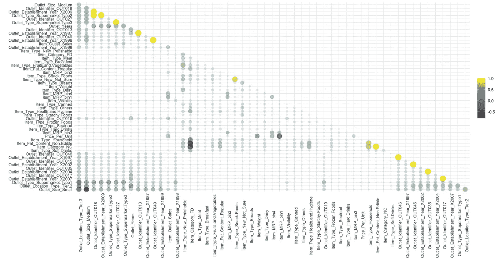

预处理(烘焙)数据的相关图(图片由作者提供)

给聪明人的一句话，你可能不打算“通常”使用这么多变量的相关图，正如我写的，如果没有更大的监视器，这很难阅读。但是，请注意创建这样一个情节的代码是多么优雅。

在这种情况下，人们可能会决定继续完成主成分分析，并根据重要性减少变量的数量。我将把那个留给另一个时间。

**模型开发—防风草**

RStudio 的团队，尤其是 Max Kuhn，有一种非常邪恶的幽默感。在命名这个包时，他们不能称之为 caret2，所以他们选择了 parsnip。

由于我们试图创建一个预测 Item_Outlet_Sales 的回归模型，为了便于演示，我们将开发两个模型，并使用均方根误差(RMSE)作为评估指标。

*   线性回归
*   随机森林

使用 parsnip 生成模型是非常优雅的。从我们要评估的第一个模型开始，线性回归，我们声明一个模型规范，然后是用于拟合模型的计算引擎。在这个实例中，parsnip 模型将使用 stats:lm()函数。

```
lm_model <- linear_reg() %>% 
            set_engine("lm")lm_mart_fit <- 
  lm_model %>%
  fit(Item_Outlet_Sales ~ ., data = mart_train)
```

调用 parsnip 模型对象将生成类似于调用 stats:lm()对象时的输出，即每个输入变量的公式和系数列表。

```
lm_mart_res <- 
  predict(lm_mart_fit, new_data = mart_test) %>% 
  bind_cols(mart_test %>% select(Item_Outlet_Sales))lm_mart_res %>%
  ggplot(aes(x = Item_Outlet_Sales, y = .pred)) +
  geom_abline() +
  geom_point(alpha = 0.5) +
  theme_minimal() +
  labs(x = "Item Outlet Sales", y = "Predicted Item Outlet Sales")
```

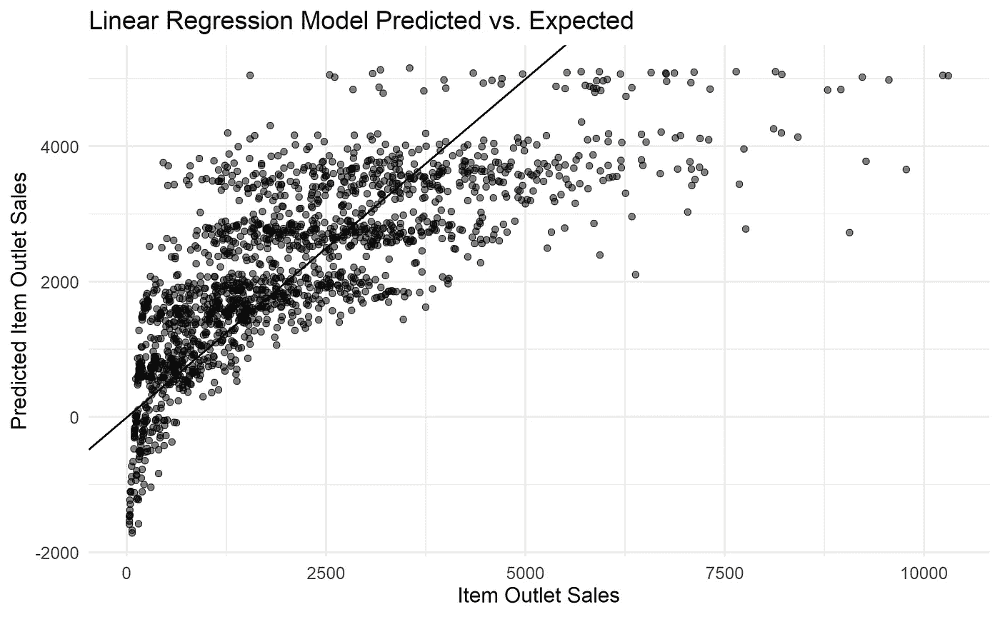

mart_test 的线性回归模型预测与期望值的散点图(图片由作者提供)

**衡量绩效——衡量标准**

在 mart_test 上使用我们的回归模型的输出，我们可以评估模型使用标尺包的准确性。标尺包为评估模型性能提供了一个有效的整洁的方式。

```
metrics <- metric_set(rmse, rsq, mae)metrics(lm_mart_res, truth = Item_Outlet_Sales, estimate = .pred)
```

为指定的误差度量创建一个包装函数。在我们的例子中，我们规定了均方根误差(RMSE)、R 和平均绝对误差(MAE)。

调用指标，指定 tible、实际和预测度量，生成一个包含每个错误度量和输出的 tible。

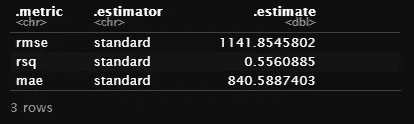

指标包装函数的输出(作者图片)

将模型的误差与测试集的预测误差进行比较，我们发现 RMSE(测试)= 1141.8，RMSE(模型)= 1144.3。差别很小，我们可以说该模型很好地适用于测试数据。

但是，回归模型预测了许多值的负值，因此不适用于此上下文，因为我们不能有负销售额。

**生成 ML 管道—工作流程**

如上所述，为了生成基本的线性模型，我们采取了许多精细的步骤，workflows 包提供了一种优雅的方法来处理这些步骤。我们现在将通过生成一个随机森林模型来演示工作流有多有用。

随机森林模型

随机森林算法是决策树的集成方法，通常通过 bagging 方法训练。RF 算法在随机特征子集中搜索最佳特征。这导致更大的树多样性，用更高的偏差换取更低的方差和更好的整体模型。

```
rf_workflow <- 
  workflow() %>% 
  add_recipe(mart_recipe) %>% #Pre-processing Steps
  add_model(rand_forest(mode = "regression") %>% #Specify Model
              set_engine("ranger"))
```

在四行代码中，我们生成了一个 ML 工作流，现在可以用作模型对象。

```
rf_mart_res <- 
  rf_workflow %>% 
  fit(training(mart_split)) %>% 
  predict(new_data = testing(mart_split)) %>%
  bind_cols(mart_test %>% select(Item_Outlet_Sales))rf_mart_res %>% 
  ggplot(aes(x= Item_Outlet_Sales, y = .pred)) +
   geom_abline(lty = 2)+
   geom_point(alpha = 0.5)+
   theme_minimal()+
   labs(x="Item Outlet Sales", y= "Predicted Item Outlet Sales", title = "pRandom Forest Regression")
```

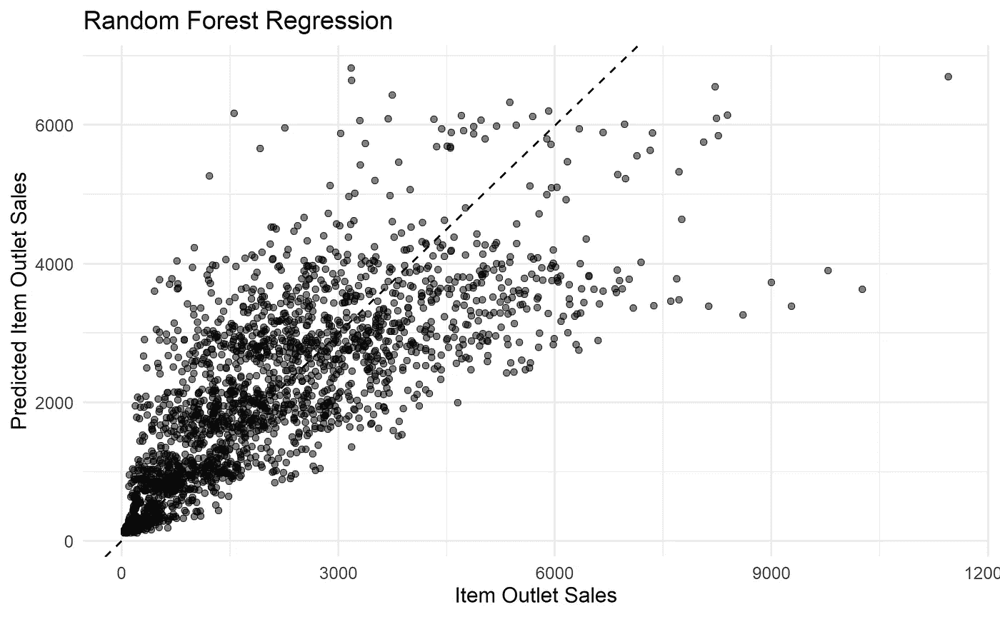

来自未调整随机森林模型的预测与实际商品销售散点图(图片由作者提供)

这里我们发现 RMSE(训练)= 1110.446，RMSE(测试)= 1126.359。随机森林模型确实有过度拟合的趋势，我们可以通过训练超参数来进一步改进模型，这也可以使用工作流和 dials 包来完成。

**表盘—精炼模型开发**

通过调整超参数来调整模型是模型开发的一个重要方面。

进入 dials 包和函数 grid_regular()，该函数用需要调优的超参数的每种可能组合建立一个 tibble。dials::grid_regular 的工作方式类似于 dplyr::expand_grid。

下面，我们重新建立一个随机森林模型规范，这次将 trees 设置为 500，mtry 和 min_n 设置为 tune()。Mtry 是每次分裂时采样的预测值数量，min_n 是分裂节点的最小观测值数量。

正如前面一样，我们通过管道传输模型和配方规范，从而生成一个调整工作流。

此外，我们创建了一个 4 重交叉验证对象(vfold_cv)。

最后，我们通过初始化 tune_grid()(网格搜索)生成一个 tune_results 对象，它遍历 rf_grid 中的每个组合，tune_wf 使用 4 重交叉验证。

```
set.seed(256)
rf_mod <- 
  rand_forest(trees = 500,
              mtry = tune(),
              min_n = tune()) %>% 
  set_engine("ranger", importance = "impurity", num.threads = 12) %>% 
  set_mode("regression")#Establish Model Flow
tune_wf <- workflow() %>%
  add_recipe(mart_recipe) %>%
  add_model(rf_mod)#Generate grid to perform grid search for hyperparameter optimisation

rf_grid <- grid_regular(mtry(range = c(6,10)), 
                        min_n(range = c(14,20)), 
                        levels = c(10,9))# 4-fold Cross Validation Stratified by Item_Outlet_Sales
folds <- vfold_cv(train, v = 4, strata = Item_Outlet_Sales)#Train and evaluate all combinations of hyperparameters specified in rf_griddoParallel::registerDoParallel(cores = 12)
rf_grid_search <- tune_grid(
  tune_wf,
  resamples = folds,
  grid = rf_grid)
```

请注意，我们已经利用并行处理来使用更多的工作站计算能力，因为网格搜索可能需要大量计算。

我们可以可视化这种计算的结果，并直观地看到哪个超参数组合提供最低的 RMSE。

```
rf_grid_search %>%
  collect_metrics() %>% 
  filter(.metric == "rmse") %>%
  select(mean, min_n, mtry) %>%
  filter(mtry > 4) %>% 
  ggplot(aes(min_n, mean, color = as_factor(mtry))) +
  geom_point()+
  geom_line()+
  scale_color_viridis_d() +
  theme_minimal()+
  scale_x_continuous(breaks = pretty_breaks())+
  theme(legend.position = "bottom") +
  labs(x = "Minimum Number of Observations to Split Node", y = "RMSE", title = "Grid Search Results for Random Forest", color = "Number of Predictors Sampled at Each Split")
```

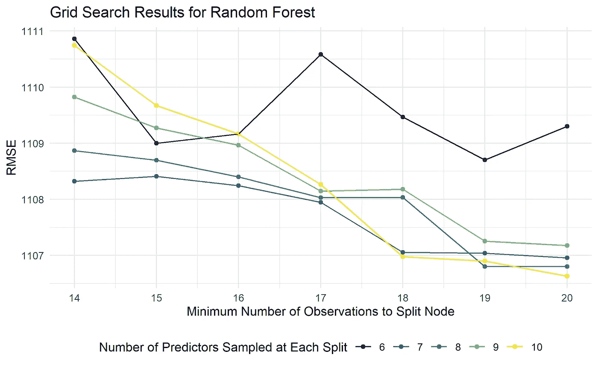

随机森林的网格搜索结果(图片由作者提供)

调用 show_best()提供了关于网格搜索结果的更多细节

```
rf_grid_search %>% show_best()
```

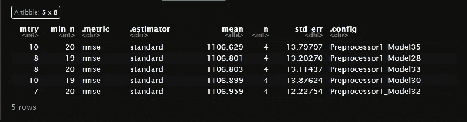

show_best()的输出打印前 5 个结果(图片由作者提供)

我们可以使用网格搜索的结果来更新随机森林模型规范。

```
rf_best_rmse <- select_best(rf_grid_search, "rmse")
final_rf <- finalize_model(
  rf_mod,
  rf_best_rmse
)final_rf
```

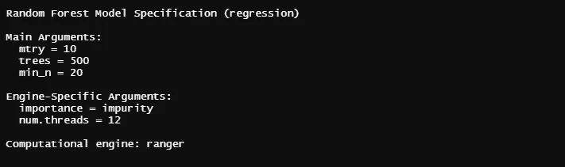

网格搜索后的最终随机森林模型规格(图片由作者提供)

使用 vip 包，我们可以适应 final_rf 并突出显示前 10 个最重要的功能。

```
final_rf %>%
  fit(Item_Outlet_Sales ~., data = bake(prep(mart_recipe),training(mart_split))) %>% 
  vip(geom=c("col"), num_features = 10) +
  theme_minimal()
```

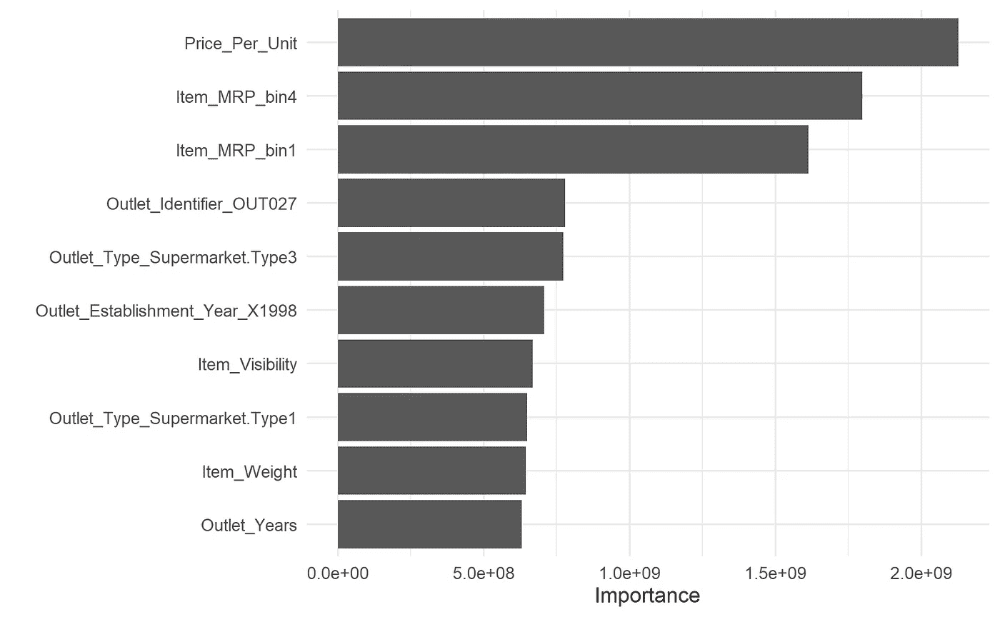

rf_final 模型的十个最重要的特性(图片由作者提供)

这真正突出了特征工程的重要性，其中一些是在我们清理数据或通过配方生成时创建的。

最后让我们评估一下 final_rf

```
final_wf <- 
  workflow() %>% 
  add_recipe(mart_recipe) %>% 
  add_model(final_rf)final_rf_res <- 
  fit(final_wf, training(mart_split)) %>% 
  predict(new_data = testing(mart_split)) %>% 
  bind_cols(mart_test %>% select(Item_Outlet_Sales))final_rf_res %>% ggplot(aes(x= Item_Outlet_Sales, y = .pred)) +
                  geom_abline(lty = 2)+
                  geom_point(alpha = 0.5)+
                  theme_minimal()+
                  labs(x="Item Outlet Sales", y= "Predicted Item Outlet Sales", title = "Tuned Random Forest Regression")
```

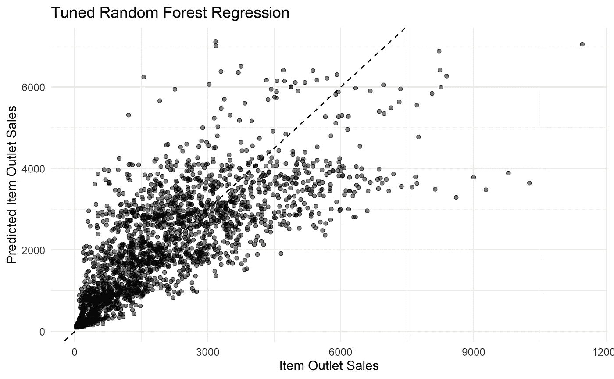

rf_final 的实际和预测产品销售散点图(图片由作者提供)

```
metrics(final_rf_res, truth = Item_Outlet_Sales, estimate = .pred)
```

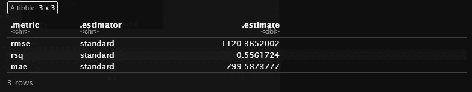

度量函数的误差度量(图片由作者提供)

将 RMSE(测试)= 1120.365 与 RMSE(训练)= 1106.629 进行比较，我们将过拟合略微降低了 2 个 RMSE 单位，并在超参数调整后产生了略微更好的模型。

**结论**

该项目试图举例说明 tidymodels 元包的易用性，通过使每个步骤可管道化，拟合两种模型类型并根据测试集评估它们的性能，可以使用它来生成机器学习工作流。如果您想更进一步，训练 XGBoost 模型是非常容易的，为了简洁起见，我没有包括这一点。

将 tidymodels 与 sci-kit learn 进行比较的一个关键要点是，tidymodels 过程中的每一步都需要 tibble 数据帧，并且不需要将数据帧转换为矩阵。此外，鉴于一切都通过 tibbles 工作，正如我所演示的，这使得模型性能和超参数训练的可视化诊断更容易理解。

我强烈推荐那些有兴趣了解更多关于 tidymodels 的人去寻找神奇的朱莉娅·斯利格@[https://juliasilge.com/](https://juliasilge.com/)，以及她与马克斯·库恩在备受期待的 Tidy Modeling with R 上的合作(你可以在这里预览一下[https://www.tmwr.org/](https://www.tmwr.org/)