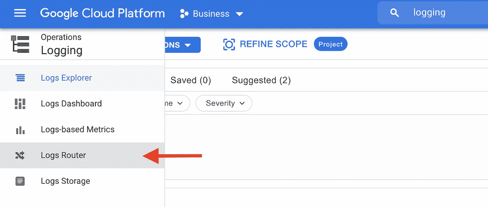

# BigQuery:审计和监控数据库的 3 种简单方法。

> 原文：<https://towardsdatascience.com/bigquery-3-simple-ways-to-audit-and-monitor-your-dabatase-1cf09027f0de?source=collection_archive---------5----------------------->

## 如何审计和监控您的 BigQuery 数据库，以保持其整洁和高效。

Google BigQuery 是一个可管理的、高度可伸缩的、无服务器的数据仓库，能够在几秒钟内查询万亿字节的数据。这是一个很棒的工具，数据分析师和科学家很容易使用。因为 GCP 使它完全被管理，你不必过多考虑数据库管理。


[@sadswim](https://unsplash.com/@sadswim) 在 [Unsplash](https://unsplash.com/) 上的照片

多年来，我一直在使用老式的企业级数据库(Oracle，SAP / Sybase，..).我们需要团队中的**数据库管理员**，**来管理数据库“健康”**。

但是当谈到主要由数据分析师和数据科学家使用的完全托管的 BigQuery 数据库时，没有人接管这个角色是一个典型的陷阱。

因此，这里有 5 种简单的方法可以立即开始监控您的 BigQuery DB！

# 方法 1:元数据

> 元数据是提供关于其他数据的信息的数据。
> —维基百科

对于关系数据库，元数据提供关于数据库本身的信息:模式、表、列或任何其他关于数据库元素和用法的信息。

GCP 和 BigQuery 提供了一些通过元数据监控数据库的便捷方法。

> 我不会详细讨论 BigQuery 的元数据，因为你可以参考 Skye Tran 的这篇文章。但是让我们有一个概述。

## A. ***信息 _ 模式***

[INFORMATION_SCHEMA](https://cloud.google.com/bigquery/docs/information-schema-intro) 是一系列视图，提供关于表、视图、数据集等等的信息。你可以访问`INFORMATION_SCHEMA.TABLES`、`INFORMATION_SCHEMA.VIEWS`、`INFORMATION_SCHEMA.COLUMNS`等几个。

**示例:深入了解模式中的表**

```
-- Returns metadata for tables in a single dataset.SELECT * FROM `bigquery-public-data.census_bureau_international`.INFORMATION_SCHEMA.TABLES;
```


**示例:显示按创建日期排序的数据集**

```
SELECT * FROM myProject.INFORMATION_SCHEMA.SCHEMATA
ORDER BY creation_time;
```

**b . _ _ 表 __**

每个数据集都有自己的隐藏元数据表，名为 **__TABLES__** 。那个很有用！这是获取类似“*您的表最后一次更新是什么时候？”*或*“你们的桌子有多大？”*。

**示例:数据集的表最后一次更新是什么时候？**

```
SELECT
  table_id, # creation_time and last_modified_time to a timestamp 
  TIMESTAMP_MILLIS(creation_time) AS creation_time,
  TIMESTAMP_MILLIS(last_modified_time) AS last_modified_time, row_count,# convert size in MB
  ROUND(size_bytes/(1024*1024),2) as size_mb,# Convert type from numerical to description 
  CASE 
   WHEN type = 1 THEN 'table' 
   WHEN type = 2 THEN 'view' 
  ELSE NULL 
  END AS type 

FROM `bigquery-public-data.census_bureau_international`.__TABLES__ 
ORDER BY last_modified_time ASC
```


一种非常方便的分析数据集的方法

# 方法 2:将 Google Cloud 日志导出到 BigQuery

现在，您希望对数据库中发生的事情有更多的控制:*您的表最后一次被访问是什么时候？一个用户“花费”多少？哪些桌子使用量最大？*

即使无法通过 BigQuery 的元数据获得信息，您也可以通过将**云日志导出到 BigQuery 来回答这些问题。**

## A.如何将日志从云日志导出到 Bigquery？

**步骤 1:创建一个新的 BigQuery 数据集来存储日志**

由于您希望在 BigQuery 中接收日志并使用 SQL 对其进行分析，因此最好通过创建新的数据集来组织数据库。选择一个方便的名称，如 ***日志*** 或 ***监控*** 。


**第二步:创建云日志接收器**

**接收器**允许您将日志或日志的过滤子集路由到选定的目的地。你可以使用 [gcloud CLI](https://cloud.google.com/bigquery/docs/reference/auditlogs#stackdriver_logging_exports) 或谷歌云的用户界面来创建它。让我们使用第二种方法。注意:接收器不会用创建前的事件进行回填。

进入谷歌**云日志**，选择**日志路由器**。



点击**创建水槽。**给它起个名字。


选择**大查询数据集**作为目的地，并使用您新创建的数据集。我建议选中“使用分区表”选项:我可能会提高性能，并使您的数据集更具可读性。


最后，您可能希望**使用一个过滤器**来只包含相关的日志。
要导出核心 BigQuery 操作的所有记录，请使用过滤器:
`protoPayload.metadata."@type"="type.googleapis.com/google.cloud.audit.BigQueryAuditMetadata"`


**第三步:从 BigQuery** 查询您的日志

很快，您的日志就会流入数据集，形成 3 个表:

*   cloud audit _ Google API _ com _ data _ access
*   cloud audit _ Google API _ com _ activity
*   cloud audit _ Google API _ com _ system _ event

`cloudaudit_googleapis_com_data_access`是迄今为止监控数据库最有用的表。让我们开始吧！

## B.如何通过 cloud audit _ Google APIs _ com _ data _ access 进行审计？

分析访问可能会有很大帮助。现在我们已经在`cloudaudit_googleapis_com_data_access`中获得了“访问历史”日志，让我们运行一些查询吧！

**例子:你的表最后一次被访问是什么时候？**

```
SELECT# Dataset name
REGEXP_EXTRACT(protopayload_auditlog.resourceName,   '^projects/[^/]+/datasets/([^/]+)/tables') AS dataset,# Table name
SPLIT(REGEXP_EXTRACT(protopayload_auditlog.resourceName, '^projects/[^/]+/datasets/[^/]+/tables/(.*)$'), '$')[OFFSET(0)] AS table,# Last access date
MAX(timestamp) as last_accessed_at,# Was it a Read or Write operation ?
CASE WHEN JSON_EXTRACT(protopayload_auditlog.metadataJson, "$.tableDataRead") IS NOT NULL THEN 'Read'
     WHEN JSON_EXTRACT(protopayload_auditlog.metadataJson, "$.tableDataChange") IS NOT NULL THEN 'Change'
END method,# Optionally: display the user who executed the operation
#protopayload_auditlog.authenticationInfo.principalEmailFROM logs.cloudaudit_googleapis_com_data_accessWHERE
  JSON_EXTRACT(protopayload_auditlog.metadataJson, "$.tableDataRead") IS NOT NULL
  OR JSON_EXTRACT(protopayload_auditlog.metadataJson, "$.tableDataChange") IS NOT NULLGROUP BY dataset, table, method# Optionally: Select a specific dataset
#HAVING dataset = 'public'ORDER BY last_accessed_at desc
```


上次访问的表

**示例:您的数据库每天/每小时/每月的成本是多少？** 这个方便的要求直接来自于[的文档](https://cloud.google.com/bigquery/docs/reference/auditlogs/migration#example_hourly_cost_breakdown)。

```
SELECT# Adapt the period of time according to your needs
TIMESTAMP_TRUNC(TIMESTAMP(JSON_EXTRACT_SCALAR(protopayload_auditlog.metadataJson, "$.jobChange.job.jobStats.endTime")), DAY) AS period,FORMAT('%9.2f',5.0 * (SUM(CAST(JSON_EXTRACT_SCALAR(protopayload_auditlog.metadataJson, "$.jobChange.job.jobStats.queryStats.totalBilledBytes") AS INT64))/POWER(2, 40))) AS Estimated_USD_CostFROM logs.cloudaudit_googleapis_com_data_accessWHEREJSON_EXTRACT_SCALAR(protopayload_auditlog.metadataJson, "$.jobChange.job.jobConfig.type") = "QUERY"GROUP BY periodORDER BY period DESC
```

**示例:您的数据库每个用户每月的费用是多少？** 和前面的要求类似，我们来分解一下每个用户每月的费用！

```
SELECT# Adapt the period of time according to your needs
TIMESTAMP_TRUNC(TIMESTAMP(JSON_EXTRACT_SCALAR(protopayload_auditlog.metadataJson, "$.jobChange.job.jobStats.endTime")), MONTH) AS period,# User
protopayload_auditlog.authenticationInfo.principalEmail as principal,FORMAT('%9.2f',5.0 * (SUM(CAST(JSON_EXTRACT_SCALAR(protopayload_auditlog.metadataJson, "$.jobChange.job.jobStats.queryStats.totalBilledBytes") AS INT64))/POWER(2, 40))) AS Estimated_USD_CostFROM logs.cloudaudit_googleapis_com_data_accessWHEREJSON_EXTRACT_SCALAR(protopayload_auditlog.metadataJson, "$.jobChange.job.jobConfig.type") = "QUERY"GROUP BY period, principalORDER BY period, principal DESC
```

您可以在[文档](https://cloud.google.com/bigquery/docs/reference/auditlogs)中找到更多请求示例。请随意创建您自己的！

## 额外收获:BigQuery 实用程序

由于`cloudaudit_googleapis_com_data_access`可能会令人困惑，BigQuery 通过 [BigQuery utils 项目](https://github.com/GoogleCloudPlatform/bigquery-utils/tree/master/views/audit)提供了这个表的帮助视图。

如果您遵循了本文的内容，就不需要重新创建日志接收器。只需跳到先决条件的步骤 3 和 4，执行。sql 脚本，一切都准备好了！

# 结论

通过 BigQuery 中的 **INFORMATION_SCHEMA** 、 **__TABLES__** 和**云日志，您现在有 3 种简单的方法来审计和监控您的数据库。**

因为您不想每次检查数据库健康状况时都重写所有这些查询，**基于您最常用的分析创建视图**是一个好的实践。您还可以基于某些阈值创建警报，但那是以后的事情了！