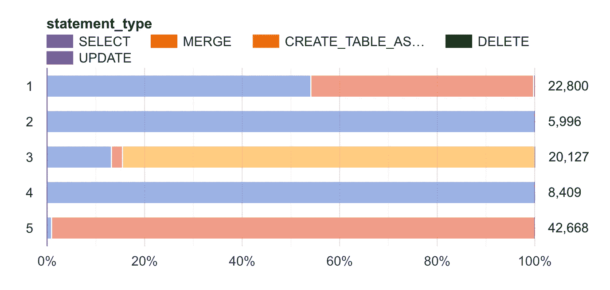

# 基于 BQ ML 的 K 均值聚类的大查询异常检测

> 原文：<https://towardsdatascience.com/bigquery-anomaly-detection-using-kmeans-clustering-from-bq-ml-41688f7a50f2?source=collection_archive---------27----------------------->

## [理解大数据](https://towardsdatascience.com/tagged/making-sense-of-big-data)

## 你有没有利用你的系统来发现它本身的错误？


威尔·迈尔斯在 [Unsplash](https://unsplash.com/s/photos/different?utm_source=unsplash&utm_medium=referral&utm_content=creditCopyText) 上的照片

# 用例

在愉快的 12 月，当你不在办公室，享受 COVID 让你享受的户外时光时，你团队的两名开发人员使用一些服务帐户(甚至可能是他们的私人帐户)运行了一系列流氓查询，看你是否能识别他们。他们拒绝给`rogue`下定义，希望看看 ML 在网络安全领域有没有用。

或者，您怀疑 BQ 数据集中的外部活动，并希望了解 ML 在网络安全领域是否有优势。[ಠ_ಠ]

**剧透**:是。

# 方法

我们将在 BQ 数据库中收集所有交易的元数据。我们将使用 BQ 机器学习(BQ ML)来训练一个(无监督的)Kmeans 算法来对事务进行聚类。我们将使用这些聚类信息来预测异常值。

# 生成数据集

```
CREATE OR REPLACE TABLE
  `analysis.ref_data_training` AS
SELECT
  *
FROM
  `region-xx`.INFORMATION_SCHEMA.JOBS_BY_PROJECT
WHERE
  DATE(creation_time) BETWEEN "2020-11-01" AND "2020-12-01"
```

让我们将上述日期之间的数据视为我们的训练数据。这假设在此期间没有发生欺诈性交易，并且我们基于此数据生成“正常”聚类。`region-xx`应替换为适当的区域。此外，让我们假设在`2020-12-01 to 2021–01–01`期间存在欺诈/异常交易。我们用这段时间创建一个类似的表`analysis.ref_data_testing`。

该表包含我们将用于构建模型的以下各列:

```
job_id
creation_time
end_time, start_time
**statement_type**
**query**
total_bytes_processed
total_slot_ms
destination_table.dataset_id
```

# 创建模型

```
CREATE OR REPLACE MODEL
  `anomaly_kmeans_001` OPTIONS (model_type='kmeans',
    standardize_features = TRUE) AS
SELECT
  r.job_id,
  EXTRACT (HOUR
  FROM
    creation_time) AS hod,
  EXTRACT (DAYOFWEEK
  FROM
    creation_time) AS dow,
  TIMESTAMP_DIFF(end_time, start_time, MINUTE) AS duration_mins,
  statement_type,
  ML.NGRAMS(bt.words_array,
    [1,
    2]) query_grams,
  query,
  total_bytes_processed,
  total_slot_ms,
  destination_table.dataset_id AS dest_dataset_id
FROM
  `analysis.ref_data_training` r
JOIN (
  SELECT
    REGEXP_EXTRACT_ALL(LOWER(query), '[a-z0-9]+') AS words_array,
    job_id
  FROM
    `ref_data_training`) AS bt
ON
  r.job_id = bt.job_id
ORDER BY
  RAND() --usually *rand() < number_rows/total_rows* works well
LIMIT
  100000 --depending on your data size, you might want to skip this
```

我们还制作了某些功能，比如一天中的某个时间`hod`和一周中的某一天`dow`。此外，我们还有一个主要特性`**query_grams**`，这将是集群的定义特征。您可以将 grams 扩展到 2 以上进行实验。

在模型创建过程中，我们不指定最佳([相关读数](/10-tips-for-choosing-the-optimal-number-of-clusters-277e93d72d92))的集群数量，我们让 BQ ML 来处理。

一旦你的模型完成训练，一定要检查它的统计数据。您可以像在 BQ 中预览表格一样进行操作。它有很多方便的可视化。

## 可视化示例分类特征、一些数字特征的质心点



语句 _ 类型分布[图片由作者提供]


我们的数字特征，所有这些都需要一些额外的预处理

# 预测未知样本的正确聚类

```
CREATE OR REPLACE TABLE
  `analysis.predicted_clusters` AS
WITH
  refs_table AS (
  SELECT
    r.job_id,
    EXTRACT (HOUR
    FROM
      creation_time) AS hod,
    EXTRACT (DAYOFWEEK
    FROM
      creation_time) AS dow,
    TIMESTAMP_DIFF(end_time, start_time, MINUTE) AS duration_mins,
    statement_type,
    ML.NGRAMS(bt.words_array,
      [1,
      2]) query_grams,
    query,
    total_bytes_processed,
    total_slot_ms,
    destination_table.dataset_id AS dest_dataset_id
  FROM
    `analysis.ref_data_testing` r
  JOIN (
    SELECT
      REGEXP_EXTRACT_ALL(LOWER(query), '[a-z0-9]+') AS words_array,
      job_id
    FROM
      `analysis.ref_data_testing`) AS bt
  ON
    r.job_id = bt.job_id)
SELECT
  * EXCEPT(query_grams) --we don't want to complicate o/p table
FROM
  ML.PREDICT( MODEL `analysis.anomaly_kmeans_001`,
    (
    SELECT
      *
    FROM
      refs_table))
```

由`ML.PREDICT`函数返回的两个重要列:`CENTROID_ID`和一个嵌套的`NEAREST_CENTROIDS_DISTANCE.`第二列包含一个数组`centroid_id`和`distance`。不用说，实例被分配给具有最小`distance`的`centroid_id`的集群。

这个嵌套字段也可以用于其他目的。

# 计算百分位数

您现在可能已经猜到了，这个想法是离群值(流氓事务)将会相对远离群集质心。我们创建一个表来存储百分位数(9990 是 99.90%的简写)。如果不清楚，99.90%的分类实例的`distance`小于该值。

## **两个音符:**

1.  根据数据的大小，您可以使用不同的百分点(例如 75%、90%和 95%)
2.  您不需要存储这些百分点，我这样做是为了保持持久性。

```
CREATE OR REPLACE TABLE
  `analysis.percentiles_anomaly` AS
SELECT
  percentiles[
OFFSET
  (9500)] AS p9500,
  percentiles[
OFFSET
  (9900)] AS p9900,
  percentiles[
OFFSET
  (9990)] AS p9990,
  percentiles[
OFFSET
  (9999)] AS p9999
FROM (
  SELECT
    [APPROX_QUANTILES](https://cloud.google.com/bigquery/docs/reference/standard-sql/approximate_aggregate_functions#approx_quantiles)((dist_from_centroid), 10000) AS percentiles
  FROM (
    SELECT
      job_id,
      c.CENTROID_ID,
      MIN(ncd.DISTANCE) AS dist_from_centroid
    FROM
      `analysis.predicted_clusters4` c,
      UNNEST(NEAREST_CENTROIDS_DISTANCE) AS ncd
    GROUP BY
      1,
      2) t) AS t2
```

## 附加说明

理想情况下，我们应该独立计算每个聚类的百分位数，因为聚类不是均匀分布的。修改上面的查询来反映这一点。

# 我看到你了，异常点

是时候根据预测数据和距离百分位数剔除欺诈交易了。从最高的百分位数开始，查看有多少个实例被归类为异常值，然后继续往下。

```
CREATE OR REPLACE TABLE
  `analysis.anomalies9999` AS
WITH
  anomalies AS (
  SELECT
    job_id,
    c.CENTROID_ID,
    MIN(ncd.DISTANCE) AS dist_from_centroid
  FROM
    `analysis.predicted_clusters4` c,
    UNNEST(NEAREST_CENTROIDS_DISTANCE) AS ncd
  GROUP BY
    1,
    2
  HAVING
    MIN(ncd.DISTANCE) >= **34.3668866** --example percentile 99.99
  ORDER BY
    dist_from_centroid DESC)
SELECT
  d.*
FROM
  `ref_data_check_all_datasets` d
JOIN
  anomalies a
ON
  a.job_id = d.job_id
```

运行常规查询的服务帐户靠近质心，它们没有出现在上述潜在异常中。出现的一些实例具有以下特征:

1.  唯一查询从个人用户帐户运行，具有少量的总生存期查询。`user_email`是我们选择忽略的一个特性，因为我们想在交易级别而不是用户级别检查完整性。
2.  各种帐户运行的错误查询。
3.  在它们各自分布的尾部具有上述特征的查询。e.x 极高的`total_bytes_processed`值。*McTotallyRealPherson 先生又忘记用分区了*。😞💰
4.  对这些异常的`dow`和`hod`过滤有助于进一步缩小范围。同样的还有`statement_type`和`user_email`。

喜欢读中肯的文章？我喜欢写[t](/data-science-interview-questions-ef87a3543b84#n%20p)hem。