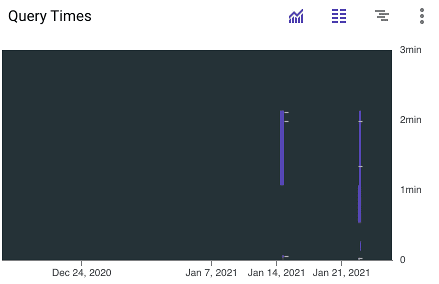

# 如何优化 BigQuery 的使用和成本

> 原文：<https://towardsdatascience.com/bigquery-costs-and-optimization-a841ffbbb8ff?source=collection_archive---------56----------------------->

## 使用谷歌数据仓库时你应该知道的最佳实践

在 [Unsplash](https://unsplash.com/s/photos/west-coast?utm_source=unsplash&utm_medium=referral&utm_content=creditCopyText) 上由 [Delphine Ducaruge](https://unsplash.com/@delphinenz?utm_source=unsplash&utm_medium=referral&utm_content=creditCopyText) 拍摄的照片

BigQuery 是一种 **SaaS** (软件即服务)数据仓库技术，将按照**付费模式向您收费。在这个小故事中，我想告诉你价格是多少，以及如何优化你的使用。**

## 哪些行动需要成本？

首先是好的方面 BigQuery 中的一些操作是免费的，比如:

*   加载数据(例如从存储桶)
*   提取数据(例如，提取到 Google 工作表)
*   复制数据(例如，复制到新表中)
*   删除表、视图和数据集
*   集群和分区表

但是你大概可以猜到，最常见的活动如:

*   数据存储
*   查询数据

确实花了一些钱。特别是最后一个功能是谷歌如何赚钱的。更多详情请访问[谷歌大查询定价](https://cloud.google.com/bigquery/pricing?hl=en)【1】。

## 这些行动的成本是多少？

通用概述将让您初步了解 BigQuery 中最常见任务的成本:

*   查询:按处理的字节收费，每 TB 5 美元(每月第一个 TB 免费)
*   存储:对于 BigQuery 存储 API，每月存储的 GB 数将为 0.02 美元(活动存储)和 1.10 美元/TB
*   流式插入将花费您每 GB 0.05 美元

这些是谷歌显示的美国地区的当前价格，其他地区的价格有所不同。

## BigQuery 与其他技术相比如何？

将价格与亚马逊的 Redshift 或 Snowflake 等其他技术进行比较很难，因为这取决于用例以及您如何优化每项技术。**同样，价格也非常相似** —这里 [fivetran 发布了一个超级好的基准](https://get.fivetran.com/rs/353-UTB-444/images/2020-benchmark-v3.pdf)【2】。在这个基准测试中，他们得出了相同的结论。然而，重要的是要强调 BigQuery 提供了最高的 SaaS 感受——因此您不必太担心供应和操作，这同样对成本有积极的影响。根据我自己的经验，我可以肯定 BigQuery 不仅易于使用，而且运行起来比传统的数据仓库更便宜。

## 最后，您如何优化您的使用？

1.  **使用 web UI 中的验证器**来帮助计算成本——UI 和 CLI 将返回查询中处理的字节数。

已处理的预测字节数—按作者分类的图像

2.使用 SuperQuery——使用 super query(例如可以通过 Chrome 安装),你甚至可以直接计算每次查询的费用。此外，该附件还提供了许多其他有用的功能[3]。

超级查询价格预测-作者图片

3.**仅包含您需要的列和行** —尤其是不必要的列会产生额外的成本，这很容易避免。

4.**尽可能使用缓存结果**和永久表来代替视图。

5.**监控您的使用情况** —借助 GCP 的日志和监控服务，您可以创建仪表盘和警报。在标准监控中，您已经有了一个很好的概述。

GCP 标准监控—用户提供的图像

但是要了解更多细节，例如哪个用户查询了哪些数据以及查询的成本，您可以使用 Stackdriver。

6.**使用 Limit** 仍然会处理所有行——所以要注意那个**陷阱。**

7.**删除重复和不必要的数据** —人们经常犯保存不必要的数据的错误(*我以后可能需要这个*)。这应该通过严格的数据治理来避免，这样就不会出现数据沼泽。

8.**使用集群** —它可以提高某些类型查询的性能，例如使用筛选子句的查询和聚合数据的查询。

9.**使用分区表** —表将被分成段，称为**分区**，这使得管理和查询数据更加容易。此外，它会节省你的钱。

## 结论

我希望这篇文章在成本和成本优化的最佳实践方面有所帮助。我本人是 BigQuery 的忠实粉丝，并在专业和私人场合使用它。它有很多优点，速度超级快。但是，我也知道，考虑一些事情来对抗不必要的成本是很重要的。尤其是在企业家的意义上，人们真正谈论的是大数据。在这里，即使是小错误和反模式也会很快导致大的成本劣势。如果你也有任何建议，请随时告诉我。

## 资料来源和进一步阅读

[1]谷歌，[定价](https://cloud.google.com/bigquery/pricing?hl=en) (2021)

[2] fivetran， [2020 数据仓库基准测试](https://get.fivetran.com/rs/353-UTB-444/images/2020-benchmark-v3.pdf) (2020)

【3】super Query，[写出完美的查询。每次都是。](https://web.superquery.io/) (2021)