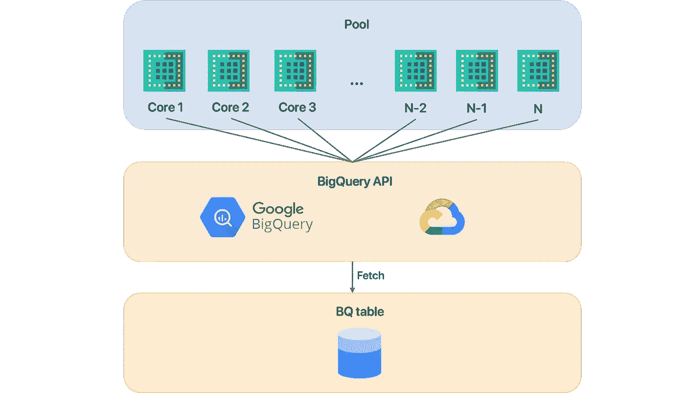
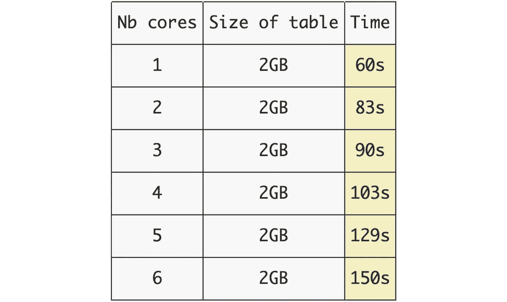
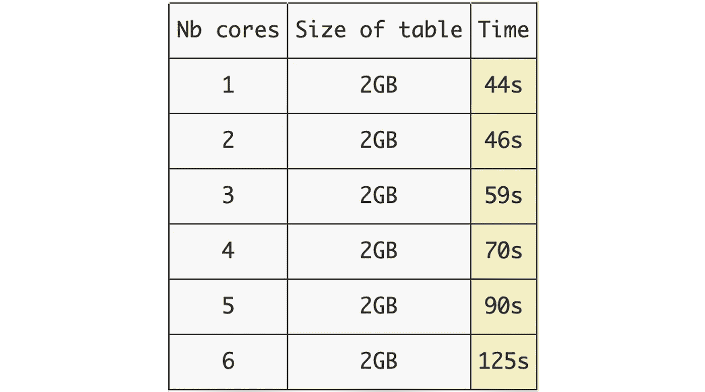

# 大查询获取+多重处理

> 原文：<https://towardsdatascience.com/bigquery-fetching-multiprocessing-dcb79de50108?source=collection_archive---------13----------------------->

## 多重处理是否提高了 BigQuery API 请求的抓取速度？

作者图片

BigQuery 存储读取 API 可用于从 BigQuery 表中获取数据。然而，在我写这些代码的时候，还没有为了更快地处理读取而使用这个 API 结合多处理进行基准测试。

在本文中，我将展示我所做的一些研究和基准测试，以便找到从 BigQuery 获取数据的最佳方法。

# 抓取+多重处理

从 BigQuery 获取数据的最常见和最简单的方法是只使用机器/实例上的一个内核来线性处理获取。

然而，如果您正在使用具有多个内核的计算机或 GCP 计算引擎(GCE ),您可能想知道使用它们来并行处理更多数据是否有用，但是有一个**关键概念需要理解**:

> 内核越多，读取速度不一定越快。从互联网上获取一些数据所需的时间很大程度上取决于路由器/网络上可用的互联网带宽。

因此，在您的设备上拥有 200 个内核并不意味着您的获取处理速度会快 200 倍，而是可以创建 200 个进程，每个进程将获取一个表块(使用较少的带宽)，以便最终将它们合并到一个表/数据帧中。

参考 [GCE 文档](https://cloud.google.com/blog/products/gcp/5-steps-to-better-gcp-network-performance)，每个 vCPU 可以处理 2GB 的入口，最多 6 个 vCPU。所以我构建了一个工具:`**bqfetch**`，它给出了要使用的核的数量，可以获取一个或多个核的表。如果`nb_cores` =-1，那么算法将使用机器上可用的虚拟 CPU 的数量，它将为每个内核创建一个进程，并并行处理它们。该工具适用于`multiprocessing`、`billiard`和`joblib`平行后端。

为了证明 BigQuery 存储在多处理中是否有效，我使用 1 到 6 个内核在 2GB 的表上独立运行了 6 次读取，并测量了所用的时间。这是使用该工具的实际代码:

> L [油墨至 bqfetch repo](https://github.com/TristanBilot/bqfetch) 。
> 
> [中篇](/the-fastest-way-to-fetch-bigquery-tables-352e2e26c9e1)关于 bqfetch 快取库。

注意，为了获取巨大的表(多个 TB ),我们必须将整个表分块/分割成可以放入内存的更小的块。因此，第一步是使用`chunks()`方法划分表格。我们必须指定要用作索引的列，以便将该列中的所有不同值分成多个块。我们还必须指定我们想要处理的每个块的大小，因此这个值必须小于机器上的可用内存(如果是这样，将会出现一条警告消息)。详细模式打印内存信息以及区块的数量/大小。

> 在中，下面的例子**将整个表分成大小为 2GB 的小块**和**连续使用 1 到 6 个内核获取它们**，仅用于演示目的。注意，在这种情况下，块的大小和表的大小是 2GB，所以只有一个块将被`chunks()`方法返回，但是在实际使用情况中，您将指定一个更大的表，并且该方法将返回一个块的列表以进行顺序处理。

## 在 12 个虚拟内核的 MacBook Pro 上的结果

作者图片:获取 2GB 表作为 pandas df 的时间，取决于核心/进程(PC)的数量

如图所示，在使用标准 Wi-Fi 连接的个人电脑上使用多个内核并不能提高性能，甚至会更差。这是可以预料的，因为**网络上可用的互联网带宽保持不变**，即使我们使用多个内核来获取数据。由于每个进程必须创建一个新的 ReadSession 以从 BigQuery 读取数据，这需要更多的时间，因为我们必须**并行初始化多个连接**，并且我们还必须在每个进程完成时合并结果。

## 在 30 个虚拟内核的 GCP 计算引擎上的结果

作者图片:获取 2GB 表作为 pandas df 的时间，取决于核心/进程的数量(GCE)

使用 GCE 时，会出现同样的问题，当内核数量增加时，性能仍然会更差。根据 GCE 文档，我们应该增加网络带宽，那么问题是什么呢？发生这种情况的原因对我来说很模糊，但我猜这是由于 [BigQuery 限制](https://cloud.google.com/bigquery/quotas#storage-limits)关于每个请求的行过滤器的大小只有 10MB。

# 结论

*   在我写这几行文字的时候(2021 年 8 月)，Google 还没有提出任何原生实现来高效地使用多处理 BigQuery 存储。因此，由于 API 的限制，我们实现这一目标的唯一方法并没有像我们希望的那样优化。我们必须等待 API 贡献者的进一步改进，以便有可能使用这种方法获得性能。
*   您可以使用我已经实现的工具通过 BigQuery API 使用多处理来做您自己的测试。代码是开源的，所以欢迎你来查看或投稿。