# 用于细粒度视觉识别和多模态深度学习的双线性池

> 原文：<https://towardsdatascience.com/bilinear-pooling-for-fine-grained-visual-recognition-and-multi-modal-deep-learning-20051c1f0e7e?source=collection_archive---------14----------------------->

巴德·赫利松在 [Unsplash](https://unsplash.com/s/photos/interaction?utm_source=unsplash&utm_medium=referral&utm_content=creditCopyText) 上的照片

> 高级神经网络架构通过学习特征交互来工作

双线性池起源于计算机视觉社区，作为一种细粒度视觉识别的方法。或者用不太花哨的语言来说，一种在识别和分类视觉对象时寻找特定细节的方法。在高层次上，该方法的工作方式如下。给定一个输入图像 *I* ，我们将 *I* 送入两个不同的深度卷积神经网络 A 和 B，见图 1。在应用若干池化和非线性变换之后，我们从 A 和 b 输出特征图。这两个网络可以被预训练以解决不同的任务。直觉是，A 和 B 以这种方式从输入图像中学习不同的特征。例如，A 被训练来检测基本的物体形状，而 B 检测纹理特征。然后，来自 A 和 B 的输出特征由所谓的*双线性池层*组合。这仅仅意味着我们通过取它们的内积，将 A 的每个特征与 B 的每个特征结合起来。读者可能会注意到，这类似于支持向量机中的 2 次多项式核。双线性池层背后的直觉是，这些特征交互允许我们检测图像的更多特定细节。

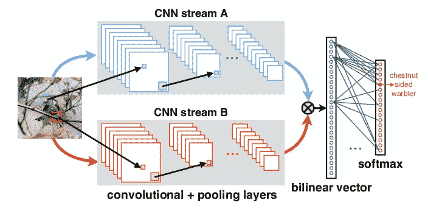

图一。双线性池的整体结构。来源[1]

## 原始建筑

我假设读者熟悉卷积神经网络的基础知识。不然我推荐[这些入门讲义](https://cs231n.github.io/convolutional-networks/)。

图 1 中网络 A 的输出是一个维数为 n×d 的矩阵 U，或 n×d*，*，网络 B 的输出是一个维数为 m×d 的矩阵 V，在 CNN 的上下文中，n 和 m 分别是 A 和 B 的输出层中滤波器(或内核)的数量。每个滤波器的维数是 *d，*它是通过展平二维特征图获得的，即经过几次核卷积和汇集变换的输出图像。双线性池操作被定义为

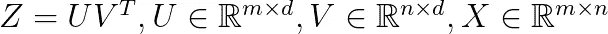

等式 1。双线性池。

然后，矩阵 Z 被展平成维数为 m*n 的向量 Z。Z 和可学习向量 w_k 的内积被提供作为 softmax 激活函数的输入，其中 K 个类别中的类别 K 的概率被计算为:

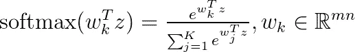

等式 2。使用双线性映射进行分类。

在上面，w_k 是维数为 m*n 的可学习向量，它模拟向量 z 属于第 k 类的概率，1≤k≤K。

## 双线性池为什么有效？

如前所述，双线性池的核心是明确考虑特征交互的思想，类似于支持向量机中的多项式核。让我们考虑一个具体的例子。作为第一个应用，双线性池用于细粒度的图像分类。考虑图 2，我们想解决一个鸟类分类问题。显然，这些都是彼此相似的鸟类，我们需要具体的细节来正确区分不同的物种。对于图 1 中的两个神经网络 A 和 B，假设 A=B，并对 A 和 B 使用[预训练的 VGG16 模型](https://neurohive.io/en/popular-networks/vgg16/)，VGG16 是一个深度 CNN 模型，已经在 ImageNet 2014 挑战赛的大量图像上进行了训练，其中图像属于 1，000 个类别中的一个。很明显，VGG16 可以检测鸟类羽毛、喙、颜色等形状。然而，许多鸟类都有相同的喙形。

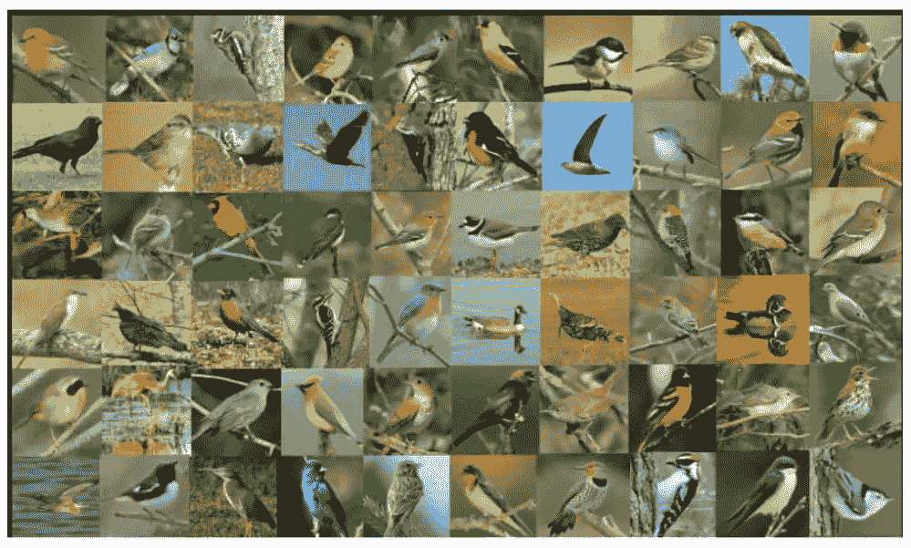

图二。即使对一个人类专家来说，正确分类所有的鸟类也是一个挑战。来源[2]

VGG16 足以正确区分鸟类和猫，但要正确区分不同的鸟类是有挑战性的，差异已经非常微妙了。为了区分不同的物种，我们需要明确地考虑这些特征的*组合*。这样的组合对每个物种来说更有可能是独一无二的。羽毛颜色和鸟喙形状的结合更有可能唯一地识别一种鸟。因此，使用正确识别某些基本形状的预训练模型，我们可以了解这些形状的哪些组合对于手头的分类问题是重要的。

## 用于多模态学习的双线性池

双线性池的另一个主要应用是结合不同领域的神经网络模型。例如，在视觉问答中，训练数据由自然语言和图像中的问题组成，参见图 3 中的示例。

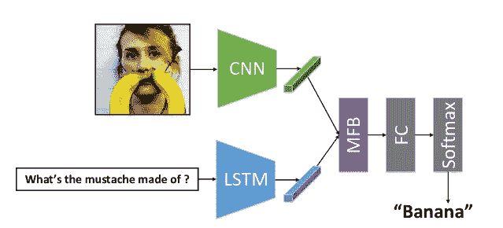

图 3。集合视觉和语言特征进行视觉问答。来源[3]

## 双线性池的变体

有几种不同的方法可以使用双线性池。

*   **单个神经网络 vs 两个网络。**网络 A 和 B 可以是相同的网络，即 A=B。如在计算机视觉示例中所讨论的，我们然后从输出神经网络的不同通道学习重要的特征对。对于多模态问题，当我们组合来自不同领域的特征时，网络 A 和 B 当然彼此不同。
*   **端到端架构与预训练模型**。两个网络 A 和 B 可以是像 VGG16 那样的具有固定权重的预训练网络。在这个设置中，新的输入通过 A 和 B 传递，然后我们只学习双线性层的权重。在端到端架构中，来自双线性层的误差反向传播到 A 和 B，并且更新它们各自的参数。双线性层是可微分的，它可以由众所周知的深度学习框架来处理，如 TensorFlow 或 PyTorch。

## 计算的复杂性

显然，双线性池的一个主要缺点是它的计算复杂性。矩阵乘法

时间复杂度为 O(m*n*d)。通常，t 尺寸 d 相当小。想象一个 CNN，我们从 256x256 像素的图像开始逐渐粗化维度，更深的层具有 16x16 维度的核图。另一方面，为了获得强大的模型，核的数量需要更大。高级架构使用几千数量级的 m 和 n。对于具有 K 个类别的分类问题(见等式 2)，这意味着我们需要 K*m*n 个可学习的参数，其数量级可以是几百万。这可能使双线性池难以训练，并容易过度拟合。

## 可伸缩双线性池的矩阵分解

已经设计了几种旨在降低原始算法的计算复杂度的方法。我将介绍一种矩阵分解方法。

设 W_k 是一个 m 乘 n 矩阵，具有可学习的双线性权重。方程 2 中的向量 w_k 是平坦矩阵 W_k，网络 A 的输出是 m-次-d 维的矩阵 U，网络 B 的输出是 n-次-d 维的矩阵，设第 I 列 U 为 u_i，V 的第 I 列为 v_i，特殊情况 d=1 时，矩阵 U 和 V 只是单列。

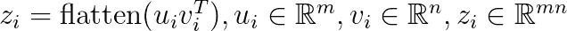

z_i 是 u_i 和 v_i 的平坦的[外积](https://en.wikipedia.org/wiki/Outer_product)，我们可以证明以下等式成立:

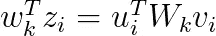

上面简单地写出了等式两边的量。

根据定义，它成立

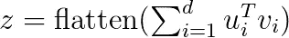

因此，我们可以将内积重写为

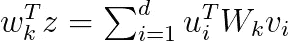

为了提高计算复杂度，我们可以用低秩分解来代替双线性矩阵 W_k:

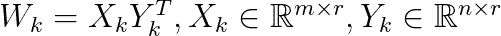

在上面，r 是一个小常数，使得 r < min(m，n)。

因此，我们获得内积的以下表达式:

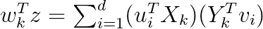

注意，右边求和的计算复杂度是 d*(m*r + n*r)。因为 r 是一个小常数，比 m 和 n 小得多，所以我们实现了更好的运行时间。此外，双线性池图层的可训练参数的数量从 K*m*n 减少到 K*(m+n)*r。为了更好地了解这两个量的比较情况，请考虑一个 CNN，其典型值为 m=n=1，000 个过滤器和 K=10 个类。使用 r = 20，我们从 10⁷到 4*10⁵减少了可学习参数的数量，即因子分解双线性池中的参数数量仅为原始设置的参数数量的 4%。

## 双线性池的缺点和限制

最后，我们应该提到双线性池的一些限制:

*   对于两个输出，特征向量 d 的维数必须相同。对于两个 CNN 模型来说，这不是一个大问题，但是对于多模态双线性池来说，这可能是一个限制。例如，单词嵌入可以具有与 CNN 非常不同的最佳维度，调整这两者可能会导致信息的丢失。
*   我们仅限于考虑成对的相互作用。研究人员提出了像三线性池这样的一般化方法，其中我们考虑了三个特征。但这使得模型更难训练，容易过度拟合。

## 履行

在 FashionMNIST 数据集上用于图像分类的双线性池的简单实现可以在[这个 Jupyter 笔记本](https://github.com/konstantinkutzkov/bilinear_pooling)中找到。请注意，双线性池并不真正适合像 FashionMNIST 这样的小型数据集。该实现作为一个示例，可以根据项目的需要进行调整和改进。

## 参考

[1]宗-林玉，阿鲁尼·罗伊·乔杜里，苏博兰苏·马吉:
用于细粒度视觉识别的双线性卷积神经网络。IEEE Trans。肛门模式。马赫。智能。40(6)，可用[此处](https://arxiv.org/pdf/1504.07889.pdf)

[2]舒孔，查尔斯·c·福尔克斯。用于细粒度分类的低秩双线性池。CVPR 2017。可用[此处](https://arxiv.org/pdf/1611.05109.pdf)，项目页面[此处](https://www.cs.cmu.edu/~shuk/lr_bilinear.html)

[3]周瑜，，，陶大成。用于视觉问答的多模态分解双线性池联合注意学习。ICCV 2017，此处[可用](https://openaccess.thecvf.com/content_ICCV_2017/papers/Yu_Multi-Modal_Factorized_Bilinear_ICCV_2017_paper.pdf)