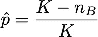
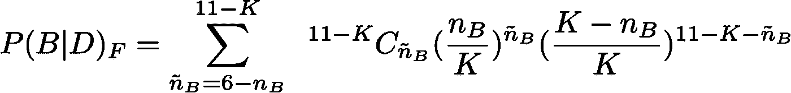
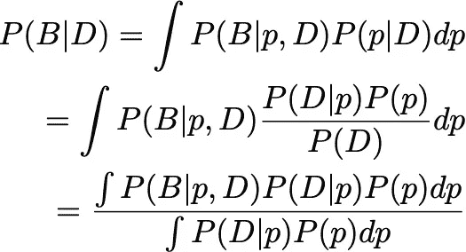
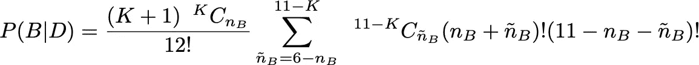
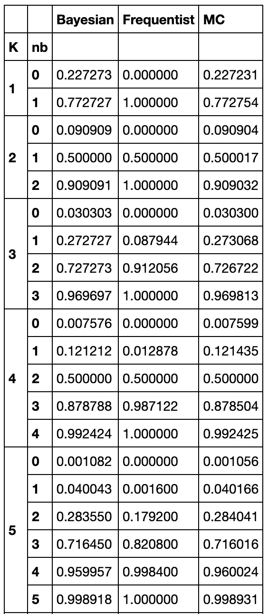
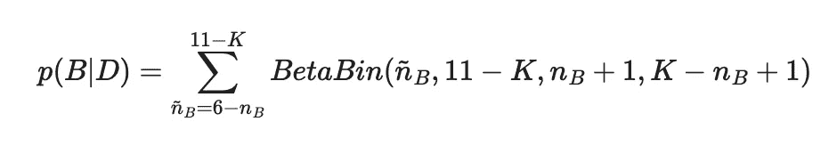

# 台球与弗雷德的常客和拜耳的贝叶斯[拜耳赢:)

> 原文：<https://towardsdatascience.com/billiards-with-fred-the-frequentist-and-bayer-the-bayesian-bayer-wins-7bc95b24a7ef?source=collection_archive---------14----------------------->

## 我在这里讨论贝叶斯自己的一个实验，它强调了贝叶斯方法的美丽、优雅和正确性，即使频率主义方法给出了不正确的结果。

在 1763 年死后发表的论文[1]中，Bayes 展示了一个例子，其中 Frequentist 点估计给出了不正确的结果(与实验不匹配)，而 Bayes 分析给出了与实验匹配的优雅解决方案。本文中的问题确切问题陈述是文献[1][2][3]中的陈述的推广。

在这里，我讨论了这个例子，并用 colab 笔记本[4]链接了推导和蒙特卡罗模拟。

# 设置

不可否认，这个设置有点做作，但我们可以忽略它。让我们在宽度为 1 的桌子上打一场台球。卡罗尔进来，随机地打了一个台球，当它落在离一面墙 p 的距离后，她把它藏在了窗帘后面。然后爱丽丝和鲍勃，不知道球的位置，射击他们自己的球，如果一个球落在卡罗尔的球的左边，爱丽丝赢了这一轮(所以概率是 p)，如果它在卡罗尔的球的右边结束，那么鲍勃赢了这一轮(所以概率是(1-p))。先得 6 分的人赢得比赛。

图片由 [Klara Kulikova](https://unsplash.com/@kkalerry) 提供

一些见不得人的角色正在观看这场游戏，当鲍勃在 K 杆时赢得了 nB 回合时，他们叫来了常客弗雷德来赌这场游戏。他们请常客弗雷德预测鲍勃赢得比赛的概率。在给了弗雷德频繁主义者多次尝试解决问题，他悲惨地失败了，这些人物听到贝叶斯统计，并邀请你，拜尔贝叶斯显示你的把戏包里有什么。

# 常客弗雷德如何尝试解决方案

常客 Fred 首先通过查看 Alice 获胜的分数来估计 p 的点数

注意 nA+nB=K。

在这之后，Frequentist 简单地计算 Bob 在 11-K 剩余游戏中赢得至少 6-nB 的概率(游戏数量永远不能超过 11。说服你自己这个论点。)

常客弗雷德对鲍勃获胜概率的回答

我们以后会看到他错得有多离谱。

# 拜耳贝叶斯如何拯救世界

在这一点上，你被叫来尝试你的贝叶斯手在这个问题上。你采取了一种非常不同的方法。你知道这一点(如果你不知道这一点，那么你应该考虑一下和/或阅读一下条件概率)

这里发生的是，我们对 p 的所有可能值进行积分，因为我们不知道它是什么。模型中的这种参数称为讨厌参数。

现在既然 Carol 均匀采样 P P(P)= 1。出于可读性的考虑，我在这里不做数学计算，推导过程可以在我下面引用的 github 笔记本中找到。

最后的表述是

鲍勃获胜概率的贝叶斯答案

# 实验

哪个答案是正确的？这是一个非常容易模拟的问题，已经在下面的笔记本中完成了。让我展示几个例子。

首先注意，如果 K=0，那么 nB =0，虽然直觉上答案是 0.5，Bob 会赢，但常客 Fred 说这是未定义的！

在 K=1，2，3，4，5 的另一个极端，如果 K=nb，Frequentist 的点估计给出 p=0 和 PF(B)=1，所以他肯定 Bob 会赢，但稍加思考就会发现这是不正确的。

甚至连常客弗雷德也认为两个答案都不正确，但他不知道该怎么办，而是继续坚持认为其他答案是正确的。

然而，弗雷德不仅在上面两个例子中是错误的，他还经常错误(双关语！).下面比较不同的 K 和 nb，贝叶斯答案如何总是匹配 MC(人们看到的小的不匹配来自 MC 采样中的有限大小效应),并且频率主义者的答案总是错误的，除了当 nb=K/2 时。

K 和 nb 的其他值的结果可以在上面引用的笔记本[4]中找到。

# 帮助常客弗雷德认识他的错误[高级]

那么，常客弗雷德做错了什么？为什么他经常得到错误的答案？让我们再来看看 Bayer the Bayesian 是如何处理讨厌的参数 P 的，它可以是从 P(p)中提取的任何值(在这种情况下恰好是均匀的)，然后对结果进行积分。另一方面，frequent ist Fred 取 p=(K-nB)/K，这是 P(D|p)的*最大似然估计量*，并将其插入 P(B|p，D)。现在，这将在可能性非常尖锐的情况下工作(这就是我们物理学家所说的狄拉克δ函数)。然而，事实证明情况并非如此。同行的物理学家将会看到这里与路径积分有很大的相似之处，在量子力学中，对所有路径求和，但在经典极限中，只有一条路径对路径积分有贡献。用这个类比，频率主义者弗雷德在一个问题中使用了经典极限，他应该做量子力学。

# 更快的方法

在经历了所有的困难之后，让我指出，有一种更简单的方法可以实现这一点，那就是我们所做的是对二项数据的[后验预测分布](https://en.wikipedia.org/wiki/Posterior_predictive_distribution)求和，即 Bob 的相关获胜次数的[贝塔二项分布](https://en.wikipedia.org/wiki/Beta-binomial_distribution)。

鲍勃以文明的方式获胜的概率的贝叶斯答案。

# 结论

贝叶斯方法更直观，因此更难出错。虽然常客们显然也能得到正确的答案，但要做到这一点却困难得多。虽然关于贝叶斯和频率主义者的哲学辩论将持续很长时间，但在实践层面上，贝叶斯是你最好的选择。

# 参考资料:

1.  T.贝叶斯。一篇解决机会主义中一个问题的论文。伦敦皇家学会哲学汇刊 53(0):370–418，1763
2.  艾迪先生。什么是贝叶斯统计？。自然生物技术 22:1177–1178，2004
3.  关于使用 Python 的贝叶斯统计的非常好的介绍。我自己的例子是对这个例子的概括，最初的引用来自贝叶斯[https://arxiv.org/pdf/1411.5018.pdf](https://arxiv.org/pdf/1411.5018.pdf)
4.  我的笔记本[https://github . com/borundev/DNN _ 讲座/blob/master/Bayesian _ pool . ipynb](https://github.com/borundev/DNN_Lectures/blob/master/Bayesian_Pool.ipynb)