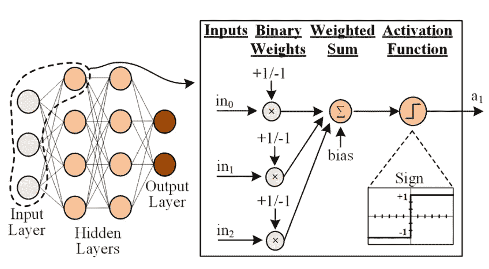
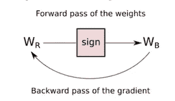
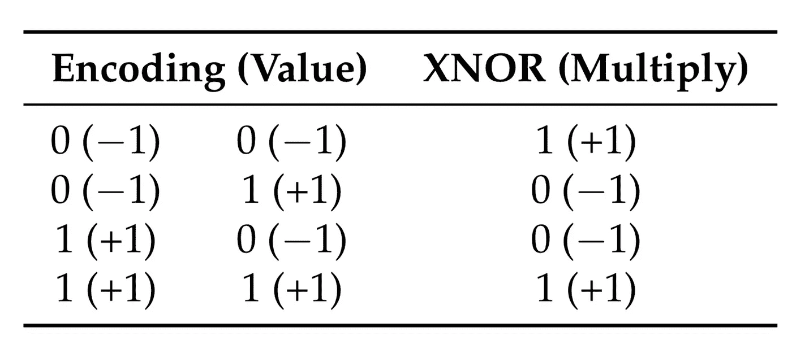
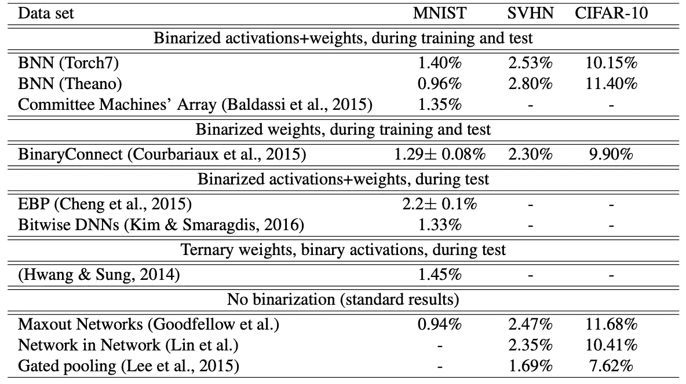

# 二值化神经网络综述

> 原文：<https://towardsdatascience.com/binarized-neural-networks-an-overview-d065dc3c94ca?source=collection_archive---------17----------------------->

## 二值化神经网络是一种有趣的神经网络变体，可以节省内存、时间和能量。了解它们是如何工作的。

亚历山大·辛恩在 [Unsplash](https://unsplash.com?utm_source=medium&utm_medium=referral) 上的照片

使用神经网络的一个障碍是运行网络所需的功率、内存和时间。这对于没有强大 CPU 或大内存的移动和物联网设备来说是个问题。二值化神经网络是解决这一问题的方法。通过使用二进制值而不是浮点值，可以更快地计算网络，并且使用更少的存储器和功率。

# **力学:**

从概念上讲，二进制神经网络(BNN)类似于常规前馈神经网络(NN)。一个区别是 BNN 中的权重和激活被限制为只有两个值:1 和-1，因此得名“二进制化”。因此，只使用了一个激活函数:符号函数。我们不能使用像 sigmoid 或 relu 这样的常规激活函数，因为它们有连续的输出，正如我们刚才所说的，激活只能是 1 和-1。

来源:[整个神经网络的布尔掩蔽](https://www.researchgate.net/publication/342258884_BoMaNet_Boolean_Masking_of_an_Entire_Neural_Network)

当我们使用梯度下降来训练网络时，这些限制会导致一些问题。首先，符号函数的梯度为 0。这是不好的，因为它使所有权重和激活的梯度也为 0，这意味着实际上不会发生任何训练。我们可以通过在进行反向传播时忽略符号激活函数来解决这个问题。然而，我们有另一个问题，即梯度更新将导致权重不再是 1 或-1。我们通过保留一组实值权重并对这些权重进行梯度更新来解决这个问题。然后，网络权重是这些实值权重的二进制化。

因此，我们的最终算法是:

*   前向传递:我们有实值权重 W_r 和输入向量 x，首先，我们对所有权重应用 sign 函数，得到 W_b = sign(W_r)。然后我们像往常一样用 W_b 和符号激活函数计算神经网络的输出。
*   反向传递:我们像往常一样进行反向传播，并计算权重 W_b 的梯度，只是我们忽略了符号激活函数。我们通过减去这些梯度来更新权重 W_r(记住，W_b 来自 W_r，所以不直接更新 W_b！).

来源:[ [2](https://www.mdpi.com/2079-9292/8/6/661/pdf) ]

# **性能:**

我们已经看到了二进制神经网络是如何工作的。现在让我们比较一下普通神经网络和 BNN 之间的理论性能差异。普通的神经网络使用 32 位浮点数。如果我们有两个 32 位寄存器，我们可以用一条计算机指令在两个 32 位数之间执行一次乘法。二进制网络使用 1 位数(我们将+1 编码为 1，将-1 编码为 0)。要将两个 1 位数字与我们的表示相乘，我们可以使用 XNOR 指令。

来源:[ [2](https://www.mdpi.com/2079-9292/8/6/661/pdf)

我们能做的是将 32 个 1 位数字放入我们的两个 32 位寄存器中的每一个，然后运行一个 XNOR 指令来同时相乘所有的数字。其结果是，我们可以用一条指令做 32 次 1 位乘法，而用一条指令只能做 1 次 32 位乘法。因此，与普通神经网络相比，BNN 理论上有 32 倍的加速比。

实际上，32x 这个数字很难达到。CPU/GPU 的编程方式会影响指令调度，指令本身并不总是需要相同数量的时钟周期来执行。此外，现代的 CPU/GPU 并没有针对运行按位代码进行优化，因此必须注意代码的编写方式。最后，虽然乘法是神经网络中总计算的很大一部分，但也有我们没有考虑的累加/求和。尽管如此，[ [1](https://arxiv.org/pdf/1602.02830.pdf) ]报告称，在比较优化的 BNN 和未优化的正常神经网络时，加速比提高了 23 倍，这表明明显的加速是完全可以实现的。

因为我们使用的是 1 位数字而不是 32 位数字，我们还希望使用大约 32 倍的内存。当我们使用的内存减少 32 倍时，我们的内存访问也减少了 32 倍。这也将减少大约 32 倍的功耗。我找不到测试这个假设的实验数据，但这个结论对我来说似乎是合理的。

最后，需要注意的是，所有这些 BNN 优势仅适用于运行时，不适用于训练时。这是因为，正如我们前面提到的，我们保留了一组实值权重来进行训练。这意味着梯度是一个 32 位浮点数，并不受制于我们所描述的 1 位优势。因此，BNN 模型不应该在内存/功率受限的设备上训练，但是它们可以在这些设备上运行。

# **精度:**

当然，如果网络由于测试集上的不良准确性而不可用，那么无论速度/内存/功率提高多少都没有关系。二值化激活和权重比常规神经网络的表达能力差，所以我们预计准确性会更差。问题是会恶化到什么程度。我找不到任何回答这个问题的理论论文，所以现在我认为像下面这样的经验数据是我们最好的。我们在这里描述的 BNN 实现是第一部分，常规 NN 变体是最后一部分。

来源:[ [1](https://arxiv.org/pdf/1602.02830.pdf)

我们看到，误差肯定会增加，特别是在 CIFAR-10 数据集上(10.15%对 7.62%)。然而，考虑到 BNNs 如前所述的所有性能优势，这大约 3%的差异并不是世界末日。对于每个精度点都至关重要的任务，例如医疗 x 射线筛查，我们不想使用 BNNs。但是在精度不那么重要或者性能更重要的情况下，bnn 是一个可行的选择。

在这篇文章中，我们已经简要了解了 BNN 的机制。我们还看到了 BNNs 如何显著提高速度、内存使用和功耗，代价是精度稍低。要更深入地了解 BNNs，请看下面的参考资料。

[1] M. Courbariaux 和 I. Hubara，[二值化神经网络:训练深度神经网络，权重和激活限制为+1 或-1](https://arxiv.org/pdf/1602.02830.pdf) (2016)

[2] T. Simons 和 D. Lee，[二值化神经网络综述](https://www.mdpi.com/2079-9292/8/6/661/pdf) (2019)